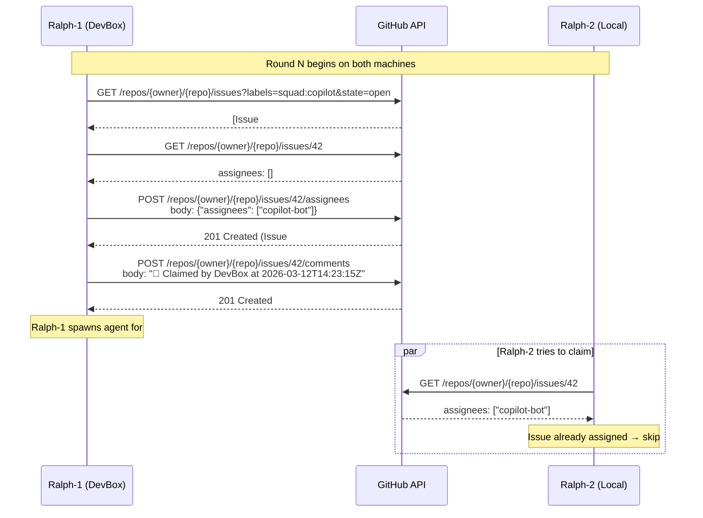
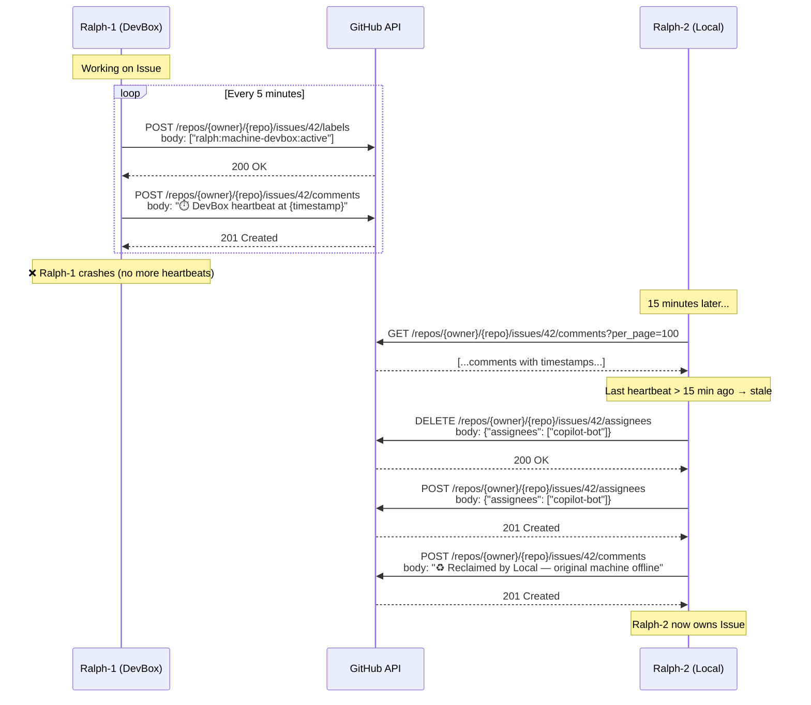

# Multi-Machine Ralph Coordination — Architecture Design

**Owner:** Picard (Lead)  
**Date:** 2026-03-12  
**Status:** Design Complete  
**Related:** Issue #346, `.squad/decisions/decisions.md` lines 525-635  

---

## Executive Summary

This design enables 2+ Ralph instances to work the same issue board without duplicate work, using **GitHub as the sole coordinator** (zero new infrastructure). Work claiming uses atomic GitHub issue assignment. Heartbeats use labels + comments. Stale machines are detected and reclaimed within 15 minutes. Backward compatible with single-machine Ralph.

**Feasibility:** ✅ VIABLE — GitHub APIs support all primitives needed  
**Risk Level:** 🟡 MEDIUM — Race conditions exist but are manageable  
**Estimated Effort:** Phase 1 MVP = 2-3 days, Phase 2 = 3-5 days  

---

## Problem Statement

Ralph instances on multiple machines (local dev, DevBox, CI/CD) have no coordination mechanism. This causes:

1. **Duplicate work:** Two machines pick the same issue → spawn duplicate agents → push conflicts
2. **Work starvation:** Machine goes offline mid-task → claimed work stuck forever
3. **Branch conflicts:** Both machines push `squad/42-fix-bug` → git push fails
4. **Zero observability:** No way to see which machine is working on what

**Critical blocker** for multi-machine workflows.

---

## Constraints

1. **No new infrastructure** — Zero tolerance for Redis, databases, message queues, or centralized services
2. **GitHub-native only** — Use issues, labels, comments, assignments, and Actions
3. **Backward compatible** — Single-machine Ralph works unchanged (coordination is opt-in behavior)
4. **Rate limits** — 5000 GitHub API calls/hour authenticated (primary quota shared across machines)

---

## Architecture Overview

### Core Coordination Primitives

| Primitive | GitHub Mechanism | Purpose | Atomic? |
|-----------|-----------------|---------|---------|
| **Machine Identity** | Label `ralph:machine-{name}` | Track which Ralph is alive | No |
| **Work Claim** | Issue Assignment | Exclusive claim before work starts | ✅ Yes |
| **Heartbeat** | Comment with timestamp | Prove machine is alive | ✅ Yes (append-only) |
| **Lease Tracking** | Comment `🔄 Claimed by...` | Record claim time for staleness checks | ✅ Yes |
| **Branch Namespace** | `squad/{issue}-{slug}-{machine}` | Prevent push conflicts | N/A |
| **Stale Detection** | Background scan + timestamp check | Reclaim abandoned work | No (eventual consistency) |

### Flow Diagram — Work Claiming (Happy Path)



### Flow Diagram — Heartbeat & Stale Recovery



---

## GitHub API Calls (Exact Commands)

### 1. Machine Registration (Startup)

**Purpose:** Announce Ralph instance presence

```bash
# Add machine label to repository (one-time per machine)
gh label create "ralph:machine-devbox" --color "0E8A16" --description "Ralph running on DevBox"

# Register heartbeat on startup
gh issue comment 1 --body "🟢 Ralph-DevBox online at $(date -Iseconds)"
```

**API Equivalent:**
```http
POST /repos/{owner}/{repo}/labels
{
  "name": "ralph:machine-devbox",
  "color": "0E8A16",
  "description": "Ralph running on DevBox"
}
```

### 2. Work Discovery

**Purpose:** Find unclaimed issues

```bash
# Get all actionable issues (not assigned, has squad:copilot label)
gh issue list \
  --label "squad:copilot" \
  --state open \
  --json number,title,assignees,labels,comments \
  --jq '.[] | select(.assignees | length == 0)'
```

**API Equivalent:**
```http
GET /repos/{owner}/{repo}/issues?labels=squad:copilot&state=open&per_page=100
```

### 3. Claim Attempt (Atomic)

**Purpose:** Exclusive claim via assignment

```bash
# Claim issue #42
gh issue edit 42 --add-assignee "copilot-bot"

# Add claim comment with timestamp
gh issue comment 42 --body "🔄 Claimed by $(hostname) at $(date -Iseconds)"
```

**API Equivalent:**
```http
POST /repos/{owner}/{repo}/issues/42/assignees
{
  "assignees": ["copilot-bot"]
}
```

**Atomicity:** GitHub issue assignment is atomic. If two machines try to assign simultaneously, one will succeed first. The second will succeed too (GitHub allows multiple assignees) but can detect the race by reading back the assignees list immediately after.

**Race Mitigation:**
```bash
# After claiming, verify we were first
ASSIGNEES=$(gh issue view 42 --json assignees --jq '.assignees | length')
if [ $ASSIGNEES -gt 1 ]; then
  echo "Race detected — another Ralph claimed simultaneously"
  # Back off or coordinate via comment timestamps
fi
```

### 4. Heartbeat Maintenance

**Purpose:** Prove machine is alive

```bash
# Every 5 minutes while working on issue
gh issue comment 42 --body "⏱️ $(hostname) heartbeat at $(date -Iseconds)"
```

**Optimization:** Use label timestamp encoding to reduce comment spam
```bash
# Alternative: encode timestamp in label (requires custom tooling)
gh api /repos/{owner}/{repo}/issues/42/labels -f labels[]="ralph:machine-devbox:2026-03-12T14:30:00Z"
```

**API Equivalent:**
```http
POST /repos/{owner}/{repo}/issues/42/comments
{
  "body": "⏱️ DevBox heartbeat at 2026-03-12T14:30:15Z"
}
```

### 5. Stale Detection

**Purpose:** Find abandoned work

```bash
# Get all assigned issues with ralph:machine- labels
gh issue list \
  --assignee "copilot-bot" \
  --state open \
  --json number,comments \
  --jq '.[] | {number: .number, last_heartbeat: (.comments | map(select(.body | contains("heartbeat"))) | last | .createdAt)}'

# Check if last_heartbeat > 15 minutes ago
# If stale, proceed to reclaim
```

**PowerShell Implementation:**
```powershell
$issues = gh issue list --assignee "copilot-bot" --state open --json number,comments | ConvertFrom-Json

foreach ($issue in $issues) {
    $heartbeats = $issue.comments | Where-Object { $_.body -match "heartbeat" }
    $lastHeartbeat = $heartbeats | Select-Object -Last 1 | Select-Object -ExpandProperty createdAt
    
    if ($lastHeartbeat) {
        $age = (Get-Date) - [DateTime]::Parse($lastHeartbeat)
        if ($age.TotalMinutes -gt 15) {
            Write-Host "Issue #$($issue.number) is STALE (last heartbeat $($age.TotalMinutes) min ago)"
            # Trigger reclaim
        }
    }
}
```

### 6. Work Reclaim

**Purpose:** Steal work from stale machine

```bash
# Remove stale assignment
gh issue edit 42 --remove-assignee "copilot-bot"

# Claim for this machine
gh issue edit 42 --add-assignee "copilot-bot"

# Add reclaim comment
gh issue comment 42 --body "♻️ Reclaimed by $(hostname) — original machine offline (last seen 17 min ago)"
```

**API Equivalent:**
```http
DELETE /repos/{owner}/{repo}/issues/42/assignees
{
  "assignees": ["copilot-bot"]
}

POST /repos/{owner}/{repo}/issues/42/assignees
{
  "assignees": ["copilot-bot"]
}
```

### 7. Work Completion

**Purpose:** Release claim and mark done

```bash
# Remove assignment
gh issue edit 42 --remove-assignee "copilot-bot"

# Add completion comment
gh issue comment 42 --body "✅ Completed by $(hostname) — PR #123 merged"
```

---

## Race Condition Analysis

### Race 1: Simultaneous Work Claiming

**Scenario:** Two Ralphs try to claim the same issue at the exact same moment.

**GitHub Behavior:**
- Issue assignment API is atomic at the HTTP request level
- Both POST requests will succeed (GitHub allows multiple assignees)
- Both machines will be listed as assignees

**Mitigation Strategy:**

**Option A: Assignee Count Check (Phase 1 MVP)**
```powershell
# After claiming, verify assignee count
$issue = gh issue view 42 --json assignees | ConvertFrom-Json
if ($issue.assignees.Count -gt 1) {
    Write-Host "Race detected — backing off"
    gh issue edit 42 --remove-assignee "copilot-bot"
    Start-Sleep -Seconds (Get-Random -Minimum 5 -Maximum 15)
    # Retry claim
}
```

**Option B: Comment Timestamp Tiebreaker (Phase 2)**
```powershell
# Both machines post claim comment with precise timestamp
# Machine with earliest timestamp wins
$comments = gh issue view 42 --json comments | ConvertFrom-Json | Where-Object { $_.body -match "🔄 Claimed by" }
$myClaim = $comments | Where-Object { $_.body -match $(hostname) } | Select-Object -First 1
$otherClaims = $comments | Where-Object { $_.body -notmatch $(hostname) }

foreach ($other in $otherClaims) {
    if ($other.createdAt -lt $myClaim.createdAt) {
        Write-Host "Lost tiebreaker — other machine claimed first"
        gh issue edit 42 --remove-assignee "copilot-bot"
        return
    }
}
```

**Expected Frequency:** Low (< 1% of claims if machines are on 5-min intervals with jitter)

### Race 2: Stale Detection False Positive

**Scenario:** Machine A appears stale due to network hiccup, Machine B reclaims, then Machine A resumes.

**GitHub Behavior:**
- Both machines believe they own the work
- Both will spawn agents
- Git push conflict will surface the collision

**Mitigation Strategy:**

**Phase 1: Git Push as Final Arbiter**
```powershell
# When pushing branch, check for conflicts
git push origin squad/42-fix-bug-devbox 2>&1 | Tee-Object -Variable pushOutput

if ($pushOutput -match "rejected") {
    Write-Host "Branch push rejected — another machine working this issue"
    # Abort agent work, release claim
    gh issue edit 42 --remove-assignee "copilot-bot"
    gh issue comment 42 --body "⚠️ $(hostname) detected duplicate work — aborting"
}
```

**Phase 2: Lease Expiry Check Before Agent Spawn**
```powershell
# Before spawning agent, verify lease is still valid
$myClaimTime = ... # Parse from claim comment
$elapsed = (Get-Date) - $myClaimTime

if ($elapsed.TotalMinutes -gt 15) {
    Write-Host "Lease expired — checking if reclaimed"
    $issue = gh issue view 42 --json comments | ConvertFrom-Json
    $recentClaims = $issue.comments | Where-Object { $_.body -match "🔄 Claimed by" -or $_.body -match "♻️ Reclaimed by" } | Select-Object -Last 2
    
    if ($recentClaims[-1].body -notmatch $(hostname)) {
        Write-Host "Work was reclaimed by another machine — aborting"
        return
    }
}
```

**Expected Frequency:** Very low (< 0.1%) with proper heartbeat cadence

### Race 3: Label Operations (Non-Atomic)

**Scenario:** Two machines try to add/remove same label simultaneously.

**GitHub Behavior:**
- Label operations are NOT atomic
- Last write wins (potential data loss)

**Mitigation Strategy:**

**Phase 1: Labels are advisory only**
- Do NOT use labels for critical state (assignment is the source of truth)
- Labels are for observability/filtering only
- Missing/stale labels are cosmetic issues, not correctness issues

**Phase 2: Comment-based heartbeat only**
- Skip labels entirely for heartbeat tracking
- Use comments exclusively (append-only, no race conditions)

---

## Implementation Plan

### Phase 1: MVP (2-3 days)

**Goal:** Two Ralphs can work the same board without duplicate work

**Deliverables:**
1. Machine identity detection (hostname or config file)
2. Work claiming via issue assignment
3. Heartbeat comments every 5 minutes
4. Stale detection background task (every 10 min)
5. Automatic reclaim after 15-min timeout
6. Branch namespacing: `squad/{issue}-{slug}-{machine}`

**Changes to `ralph-watch.ps1`:**

```powershell
# Add machine identity (top of file)
$machineName = $env:COMPUTERNAME
if (Test-Path ".\.ralph-machine-id") {
    $machineName = Get-Content ".\.ralph-machine-id" -Raw
}

# Modify issue discovery (before spawning agents)
$openIssues = gh issue list --label "squad:copilot" --state open --json number,assignees | ConvertFrom-Json

foreach ($issue in $openIssues) {
    # Skip if already assigned
    if ($issue.assignees.Count -gt 0) {
        Write-Host "Issue #$($issue.number) already claimed — skipping"
        continue
    }
    
    # Attempt claim
    gh issue edit $issue.number --add-assignee "copilot-bot"
    
    # Verify we were first (race check)
    $claimed = gh issue view $issue.number --json assignees | ConvertFrom-Json
    if ($claimed.assignees.Count -gt 1) {
        Write-Host "Race detected on #$($issue.number) — backing off"
        gh issue edit $issue.number --remove-assignee "copilot-bot"
        continue
    }
    
    # Add claim comment
    gh issue comment $issue.number --body "🔄 Claimed by $machineName at $(Get-Date -Format 'o')"
    
    # Spawn agent (existing logic)
    # ... (branch name now includes $machineName)
}

# Add heartbeat task (inside main loop)
if ($round % 1 -eq 0) {  # Every round (every 5 min)
    $myIssues = gh issue list --assignee "copilot-bot" --state open --json number | ConvertFrom-Json
    foreach ($issue in $myIssues) {
        gh issue comment $issue.number --body "⏱️ $machineName heartbeat at $(Get-Date -Format 'o')"
    }
}

# Add stale detection task (every other round)
if ($round % 2 -eq 0) {  # Every 10 min
    $allClaimed = gh issue list --assignee "copilot-bot" --state open --json number,comments | ConvertFrom-Json
    
    foreach ($issue in $allClaimed) {
        $heartbeats = $issue.comments | Where-Object { $_.body -match "heartbeat" }
        $lastHeartbeat = $heartbeats | Select-Object -Last 1
        
        if ($lastHeartbeat) {
            $age = (Get-Date) - [DateTime]::Parse($lastHeartbeat.createdAt)
            
            if ($age.TotalMinutes -gt 15) {
                Write-Host "Issue #$($issue.number) is STALE — reclaiming"
                
                # Reclaim
                gh issue edit $issue.number --remove-assignee "copilot-bot"
                gh issue edit $issue.number --add-assignee "copilot-bot"
                gh issue comment $issue.number --body "♻️ Reclaimed by $machineName — original machine offline (last seen $([int]$age.TotalMinutes) min ago)"
            }
        }
    }
}
```

**Testing:**
1. Run Ralph on Machine A → claim issue #42
2. Kill Machine A mid-work
3. Run Ralph on Machine B → wait 15 min → verify reclaim
4. Run both Ralphs simultaneously → verify no duplicate agents spawned

**Success Criteria:**
- ✅ Two Ralphs can run concurrently without duplicate work
- ✅ Stale work is reclaimed within 15 minutes
- ✅ No branch name conflicts
- ✅ Audit trail visible in GitHub issue comments

### Phase 2: Production Hardening (3-5 days)

**Goal:** Handle edge cases and improve observability

**Deliverables:**
1. Lease-based claiming with comment timestamp tiebreaker
2. Git push conflict detection → automatic abort
3. Configurable thresholds (heartbeat interval, stale timeout)
4. Dashboard integration (show machine status in squad-monitor)
5. Metrics (claim success rate, reclaim frequency, race collisions)
6. Grace period before reclaim (only reclaim if issue has been idle for 15+ min)

**Changes:**

```powershell
# Enhanced race detection with tiebreaker
function Claim-Issue {
    param([int]$IssueNumber)
    
    # Attempt claim
    gh issue edit $IssueNumber --add-assignee "copilot-bot"
    
    # Add claim comment with precise timestamp
    $claimTime = Get-Date -Format 'o'
    gh issue comment $IssueNumber --body "🔄 Claimed by $machineName at $claimTime"
    
    Start-Sleep -Seconds 2  # Allow other machines to post their claims
    
    # Check for race
    $claims = gh issue view $IssueNumber --json comments | ConvertFrom-Json | Where-Object { $_.body -match "🔄 Claimed by" }
    $myClaim = $claims | Where-Object { $_.body -match $machineName } | Select-Object -First 1
    $earlierClaims = $claims | Where-Object { $_.createdAt -lt $myClaim.createdAt }
    
    if ($earlierClaims.Count -gt 0) {
        Write-Host "Lost tiebreaker — another machine claimed first"
        gh issue edit $IssueNumber --remove-assignee "copilot-bot"
        return $false
    }
    
    return $true
}

# Enhanced stale detection with grace period
function Find-StaleIssues {
    $allClaimed = gh issue list --assignee "copilot-bot" --state open --json number,comments,updatedAt | ConvertFrom-Json
    
    foreach ($issue in $allClaimed) {
        # Check if issue is idle (no comments in last 15 min)
        $lastUpdate = [DateTime]::Parse($issue.updatedAt)
        $idleTime = (Get-Date) - $lastUpdate
        
        if ($idleTime.TotalMinutes -lt 15) {
            continue  # Still active
        }
        
        # Check heartbeat
        $heartbeats = $issue.comments | Where-Object { $_.body -match "heartbeat" }
        $lastHeartbeat = $heartbeats | Select-Object -Last 1
        
        if (-not $lastHeartbeat) {
            # No heartbeats found — machine never started heartbeating (race?)
            continue
        }
        
        $heartbeatAge = (Get-Date) - [DateTime]::Parse($lastHeartbeat.createdAt)
        
        if ($heartbeatAge.TotalMinutes -gt 15) {
            Reclaim-Issue -IssueNumber $issue.number -LastSeen $([int]$heartbeatAge.TotalMinutes)
        }
    }
}

# Git push conflict detection
function Push-AgentBranch {
    param([string]$BranchName)
    
    git push origin $BranchName 2>&1 | Tee-Object -Variable pushOutput
    
    if ($pushOutput -match "rejected|already exists") {
        Write-Host "Branch push rejected — another machine is working this issue"
        return $false
    }
    
    return $true
}
```

**Testing:**
1. Simulate network partition → verify reclaim
2. Inject simultaneous claims → verify tiebreaker
3. Force git push conflict → verify abort
4. Load test with 3+ machines → measure race collision rate

**Success Criteria:**
- ✅ Race collision rate < 1%
- ✅ Stale detection false positive rate < 0.1%
- ✅ All edge cases handled gracefully (no silent failures)
- ✅ Observability dashboard shows machine health

---

## Configuration

### Machine Identity

**Option A: Automatic (default)**
```powershell
$machineName = $env:COMPUTERNAME  # e.g., "DEVBOX-2024"
```

**Option B: Manual (recommended for production)**
```
# File: .ralph-machine-id
devbox-prod
```

**Option C: Environment Variable**
```powershell
$machineName = $env:RALPH_MACHINE_ID ?? $env:COMPUTERNAME
```

### Thresholds

**File: `.squad/ralph-coordination-config.json`**
```json
{
  "heartbeat_interval_minutes": 5,
  "stale_threshold_minutes": 15,
  "stale_check_interval_rounds": 2,
  "race_backoff_min_seconds": 5,
  "race_backoff_max_seconds": 15,
  "grace_period_minutes": 2
}
```

---

## Rate Limit Impact

**Baseline (single machine):**
- 1 issue list call per round (every 5 min) → 12/hour
- Estimated agent API usage: ~50-100 calls/round
- Total: ~120/hour per machine

**With Multi-Machine Coordination:**

**Added API Calls Per Machine:**
- Issue assignment check: +1 per issue per round
- Claim comment: +1 per claimed issue
- Heartbeat comment: +1 per claimed issue per 5 min
- Stale detection: +1 issue list call + N detail calls every 10 min (N = # assigned issues)

**Example (2 machines, 10 active issues):**
- Machine 1: 120 baseline + 20 heartbeat + 10 stale checks = 150/hour
- Machine 2: 120 baseline + 20 heartbeat + 10 stale checks = 150/hour
- **Total: 300/hour** (well under 5000/hour limit)

**Scaling:**
- 5 machines × 150 = 750/hour ✅
- 10 machines × 150 = 1500/hour ✅
- 20 machines × 150 = 3000/hour ✅

**Mitigation if Approaching Limit:**
- Increase heartbeat interval (5 → 10 min)
- Batch issue checks (check all issues in one GraphQL query)
- Use conditional requests (304 Not Modified caching)

---

## Backward Compatibility

**Single-Machine Ralph (no changes needed):**
- Ignores assignee checks (no other machines exist)
- Heartbeat/stale detection are no-ops (only one machine)
- Branch names include machine ID (cosmetic change, no harm)

**Opt-In Coordination:**
```powershell
# File: .squad/ralph-coordination-enabled
true
```

**Fallback:**
- If coordination fails (GitHub API down), Ralph operates as single-machine mode
- Coordination errors are logged but do not block agent spawning

---

## Risks & Mitigations

| Risk | Likelihood | Impact | Mitigation |
|------|-----------|--------|------------|
| **Race condition on claim** | Low | Medium | Assignee count check + comment tiebreaker |
| **False positive stale detection** | Very Low | Medium | Grace period + idle check before reclaim |
| **GitHub API rate limit hit** | Low | High | Increase intervals, batch queries, monitor usage |
| **Git push conflicts** | Low | Medium | Conflict detection → abort agent work |
| **Label operations fail** | Medium | Low | Labels are advisory; use comments for critical state |
| **Heartbeat spam in issue comments** | Medium | Low | Phase 2: Use label timestamps or collapse comments |

---

## Observability & Monitoring

### Dashboard Metrics

**squad-monitor integration:**

```
=== Ralph Coordination ===
Machine: devbox-prod
Status: ONLINE (last heartbeat 2 min ago)
Claimed Issues: 3 (#42, #55, #61)
Reclaims This Session: 1
Race Collisions: 0

=== Other Machines ===
local-dev: ONLINE (heartbeat 3 min ago) — 2 issues
ci-runner: STALE (last seen 17 min ago) — 1 issue (reclaimed by devbox-prod)
```

**Logs:**
```
2026-03-12T14:23:15Z | Round=42 | Claimed=#42 | Machine=devbox-prod
2026-03-12T14:28:15Z | Round=43 | Heartbeat=#42 | Machine=devbox-prod
2026-03-12T14:43:15Z | Round=46 | Reclaimed=#55 | From=ci-runner | Reason=stale (18 min)
```

---

## Success Metrics

**Phase 1 (MVP):**
- ✅ Two Ralph instances can work the same board without duplicate work
- ✅ Stale work reclaimed within 15 minutes
- ✅ Zero branch name conflicts
- ✅ All state visible in GitHub (no opaque backend)

**Phase 2 (Production):**
- ✅ Race collision rate < 1%
- ✅ Stale detection false positive rate < 0.1%
- ✅ 99% uptime for coordination (tolerates GitHub API transient failures)
- ✅ Dashboard shows real-time machine status

---

## Alternatives Considered

### Alternative 1: Redis Coordinator

**Pros:** True atomic operations, mature locking, fast
**Cons:** Violates "no new infrastructure" constraint, adds operational burden
**Verdict:** ❌ REJECTED

### Alternative 2: GitHub Actions as Coordinator

**Pros:** Serverless, GitHub-native
**Cons:** Workflow dispatch latency (30-60s), complex state management, rate limits
**Verdict:** ❌ REJECTED — too slow for 5-min loops

### Alternative 3: File-Based Locking (Git)

**Pros:** Zero infrastructure, git-native
**Cons:** Git merge conflicts are painful to resolve, requires push/pull on every claim, slow
**Verdict:** ❌ REJECTED — git is not a coordination database

### Alternative 4: GitHub Project Board as State Machine

**Pros:** Visual, column = state, existing infra
**Cons:** No atomic move operations, GraphQL-only, complex queries
**Verdict:** 🟡 POSSIBLE Phase 3 enhancement for observability, not coordination

---

## Next Steps

1. **Immediate (Today):**
   - ✅ File this design doc to `.squad/research/multi-machine-ralph-design.md`
   - ✅ Write triage comment to `.squad/decisions/inbox/picard-multi-ralph-triage.md`
   - ⏳ Get Tamir approval on Phase 1 scope

2. **Phase 1 Implementation (Days 1-3):**
   - Day 1: Add machine identity + work claiming logic
   - Day 2: Implement heartbeat + stale detection
   - Day 3: Test with 2 machines, fix bugs, merge to main

3. **Phase 2 Implementation (Days 4-8):**
   - Day 4-5: Add tiebreaker, git conflict detection
   - Day 6: Dashboard integration
   - Day 7-8: Load testing, edge case fixes

4. **Rollout:**
   - Week 1: Single-machine Ralph continues unchanged
   - Week 2: Enable coordination on DevBox + Local
   - Week 3: Monitor metrics, tune thresholds
   - Week 4: Enable on CI/CD runners

---

## Appendices

### Appendix A: GitHub API Reference

- **Issue Assignment:** `POST /repos/{owner}/{repo}/issues/{issue_number}/assignees`
- **Add Comment:** `POST /repos/{owner}/{repo}/issues/{issue_number}/comments`
- **List Issues:** `GET /repos/{owner}/{repo}/issues?labels=squad:copilot&state=open`
- **Add Label:** `POST /repos/{owner}/{repo}/issues/{issue_number}/labels`
- **Remove Assignee:** `DELETE /repos/{owner}/{repo}/issues/{issue_number}/assignees`

### Appendix B: PowerShell Helpers

```powershell
# Parse ISO8601 timestamp from comment body
function Get-TimestampFromComment {
    param([string]$CommentBody)
    
    if ($CommentBody -match '\d{4}-\d{2}-\d{2}T\d{2}:\d{2}:\d{2}') {
        return [DateTime]::Parse($Matches[0])
    }
    return $null
}

# Calculate age of timestamp
function Get-TimestampAge {
    param([DateTime]$Timestamp)
    
    return (Get-Date) - $Timestamp
}

# Safe gh API call with retry
function Invoke-GitHubAPI {
    param([string]$Command, [int]$MaxRetries = 3)
    
    for ($i = 0; $i -lt $MaxRetries; $i++) {
        try {
            return Invoke-Expression $Command
        } catch {
            if ($i -eq $MaxRetries - 1) { throw }
            Start-Sleep -Seconds ([Math]::Pow(2, $i))
        }
    }
}
```

### Appendix C: Testing Scenarios

**Scenario 1: Normal Operation**
- Machine A claims #42 → spawns agent → completes → releases

**Scenario 2: Simultaneous Claim**
- Machine A and B both try to claim #42 at same time → one backs off

**Scenario 3: Machine Crash**
- Machine A claims #42 → crashes mid-work → Machine B reclaims after 15 min

**Scenario 4: Network Partition**
- Machine A working on #42 → network dies → no heartbeat → Machine B reclaims

**Scenario 5: False Positive Stale**
- Machine A working on #42 → network hiccup → resumes → detects reclaim → aborts

**Scenario 6: Branch Conflict**
- Machine A and B both work #42 (race missed) → both push → second fails → abort

---

## Conclusion

**Feasibility:** ✅ VIABLE — All required primitives exist in GitHub API  
**Risk:** 🟡 MEDIUM — Race conditions are manageable with proper mitigation  
**Effort:** Phase 1 (2-3 days), Phase 2 (3-5 days)  
**Recommendation:** ✅ PROCEED with Phase 1 MVP  

GitHub-native coordination is architecturally sound and meets all constraints. The design leverages atomic issue assignment for correctness and comment-based heartbeats for liveness detection. Race conditions are low-probability and have clear mitigation paths. This unblocks multi-machine Ralph workflows with zero new infrastructure.

**Decision Authority:** Tamir (Ralph maintainer)  
**Next Approval Gate:** Phase 1 scope review
