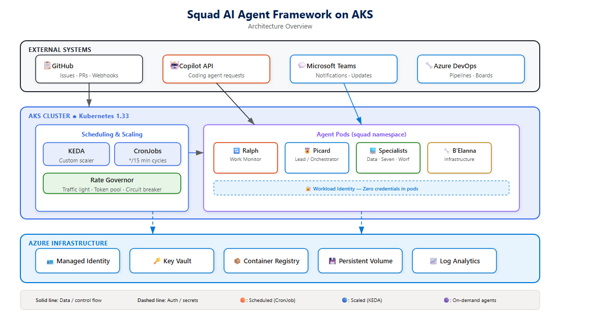
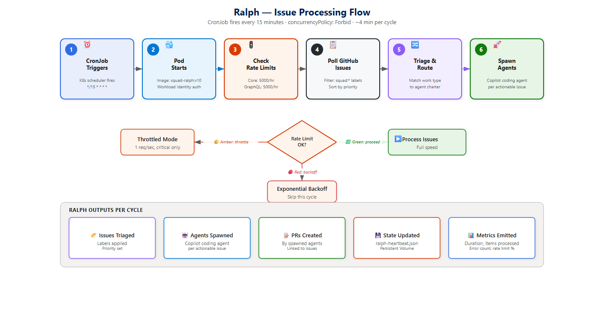
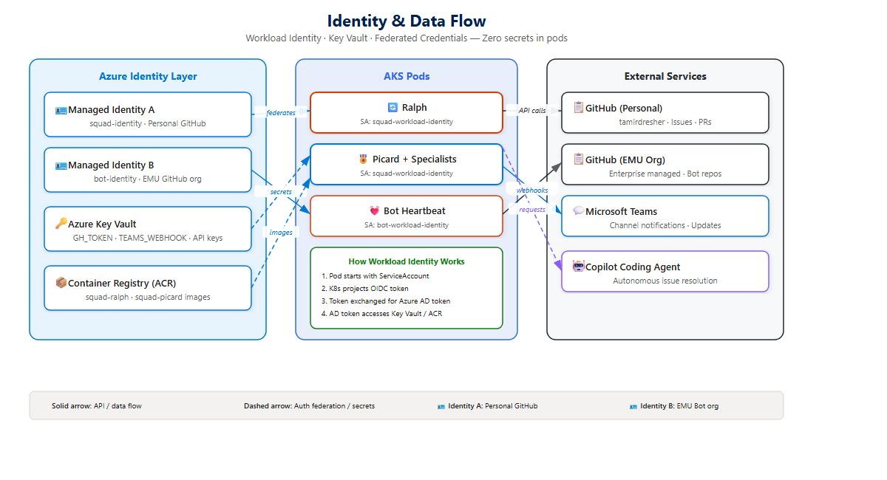
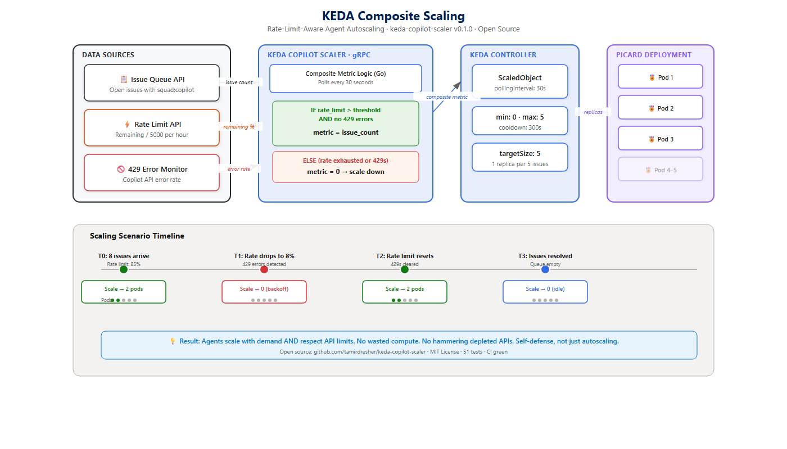
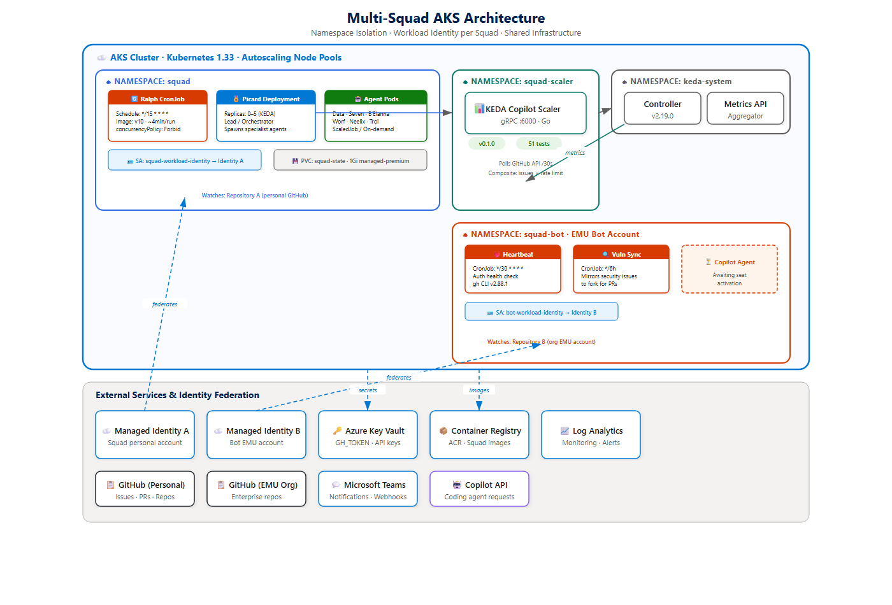
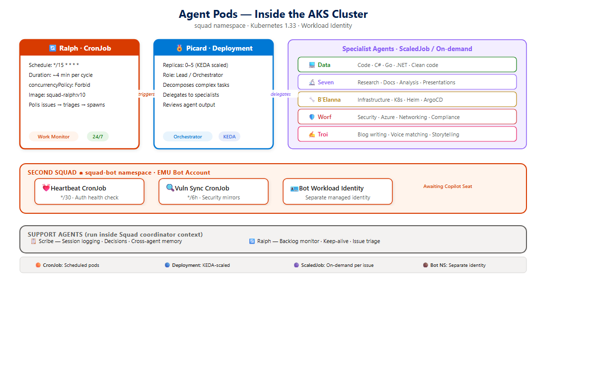

> *"The Unicomplex. Home to trillions of drones. The heart of the Collective. Every node serves a function. Every cube knows where to go."*
> — Seven of Nine, Star Trek: Voyager

At the end of [Part 5](/blog/2026/03/20/scaling-ai-part5-knowledge-power), I promised I'd zoom way out. Talk about the bigger picture. Multi-squad federation. Knowledge sharing across deployments. The grand unified theory of AI engineering teams.

I lied. Sort of.

What actually happened is that I tried to zoom out and immediately crashed into the fact that my entire AI squad was still running on a laptop. You can't federate what you can't keep running when you close the lid. Terminal windows do not run when laptops sleep. This is not a bug. This is physics.

So before the grand vision, I needed a home. A Unicomplex. Somewhere the squad could live permanently — scaling up when work arrived, scaling down when it didn't, and never once caring whether I was awake, asleep, or walking the dog.

This post is about building that home on Azure Kubernetes Service. What went right, what went sideways, what's running in production right now, and one open-source project that probably only I will ever use.

Here's what the whole thing looks like from 30,000 feet:


*Three layers. External systems talk to an AKS cluster. The cluster talks to Azure infrastructure. Everything in between is CronJobs and managed identities.*

Every `kubectl` command in this post was run against a real cluster. Every YAML block is from a real manifest. The cluster is running Kubernetes 1.33. It's not a demo.

---

## What Was Wrong With the Laptop

Let me be honest about the state of things before AKS.

Ralph ran as a PowerShell loop on my laptop. Every five minutes: wake up, check the issue queue, spawn agents, go back to sleep. It worked. It worked *well*. Parts [1](/blog/2026/03/11/scaling-ai-part1-first-team) through [5](/blog/2026/03/20/scaling-ai-part5-knowledge-power) were written while the squad ran this way. Hundreds of issues triaged, dozens of PRs opened, a whole learning pipeline humming along.

But.

The loop died when my laptop slept. It died when Windows Update decided 3 AM was a great time for a restart. It died when I unplugged at a coffee shop and battery saver throttled PowerShell to the point where `gh` CLI calls timed out. One time Ralph didn't run for 14 hours because I took a day off and forgot to leave the laptop open. The squad's backlog grew to 23 items and it took two days to catch up.

A productivity system that requires you to never close your laptop is not a productivity system. It's an anxiety generator with extra steps.

In [Part 3](/blog/2026/03/18/scaling-ai-part3-distributed), I moved to multiple machines — a DevBox, a second laptop, git-based task queues for coordination. That helped with capability routing (GPU work goes to the DevBox, regular work stays local). But it was still machines I had to keep awake. Distributed toil is still toil.

Kubernetes was the obvious answer. I'd been avoiding it because "deploying your side project to Kubernetes" felt like using a cruise ship to cross a swimming pool. But once you have two squads, three CronJobs, a custom scaler, and rate-limiting concerns across all of them — it's not a swimming pool anymore. It's an ocean. And you want the ship.

---

## Ralph Becomes a CronJob

The migration itself was surprisingly undramatic. The most interesting part was what *disappeared*.

On my laptop, Ralph's loop had 300 lines of PowerShell mutex logic. Lock files. PID checks. Stale lock detection. A whole subsystem to prevent two Ralph instances from running simultaneously — because `concurrencyPolicy` isn't a concept in "a while loop on a laptop."

On Kubernetes:

```yaml
apiVersion: batch/v1
kind: CronJob
metadata:
  name: ralph
  namespace: squad
spec:
  schedule: "*/15 * * * *"
  concurrencyPolicy: Forbid
  successfulJobsHistoryLimit: 3
  failedJobsHistoryLimit: 5
  jobTemplate:
    spec:
      activeDeadlineSeconds: 600
      template:
        spec:
          serviceAccountName: squad-workload-identity
          containers:
            - name: ralph
              image: myregistry.azurecr.io/squad-ralph:v10
              imagePullPolicy: IfNotPresent
              resources:
                requests:
                  cpu: "250m"
                  memory: "256Mi"
                limits:
                  cpu: "1"
                  memory: "512Mi"
              env:
                - name: GH_CONFIG_DIR
                  value: /tmp/gh-config
          restartPolicy: Never
```

`concurrencyPolicy: Forbid`. One line. That replaced the entire mutex subsystem. No lock files. No PID checks. No "is the previous instance still running?" logic. The Kubernetes scheduler just... handles it. If a previous Ralph job is still running when the next one triggers, the new one doesn't start. Done.

I stared at that line for a while.

The CronJob runs every 15 minutes. Each run completes in about 4 minutes — Ralph checks the issue queue, spawns Copilot coding agents for anything actionable, waits for them to finish or timeout, and exits. Clean lifecycle. No lingering processes. No leaked state.


*Every 15 minutes: wake up, check the queue, process what's there, exit. Kubernetes handles the scheduling, retries, and history. Ralph just does the work.*

The container image is ~890MB (PowerShell 7, Node.js, `gh` CLI, and Squad tooling). That's big enough that `imagePullPolicy: IfNotPresent` matters — you don't want to pull 890MB every 15 minutes. Learned that one the hard way when my first deployment spent more time downloading the image than doing actual work. Ralph was completing his rounds in 4 minutes but spending 6 minutes on image pull. That's not a CI/CD pipeline. That's a broadband speed test.

---

## Zero Credentials in the Pod

The laptop version of Ralph had a GitHub PAT stored in an environment variable. Fine for local dev. Terrible for production. PATs expire, get leaked, and require manual rotation. The kind of thing that works until the day it ruins your weekend.

AKS has Workload Identity — a pod gets an Azure Managed Identity, and that identity can authenticate to whatever services you've federated it with. No tokens stored in the cluster. No secrets to rotate. The pod proves who it is the same way a human proves who they are to Azure AD: through identity federation.

The setup:

1. Create a Managed Identity in Azure
2. Federate it with the Kubernetes service account
3. Configure `gh` CLI to use the identity for authentication

The service account annotation is where it all connects:

```yaml
apiVersion: v1
kind: ServiceAccount
metadata:
  name: squad-workload-identity
  namespace: squad
  annotations:
    azure.workload.identity/client-id: "<managed-identity-client-id>"
```

When a pod runs with this service account, Azure injects the identity token automatically. No `GH_TOKEN` secret. No Key Vault CSI driver (though we use that for other things). The pod just *is* who it says it is.

I'll be honest — getting this working took longer than I expected. The federation between the AKS OIDC issuer and the Managed Identity has specific audience and subject claims that have to match exactly, and the error messages when they don't match are... unhelpful. "Token validation failed" doesn't tell you which of the six possible misconfigurations you hit. I spent most of a Saturday on this before realizing the subject claim in the federation had a typo in the namespace. One character. Two hours.

But once it worked: zero credentials stored in the cluster. Ralph authenticates to GitHub, to Azure Container Registry, to anything federated with that identity. No rotation. No leaks. The kind of infrastructure that lets you sleep at night — which is the whole point of moving off the laptop.

Here's the flow, because the identity story is actually the part that makes everything else work:


*Left to right: Azure identity gets federated to the K8s service account. The pod picks it up automatically. From there it fans out to GitHub, ACR, and anything else you've federated. No tokens. No secrets. Just identity all the way down.*

---

## The KEDA Scaler Nobody Asked For

Here's the thing about running AI agents on Kubernetes: the standard autoscaling mechanisms don't understand your workload. CPU-based HPA doesn't know that your pods are idle because there are no GitHub issues to process. Memory-based scaling doesn't know that you're about to hit your GitHub API rate limit and every new pod you spin up will just burn quota faster.

What I needed was an autoscaler that understood *three things simultaneously*:

1. **Is there work?** (Open GitHub issues labeled `squad:copilot`)
2. **Can we do the work?** (GitHub API rate limit has headroom)
3. **Should we do the work?** (We're not getting HTTP 429s from the Copilot API)

KEDA — the Kubernetes Event-Driven Autoscaler — supports custom external scalers. You write a gRPC server that implements four methods, KEDA calls your server to decide how many replicas to run. It's the extension point I needed.

So I built [keda-copilot-scaler](https://github.com/tamirdresher/keda-copilot-scaler). It's an open-source Go project with 51 tests and a green CI badge that I am unreasonably proud of given that I wrote the whole thing in a weekend.

The core idea is **composite scaling**: the scaler only reports work when *all* conditions are met. If there are 10 open issues but the API rate limit is exhausted, the metric drops to zero. KEDA scales the pods down. They wait until the rate limit resets, then spin back up when there's both work *and* capacity.

The gRPC implementation:

```go
func (s *Server) GetMetrics(_ context.Context, req *pb.GetMetricsRequest) (
    *pb.GetMetricsResponse, error) {

    snap := s.collector.Get()
    threshold := s.getThreshold(req.ScaledObjectRef)

    var value int64
    if snap.RateLimitRemaining > threshold {
        // Only report work when API headroom exists
        value = int64(snap.IssueQueueDepth)
    }
    // Otherwise metric = 0 → KEDA scales down

    return &pb.GetMetricsResponse{
        MetricValues: []*pb.MetricValue{{
            MetricName:  req.MetricName,
            MetricValue: value,
        }},
    }, nil
}
```

Do you see what this means? When the rate limit is healthy, the metric equals the issue count — KEDA scales up to handle the work. When the rate limit is exhausted, the metric is zero — KEDA scales down regardless of how many issues are waiting. The pods back off automatically. No wasted compute. No hammering a depleted API.

The collector polls three GitHub endpoints in parallel every 30 seconds: `/rate_limit` for API quota, a GraphQL query for issue count, and (eventually) a Copilot usage endpoint that doesn't exist yet. Each poll is independent — if one fails, the others still report. Resilience over completeness.

The ScaledObject that ties it all together:

```yaml
apiVersion: keda.sh/v1alpha1
kind: ScaledObject
metadata:
  name: squad-agent-scaler
  namespace: squad
spec:
  scaleTargetRef:
    name: picard
  minReplicaCount: 0
  maxReplicaCount: 5
  pollingInterval: 30
  cooldownPeriod: 300
  triggers:
    - type: external
      metadata:
        scalerAddress: "keda-copilot-scaler.squad-scaler.svc.cluster.local:6000"
        metricName: "copilot_scaler_composite"
        targetSize: "5"
        rateLimitThreshold: "100"
```

`minReplicaCount: 0` — scale to zero when there's no work. `cooldownPeriod: 300` — wait five minutes after the last trigger before scaling down, so in-flight agent work has time to complete. `targetSize: "5"` — one replica per five issues.

Is this overengineered for a project that currently has one person using it? Absolutely. But the alternative was writing another shell script that polls GitHub and kills pods manually. I've written enough of those shell scripts. They haunt my dreams. The KEDA approach is declarative, testable, and — crucially — it works when I'm asleep.


*The feedback loop: KEDA polls the scaler → scaler checks GitHub API → metric goes up or down → pods scale accordingly. When the rate limit runs out, the metric drops to zero. No wasted compute.*

KEDA v2.19.0 is running in the cluster. The scaler runs as its own deployment in the `squad-scaler` namespace. Fifty-one tests. CI green. I mentioned the test count twice now. I'm not going to apologize for that.

---

## The Second Squad

Once the infrastructure was running, a question emerged: can we run *two* squads on the same cluster?

Not two instances of the same squad. Two different squads, each watching a different repository, each with its own identity, its own rate limits, its own CronJobs. Separate teams sharing physical infrastructure — the way any Kubernetes cluster is designed to work, but with AI agents instead of microservices.


*Two squads, three namespaces, one cluster. Each squad has its own identity, its own CronJobs, its own secrets. Namespace isolation does the heavy lifting. The only shared resource is the node pool.*

The second squad is a bot account — an Enterprise Managed User (EMU) running as an automated system. It lives in its own namespace with its own Workload Identity, its own managed identity, and its own set of CronJobs:

- **Heartbeat CronJob** — runs every 30 minutes, confirms the bot is alive and authenticated
- **Vulnerability sync CronJob** — runs every 6 hours, mirrors upstream security advisories to a fork so the bot can create PRs for them

Setting this up taught me several things the documentation didn't mention.

**Thing one:** `gh` CLI has a global auth state. One file. `~/.config/gh/hosts.yml`. When the first squad's Ralph calls `gh auth switch`, it changes the auth state for *every process using that config directory*. In [Part 4](/blog/2026/03/21/scaling-ai-part4-distributed-problems), this was the auth race condition from hell. On Kubernetes, the fix is `GH_CONFIG_DIR` — each pod gets its own config directory. No shared state. No race.

```yaml
env:
  - name: GH_CONFIG_DIR
    value: /tmp/gh-config
```

One environment variable. The distributed systems problem from Part 4, solved by container isolation. I spent two days debugging that race condition on my laptop. On Kubernetes it doesn't exist. I'm not sure if I should be relieved or embarrassed that I didn't containerize sooner.

**Thing two:** The heartbeat CronJob had bash syntax issues that took multiple iterations to fix. Not Kubernetes issues — literally bash quoting issues inside a YAML heredoc inside a container entrypoint. The kind of bug where you stare at the error message, whisper "that can't be right," run it again, and get the exact same error. Three `kubectl apply` cycles later I found a missing closing quote in a `jq` filter. Is this the future of cloud-native AI? Yes. Yes it is. And the future has quoting issues.

**Thing three:** The bot can authenticate to GitHub. It can see issues. It can create PRs. What it *cannot* do, as of this writing, is use GitHub Copilot. The Copilot coding agent requires a Copilot seat assigned to the account, and that seat activation is still pending. So we have a bot that's fully deployed, fully authenticated, running on production infrastructure, and... waiting for a license.

```
$ gh copilot suggest "hello world"
error: Copilot is not available. Your account does not have a Copilot subscription.
```

I want to be honest: this is where we are. The infrastructure is ready. The bot is ready. The Copilot seat is not. When it activates, the bot will be able to process issues end-to-end. Until then, it can triage, label, and prepare — but it can't code. Half a squad is still half a squad.

---

## The Free Tier Trap

While waiting for the bot's Copilot seat, I did something I should have done weeks earlier: I actually calculated the cost of running an always-on AI squad.

The question I keep getting from people who've read this series is: "Can I do this with the free Copilot tier?" The answer is yes, technically, in the same way you can technically drive cross-country in first gear. You'll get there. Eventually. In a way that makes you question every decision that led to this moment.

Here's the math.

The free Copilot tier gives you **50 requests per month**. Ralph runs every 15 minutes. Each run generates at least one Copilot API request (the issue triage). If there's actionable work, it generates more — one per agent spawned. Let's be generous and assume only one request per run.

```
24 hours × 4 runs/hour = 96 runs/day
50 requests/month ÷ 30 days = 1.67 requests/day

1.67 requests / 96 possible runs = 1.7% utilization
```

Ralph could run once every **14.4 hours** on the free tier. That's not an AI team. That's an AI intern who checks email twice a day.

**Copilot Pro** ($10/month): 300 requests. Better. Ralph could run every 2.4 hours. Not great, but you could get work done if you're patient and your issue queue doesn't grow faster than one item per 2.4 hours.

**Copilot Pro+** ($39/month): 1,500 requests. Now we're talking. Ralph every 29 minutes. Close to the 15-minute interval I actually run. This is the minimum viable tier for a meaningful always-on squad.

**Copilot Business/Enterprise**: Custom limits, but you need an organization. Not viable for indie developers or personal projects.

The real constraint isn't the Copilot subscription cost. It's the **GitHub API rate limit**: 5,000 requests per hour for authenticated users. Every `gh` CLI call, every issue list, every PR creation, every status check — they all count. My squad currently runs about 950 core API calls and 4,500 GraphQL calls per hour. That's dangerously close to the ceiling. The traffic light throttling I built in Part 4 (green/amber/red based on remaining quota) is the only reason we haven't hit 429 errors on the API side.

```
Current usage:
  Core API:    ~950 / 5,000 per hour (19%)
  GraphQL:   ~4,500 / 5,000 per hour (90%) ← this is the real bottleneck
```

Ninety percent GraphQL utilization. One enthusiastic `gh issue list` loop away from rate limiting. That's why the KEDA scaler exists — it's not academic. It's self-defense.

The honest answer about running Squad cheaply: you need Copilot Pro+ ($39/month) at minimum, and you need to be very disciplined about GraphQL queries. There's no magic. The APIs have limits, and AI agents are hungry.

---

## Capability Routing: Matching Agents to Hardware

Not every agent needs the same hardware. Seven does research — she needs network access and memory, but not a GPU. A podcaster agent generating voice clones needs GPU compute. B'Elanna running Helm deployments needs access to Azure credentials and Kubernetes RBAC tokens. Running everything on identical nodes wastes resources for simple tasks and starves complex ones.

The solution is capability-based routing: each node in the cluster advertises what it can do, and agents get scheduled to nodes that have what they need.

I built a DaemonSet that discovers 8 capability categories and patches them as labels on each node:

```yaml
apiVersion: apps/v1
kind: DaemonSet
metadata:
  name: capability-discovery
  namespace: squad
spec:
  selector:
    matchLabels:
      app: capability-discovery
  template:
    spec:
      containers:
        - name: discovery
          command:
            - /bin/sh
            - -c
            - |
              while true; do
                # Detect GPU
                if [ -d /dev/dri ] || nvidia-smi > /dev/null 2>&1; then
                  kubectl label node $NODE_NAME squad.io/capability-gpu=true --overwrite
                fi
                # Detect browser runtime
                if command -v chromium > /dev/null 2>&1; then
                  kubectl label node $NODE_NAME squad.io/capability-browser=true --overwrite
                fi
                # ... 6 more capability checks
                sleep 300
              done
```

Every 5 minutes, each node's capabilities get refreshed. Agent pods use `nodeSelector` or `nodeAffinity` to land on the right hardware:

```yaml
# Podcaster agent — needs GPU
spec:
  nodeSelector:
    squad.io/capability-gpu: "true"

# Seven — research, just needs network
spec:
  nodeSelector:
    squad.io/capability-network: "true"
```

This isn't fully deployed yet — it's designed, the DaemonSet runs, the labels get applied, but the agent scheduling rules are still manual nodeSelectors rather than an automated matching system. The vision is that when Picard decomposes a task, he reads the `needs:` labels on the GitHub issue and the scheduler automatically routes the agent pod to a node with matching capabilities. We're not there yet. But the building blocks are in the cluster, being tested.

I want to be honest about the gap. Today: capability labels exist, manual routing works. Tomorrow: automated matching based on issue metadata. The infrastructure is ahead of the orchestration.

---

## What Actually Runs Right Now

Let me give you the honest inventory. No aspirational diagrams. No "coming soon" features dressed up as current state. This is what `kubectl get pods` shows, today:


*Every box in this diagram is a real pod that ran this week. The namespaces are real. The CronJob schedules are real. The "Waiting for Copilot seat" label on the bot is, unfortunately, also real.*

**`squad` namespace:**
- Ralph CronJob — `*/15 * * * *`, completing in ~4 minutes, container v10
- KEDA ScaledObject watching the issue queue
- Workload Identity service account (zero stored credentials)

**`squad-scaler` namespace:**
- keda-copilot-scaler v0.1.0 — custom gRPC scaler, polling GitHub every 30s
- 51 passing tests, CI green

**`squad-bot` namespace:**
- Heartbeat CronJob — `*/30 * * * *`
- Vulnerability sync CronJob — every 6 hours
- Workload Identity with its own managed identity
- `gh` CLI v2.88.1, authenticated, 5,000 rate limit
- **Waiting for Copilot seat activation** (can triage, can't code)

**Cluster-wide:**
- KEDA v2.19.0 (AKS add-on)
- Capability discovery DaemonSet (8 labels, refreshing every 5 min)
- AKS with Kubernetes 1.33, autoscaling node pools

That's it. That's the Unicomplex. Not a trillion drones — more like a handful of very specific CronJobs and one gRPC server that talks to GitHub. But it runs 24/7. It doesn't care if my laptop is open. And it scales.

The first time I woke up to a Picard summary of work completed overnight — three issues triaged, one PR opened, two issues labeled for human review — I felt the same shift I described in [Part 1](/blog/2026/03/11/scaling-ai-part1-first-team). That's not a tool. That's a team member who works the night shift.

---

## What's Next

Part 5 teased the big question: how do you scale from one squad to many? How do a hundred squads, each working for a different team, share knowledge without leaking secrets?

Now that the infrastructure exists, I can actually work on that.

The pieces are coming together. KEDA handles scaling. Workload Identity handles authentication. Namespace isolation handles multi-tenancy. Capability routing handles hardware matching. The missing piece is **cross-squad coordination** — a way for squads in different namespaces (or different clusters) to share learned patterns, broadcast discovered vulnerabilities, and coordinate on shared dependencies.

The Borg solved this with a collective consciousness. Efficient, but the privacy implications are... suboptimal. We're going to need something more like federated learning — each squad keeps its own data, but the aggregate knowledge improves everyone.

That's Part 7. And it's the part I've been wanting to write since I started this series.

---

*This post is Part 6 of the "Scaling AI-Native Software Engineering" series. [Part 0: Organized by AI](/blog/2026/03/10/organized-by-ai) • [Part 1: Your First AI Engineering Team](/blog/2026/03/11/scaling-ai-part1-first-team) • [Part 2: Scaling Squad to Your Work Team](/blog/2026/03/12/scaling-ai-part2-collective) • [Part 3: When Your AI Squad Becomes a Distributed System](/blog/2026/03/18/scaling-ai-part3-distributed) • [Part 4: When Eight Ralphs Fight Over One Login](/blog/2026/03/21/scaling-ai-part4-distributed-problems) • [Part 5: Knowledge Is Power](/blog/2026/03/20/scaling-ai-part5-knowledge-power)*

*The [keda-copilot-scaler](https://github.com/tamirdresher/keda-copilot-scaler) is open source and MIT licensed. All YAML blocks, kubectl commands, and rate limit numbers in this post are from the production cluster. The free tier math is real and I take no pleasure in reporting it. Ralph has been running on AKS for three weeks now and has not once complained about my sleep schedule. I consider this an unqualified win.*
