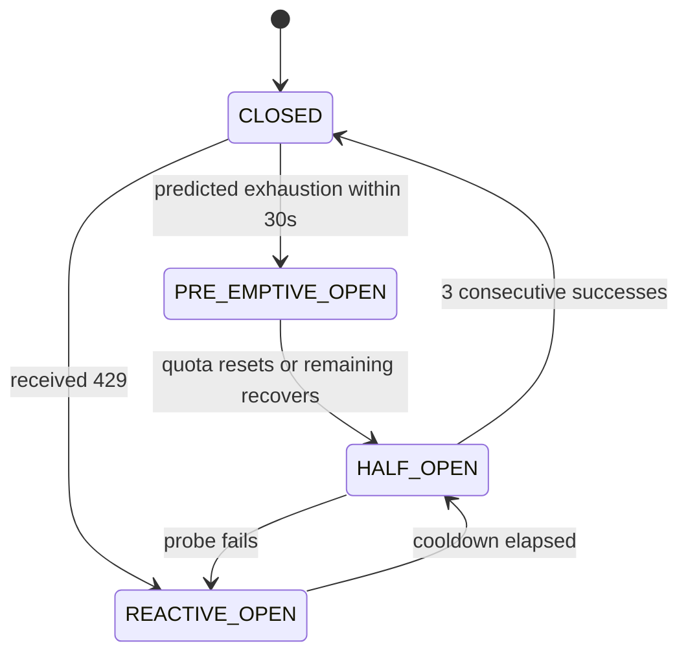

### Pattern 2: Shared Token Pool

**What broke:** All agents share an org-level GitHub Copilot quota (30K input tokens/min) but tracked consumption i
independently. When Ralph was idle, Picard couldn't borrow his unused allocation. When Ralph was busy triaging, he starv
ve
ed Data's code generation.

**What I learned:** Agents need a shared ledger. I created `rate-pool.json` — a single file (with file-locking) that t
tracks the shared quota, per-agent soft reservations, and a donation register where idle agents release unused tokens.  
 


```jsonc
// rate-pool.json
{
  "github_copilot": {
    "window_tokens_total": 30000,
    "window_tokens_remaining": 18500,
    "agent_allocations": {
      "picard": { "reserved": 8000, "used": 3200 },
      "ralph":  { "reserved": 5000, "used": 800 },
      "data":   { "reserved": 8000, "used": 7100 }
    },
    "donation_pool": 4200
  }
}
```

The rules are simple:
- **P0 agents** (Picard, Worf) always get tokens if any remain
- **P1 agents** (Data, Seven) use their reservation, then pull from the donation pool
- **P2 agents** (Ralph) yield when the pool is under 30% capacity
- **Idle agents** donate unused reservations back to the pool automatically
- **Starvation prevention:** any P2 agent denied for 5+ minutes gets promoted to P1

There's no circular wait — an agent either gets tokens immediately or yields and retries next round. No deadlocks possib
ble.

> **Key insight:** Treat your API quota like a shared bank account, not separate wallets. Idle agents should donate, cri
itical agents should overdraw.

---

### Pattern 3: Predictive Circuit Breaker

**What broke:** My existing circuit breaker opened only *after* receiving a 429. That's like pulling the fire alarm aft
ter the building is already on fire. The quota was gone, and recovery meant waiting the full cooldown window.

**What I learned:** You can predict exhaustion before it happens. If you're burning 1,000 tokens/second and you have 2,
,000 left, you've got 2 seconds — not enough time for the next agent request to complete.

I added a `PRE-EMPTIVE_OPEN` state to the circuit breaker:

 



Before switching models entirely, the circuit breaker first tries **reducing load on the same model** — cutting `max_tok
kens`, compressing prompts. Only if that doesn't help does it walk down the fallback chain:

```
claude-sonnet-4.6 → gpt-5.4-mini → gpt-5-mini → gpt-4.1
```

> **Key insight:** The difference between "locked out for 10 minutes" and "gracefully downgraded for 30 seconds" is pred
diction. If you can see the wall coming, you can brake instead of crashing.

---

### Pattern 4: Cascade Detector

**What broke:** Squad workflows are sequential — Picard makes an architecture decision, Data implements it, Belanna depl
loys it, Neelix announces it. A rate limit hit at *any* stage blocked everything downstream. But no agent knew about its
s

 dependencies.

**What I learned:** You need a dependency graph. When one agent gets rate-limited, every downstream agent should know *
*before* it attempts its next call.


When 3+ agents get rate-limited within a 30-second window, the cascade detector switches to **sequential mode** — agents
s take an ordered lock and go one at a time instead of all at once. This kills the thundering herd instantly.

I encode the workflow DAG in a simple config:

```yaml
# backpressure.yaml
workflows:
  issue-to-deploy:
    - ralph      # triage
    - picard     # architecture
    - data       # implementation
    - belanna    # deployment
    - neelix     #announcement
  cascade_threshold: 3  # agents hit in 30s triggers sequential mode
```

> **Key insight:** A rate limit isn't a local event — it's a signal that propagates through your agent dependency chain.
. Map the chain, propagate the signal.

---

### Pattern 5: Lease-Based Cleanup

**What broke:** When an agent crashed mid-round, its token reservation in the shared pool was never released. Even in a 
 couple of weeks of running, I saw phantom allocations start to accumulate — agents got denied tokens despite actual AP
PI
I quota being available. At scale, this would get much worse.

**What I learned:** Every allocation needs a lease with an expiry. I tag each reservation with a timestamp and tie it 
 to the agent's heartbeat. A background sweep every 30 seconds checks:

```powershell
# Reclaim tokens from dead agents
$heartbeatFiles = Get-ChildItem "$env:SQUAD_DIR/heartbeats/*.json"
foreach ($hb in $heartbeatFiles) {
    $agent = $hb.BaseName
    $lastBeat = (Get-Content $hb.FullName | ConvertFrom-Json).timestamp
    $staleness = (Get-Date) - [datetime]$lastBeat

    if ($staleness.TotalMinutes -gt 2) {
        # Agent is dead — reclaim its tokens
        $pool = Get-Content "rate-pool.json" | ConvertFrom-Json
        $unused = $pool.github_copilot.agent_allocations.$agent.reserved -
                  $pool.github_copilot.agent_allocations.$agent.used
        $pool.github_copilot.donation_pool += [Math]::Max(0, $unused)
        $pool.github_copilot.agent_allocations.$agent.reserved = 0
        $pool | ConvertTo-Json -Depth 5 | Set-Content "rate-pool.json"
        Write-Host "♻️ Reclaimed $unused tokens from crashed agent: $agent"
    }
}
```

This hooks directly into Squad's existing `ralph-heartbeat.ps1` — the heartbeat files are already there. I just started
d reading them.

> **Key insight:** In any environment where agents can crash — and they will — allocations outlive the processes that ma
ade them. Add a lease, or your token pool will slowly starve.

---

### Pattern 6: Priority Retry Windows

**What broke:** The standard exponential-backoff-with-jitter formula treats every caller equally. When Picard (criti
ical architecture decisions) and Ralph (background polling) both get a 429 at the same time, they both retry in the same
e

 random window. Ralph can get lucky and grab the quota before Picard. That's priority inversion.

**What I learned:** Give each priority tier its own non-overlapping retry window. P0 retries first. P1 retries after P0
0 is done. P2 goes last.


```mermaid
gantt
    title Retry Windows After 429 (non-overlapping)
    dateFormat X
    axisFormat %s

    section P0 (Critical)
    Picard, Worf : 0, 500ms

    section P1 (Standard)
    Data, Seven, Belanna, Troi, Neelix : 500ms, 3500ms

    section P2 (Background)
    Ralph, Scribe : 3500ms, 9500ms
```

| Priority | Agents | Retry Window |
|----------|--------|-------------|
| **P0** Critical | Picard, Worf | **0 – 0.5s** |
| **P1** Standard | Data, Seven, Belanna, Troi, Neelix | **0.5 – 3.5s** |
| **P2** Background | Ralph, Scribe | **3.5 – 9.5s** |

This guarantees P0 agents consume available quota before P1 agents even begin retrying. Priority inversion becomes struc
cturally impossible.

```powershell
function Get-RetryDelay {
    param(
        [int]$RetryAfterSeconds,
        [int]$Attempt,
        [int]$Priority  # 0=critical, 1=standard, 2=background
    )

    # Base delay from Retry-After header (or exponential backoff)
    if (-not $RetryAfterSeconds) {
        $RetryAfterSeconds = [Math]::Min(60, [Math]::Pow(2, $Attempt))
    }

    # Non-overlapping priority windows
    switch ($Priority) {
        0 { $windowStart = 0;    $windowEnd = 0.5  }  # P0: first 500ms
        1 { $windowStart = 0.5;  $windowEnd = 3.5  }  # P1: 500ms–3.5s
        2 { $windowStart = 3.5;  $windowEnd = 9.5  }  # P2: 3.5s–9.5s
    }

    $jitter = Get-Random -Minimum 0 -Maximum (($windowEnd - $windowStart) * 1000)
    return $RetryAfterSeconds + $windowStart + ($jitter / 1000.0)
}
```

> **Key insight:** Standard jitter treats all callers as equal. In a multi-agent system, they're not. Separate the retry
y windows by priority and the problem disappears.

---

## The Full Architecture

All six patterns feed into a shared **Rate State Store** — a pair of JSON files (`rate-pool.json` and `rate-state.json`)
) with file locking. Every agent reads state before calling an API and writes state after receiving a response. No centr
ra
al server needed — it's cooperative coordination through the filesystem.

```
┌─────────────────────────────────────────────────┐
│              Squad Rate Governor                │
│                                                 │
│  ┌──────────┐ ┌──────────┐ ┌──────────────────┐│
│  │ Traffic  │ │ Shared   │ │ Lease-Based      ││
│  │ Light    │ │ Token    │ │ Cleanup          ││
│  │ Throttle │ │ Pool     │ │ (heartbeat-tied) ││
│  └────┬─────┘ └────┬─────┘ └────────┬─────────┘│
│       │             │                │          │
│       ▼             ▼                ▼          │
│  ┌─────────────────────────────────────────┐    │
│  │  Rate State Store                       │    │
│  │  rate-pool.json · rate-state.json       │    │
│  └────────────┬────────────────────────────┘    │
│               │                                 │
│       ┌───────┼───────┐                         │
│       ▼       ▼       ▼                         │
│  ┌────────┐ ┌──────┐ ┌───────────┐              │
│  │Cascade │ │Retry │ │Predictive │              │
│  │Detector│ │Window│ │Circuit    │              │
│  │        │ │      │ │Breaker    │              │
│  └────────┘ └──────┘ └───────────┘              │
└─────────────────────────────────────────────────┘
         │          │          │
         ▼          ▼          ▼
    GitHub API   GitHub Copilot   Azure OpenAI
```

---

## Real Numbers

Here's what I observed during stress testing *before* designing the Rate Governor:

| Metric | Value |
|--------|-------|
| Agents running concurrently | 9 (V10 stress test) |
| PRs created in one burst | **10 in 22 minutes** |
| GitHub API calls/hour | 4,800+ (dangerously close to 5,000 limit) |
| 429 errors per incident | **60+ chained failures** |
| Cascade chain depth | Up to 5 agents (full workflow blocked) |
| Recovery time (no governor) | Up to **60 minutes** (full hour lockout) |
| GitHub Copilot token budget | 30K ITPM / 8K OTPM |
| Agent crashes | Several during stress test |

And here's what the patterns address:

| What I tried | What it fixes | Expected improvement |
|--------------|---------------|---------------------|
| Traffic Light Throttling | Hitting 429s reactively | 25–40% fewer 429 errors |
| Shared Token Pool | Agents starving each other | Better token utilization across all agents |
| Predictive Circuit Breaker | Full lockouts after quota exhaustion | Graceful degradation instead of 10-min outages |  
| Cascade Detector | One 429 taking down the whole workflow | 60–80% fewer cascade chains |
| Lease-Based Cleanup | Ghost allocations from crashed agents | Prevents phantom token starvation |
| Priority Retry Windows | Ralph retrying before Picard | >95% elimination of priority inversion |

---

## 5 Things to Do Today

If you're running multiple AI agents against shared API quotas, here's the practical checklist:

### 1. Read the rate-limit headers

Every response from GitHub Copilot and GitHub includes `x-ratelimit-remaining`. Parse it. Log it. React to it *befor
re* hitting a 429. This is free and takes 20 minutes to implement.

### 2. Assign priority tiers to your agents

Not all agents are equal. Your architecture decision-maker should not compete with your background poller. Define P0 (cr
ritical), P1 (standard), P2 (background) tiers and stagger your retry windows accordingly.

### 3. Share quota state across agents

If your agents track consumption independently, they will over-consume. A shared JSON file with file-locking is good eno
ough to start. You don't need Redis or a coordinator service on day one.

### 4. Add lease expiry to allocations

If agents can crash (and they will), every token reservation needs a TTL. Dead agents shouldn't hold quota hostage. Tie 
 it to a heartbeat file — if the heartbeat stops, reclaim the tokens.

### 5. Map your agent dependency chain

Which agents depend on which other agents' output? Write it down. When one agent gets rate-limited, propagate a backpres
ssure signal to everything downstream before they waste their own API calls.

---

*These patterns came out of a couple of weeks of running Squad in production and a deep dive into what breaks when you s
scale multi-agent systems. The full research report — including detailed algorithms, formal proofs, and implementation g
gu
uidance — is available in the [project repository](https://github.com/tamirdresher/squad).*

*Squad manages 8–12 autonomous AI agents performing code review, architecture decisions, infrastructure deployment, rese
earch, and communication — all against shared API quotas that were never designed for this kind of concurrent access.*  
 


---

> 📚 **Series: Scaling Your AI Development Team**
> - **Part 0**: [Organized by AI — How Squad Changed My Daily Workflow](/blog/2026/03/10/organized-by-ai)
> - **Part 1**: [Resistance is Futile — Your First AI Engineering Team](/blog/2026/03/11/scaling-ai-part1-first-team)   
> - **Part 2**: [The Collective — Organizational Knowledge for AI Teams](/blog/2026/03/12/scaling-ai-part2-collective)  
> - **Part 3**: [Unimatrix Zero — Many Teams, One Repo with SubSquads](/blog/2026/03/15/scaling-ai-part3-streams)       
> - **Part 4**: [When Eight Ralphs Fight Over One Login — Distributed Systems in AI Teams](/blog/2026/03/17/scaling-ai-p
part4-distributed)
> - **Part 5**: [Knowledge is Power — How an AI Squad Learns to Evolve Itself](/blog/2026/03/18/scaling-ai-part5-evoluti
ion)
> - **Part 6**: 9 AI Agents, One API Quota — The Rate Limiting Problem ← You are here

___BEGIN___COMMAND_DONE_MARKER___0
PS C:\Users\tamirdresher\source\repos\tamresearch1>
___BEGIN___COMMAND_DONE_MARKER___0
PS C:\Users\tamirdresher\source\repos\tamresearch1> 
