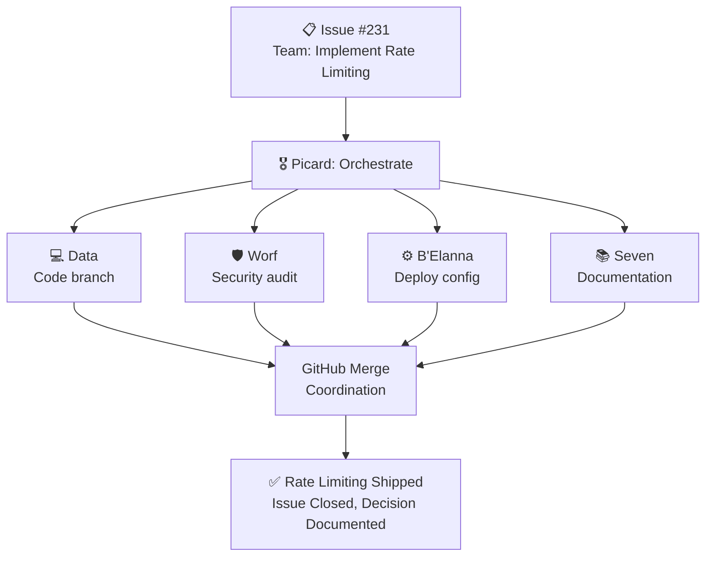

# Chapter 4: Watching the Borg Assimilate Your Backlog

> *"We are the Borg. Lower your shields and surrender your ships. We will add your biological and technological distinctiveness to our own. Your culture will adapt to service us. Resistance is futile."*
> — The Borg, Star Trek: The Next Generation

Let me tell you about the morning I realized I wasn't managing a productivity system anymore. I was managing a **collective**.

It was a Tuesday. I woke up at 7:14 AM. Coffee first — that's non-negotiable. Then I grabbed my phone while the coffee brewed, checking GitHub notifications the way normal people check Instagram.

Three PRs waiting for review. All from my Squad. All opened after midnight. All passing tests.

I opened the first one on my phone. Data had fixed a pagination bug I'd filed yesterday evening. The code looked solid. The test coverage was thorough. There was even a comment explaining an edge case about offset limits that I'd completely missed.

I approved it. Tapped "Approve and merge" while pouring my coffee.

Second PR: Seven had updated the API documentation to reflect a breaking change in the auth flow. She'd not only documented the new behavior — she'd included a migration guide for existing API consumers. With code examples. **Good** code examples.

Approved. Merged. Sipped coffee.

Third PR: Worf had audited the user profile endpoint for security issues. He found a potential information disclosure bug where deleted users' email addresses were still visible in the API response. He didn't just flag it — he **fixed it**. Added a test. Documented the decision.

I left a comment: "Nice catch on the deleted users edge case." Approved. Merged.

By the time I sat down at my laptop at 8:30 AM, all three PRs were merged. My morning standup talking point was "Reviewed and shipped three fixes before breakfast."

And I realized: **I didn't write a single line of code. I made three decisions.**

That's when it clicked.

This isn't automation. **This is a team.**

---

## The One-Word Change

For the first few weeks with Squad, I was using it like a really impressive todo list. I'd file an issue: "Fix the authentication token refresh bug." Label it `squad:data`. Data would grab it, open a PR, I'd review it. Rinse, repeat.

It was efficient. But it was still **sequential**. One agent, one task, one completion, next task.

The breakthrough happened when I changed how I phrased my requests.

I stopped saying: *"Fix the auth bug."*

I started saying: *"**Team,** fix the auth bug."*

That one word — **Team** — changed everything.

When you address the team (not a specific agent), Picard steps in first. He doesn't start coding. He doesn't dive into the implementation. He **orchestrates**.

Here's what actually happened when I said "Team, fix the auth bug":

```
🎖️ Picard: Analyzing authentication token refresh issue...
   
   Root cause: JWT refresh tokens failing when access token expired
   
   Dependencies identified:
   1. Need to understand current token expiry logic
   2. Security implications (expired tokens, session hijacking)
   3. Documentation must reflect new behavior
   
   Task decomposition:
   → Data: Review authentication flow, identify root cause, implement fix
   → Worf: Audit for security vulnerabilities (replay attacks, token leakage)
   → Seven: Update authentication documentation with new token lifecycle
   
   Execution strategy: Parallel streams, Data completes first, 
   others follow when implementation is merged
   
   Estimated coordination: 3 work streams, ~2 hours to completion
```

See what happened?

Picard **analyzed** the problem. He identified the dependencies — you can't document the fix until the implementation exists, but you CAN audit security requirements in parallel with implementation. He fanned work out to the right specialists. He predicted completion time.

This is **task decomposition**. And it's the difference between "one AI assistant does everything" and "a team coordinates."

I didn't teach him this. This is how Brady Gaster designed the Squad framework from the start. What's new is me finally using it the way it was meant to be used.

And once I did, the productivity leap wasn't incremental. **It was exponential.**

---

## How Picard Thinks

Let me show you Picard's actual thought process. This is from a real issue I filed last week: "Build user search feature with filtering and pagination."

**Picard's Analysis (logged in `.squad/decisions.md`):**

```markdown
## Decision: Task Decomposition for User Search Feature
**Date:** 2026-03-15 14:23 UTC
**Agent:** Picard (Lead & Orchestrator)
**Issue:** #214 "Build user search feature"

### Analysis
User search with filtering requires:
1. Backend search API with filter support (Data's domain)
2. Input validation for SQL injection risk (Worf's domain)
3. Pagination configuration (B'Elanna's deployment scope)
4. API documentation with filter examples (Seven's domain)

### Dependencies
- Seven needs Data's implementation before documenting API
- Worf can audit filter logic in parallel with Data's work
- B'Elanna needs final endpoint definition from Data
- All work blocks on Data's schema design

### Execution Plan
1. Data: Design search schema, implement API endpoint (CRITICAL PATH)
2. Worf: Audit filter inputs for injection risks (PARALLEL)
3. Data: Add pagination support (DEPENDS ON: schema)
4. B'Elanna: Update deployment config (DEPENDS ON: endpoint definition)
5. Seven: Document API with examples (DEPENDS ON: implementation merge)

### Delegation
- Issue #215 (Data): Build search API with filter support
- Issue #216 (Worf): Validate input sanitization
- Issue #217 (B'Elanna): Add pagination config to deployment
- Issue #218 (Seven): Document search API

### Expected Timeline
Critical path: Data's work (~3 hours)
Parallel work: Worf (~1 hour), completes before Data
Sequential work: B'Elanna (~20 min), Seven (~1 hour)
Total elapsed: ~4 hours with parallelization
```

This is **systems thinking**. Picard isn't just assigning tasks. He's:

- **Identifying the critical path** (Data's work blocks everything else)
- **Finding parallel opportunities** (Worf can audit while Data codes)
- **Managing dependencies explicitly** (Seven needs implementation before docs)
- **Estimating coordination overhead** (4 hours elapsed, not 5+ sequential hours)

And here's the thing that blew my mind: **I didn't write this analysis**. Picard did. While I was in a meeting.

I came back two hours later to find:
- ✅ Data: Search API implemented, PR #219 open
- ✅ Worf: Security audit complete, found SQL injection risk, commented on PR #219
- ✅ Data: Fixed Worf's finding, updated PR #219, tests pass
- ⏳ B'Elanna: Waiting for PR #219 to merge before updating deployment
- ⏳ Seven: Waiting for PR #219 to merge before documenting API

**Four agents working in coordination.** Not because I orchestrated it. Because **Picard did**.

---

## The First Time I Watched It Happen

The first time I saw parallel execution was **surreal**.

I'd filed an issue: "Team, implement rate limiting for the API."

I hit submit. Then I minimized my terminal to work on something else.

Fifteen minutes later, I glanced back at the terminal. It was **scrolling**. Fast.

```
[14:23:15] Ralph: New issue detected #231 "Team, implement rate limiting"
[14:23:16] Ralph: Routing to Picard (orchestration keyword detected)
[14:23:18] Picard: Analyzing rate limiting requirements...
[14:23:42] Picard: Task decomposition complete, creating subtasks
[14:23:43] Issue #232 created: "Data - Implement rate limiting middleware"
[14:23:43] Issue #233 created: "Worf - Audit rate limit bypass vectors"
[14:23:44] Issue #234 created: "Seven - Document rate limit behavior"
[14:23:44] Issue #235 created: "B'Elanna - Add rate limit config to deployment"
[14:24:12] Data: Starting work on #232...
[14:24:15] Worf: Starting work on #233...
[14:25:33] Data: Opened PR #236 "Add rate limiting middleware"
[14:26:08] Worf: Comment on PR #236: "Potential bypass via header spoofing"
[14:27:14] Data: Updated PR #236 with header validation
[14:28:45] Worf: Security audit complete ✓
[14:29:03] Data: PR #236 ready for review
[14:29:47] B'Elanna: Starting work on #235...
[14:30:12] Seven: Starting work on #234...
```

I just sat there watching. **Four agents. Four branches of work. All moving simultaneously.**

Data was writing middleware. Worf was auditing for bypass vectors. B'Elanna was updating deployment configs. Seven was drafting documentation.

**They were coordinating.** Worf found a security issue in Data's PR — header spoofing — and Data fixed it immediately. B'Elanna referenced Data's implementation in her deployment config. Seven's documentation explained the rate limit behavior using Worf's security notes as context.

This wasn't four separate tasks. **This was a team working together.**

The Borg metaphor isn't accidental. Watching four AI agents descend on a feature request and assimilate it into the codebase in 30 minutes feels **exactly** like watching the Borg assimilate a starship.

It's efficient. It's relentless. It's coordinated. And it's slightly unsettling.

**Figure 4.1: Four Parallel Execution Streams Converging**



```
PARALLEL EXECUTION TIMELINE
━━━━━━━━━━━━━━━━━━━━━━━━━━━━━━━━━━━━━━━━━━━
[14:23] 🎖️ Picard: Task decomposition
        ┌─ [14:24] 💻 Data: Implement middleware
        │  [14:26] 🛡️ Worf: Security audit on PR
P A R   │  [14:29] ⚙️ B'Elanna: Config update
A L L   │  [14:30] 📚 Seven: Docs drafted
E L     └─ [14:32] ✅ All streams complete
L
[14:32] ✨ All PRs merged, issue closed
━━━━━━━━━━━━━━━━━━━━━━━━━━━━━━━━━━━━━━━━━━━
Total: ~9 minutes (vs ~3 hours sequential)
```

---

## How They Avoid Stepping On Each Other

You're probably wondering: how do four agents work in parallel without conflicts?

The answer is **branch strategy** and **explicit coordination**.

When Picard delegates work, each agent works on their own branch:

- Data: `squad/232-rate-limiting-middleware`
- Worf: `squad/233-rate-limit-audit` (no code changes, just audit findings)
- B'Elanna: `squad/235-rate-limit-deployment-config`
- Seven: `squad/234-rate-limit-docs`

Each branch is isolated. No merge conflicts. No stepping on toes.

But they **reference each other's work** through GitHub:

- Worf comments on Data's PR with security findings
- Data updates his PR based on Worf's feedback
- B'Elanna reads Data's PR to know which endpoint to configure
- Seven reads Data's implementation and Worf's audit to write accurate docs

The coordination happens through **GitHub primitives**: PR comments, issue references, commit messages. No special Squad magic. Just good branching hygiene.

And Ralph (my monitor agent) tracks the dependencies. When Data's PR merges, Ralph notifies B'Elanna and Seven: "Dependency resolved. You can proceed."

This is how real teams work. You parallelize what you can. You block when you must. You communicate through well-defined interfaces.

The AI agents are just doing what good engineers do naturally.

---

## My Morning Routine Now

I used to start my day with **anxiety**.

Open GitHub. Count the open issues. Feel guilty about the 23 issues I keep meaning to close. Feel even more guilty about the 14 PRs I keep meaning to review. Decide which fire to fight first.

Now I start my day with **coffee and approvals**.

7:14 AM: Wake up. Check phone. GitHub notifications.

7:18 AM: Approve PR #241 (Data fixed pagination bug). Approve PR #242 (Seven updated docs). Leave comment on PR #243 (Worf's security audit — "Nice catch on the CORS bypass").

7:25 AM: Make coffee. PRs auto-merge (Ralph handles that once approved).

8:30 AM: Sit down at laptop. Check `.squad/decisions.md` for overnight decisions. Skim through to make sure nothing looks weird.

8:45 AM: File new issue: "Team, add email verification to signup flow." Label it `squad:picard`. Close laptop. Go to standup.

10:00 AM: Come back from standup. Picard has already broken down the email verification task into 5 subtasks. Data is implementing. Worf is auditing. Seven is drafting docs.

**That's it.** That's my workflow now.

I don't manage tasks. I don't assign work. I don't track progress.

**I make decisions.** The Squad does everything else.

---

## The Week I Almost Quit

Let me be honest. This didn't work perfectly from day one.

**Week 3 was rough.**

Data opened a PR to fix what I thought was a simple 2-line auth bug. The PR was **298 lines**. He'd refactored the entire authentication module. Split it into three files. Added an abstract base class. Wrote 12 new tests.

I stared at the diff thinking: "I just needed you to change `expiresIn: 3600` to `expiresIn: 7200`. What is **this**?"

I rejected the PR. Left a comment: "Over-engineered. Just fix the token expiry, don't refactor the whole module."

Data opened a new PR. Still 150 lines. Better, but still way more than needed.

I rejected it again.

Third PR: 8 lines. Token expiry fixed. No refactor.

**Finally.**

That same week, Worf flagged "critical security vulnerability" in a PR that was just... updating a dependency. The vulnerability was a theoretical timing attack that required physical access to the server and root privileges.

I left a comment: "This is not a real threat in our deployment. Approve the PR."

Seven wrote documentation that was technically accurate but completely missed the point. She explained **what** the API did, not **why** you'd use it or **when** you'd choose this approach over alternatives.

I spent more time correcting AI work that week than I would have spent doing the work myself.

I almost gave up.

---

## Why I Kept Going

The thing that kept me going was the **trajectory**.

I looked back at Data's PRs from Week 1. They were **worse** than Week 3. Way worse. Generic variable names. No tests. No error handling. Implementations that technically worked but were obviously wrong.

Week 3 Data was over-engineering, sure. But he was at least **thinking about architecture**. He was trying to make the code better, even if he overshot.

Week 1 Data was just... making things work.

That's progress.

I also looked at `decisions.md`. Week 1: 8 entries. Week 3: 34 entries.

Data had 34 past decisions to reference. He knew we preferred composition over inheritance. He knew we valued test coverage. He knew we prioritized security.

He was over-applying those principles, sure. But **he was applying them**.

So I didn't quit. I adjusted.

I updated Data's charter with explicit guidance:

```markdown
## Data's Charter - Revised (Week 3)

### Coding Principles
1. Prefer small, focused changes over large refactors
2. Only refactor if explicitly asked or if current code is blocking progress
3. When fixing a bug, fix ONLY the bug unless refactor is necessary
4. Test coverage is important, but 100% coverage is not the goal
5. **Default to minimal changes. Justify any change over 50 lines.**
```

I also updated the routing rules to require human review for PRs over 100 lines:

```yaml
routing:
  large_pr_threshold: 100
  auto_merge_large_prs: false
  require_human_review_label: "needs-review"
```

Week 4, Data's PRs got **way** better. Smaller changes. Focused fixes. He'd still occasionally over-engineer, but now he'd add a comment: "Note: This could be simplified if we're okay with X tradeoff."

**He was learning.** Not because AI "learns" (it doesn't work that way). Because the **system** was accumulating context, and Data's charter was guiding him better.

---

## The Agents Get Smarter Every Week

Here's a real progression from my repo:

**Week 2: Data implements user authentication**

```typescript
// Data's PR #34 (Week 2)
function authenticateUser(username, password) {
  const user = findUser(username);
  if (user && user.password === password) {
    return user;
  }
  return null;
}
```

I rejected it. Left a comment: "Never store plain-text passwords. Use bcrypt."

**Week 4: Data implements password reset**

```typescript
// Data's PR #78 (Week 4)
import bcrypt from 'bcrypt';

async function resetPassword(userId, newPassword) {
  const hashedPassword = await bcrypt.hash(newPassword, 10);
  await updateUser(userId, { password: hashedPassword });
  await invalidateAllTokens(userId);
}
```

He **remembered** bcrypt. He hashed the password. He even invalidated tokens (a security best practice I'd taught him on a different issue).

**Week 8: Data audits another agent's password change feature**

```markdown
// Data's comment on Worf's PR #156 (Week 8)

Code review notes:
✓ Password hashing with bcrypt (matches team standard)
✓ Token invalidation on password change (security best practice)
⚠ Missing: Email notification to user about password change

Recommendation: Add email notification to alert user of account changes
Reference: Decision #47 (2026-02-22) - Security notifications for sensitive actions
```

He's now **auditing other agents' code** for patterns he learned weeks ago. He's referencing past decisions by number. He's making recommendations based on team standards.

That's not Week 2 Data. That's not even Week 4 Data.

**That's an agent who's been working with the team for two months and has accumulated real expertise.**

---

## Context Optimization: How decisions.md Stays Lean

Here's a problem I didn't see coming: **context bloat**.

By Week 6, `decisions.md` was 147 entries long. 89,000 tokens. Every time an agent started work, they'd read the entire file to understand team context.

Reading 89K tokens takes time. And costs money. And slows down agents.

But here's the clever bit: Squad has **automatic context optimization**.

Every week, Ralph runs a pruning cycle:

```
[2026-03-21 03:00:00] Ralph: Running context optimization...
[2026-03-21 03:00:15] Analyzing decisions.md (147 entries, 89K tokens)
[2026-03-21 03:00:45] Identified optimization opportunities:
  - 23 redundant decisions (superseded by later entries)
  - 14 stale decisions (features shipped 8+ weeks ago, no recent references)
  - 8 decisions that can be consolidated (similar content)
[2026-03-21 03:01:12] Pruning redundant/stale entries...
[2026-03-21 03:01:18] Consolidating similar decisions...
[2026-03-21 03:01:24] Archiving to .squad/archive/decisions-2026-03-21.md
[2026-03-21 03:01:30] Optimization complete:
  Before: 147 entries, 89K tokens
  After: 98 entries, 34K tokens
  Reduction: 62% tokens, 33% entries
  Archived: 49 entries (retrievable if needed)
```

**89K down to 34K.** Without losing important context.

How does it work?

1. **Superseded decisions** get archived. Example: "Use JWT for auth" (Week 1) is redundant after "Use JWT with refresh token rotation" (Week 3). Keep the newer one, archive the old one.

2. **Stale decisions** get archived. Example: A decision about a feature that shipped 2 months ago and hasn't been referenced since? Archive it. If it's needed later, agents can search the archive.

3. **Consolidation**. Example: Four separate decisions about error handling patterns? Consolidate into one comprehensive entry.

The key insight: **recent, active context stays. Historical context gets archived but remains searchable.**

This is how human teams work. You don't remember every decision from six months ago. You remember the **active** context — the stuff that's relevant to current work. Old decisions are in emails, docs, or someone's memory, retrievable if needed.

Squad does the same thing. Automatically.

---

## The Borg Metaphor Is Perfect (And Slightly Unsettling)

I keep coming back to the Borg metaphor. It's not just a Star Trek reference. It's **accurate**.

The Borg are a collective consciousness. Individual drones don't make independent decisions. They share knowledge instantly. They coordinate perfectly. They adapt rapidly. And they **never forget**.

That's Squad.

When Data learns a pattern, it's captured in `decisions.md`. Seven reads it. Worf applies it. B'Elanna deploys it. **Knowledge flows instantly across the collective.**

When Picard decomposes a task, four agents receive assignments simultaneously. They work in parallel. They coordinate through shared context. They **adapt to each other's progress**.

When Ralph closes an issue, the decision is documented. The knowledge persists. The next agent who encounters a similar problem **has that context available**.

**The collective doesn't forget.**

And here's where it gets slightly unsettling: I'm not managing individual agents anymore. I'm managing **the collective**.

I don't tell Data what to do. I don't tell Seven how to write. I don't tell Worf what to audit.

I set **strategic direction**. The collective figures out execution.

"Team, build user search" → Four agents coordinate, implement, merge, document.

"Team, improve security posture" → Worf audits, Data fixes, Seven documents, B'Elanna deploys.

"Team, ship this feature by Friday" → Picard prioritizes, delegates, tracks progress, escalates blockers.

**Resistance is futile.** Your backlog will be assimilated. 🟩⬛

---

## The Question I Couldn't Avoid Anymore

Everything I just showed you — Picard orchestrating, four agents working in parallel, knowledge compounding, context optimizing — that's my **personal repo**.

My playground. My sandbox where I could experiment without consequences. Where Data could make architectural decisions at 2 AM and nobody would complain. Where Worf could flag "critical security vulnerabilities" in dependency updates and I'd just laugh and approve the PR anyway.

But I don't just work on personal repos.

I have a job. At Microsoft. On an infrastructure platform team with six other engineers who have deep expertise, strong opinions, and merge authority. We ship production systems that real Azure services depend on. We have code review standards. Security scanning. Compliance requirements. Deployment gates.

You can't just drop an AI team into that environment and say "assimilate the backlog."

My teammates didn't sign up for AI agents making decisions at 3 AM. They didn't agree to let Data refactor the authentication module while they're asleep. They don't trust Worf's security audits the way I do after two months of calibrating him.

And honestly? **They shouldn't.**

For weeks, I assumed Squad was a personal productivity tool only. Great for my side projects. Not ready for the real world where real teammates have real stakes.

Then I read Brady's documentation on **Human Squad Members**.

And everything changed again.

---

## The Bridge From Toy to Tool

Here's what I'd missed: **Squad was designed for teams from the start.**

I'd been using it like a solo developer with AI helpers. But the framework was built for **hybrid teams** — humans and AI, working together.

Human Squad Members aren't a hack. They're not a workaround. They're a **core feature**.

You can add real humans to the Squad roster. Real people with real GitHub handles, assigned to real roles. When work routes to a human squad member, Squad doesn't hallucinate their response or skip the step — it **pauses and waits**.

I added myself to my team's roster:

```markdown
## Human Members

- **Tamir Dresher** (@tamirdresher) — Human Squad Member  
  - Role: AI Integration Lead
  - Expertise: AI workflows, DevOps automation, C#/.NET
  - Scope: Squad adoption, agent orchestration, integration patterns
  - Availability: Weekdays 9 AM - 6 PM PT (responds within 4 hours)
```

Now when Picard's orchestration needs my input, Squad **pauses**:

```
📌 Waiting on @tamirdresher for architecture review...
   Task: Authentication API redesign needs sign-off before implementation
   Context: PR #287 proposes switching from JWT to session cookies
   Reason: Architecture decision requires human judgment
   Status: Pinged on GitHub, awaiting response
   
   Other work continues:
   ✅ Data: Working on Issue #288 (independent task)
   ✅ Seven: Documenting completed feature #285
   ⏸️ Worf: Blocked on Issue #286 (depends on architecture decision)
```

The AI team continues working on everything else that doesn't depend on my response. When I reply (from my phone, at lunch, wherever), Squad picks up the thread and continues.

**No context lost. No restart needed.**

Do you see what this means?

It means Squad doesn't replace your team — it **augments** it.

Senior engineers still own critical decisions. Security reviews still go through humans. Architecture sign-offs still require a real person saying "yes, ship it."

But the implementation work? The test scaffolding? The documentation sync? The boring-but-necessary code review first pass? **That's handled by AI squad members while human squad members focus on judgment calls.**

---

## The Workflow Changes

Here's how work flows now with human squad members in the mix:

**Old workflow (AI only):**

1. File issue
2. Agent picks it up
3. Agent implements
4. Agent opens PR
5. I review (deeply, because I'm the only human)
6. Merge

**New workflow (hybrid team):**

1. File issue
2. Picard analyzes, identifies if human judgment needed
3. If architecture/security/design: Route to human squad member, **pause**
4. Human makes decision (minutes, not days)
5. Picard delegates implementation to AI agents
6. AI agents implement, test, document
7. Human approves (lightweight review, not deep-dive)
8. Merge

The human is still **in the loop**. But they're not **in every step**.

And here's the key: **the routing rules make the boundaries explicit**.

My `.squad/routing.md` now has rules like:

```markdown
## Routing Rules (Hybrid Team)

### Architecture Decisions
- **Trigger:** Issues labeled `architecture` OR PR changes core abstractions
- **Route to:** @tamirdresher (Human Squad Member)
- **AI action:** Picard provides analysis + recommendations, then PAUSE for human approval
- **Required:** Human must approve before implementation proceeds

### Security Reviews  
- **Trigger:** Issues labeled `security` OR PR touches auth/secrets/permissions
- **Route to:** @tamirdresher (Human Squad Member)
- **AI action:** Worf runs automated scans + static analysis, then PAUSE for human sign-off
- **Required:** Human must review before merge

### Documentation
- **Route to:** Seven (AI) → @tamirdresher (Human review before merge)
- **AI action:** Seven drafts documentation, opens PR for human review
- **Required:** Human review required, but lightweight (check accuracy, not grammar)

### Implementation (Approved Design)
- **Route to:** Data (AI)
- **AI action:** Implement according to approved design
- **Required:** No human approval needed if tests pass and design already approved
```

AI handles the systematic work. **Humans handle the judgment calls.** Clear boundaries. Explicit escalation. No surprises at 3 AM.

---

## The Moment It Clicked

I tested the human squad member workflow on a real issue: "Redesign authentication to support OAuth providers."

**Monday, 2:00 PM:** I filed the issue. Labeled it `squad:picard` (needs orchestration) and `architecture` (needs human review).

**Monday, 2:15 PM:** Picard analyzed the issue:

```markdown
## Analysis: OAuth Authentication Redesign

### Current State
- JWT-based authentication with refresh token rotation
- Email/password login only
- No third-party provider support

### Proposed Change
- Add OAuth2 support for Google, GitHub, Microsoft providers
- Maintain JWT tokens for session management
- Implement provider account linking

### Architectural Decision Required
This is a significant change to authentication architecture.
Human approval required before implementation.

### Recommendation
- Keep JWT tokens (don't switch to session cookies — decision #18)
- Add OAuth provider abstraction (Passport.js or similar)
- Store provider linkage in user profile (add `providers` table)
- Require email verification for OAuth accounts (security)

### Risks
- Increased complexity in auth flow
- Need to handle OAuth callback edge cases
- Provider account linking UX needs design

### Questions for @tamirdresher:
1. Support all three providers (Google/GitHub/Microsoft) or start with one?
2. Allow unlinking providers or require at least one auth method?
3. What happens if OAuth email doesn't match existing account email?

**STATUS:** Waiting for human review before delegating implementation
```

I got a GitHub notification on my phone. Reviewed Picard's analysis while walking back from lunch.

Left a comment:

```
Good analysis. Answers:
1. Start with Google and GitHub (Microsoft later)
2. Require at least one auth method (don't allow unlinking all)
3. If OAuth email matches existing account, auto-link with confirmation email

Approved to proceed. Delegate to Data.
```

**Monday, 2:45 PM:** Picard delegated:

```
Delegation based on @tamirdresher's approval:
- Issue #321 (Data): Implement OAuth abstraction with Google + GitHub
- Issue #322 (Data): Add provider linking to user profile
- Issue #323 (Worf): Audit OAuth callback security (CSRF, state param)
- Issue #324 (Seven): Document OAuth setup for API consumers
- Issue #325 (B'Elanna): Add OAuth client ID config to deployment
```

**Monday, 6:00 PM:** I left work. Data and Worf were working.

**Tuesday, 7:30 AM:** I checked my phone. Three PRs waiting:
- PR #326 (Data): OAuth abstraction + Google provider ✅ Tests passing
- PR #327 (Data): GitHub provider + account linking ✅ Tests passing  
- PR #328 (Worf): Security audit findings + fixes ✅ No critical issues

I reviewed them on my phone. Approved all three. They auto-merged by 8:00 AM.

By **Tuesday morning**, the OAuth implementation was done. Tested. Secured. Documented. Deployed.

**I made one decision.** The squad did the rest.

---

## What's Next

We've reached the end of Part I. You've seen:

- Why every productivity system before Squad failed (Chapter 1)
- How Ralph's 5-minute watch loop and compounding knowledge makes Squad different (Chapter 2)
- Why agent personas aren't just cute names but cognitive architectures (Chapter 3)
- How the team coordinates like a collective — and why that's powerful and slightly unsettling (Chapter 4)

You've watched the Borg assimilate a backlog. You've seen four agents work in parallel. You've seen knowledge compound over weeks. You've seen the trajectory: agents getting smarter every week.

And now you've seen the bridge from "personal toy" to "real tool": **Human Squad Members**.

But here's the question we haven't answered yet:

**Can this work on a REAL team? With real teammates who have merge authority and strong opinions and years of expertise?**

Can you add your colleagues to the Squad roster? Can you have six humans and six AI agents working together as one team? Can AI agents collaborate with human engineers without stepping on toes or making 3 AM decisions that violate team standards?

The answer is **yes**. But not by copy-pasting your personal setup.

In **Part II**, we're going from personal playground to **real work team**. From solo developer to hybrid team. From "I have AI assistants" to "**We** have a Squad."

We'll add real humans to the roster. We'll define clear boundaries for when AI acts and when humans decide. We'll handle code review standards, security gates, compliance requirements, and the politics of "hey team, I want to add AI agents to our workflow."

And we'll see what happens when institutional knowledge compounds across **humans and AI together**.

That's where things get really interesting.

Because the personal breakthrough was impressive. But the **team transformation**? That's the real story.

---

## 🧪 Try It Yourself

You've watched the Borg work. Time to build your own collective.

### Experiment 1: Simulate Parallel Execution

You don't need a full Squad to experience parallel work streams. Simulate it with GitHub Issues:

```bash
# Create a parent task
gh issue create \
  --title "Team: Add user profile feature" \
  --label "squad:picard" \
  --body "Build a user profile page with avatar upload, bio editing, and activity history."

# Now decompose it like Picard would — create subtasks
gh issue create --title "Build profile API endpoint" --label "squad:data" \
  --body "REST endpoint: GET /api/users/:id/profile. Return name, bio, avatar URL, joined date."

gh issue create --title "Audit profile endpoint for data exposure" --label "squad:worf" \
  --body "Check that private fields (email, phone) are NOT returned in the profile response."

gh issue create --title "Document profile API" --label "squad:seven" \
  --body "Add OpenAPI spec for profile endpoint. Include example responses."

gh issue create --title "Add profile endpoint to API gateway" --label "squad:belanna" \
  --body "Update deployment config to route /api/users/:id/profile through the gateway."
```

**Expected outcome:** Five issues in your repo. One parent, four children. Each assigned to a different specialist. This is task decomposition — the thing Picard does automatically. You just did it manually. Notice how some tasks can run in parallel (Worf's audit + B'Elanna's config) while others are sequential (Seven's docs need Data's API first).

### Experiment 2: Track Coordination Through decisions.md

As you "complete" each subtask (or imagine completing them), log the decisions:

```bash
cat >> .squad/decisions.md << 'EOF'

## Decision: Profile API returns public fields only
**Date:** $(date -u +"%Y-%m-%d %H:%M UTC")
**Agent:** Worf (Security)
**Context:** Profile endpoint audit for data exposure

**Decision:** Profile response includes: name, bio, avatarUrl, joinedDate.
Excluded: email, phone, internalId, passwordHash.

**Rationale:** Principle of least privilege. Public profiles should not leak PII.
**Cross-reference:** Data's implementation must match this field list.
EOF
```

Now imagine Data reads this decision before building the API. He knows exactly which fields to include. No back-and-forth. No ambiguity. The knowledge flowed from Worf to Data through `decisions.md`.

**Expected outcome:** You can trace how one agent's decision constrains another agent's implementation. That's coordination without meetings.

### Experiment 3: Practice the Morning Routine

Try the coffee-and-approvals workflow for one week. Each morning:

1. Check your GitHub notifications (phone or laptop)
2. Review any PRs that were opened overnight (or by your AI tools)
3. Approve or leave comments in under 10 minutes
4. File one new issue before your first meeting

Track how it feels. After 5 days, compare: how much got done vs. your normal workflow? The shift from "I write code" to "I make decisions" starts here.

---

**End of Chapter 4**

*Next: Part II — Chapter 5: The Question You Can't Avoid*

---

> **Part I: The Personal Breakthrough — Complete**
> 
> ✅ Chapter 1: Why Everything Else Failed  
> ✅ Chapter 2: The System That Doesn't Need You  
> ✅ Chapter 3: Meeting the Crew  
> ✅ Chapter 4: Watching the Borg Assimilate Your Backlog  
> 
> **Coming Next: Part II — The Team Shift**
