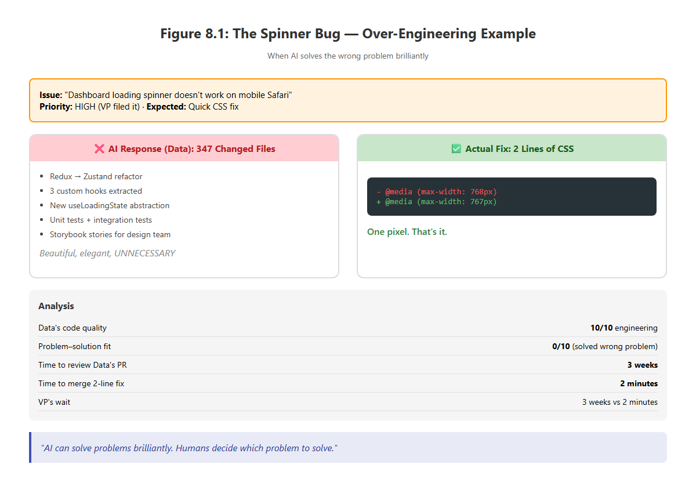
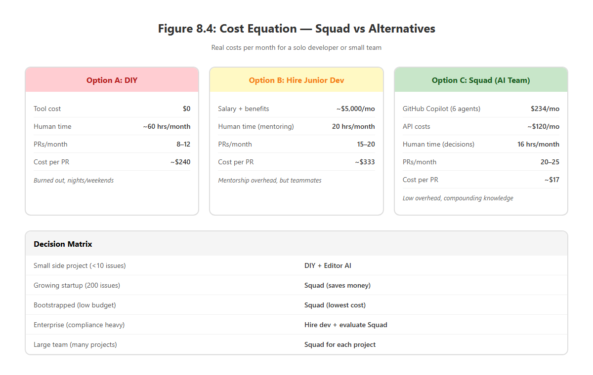

# Chapter 8

## What Still Needs Humans

> **This chapter covers**
>
> - Understanding why AI excels at analysis but can't make judgment calls
> - Recognizing the boundaries between AI implementation and human decision-making
> - Navigating political context, production incidents, and architecture decisions with an AI team
> - Calculating the real cost equation for AI-augmented development
> - Building a trust framework for when to escalate, trust, or override your AI agents

> *"AI can write the code. But only you can decide which code to write."*

Let me tell you about the time Data tried to fix a bug that should have taken five minutes.

It was a Tuesday morning. A VP had filed an issue: "The dashboard loading spinner doesn't work on mobile Safari." Priority: High. Because when a VP files a bug, every bug becomes high priority.

I labeled it `squad:data` and went to get coffee.

By the time I got back — maybe 10 minutes — Data had opened a PR. Excellent. I clicked through to review it.

**The PR had 347 changed files.**

I scrolled through the diff in complete silence. Data hadn't just fixed the spinner. He'd refactored the entire loading state management system. Redux replaced with Zustand. Three custom hooks extracted. A new `useLoadingState` abstraction. Unit tests. Integration tests. Storybook stories for the design team.

It was beautiful code. Elegant. Well-tested. Completely architected.

It was also **not what we needed**.

The actual bug? A CSS media query targeting the wrong breakpoint. **Two lines.**

**Listing 8.1: The two-line CSS fix that a 347-file refactor couldn't beat**

```css
/* Before */
@media (max-width: 768px) { ... }

/* After */
@media (max-width: 767px) { ... }
```

That's it. That's the entire fix. One pixel off. Classic Safari.



Data's 347-file refactor would have taken three weeks to review properly. Would have delayed two other features. Would have introduced risk into a stable system. Would have made the VP wait **three weeks** for a spinner to work.

I closed Data's PR with a polite comment: "This is over-engineered for the scope. Let's just fix the CSS."

I opened a new issue: "Fix mobile spinner — CSS ONLY, do not refactor."

Data fixed it in 2 minutes this time. Two lines. Perfect.

**And that's when I learned the most important lesson about AI teams:**

**AI can solve problems brilliantly. But only humans can decide which problem to solve.**

> 🔑 **KEY CONCEPT:** AI agents optimize for the problem as stated. Humans optimize for the problem that *actually matters*. Constraining the scope of AI work — through clear, specific issues — is one of your most important jobs as the human lead.

---

## 8.1 The Boundaries You Can't Cross (Yet)

Three months into running Squad, I've found the edges. The places where AI stops and humans **must** start.

Not because the AI is bad. Because the AI is solving a different problem than the one you're trying to solve.

> *Side note:* If you followed along in chapters 3–5 while building your own Squad, you may have already bumped into some of these boundaries. This chapter names them explicitly so you can recognize them faster next time.

Let me walk you through the boundaries.

---

## 8.2 Architecture Decisions: Analysis vs. Judgment

Here's what AI is **incredible** at:

- Analyzing trade-offs
- Listing pros and cons
- Finding edge cases you missed
- Researching patterns from your codebase
- Synthesizing information from documentation

Here's what AI **cannot** do:

- Decide which trade-off matters more
- Understand your team's velocity
- Know what your VP cares about vs. what your tech lead cares about
- Predict which technical debt you can afford this quarter
- Assess political risk of a rewrite

**Example:**

I asked Picard to analyze whether we should migrate our auth system from sessions to JWT.

His analysis was **perfect**:

**JWT Pros:**
- Stateless (scales horizontally)
- Works across multiple domains
- Industry standard
- Reduces database load

**JWT Cons:**
- Can't revoke tokens easily (session can just delete from DB)
- Larger payload size (impacts mobile users)
- Client must implement refresh logic correctly
- More complex secret management

**Session Pros:**
- Simple to implement
- Easy to revoke (just delete from database)
- Smaller cookie size
- Server controls everything

**Session Cons:**
- Requires database lookup on every request
- Doesn't scale horizontally without sticky sessions or Redis
- Cross-domain issues
- Tighter coupling between services

Picard laid it all out beautifully. With code examples. With metrics from our existing system.

But then he asked: **"Which architecture should we choose?"**

And I realized: he can't answer that. Because the answer depends on:

- Are we scaling horizontally next quarter? (I know the roadmap; he doesn't)
- Does our mobile team have bandwidth to implement JWT refresh properly? (I know their sprint velocity; he doesn't)
- Did the security team just mandate "revocability" as a requirement? (I was in that meeting; he wasn't)
- Is the CEO's demo in two weeks going to break if we migrate mid-sprint? (I know about the demo; he doesn't)


**AI gives you the map. But only you can pick the destination.**

I chose JWT. Not because it's "better." Because our mobile team had bandwidth, we were hiring DevOps next quarter to handle horizontal scaling, and the security team's "revocability" requirement didn't apply to user sessions (only admin sessions, which we handle differently).

Picard couldn't know any of that. **I** had to make the call.

> 💡 **TIP:** When asking an AI agent to analyze architecture options, always ask it to list the *assumptions* behind each recommendation. That way you can quickly spot which assumptions don't hold in your specific context — and make a better-informed decision.

---

## 8.3 Production Incidents: Context vs. Diagnosis

Here's what happens when production breaks at 2 AM:

Ralph detects the failure (monitors are screaming). He gathers context:
- Error logs from the last 30 minutes
- Recent deployments (last 4 hours)
- Relevant code changes (3 PRs merged today)
- System metrics (CPU, memory, response times)
- Dependency status (are third-party APIs down?)

He opens an incident issue. Tags it `squad:picard` for triage.

Picard reads the context. Proposes three hypotheses:
1. Database connection pool exhausted (max connections hit)
2. New caching layer introduced race condition
3. Third-party API rate limit exceeded

He attaches evidence for each hypothesis. Links to relevant logs. Suggests diagnostic commands.

**This is incredible.** I'm bleary-eyed at 2 AM and Picard has already done 80% of the investigative work.

But here's where humans are still required:

**I have to decide which hypothesis to test first.**

Because testing hypothesis #1 (database connection pool) requires bouncing the database connection manager, which will cause a 30-second outage for all users.

Testing hypothesis #3 (API rate limits) requires checking with the vendor, which means waking up their on-call person at 2 AM (they're in a different timezone).

Testing hypothesis #2 (caching race condition) requires disabling the new cache, which will slow down the site but keep it running.


**Picard can't make that call.** He doesn't know:
- Is a 30-second outage worse than degraded performance?
- What's our relationship with the vendor? (Did we just renew the contract? Are we already on thin ice?)
- How critical is the site right now? (Is there a big marketing campaign driving traffic? Is it a slow Tuesday at 2 AM?)

I have to decide. **Humans carry the context that doesn't fit in logs.**

(I picked hypothesis #2. Disabled the cache. Site came back up at 2:07 AM. Fixed the race condition the next day. Total downtime: 7 minutes. Acceptable.)

> ⚠️ **WARNING:** Never let an AI agent autonomously execute production incident remediation without human approval. AI is outstanding at *diagnosis* — gathering logs, proposing hypotheses, ranking likelihood — but *remediation* decisions carry business risk that only a human can evaluate. Chapter 6 covers how to configure escalation paths for production incidents.

---

## 8.4 Political Context: AI Doesn't Read the Room

Remember that VP who filed the spinner bug?

She filed another issue two weeks later: "Add dark mode to the dashboard."

Ralph picked it up. Routed it to Data (UI change).

Data implemented it **perfectly**. Full dark mode. Theme switcher. Persisted preferences. Color contrast validated for accessibility. 94 changed files. PR opened in 6 hours.

I reviewed it and immediately knew: **we can't merge this.**

Not because the code was bad. Because the product team had been debating dark mode for **nine months**. There were:
- 6 design mockups from 4 different designers
- 3 user research reports with conflicting data
- 2 accessibility audits with competing recommendations
- 1 very strong opinion from the CEO (who hates dark mode)

The VP who filed the issue? She **knew** about this debate. She was testing whether I'd merge it without checking. She wanted dark mode **for her**, but she also knew it was politically impossible.

**AI doesn't understand political context.** Data saw a feature request and implemented it. Correctly. Beautifully. Completely.

But if I'd merged it, I would have:
- Upset the CEO
- Undermined the product team's authority
- Wasted Data's 6 hours of work when it got reverted
- Looked like I didn't understand the organizational dynamics

**I closed the PR and politely explained to the VP that dark mode needed product team approval first.**

She thanked me. Because she **knew** I'd have to say no. She was filing it to demonstrate demand. She wasn't expecting it to ship.

**AI can't play organizational politics.** It can't read subtext. It can't understand when a bug report is really a feature negotiation disguised as a bug report.

**That's your job.**

> 📌 **NOTE:** This doesn't mean political context is bad. Organizations are made of people, and people have competing priorities. Your role as the human in the loop is to translate *organizational reality* into *clear, actionable instructions* that your AI agents can execute without accidentally stepping on a landmine. See chapter 4 for how issue templates help encode this context.

---

## 8.5 The Cost Equation: Humans Do the Math

Let's talk about money.

Because AI isn't free. And "the AI team handles it" has real costs:

**Listing 8.2: Per-agent cost breakdown for a six-agent Squad**

| Cost Type | Amount | Frequency | Notes |
|-----------|---------|-----------|-------|
| GitHub Copilot Seat | $39/month | Per agent | 6 agents = $234/month |
| Compute (API calls) | ~$120/month | Variable | Depends on repo activity |
| Storage (logs, context) | ~$3/month | Fixed | Minimal |
| Human review time | ~4 hrs/week | Your time | Reviewing PRs, making decisions |
| **Total** | **~$357/month** | **+ 16 hrs/month** | **~$17 per merged PR** |

Now let's compare to alternatives:

**Option A: Do Everything Yourself**
- Cost: $0 in AI tools
- Time: ~60 hrs/month (coding, docs, tests, reviews)
- Merged PRs: ~8-12/month (you're one person)

**Option B: Hire Junior Dev**
- Cost: ~$5,000/month (salary + benefits)
- Time: ~20 hrs/month (your time mentoring + reviewing)
- Merged PRs: ~15-20/month (once they're ramped up)

**Option C: Squad**
- Cost: ~$357/month (AI costs)
- Time: ~16 hrs/month (your time reviewing decisions)
- Merged PRs: ~20-25/month (agents work 24/7)



**Is it worth it?**

For me: **absolutely.** $17 per merged PR is a bargain when the alternative is hiring a junior dev at $5K/month or burning my nights and weekends.

But for you? **You have to do the math.**

If you're on a side project with 3 issues per month, Squad is overkill. Use GitHub Copilot in your editor and call it a day.

If you're running a startup with a backlog of 200 issues and no budget for a full-time dev, Squad might **save** you money.

If you're at a large enterprise with compliance requirements and 6-month procurement cycles, Squad might be politically impossible even if it's economically sound.

**AI can't tell you whether it's worth the money.** Only you know your budget, your backlog, and your alternatives.

> ### 🧪 Try It Yourself
>
> **Exercise 8.1: Calculate Your Own Cost Equation**
>
> 1. Estimate how many hours per month you spend on tasks an AI agent could handle (tests, docs, boilerplate, simple bug fixes).
> 2. Multiply those hours by your hourly rate (or opportunity cost).
> 3. Compare that to the ~$357/month Squad cost from Listing 8.2.
> 4. Factor in the ramp-up period — agents need 4–8 weeks of correction before they hit their stride.
> 5. Does the math work for your situation? If the break-even point is more than 3 months out, start with a smaller squad (2–3 agents) and grow from there.

---

## 8.6 The Escalation Decision: When to Trust, When to Override

Here's the hardest part of running an AI team:

**Knowing when to trust the agent and when to override them.**

### When to Trust:

Data says: "This refactor reduces code duplication by 40% and improves test coverage."

**You should probably trust that.** Because Data is analyzing code metrics. He's not guessing. He's counting lines. Measuring coverage. Extracting methods.

Unless you have context that he doesn't (like: "we're about to delete that module next sprint"), you should trust the refactor.

### When to Override:

Worf says: "This API endpoint doesn't validate the user's email format. Security risk: HIGH."

**You need to investigate.** Because Worf's definition of "HIGH" might not match yours. He's flagging every missing validation as a security risk. But:
- Is this API internal-only? (Then email validation is less critical)
- Do we validate email upstream? (Then redundant validation adds complexity)
- Is this a POST endpoint or GET? (GET with invalid email is less risky)

**You carry context that Worf doesn't.**

### The Rule I Use:

**Trust agents on objective facts. Override agents on judgment calls.**

- Data says "this code has 12 conditionals" → **Trust it** (he counted)
- Data says "this code is too complex" → **Evaluate it** (complexity is subjective)

- Seven says "the API docs don't explain this parameter" → **Trust it** (she read the docs)
- Seven says "the docs are poorly written" → **Evaluate it** ("poorly written" is subjective)

- Worf says "this dependency has a known CVE" → **Trust it** (CVE databases are objective)
- Worf says "this dependency is a security risk" → **Evaluate it** (risk depends on usage)

**AI gives you signals. You make the call.**

---

## 8.7 What Works Brilliantly

Let me be clear about what AI teams are **exceptional** at:

### Systematic Validation

Ralph runs the same checks every 5 minutes. He never gets tired. He never forgets. He never says "I'll check it later."

He caught a config error **12 times** in the first month. Twelve times I pushed a broken config and Ralph caught it before it merged.

I would have missed 11 of those. Humans get complacent. AI doesn't.

### Grunt Work

Data writes tests. Seven writes docs. Worf writes security scan configs.

This is work I **hate** doing but **know** should be done. Before Squad, I'd skip it. "I'll add tests later." (Narrator: he did not add tests later.)

Now it just... happens. I review it. I approve it. But I don't **do** it.

**That's the dream.**

### Knowledge Sync

Every agent reads `.squad/decisions.md` before starting work. Every agent **writes** to `decisions.md` after finishing work.

The knowledge compounds **automatically**. I don't maintain a wiki. I don't update docs. The agents do it.

And when a new agent joins (I added Scribe recently for session logging), she reads the entire decision history on day one. She knows **everything** the team has done for the past three months.

Try onboarding a human that fast.

---

## 8.8 What's Still Rough

Let me also be honest about where AI teams **struggle**:

### Occasional Hallucinations

Data sometimes "remembers" a function that doesn't exist. Seven sometimes cites documentation that's outdated. Worf sometimes flags vulnerabilities that were patched two versions ago.

**This is getting better every week.** But it still happens.

**My rule:** Always spot-check AI code. Don't merge blindly. Especially for:
- Security-sensitive changes
- Database migrations
- API contract changes
- Anything that touches production data

### Over-Engineering Rabbit Holes

Data **loves** to refactor. Give him a 2-line bug fix and he'll propose a 300-line architectural improvement.

Sometimes that's great (the codebase gets cleaner). Sometimes it's overkill (we just need to ship).

**I've learned to write clearer issues:**

**Listing 8.3: Constraining issue scope to prevent over-engineering**

- ❌ "Fix the login bug"
- ✅ "Fix the login bug — minimal changes, do not refactor"

Specificity helps. But I still review every PR and occasionally say: "Nope, too much, scale it back."

### Context Confusion

If two issues are related, agents sometimes miss the connection. Data fixes a bug in module A. Seven writes docs for module B. Neither realizes module B **uses** module A and the docs are now outdated.

**I catch this in review.** But it requires me to hold the context in my head. AI agents don't have perfect cross-talk yet.

This is improving (Picard now does "context checks" before assigning work). But it's not perfect.

---

## 8.9 The Trajectory: Every Week, A Little Smarter

Here's what gives me confidence in AI teams:

**The trend line.**

**Listing 8.4: Correction rate decline over 12 weeks**

```
Week  1: Data's PRs required 60% corrections.
Week  4: 30% corrections.
Week  8: 10% corrections.
Week 12:  5% corrections.
```

**The agents are learning.** Not in some magical neural-net way. They're learning because:
- The decision log grows (more context for future work)
- The team patterns lock in (consistent code style)
- The routing rules get refined (right agent for right task)
- I give feedback that sticks (corrections become conventions)

**Every merged PR makes the next PR better.**

This isn't static automation. This is **compounding intelligence**.

And the best part? The cost per PR is **decreasing**. As agents get better, I review faster. Less back-and-forth. Fewer corrections. More trust.

**Listing 8.5: Cost per PR declining with agent maturity**

```
Month 1: ~$22 per merged PR (lots of corrections, wasted tokens).
Month 3: ~$17 per merged PR (fewer corrections, more efficient).
```

**The ROI is improving every week.**

> *Side note:* If you're tracking these metrics yourself, the simplest approach is a spreadsheet with two columns: monthly AI spend and merged PR count. Chapter 7 shows how Ralph can automate this tracking for you.

---

## 8.10 When to Escalate, When to Trust, When to Override

So how do you actually decide?

Here's my mental model:

### Escalate When:
- The decision affects architecture (JWT vs. sessions)
- The decision has political implications (VP's feature request)
- The decision involves cost trade-offs (refactor now vs. later)
- You don't understand the agent's reasoning (ask Picard to explain)

### Trust When:
- The task is well-defined ("add tests for this function")
- The output is objectively measurable ("coverage increased by 15%")
- The agent has done this successfully before (pattern recognition)
- The risk is low (docs changes, test additions)

### Override When:
- The agent over-engineered the solution (347 files for a 2-line fix)
- The agent missed organizational context (dark mode debate)
- The agent's judgment differs from yours (subjective calls)
- You have information the agent doesn't (upcoming roadmap changes)

**The key:** AI agents are **advisors**, not **decision-makers**.

They propose. You decide.

They implement. You review.

They document. You approve.

**You're the manager. They're the team.**

---

## 8.11 The Honest Assessment

So is Squad perfect? **No.**

Is it better than every other productivity system I've tried? **Absolutely.**

Will it replace human developers? **Not even close.**

But will it make you **faster, smarter, and more systematic** than you've ever been working alone?

**Yes. If you learn where humans are still needed.**

Because here's the truth:

AI can write code brilliantly. But only you can decide **which** code to write.

AI can analyze trade-offs perfectly. But only you can decide **which** trade-off matters.

AI can work 24/7 without breaks. But only you can decide **what's worth working on**.

**AI amplifies your judgment. It doesn't replace it.**

And if you understand that — if you embrace your role as the **decision-maker** while letting AI handle the **implementation** — then you'll ship faster than you ever thought possible.

---

## 8.12 The Moment I Knew It Was Working

Three months in, I was reviewing Data's PR for a database migration.

He'd written the migration. Written the rollback. Written tests for both. Written monitoring queries to validate the migration succeeded. Updated the docs. Logged the decision.

I read through the PR. I ran the tests locally. I reviewed the SQL.

**It was perfect.**

I left a comment: "Nice work. Approved."

Data responded 3 minutes later (Ralph had picked up my approval):

> "Thank you. Should I merge or wait for additional review?"

I thought about it. This was a production database. Real user data. A mistake could be **bad**.

But the tests passed. The rollback was tested. The migration was idempotent. The monitoring was in place.

I had reviewed it. It was good.

I typed: "Merge it."

Data merged the PR. The migration ran. The monitoring queries showed green. The users didn't notice a thing.

**And I realized: I just trusted an AI agent with production data.**

Not blindly. I reviewed it. I validated it. I made the call.

But I **trusted** the implementation. Because Data had earned that trust. Week by week. PR by PR. Pattern by pattern.

**That's when I knew this wasn't just automation.**

**This was delegation.**

And delegation — the ability to trust someone else to do good work — is how **everything** scales.

---

## 8.13 What This Means For You

If you're reading this thinking "I could never trust AI with my production systems," I get it.

I felt that way too.

But here's what I learned:

**You don't have to trust AI on day one.**

You start small:
- Docs changes (low risk)
- Test additions (easy to validate)
- Code formatting (automated checks catch errors)

You review **everything** at first. You correct mistakes. You refine instructions.

And gradually — week by week — the agents get better. The trust grows. The speed increases.

And one day you realize: you just approved a production database migration written by an AI agent.

**Because you reviewed it. You validated it. You made the call.**

**But you didn't write it.**

And that distinction — between **writing code** and **deciding what to write** — is the future of software development.

AI writes. You decide.

AI implements. You judge.

AI works 24/7. You work during the hours you choose.

**That's the boundary.**

And if you learn to work within that boundary — if you embrace your role as the **architect of decisions** while letting AI handle the **mechanics of implementation** — then you'll ship code faster than you ever thought possible.

---

## 8.14 The Cost Per Merged PR: Is It Worth It?

Let me close with the number that matters most:

**~$17 per merged PR.**

That's what Squad costs me. After three months. With six agents running 24/7.

Is it worth it?

For me: **absolutely.**

Because the alternative is:
- Spending my nights and weekends writing code (my time is worth more than $17/PR)
- Hiring a junior dev at $5K/month (way more expensive than $357/month)
- Letting the backlog grow until the project dies (infinite cost in opportunity)

But for you? **You have to decide.**

Run the numbers. Estimate your costs. Calculate your alternatives.

And then decide: is AI augmentation worth it for **your** situation?

**Only you can make that call.**

Because that's the boundary. That's where humans are still needed.

**AI can do the work. But only you can decide if the work is worth doing.**

---

## Summary

- **AI excels at analysis, not judgment.** Agents can map out every trade-off in an architecture decision, but only you can weigh those trade-offs against roadmap, team velocity, and organizational politics.
- **Production incidents need human risk assessment.** AI can diagnose probable causes in minutes — but choosing which fix to attempt first requires understanding business impact, vendor relationships, and acceptable downtime windows.
- **Political context is invisible to AI.** Feature requests sometimes carry organizational subtext that no amount of code analysis can decode. The human in the loop translates organizational reality into actionable instructions.
- **The cost equation favors Squad for mid-to-large backlogs.** At ~$17 per merged PR, AI augmentation is dramatically cheaper than hiring — but only if your issue volume justifies the overhead.
- **Trust is earned incrementally.** Start with low-risk tasks (docs, tests, formatting), review everything, and expand the agent's autonomy as their correction rate drops.
- **Trust objective facts, override subjective calls.** When an agent reports a metric, trust it. When an agent makes a judgment call, evaluate it against context the agent can't see.
- **AI amplifies your judgment — it doesn't replace it.** The future of software development is not writing code; it's deciding which code to write.

---

*Next: Part III — Advanced Patterns: When the Squad Scales Beyond Your Repo*
