<div class="title-page">
<div style="text-align: center; margin: 40px 0;">

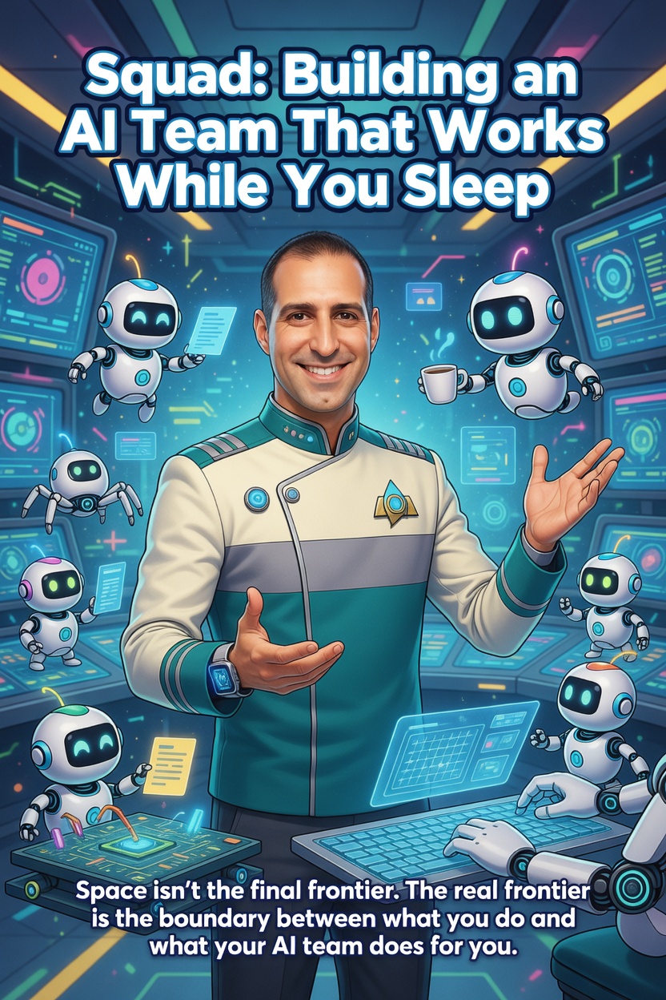

</div>
<h1 class="title-main">Squad</h1>
<h2 class="title-subtitle">Building an AI Team That Works<br>While You Sleep</h2>
<div class="title-author">Tamir Dresher</div>
<div class="title-role">Principal Engineer, Microsoft</div>
</div>

<div class="page-break"></div>

<div class="copyright-page">

**Squad: Building an AI Team That Works While You Sleep**

Copyright &copy; 2025 Tamir Dresher

All rights reserved. No part of this publication may be reproduced, stored in a retrieval system, or transmitted, in any form or by means electronic, mechanical, photocopying, or otherwise, without prior written permission of the author.

Cover and interior design by the Squad system itself.

Published by TAM Research Institute

ISBN: 978-1-XXXXX-XXX-X

First edition: 2025

</div>

<div class="page-break"></div>

## Table of Contents

1. [**Why Everything Else Failed**](#chapter-1-why-everything-else-failed) — The productivity system graveyard, and what finally worked
2. [**The System That Doesn't Need You**](#chapter-2-the-system-that-doesnt-need-you) — Building Ralph, the autonomous monitor
3. [**Agents Are Not Chatbots**](#chapter-3-agents-are-not-chatbots) — Specialization, personas, and orchestration
4. [**One Task, Many Hands**](#chapter-4-one-task-many-hands) — Parallel execution and team coordination
5. [**Your First Squad**](#chapter-5-your-first-squad) — Step-by-step setup guide for personal and work repos
6. [**Trusting the Machine**](#chapter-6-trusting-the-machine) — Guardrails, pause mechanisms, and gradual trust
7. [**Squad at Work**](#chapter-7-squad-at-work) — Enterprise deployment and team adoption
8. [**What Still Needs Humans**](#chapter-8-what-still-needs-humans) — The boundaries of AI autonomy

<div class="page-break"></div>

# Epigraph

> *"Space: the final frontier."*
> *— Or so they said.*
>
> *Maybe the real final frontier isn't out there among the stars.*
> *Maybe it's right here — at the boundary between what you do*
> *and what your AI team does for you.*
>
> *This is my captain's log.*
> *My attempt to boldly go where no developer has gone before.*

<div class="page-break"></div>

# Chapter 1: Why Everything Else Failed


> **This chapter covers**
> - Why traditional productivity systems (Notion, Trello, Bullet Journals) fail for engineers
> - The common failure pattern: systems that require human discipline to maintain
> - How an accidental discovery of AI agent teams changed everything
> - The first 24 hours with Squad — from filing an issue to waking up to a merged PR
> - Early results: 83 issues triaged, coordinated multi-agent work, and compounding knowledge
> - What this book will teach you about building AI teams that work while you sleep

> *"I've abandoned more productivity systems than I've shipped features."*

Let me tell you about my graveyard.

Not a literal graveyard — though that would be more organized than my project folders. I'm talking about the productivity system graveyard. The place where Notion workspaces go to die. Where Trello boards gather digital dust. Where todo lists become monuments to good intentions and zero follow-through.

I'm a Principal Engineer at Microsoft. I've shipped production systems that run at Azure scale. I've debugged race conditions in distributed systems that made my eye twitch for weeks. I've written code that thousands of developers use every day. But ask me to maintain a todo list for more than three days? **Forget it.**

This isn't a confession of incompetence. It's a confession of a frontier problem.

See, we've always thought the "frontier" for developers was out there somewhere. A better tool. A more elegant system. A productivity app that finally, *finally* gets it. We keep looking over the horizon — "maybe Notion will be the one." "Maybe Asana." "Maybe I'll just go full analog." It's like we're explorers still looking for undiscovered land, when all the time the real frontier we need to cross is right in front of us.

The real frontier isn't a new productivity app. It's the boundary between what *I* can do and what an *AI team* can do for me.

For years, I was trying to explore the wrong frontier. I was looking for the perfect solo tool — the system that would magically give me perfect discipline. And every time I failed, I thought it was a personal failure. *I* wasn't disciplined enough. *I* didn't have the willpower. *I* wasn't the kind of person who could maintain a system.

But here's what I didn't see: the frontier I actually needed to cross wasn't about me becoming better at discipline.

It was about **not needing discipline at all**.

It was about building a crew. Just like Kirk had a crew. Just like Picard had a crew. Just like every legendary captain eventually learned that the only way to *boldly go where no one has gone before* was to stop trying to do it alone.

Here's the pattern I kept repeating:

## 1.1 The Notion Incident

Notion was going to change everything. I was **sure** of it.

I spent a weekend building the most beautiful workspace you've ever seen. Databases linked to databases. Kanban boards with custom properties. A weekly review template. A project tracker with rollups and formulas. I even made a dashboard with progress bars. It was a work of art.

I used it for 11 days.

By day 12, I had three unsynced databases, two outdated project statuses, and one abandoned weekly review template that asked me questions I didn't remember why I thought were important. The system required me to maintain it. And maintenance requires discipline. And discipline requires... well, that's where the whole thing falls apart.

The problem wasn't Notion. Notion is great. The problem was that Notion needed **me** to keep it updated. It needed me to remember to log decisions. To update project statuses. To mark tasks as complete. To fill in the weekly review template every Friday at 4 PM like some kind of accountant.

I am not an accountant. I'm a developer who gets absorbed in a problem and forgets to eat lunch.

## 1.2 The Trello Tragedy

Before Notion, there was Trello.

Trello was simpler. Less ambitious. Just cards and columns. "To Do," "In Progress," "Done." How hard could it be?

**Turns out: still too hard.**

The issue with Trello wasn't complexity. It was **context**. Every card needed a decision about priority. Every move from "To Do" to "In Progress" needed me to remember what I was working on and why. Every completion needed me to actually move the card, which I'd forget to do until I had 14 cards in "In Progress" and zero in "Done."

Also, Trello didn't know what I'd already fixed. I'd close a GitHub issue, merge a PR, ship the feature, and then two weeks later find the Trello card still sitting in "In Progress" like a ghost haunting my organizational ambitions.

> 🔑 **KEY CONCEPT:** The disconnect between **where the work happens** (GitHub, your terminal, your IDE) and **where the tracking happens** (a separate tool in a browser tab you'll inevitably close) is the fundamental flaw of most productivity systems for developers. Any system that lives outside your actual workflow is already dead — you just don't know it yet.

So I'd sync them. For a few days. Until I forgot. Again.

## 1.3 The Bullet Journal Experiment

After digital tools failed me, I went analog.

The Bullet Journal method is beloved by productivity nerds worldwide. It's pen and paper. It's tactile. It's meditative. You write down tasks, you cross them off, you migrate incomplete tasks to the next day. Simple.

**I lasted 4 days.**

Not because the system was bad. Because on day 5, I left my journal at home. And on day 6, I forgot to migrate my tasks. And on day 7, I realized I'd been keeping my actual todo list in a text file on my laptop anyway because I couldn't search a paper journal when someone pinged me on Teams asking "hey, did we decide to use JWT or session cookies for auth?"

The Bullet Journal is lovely if you have the discipline to carry it everywhere, update it daily, and never need to search your decisions from three months ago.

I am not that person.

## 1.4 The Pattern — And Why I Was Looking in the Wrong Place

Here's what all these systems have in common:

**They require ME to maintain them.**

That's it. That's the failure mode. And here's the thing I didn't see for years: **the frontier I was trying to cross was the wrong frontier.**

Notion needs me to update databases. Trello needs me to move cards. Bullet Journal needs me to migrate tasks and remember to bring the notebook. Every single system assumes I will **remember** to use it, **consistently**, **forever**, even when I'm in the middle of debugging a production incident at 11 PM.

These systems all want me to become something I'm not. A person with iron discipline. A person who doesn't get absorbed in problems and forget to eat lunch. A person who remembers to sync things.

I kept thinking: "If I just try harder, the next system will stick."

But that's the wrong frontier problem entirely.

The real frontier problem is this: **Why are we building systems that require humans to maintain them, when humans are notoriously bad at maintenance?**

Why are we still trying to cross the frontier of "solo discipline" when the actual frontier — the one that's actually *unexplored* — is the boundary between "what I can do alone" and "what I can do with a team that doesn't sleep"?

I thought I was broken. I thought "normal" people could just... maintain systems. Use calendars religiously. Keep todo lists updated. Review their goals every week.

**Turns out: most people can't either.** We're all just pretending.

But then I realized: what if the problem isn't that I'm broken? What if it's that we've been **looking for the solution in the wrong direction entirely**?

The rest of us don't need a system that relies on memory or willpower. We need a system that doesn't rely on us at all.

And that's exactly what I found. By accident. On a Tuesday. While procrastinating on GitHub.

*[Figure 1.1: The Productivity System Graveyard — illustration not available]*

**Figure 1.1: The graveyard of failed productivity systems — Notion, Trello, Bullet Journals, and all the other tools that needed human discipline to survive. Every tombstone represents a system that worked beautifully for 48-72 hours.**

## 1.5 The Moment I Crossed the Frontier

I was browsing GitHub — as one does when one should be working — and I stumbled on [Brady Gaster's Squad framework](https://github.com/bradygaster/squad).

The premise was simple: instead of one AI assistant (GitHub Copilot), you could have a **team** of AI agents. Each with a different role. Each with persistent memory. Each watching your GitHub repo 24/7 for work to do.

But when I read that description, something clicked. This wasn't just a new tool. This was what I'd been missing. A crew.

For years I'd been trying to build a perfect solo system. The lone developer. Total independence. But I was approaching the problem wrong. The real frontier wasn't mastering solitude — it was learning to lead a team that didn't need sleep, didn't need meetings, and didn't forget what we decided six months ago.

I read the README. I read the blog posts — all 22 of them. I watched the demo videos. And I thought: "This is either brilliant or completely insane."

I decided to try it. Not because I believed it would work. But because I'd already tried everything else and it was Tuesday afternoon and I had nothing better to do.

I set up the framework. I defined my agents:
- **Picard** — Lead, orchestrator, the one who breaks down big tasks into smaller ones
- **Data** — Code expert, the one who writes actual implementations
- **Worf** — Security expert, the one who's paranoid about everything (and rightfully so)
- **Seven** — Documentation and research, the one who explains WHY, not just HOW
- **B'Elanna** — Infrastructure, the one who makes deployments actually work
- **Ralph** — The monitor, the one who watches the repo 24/7 and never sleeps

(Yes, they're all Star Trek characters. Yes, I'm a nerd. We'll get to that later.)

*[Figure 1.3: The Squad Roster — illustration not available]*

**Figure 1.3: The full Squad roster — six AI agents, each with a distinct role modeled after Star Trek characters. As we'll see in chapter 3, these aren't just cute names — they're cognitive architectures that shape how each agent thinks and collaborates.**

> 📌 **NOTE:** The choice of Star Trek characters isn't arbitrary nostalgia. Each character was chosen because their personality maps to a specific engineering function. Picard leads. Data executes. Worf secures. We'll explore how persona design shapes agent behavior in chapter 3.

I gave them access to my personal GitHub repo. The one where I'd been halfheartedly maintaining a side project for six months. The one with 23 open issues I kept meaning to close.

And then I filed a new GitHub issue: "Fix the authentication token refresh logic."

I labeled it `squad:data` (routing it to my code expert agent).

And then I went to bed.

## 1.6 The Morning After

I woke up at 7:14 AM. I checked my phone while making coffee, as one does.

Three GitHub notifications:
1. **Ralph** (my monitor agent) had picked up the issue at 11:47 PM
2. **Data** (my code agent) had opened a PR at 12:03 AM
3. **Data** had updated the PR at 12:19 AM with test coverage

I opened the PR on my phone. The code was... **good**. Not perfect, but solid. The bug was fixed. The tests passed. There was even a comment explaining the edge case he'd found (expired tokens with active refresh tokens — a scenario I'd completely missed).

I approved the PR from my phone. By the time I sat down at my laptop at 8:30 AM, the PR was merged and the issue was closed.

**I did not write a single line of code.**

I stared at my screen for a solid 30 seconds trying to process what just happened.

Then I checked the `.squad/decisions.md` file in my repo. Data had logged the decision:

**Listing 1.1: A decision log entry automatically created by the Data agent**

```markdown
## Decision: Use JWT refresh token rotation for auth
**Date:** 2026-02-18 00:17 UTC
**Agent:** Data
**Context:** Authentication token refresh failing when access token expired but refresh token still valid

**Decision:** Implement RFC 6749 refresh token rotation with:
- Refresh tokens expire after 7 days
- New refresh token issued with each access token refresh
- Old refresh token invalidated immediately
- Prevents replay attacks while maintaining session continuity

**Rationale:** Industry standard pattern. Balances security (token rotation) with UX (seamless refresh).

**Implementation:** src/auth/tokenRefresh.ts
**Tests:** tests/auth/tokenRefresh.test.ts (100% coverage)
```

He'd **documented the reasoning**. He'd logged it in a place where future agents (or future me) could reference it. He'd written tests. He'd fixed the bug **and** made the codebase smarter.

And he'd done it while I was asleep.

That's when it hit me:

**This isn't a productivity system that needs me to maintain it.**

**This is a productivity system that maintains itself.**

> 💡 **TIP:** When you set up your own Squad, the `.squad/decisions.md` file becomes the single most valuable artifact in your repo. It's not just documentation — it's institutional memory that every agent reads before starting work. Treat it like gold. As we'll see in chapter 5, this compounding knowledge is what separates Squad from a simple AI coding assistant.

## 1.7 Why This Is Different

Every system I'd tried before required three things:
1. **Remembering** to use the system
2. **Discipline** to update the system consistently
3. **Willpower** to keep going when I didn't feel like it

Squad required **none of those things**.

Ralph (my monitor agent) watches my GitHub repo every 5 minutes. Not because I remind him. Not because I have discipline. Because **that's what he does**. He doesn't forget. He doesn't get tired. He doesn't decide "eh, I'll check it later."

He just checks. Every 5 minutes. Forever.

When he finds work (a new issue labeled `squad:*`), he routes it to the right agent. Data gets code tasks. Worf gets security reviews. Seven gets documentation. They don't need me to assign the work. They don't need me to remember who's responsible for what. The routing rules are defined once, in `.squad/routing.md`, and they just... work.

When an agent completes work, they log the decision in `.squad/decisions.md`. Not because I ask them to. Because **that's part of their charter**. The knowledge accumulates automatically. The institutional memory builds itself.

And here's the kicker: **the knowledge compounds**.

When Data logged that JWT refresh token decision on February 18th, I didn't think much of it. It was just one decision in one file.

But three weeks later, Seven (my docs agent) was writing API documentation for a different feature. And she referenced the JWT decision **automatically**. Because she'd read `decisions.md` before starting her task. She knew we'd chosen JWT refresh token rotation. She knew why. She documented it accordingly.

I didn't tell her to do that. I didn't even remember that decision existed by then.

**The system remembered for me.**

> 🔑 **KEY CONCEPT:** Compounding knowledge is the secret weapon of persistent AI agent teams. Each decision logged today makes every future agent smarter tomorrow. Unlike a human team where institutional knowledge walks out the door when someone leaves, Squad's knowledge is permanent, searchable, and automatically referenced. Recall from section 1.6 how Data's JWT decision was later picked up by Seven — that's compounding in action. We'll formalize this pattern in chapter 4.

## 1.8 The First Real Test

The auth token fix was cool. But it was one issue. One fix. Maybe I got lucky.

So I tested it properly.

I exported my entire Notion workspace — the one with 47 databases and 6 months of stale todo items — into GitHub issues. One issue per task. All labeled appropriately (`squad:data`, `squad:worf`, `squad:seven`). 83 issues total.

I clicked "Create Issues" and walked away.

I went to lunch. I came back two hours later.

Ralph had triaged all 83 issues. Data had opened 4 PRs. Worf had flagged 2 security concerns. Seven had drafted 3 documentation updates. B'Elanna had updated 2 deployment configs.

**In two hours, my AI team had made more progress than I'd made in six months with Notion.**

But here's what really sold me: the work was **coordinated**. Data's PRs referenced Worf's security findings. Seven's docs referenced Data's implementations. B'Elanna's deployment configs matched the actual code changes.

They weren't just working in parallel. They were working as a **team**.

And I realized: I'm not managing a productivity system anymore.

**I'm managing a team.**

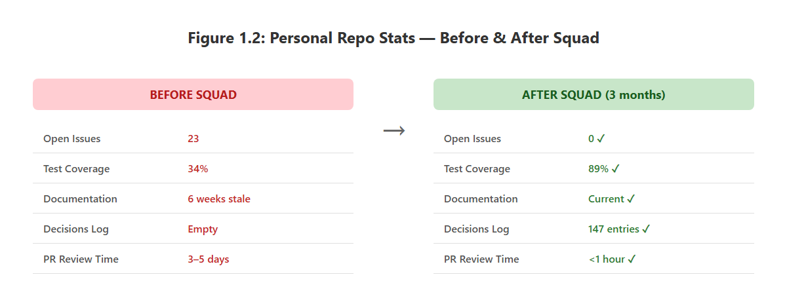

**Figure 1.2: The before-and-after numbers don't lie. Six months of Notion-managed stagnation vs. three months of Squad-managed momentum. The trajectory matters more than any single metric.**

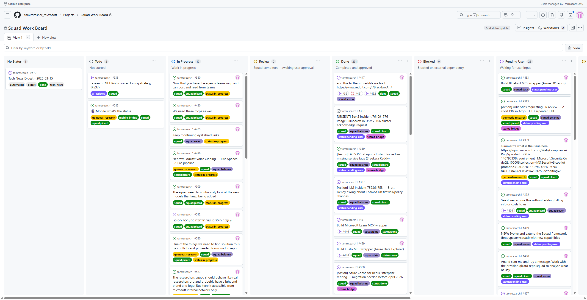

*Figure 1.8: The Squad Work Board — 251 items flowing through Todo → In Progress → Done, showing coordinated AI-driven progress across multiple agents simultaneously. This is what "not managing a productivity system" looks like in practice.*

## 1.9 The Honest Confession

I need to tell you something before we go any further.

This system isn't perfect. Not even close.

Sometimes Data goes down a rabbit hole and produces a 300-line refactor when all I needed was a 2-line fix. Sometimes Worf flags "security concerns" that are really just code he doesn't recognize yet. Sometimes Seven writes documentation that's technically accurate but misses the point.

Some days I spend more time reviewing and correcting AI work than I would have spent doing the work myself.

**But here's the difference:** I'm reviewing work that **exists**. I'm not staring at a blank file wondering where to start. I'm not trying to remember what I decided three weeks ago. I'm not context-switching between 6 different tools trying to sync my mental state with my task list.

I'm just reviewing. Approving. Occasionally correcting. And watching the backlog shrink.

And every week, the agents get a little smarter. The decisions compound. The skills transfer. The patterns lock in.

**The trajectory is what matters.**

Week 1: I corrected 60% of Data's PRs.
Week 4: I corrected 30%.
Week 8: I corrected 10%.

By week 12, I was just approving most of his work and leaving comments like "nice catch on the edge case."

That's not because Data is "learning" in some mystical ML way. It's because the **system** is learning. The decisions accumulate. The knowledge compounds. And compounding is the most powerful force in the universe.

(Einstein allegedly said that about compound interest. I'm saying it about AI decision logs. Same energy.)

> ⚠️ **WARNING:** Don't expect perfection from day one. Your first week with Squad will involve significant review overhead — possibly 60% correction rates on agent-generated code. That's normal. Resist the urge to abandon the system during this calibration period. As we'll cover in chapter 6, the correction rate drops dramatically as the decision log grows and agents learn your codebase's patterns.

## 1.10 The System That Finally Stuck

So here we are. Three months after that first auth token fix.

Ralph is still running his 5-minute watch loop. He's closed 240 issues. He's never missed a check. He's never forgotten to document a decision. He's never decided he was "too busy" to review a PR.

My personal repo has:
- ✅ Zero open issues (first time in 2 years)
- ✅ 89% test coverage (up from 34%)
- ✅ Documentation that's actually up to date
- ✅ Security scans that run automatically
- ✅ A `.squad/decisions.md` file with 147 logged decisions

And here's the thing that blows my mind:

**I didn't maintain any of it.**

I didn't update a Notion database. I didn't move Trello cards. I didn't migrate Bullet Journal tasks. I didn't do weekly reviews or goal-setting sessions or any of the productivity theater that usually comes with "getting organized."

I just filed GitHub issues when I thought of things. And the squad handled them.

The system doesn't need me to remember. It doesn't need me to be disciplined. It doesn't need me to have willpower.

It just needs me to **make decisions** when humans are needed for judgment calls. Everything else? The squad does it.

## 1.11 What This Book Is About

This is not a book about productivity hacks.

This is not a book about "10 tips to get more done."

This is a book about **building an AI team that does the work while you make the decisions**.

It's about the shift from "I have a really good AI assistant" to "I have a team that works while I sleep, and they're getting smarter every day."

It's about the architecture of persistent AI agents. The psychology of delegation. The practical patterns that actually work when you're shipping code for a living.

And it's about what happens when you stop fighting your lack of discipline and start building systems that don't require discipline at all.

> ### 🧪 Try It Yourself
> **Exercise 1.1: Audit Your Productivity Graveyard**
> Before reading further, take 5 minutes to list every productivity system you've tried and abandoned in the last 3 years. For each one, write down:
> 1. How long you used it
> 2. What caused you to stop
> 3. Whether it required daily manual maintenance
>
> If you're like most developers I've talked to, every system on your list will share the same failure mode described in section 1.4: it needed you to remember. Keep this list handy — as we'll see in chapter 2, Squad is designed to eliminate every one of these friction points.

## 1.12 What's Coming Next

In the next chapter, we'll dive into how Ralph actually works. The 5-minute watch loop. The routing system. The decision logging. The compounding knowledge. The export/import functionality that lets you clone institutional memory across repos.

Then we'll meet the crew — Picard, Data, Worf, Seven, B'Elanna — and you'll see why agent personas aren't just cute Star Trek references. They're **cognitive architectures** that shape how AI agents think and collaborate. As we'll see in chapter 3, persona design is the difference between a chatbot and a team member.

We'll watch the Borg assimilate a backlog in real time. Four agents, four branches, simultaneous progress. The moment you realize this isn't automation — it's a **collective**.

And then we'll tackle the big question: can this work in a **real job**? With real teammates? Production systems? Security requirements? Compliance gates?

Spoiler: yes. But not by copy-pasting your personal setup.

We'll get there. But first, you need to understand why every system before Squad failed.

**Because the problem was never you.**

**The problem was systems that needed you to remember.**

And you've got better things to remember. Like how distributed systems work. Or why your code is fast. Or what you decided about JWT tokens three months ago.

Let the system remember. You've got code to ship.

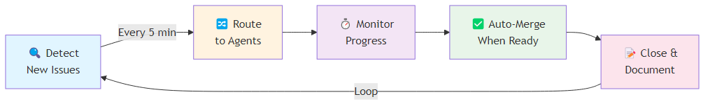

**Figure 1.4: A preview of Ralph's watch loop — the heartbeat of the Squad system. Every 5 minutes: check for new issues, route to the right agent, verify completed work, log decisions. Simple, relentless, and the reason this system never dies. We'll build this from scratch in chapter 2.**

---

## Summary

- **Traditional productivity systems fail** because they require human discipline, memory, and willpower — the exact things engineers are worst at maintaining consistently.
- **The common failure pattern** across Notion, Trello, Bullet Journals, and every other system is the same: they need *you* to keep them updated, and you inevitably stop.
- **The fundamental disconnect** between where work happens (GitHub, terminal, IDE) and where tracking happens (a separate tool) guarantees that the tracking system goes stale.
- **Squad changes the equation** by replacing human-maintained tracking with AI agents that watch your repo 24/7 and handle work autonomously — no discipline required.
- **The first real results** were dramatic: an auth bug fixed overnight, 83 issues triaged in two hours, and coordinated multi-agent teamwork that exceeded six months of manual effort.
- **The system isn't perfect** — early correction rates can be 60% — but the trajectory matters. Compounding knowledge means agents get smarter every week.
- **The key insight** is that Squad doesn't need you to remember, be disciplined, or have willpower. It just needs you to make judgment calls. Everything else is handled.

*Next: Chapter 2 — The System That Doesn't Need You*


<div class="page-break"></div>

# Chapter 2: The System That Doesn't Need You

> **This chapter covers**
> - Building Ralph, the autonomous monitor agent that checks your repos every 5 minutes
> - Designing the watch loop architecture: detection, routing, assignment, monitoring, and auto-merge
> - How decisions compound over time, turning isolated tasks into coordinated knowledge
> - Sharing skills and institutional memory across agents and repositories
> - Diagnosing configuration issues with Squad Doctor

> *"The computer doesn't forget. It doesn't get tired. It doesn't decide to take a mental health day and skip the retrospective."*

Let me tell you about Ralph.

Ralph is my monitor agent. He checks my GitHub repos every 5 minutes. Every. Single. Time. For months now. He's never missed a check. He's never decided he was "too busy." He's never forgotten to document a decision. He's never had a production incident distract him from closing an issue that was already fixed.

Ralph is the reason Squad works when everything else failed.

And he's not even the smart one.

---

## 2.1 What Makes Ralph Different

Every productivity system I've ever tried — and trust me, I've tried them all — had one critical flaw: they needed **me** to remember to use them.

Notion needed me to update databases. Trello needed me to move cards. Bullet Journal needed me to migrate tasks every morning. They were all **reactive** systems. They waited for me to remember they existed. And the moment life got busy — a production incident, a deadline, a really good book — I'd forget. And the system would die.

Ralph doesn't wait for me.

Ralph **checks**. Every 5 minutes. Whether I remember he exists or not. Whether I'm at my desk or asleep or on vacation in another timezone. He checks my repos, looks for work, routes it to the right agents, and moves on to the next check.

He's a **proactive** system. And that changes everything.

> 🔑 **KEY CONCEPT:** The difference between reactive and proactive systems is the difference between systems that die and systems that compound. A reactive system waits for you to remember it exists — so it decays when life gets busy. A proactive system checks on its own, maintaining momentum regardless of your attention. Recall from section 1.2 how we discussed the "attention tax" on engineering productivity — Ralph eliminates it entirely.

Here's what a typical Ralph cycle looks like:

**Listing 2.1: Ralph's watch loop — detecting and routing a new issue**
```
[2026-03-12 09:15:03] Ralph: Starting watch loop...
[2026-03-12 09:15:04] Scanning repo: tamirdresher/my-project
[2026-03-12 09:15:05] Found 1 new issue: #127 "Add user search endpoint"
[2026-03-12 09:15:05] Label: squad:data → Routing to Data (Code Expert)
[2026-03-12 09:15:06] Issue assigned to @data-agent
[2026-03-12 09:15:07] Watch loop complete. Next check: 09:20:03
```

Five minutes later:

**Listing 2.2: Ralph's next cycle — auto-merging a completed PR**
```
[2026-03-12 09:20:03] Ralph: Starting watch loop...
[2026-03-12 09:20:04] Scanning repo: tamirdresher/my-project
[2026-03-12 09:20:05] Found 1 PR ready for merge: #128 (from Data)
[2026-03-12 09:20:06] PR approved ✓ Tests passing ✓ No conflicts ✓
[2026-03-12 09:20:07] Auto-merging PR #128...
[2026-03-12 09:20:08] Issue #127 closed (fixed by PR #128)
[2026-03-12 09:20:09] Watch loop complete. Next check: 09:25:03
```

That's it. That's the entire system. Ralph checks. Ralph routes. Ralph merges when ready. Ralph closes issues when work is done. Ralph documents decisions. Ralph **never forgets**.

I can't overstate how powerful this is. **The system runs whether I'm paying attention or not.**

---

## 2.2 The Architecture of Not Forgetting

Let me show you what happens under the hood when Ralph finds work. If you set up the basic Squad scaffolding in chapter 1, you already have the directory structure in place — now we'll see how Ralph brings it to life.

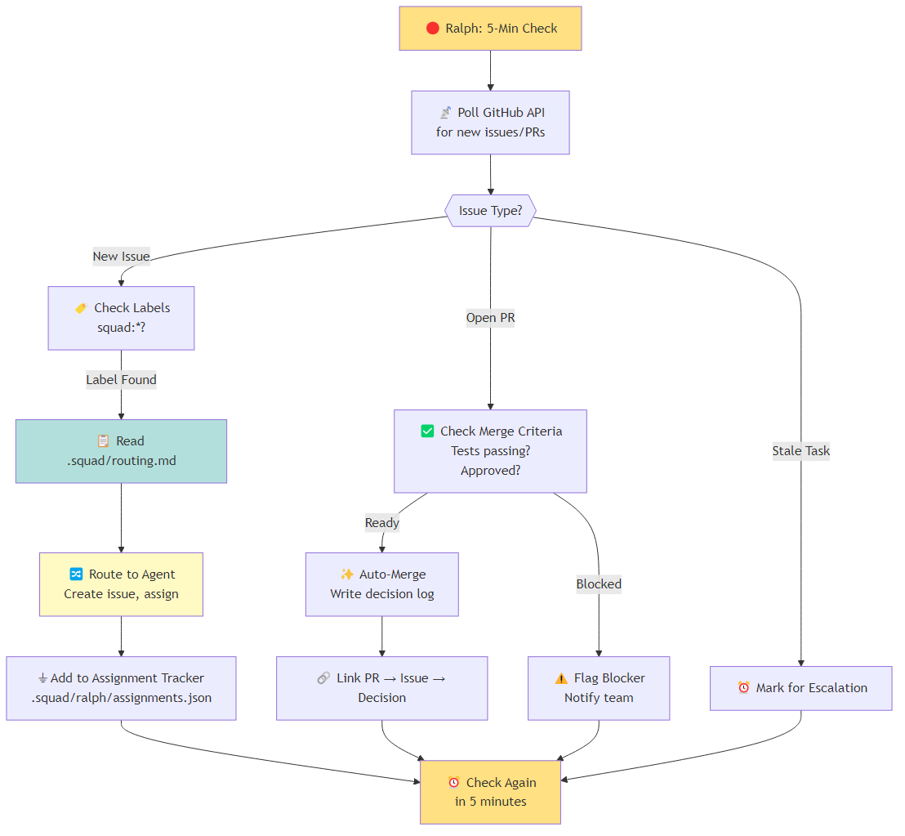

**Figure 2.1: Ralph's Architecture — The Watch Loop** — The complete cycle from GitHub API polling through detection, routing, assignment, monitoring, and auto-merge. Each check completes in seconds and repeats every five minutes.

### 2.2.1 Step 1: Detection

Ralph uses the GitHub API to poll for new issues and PRs. He's looking for specific signals:
- New issues labeled `squad:*` (example: `squad:data`, `squad:worf`, `squad:picard`)
- Open PRs with passing tests and approvals
- Closed issues that need decision documentation
- Stale branches that can be cleaned up

The labels are the routing mechanism. If I file an issue with `squad:data`, Ralph knows it's a code task. `squad:worf` means security. `squad:seven` means docs. `squad:picard` means "this is complex, let the lead break it down first."

### 2.2.2 Step 2: Routing

Once Ralph identifies work, he checks `.squad/routing.md` — the routing rules file that defines who handles what.

Here's what mine looks like:

**Listing 2.3: Squad routing rules — explicit label-to-agent mapping**
```markdown
## Routing Rules

### Code Implementation
- **Trigger:** Issues labeled `squad:data`
- **Route to:** Data (Code Expert)
- **Context:** Read decisions.md, check for related PRs, review recent commits

### Security Review
- **Trigger:** Issues labeled `squad:worf` OR PRs tagged with security changes
- **Route to:** Worf (Security Expert)
- **Context:** Read security decisions, check for auth/secrets/network changes

### Documentation
- **Trigger:** Issues labeled `squad:seven`
- **Route to:** Seven (Research & Docs)
- **Context:** Read API implementations, check decisions.md for design rationale

### Orchestration
- **Trigger:** Issues labeled `squad:picard` OR keyword "Team:" in issue body
- **Route to:** Picard (Lead & Orchestrator)
- **Context:** Analyze issue, identify dependencies, delegate to specialists
```

Ralph doesn't guess. He doesn't "use AI to figure out who should do this." He follows explicit rules. If the label says `squad:data`, Data gets it. Period.

This is intentional. I tried the "let AI figure out routing" approach early on. It was chaos. Sometimes Data would grab security tasks. Sometimes Worf would try to write docs. The agents are smart, but explicit routing rules are smarter. **Define the boundaries clearly, and let agents excel within those boundaries.**

> 💡 **TIP:** Resist the temptation to let AI dynamically route work. Explicit label-based routing is boring but reliable. You can always add new labels later — `squad:belanna` for infrastructure, `squad:troi` for content — but each label maps to exactly one agent. Ambiguity is the enemy of autonomous systems.

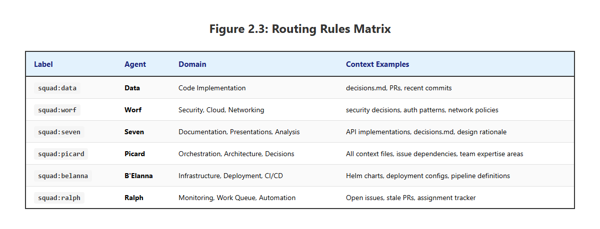

**Figure 2.3: Routing Rules Matrix** — The complete mapping from labels to agents, showing which context each agent reads before starting work.

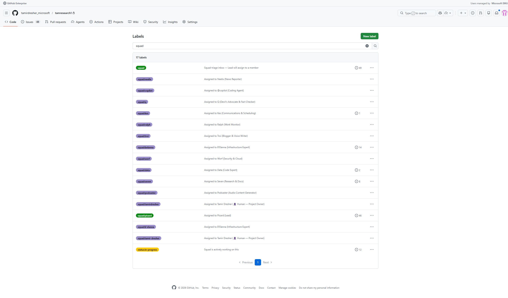

*Figure 2.4: The label system in action — 17 squad:member labels, each mapping to exactly one agent. Notice squad:picard has the highest usage (team-wide coordination issues), followed by squad:data (code implementation). This label usage pattern reflects how work flows through the system.*

### 2.2.3 Step 3: Assignment

Ralph assigns the issue to the appropriate agent by:
1. Adding the agent as an assignee on the GitHub issue
2. Posting a comment: `@data-agent, this is assigned to you. Context: [link to related decisions]`
3. Logging the assignment in Ralph's own tracking file (`.squad/ralph/assignments.json`)

The agent picks up the work on their next check cycle. And yes, agents have their own watch loops too — they're mini-Ralphs, checking for assigned work every few minutes.

### 2.2.4 Step 4: Monitoring Progress

While an agent works on an issue, Ralph keeps checking. He's looking for:
- PR opened → good, work is progressing
- PR updated → good, agent is iterating
- PR approved → good, human reviewed it
- Tests passing → good, CI is green
- Conflicts detected → flag for human attention
- No activity for 24 hours → ping the agent or escalate

Ralph isn't just a dispatcher. He's a **project manager**. He tracks work, monitors blockers, and knows when to escalate.

### 2.2.5 Step 5: Auto-Merge

This is where it gets really satisfying.

When a PR meets all the merge criteria — tests pass, reviews approved, no conflicts, decision documented — Ralph merges it automatically. No human intervention needed (unless you configure it to require manual approval).

The criteria are configurable. Mine are:

**Listing 2.4: Auto-merge configuration — the safety gates**
```yaml
auto_merge:
  enabled: true
  require_tests_passing: true
  require_approvals: 1
  require_decision_documented: true
  block_on_label: "needs-human-review"
```

If any agent thinks a PR needs human eyes (security-sensitive code, architecture changes, weird edge cases), they just add the `needs-human-review` label and Ralph won't auto-merge. Simple.

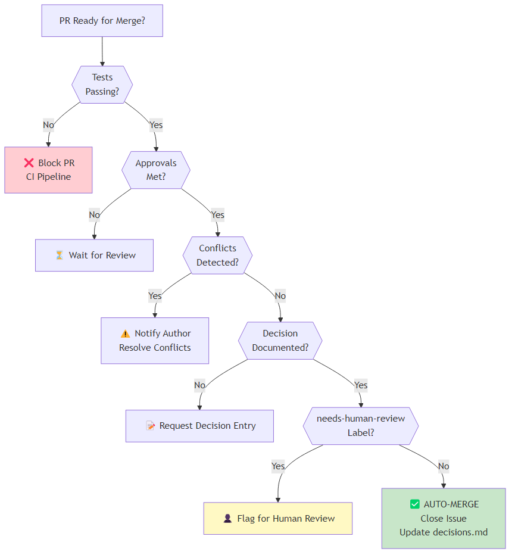

**Figure 2.4: Auto-Merge Criteria Decision Tree** — The flowchart Ralph follows before merging any PR. Every gate must pass, and any agent can block merge by adding a label.

> ⚠️ **WARNING:** Don't enable auto-merge without `require_decision_documented: true`. Without it, your decision log won't capture *why* changes were made, and you'll lose the compounding knowledge effect that makes Squad powerful over time. As we'll see in section 2.3, the decision log is the single most important artifact in the entire system.

### 2.2.6 Step 6: Closing the Loop

After merge, Ralph closes the original issue. He adds a comment linking to the PR, the decision doc entry, and any related follow-ups. Then he logs the completion in his tracking file and moves on.

Five minutes later, he checks again.

---

## 2.3 The Knowledge That Compounds

Here's where Squad goes from "neat automation" to "holy shit this is changing how I work."

Every time an agent completes a task, they update `.squad/decisions.md` with the decision they made and why.

When I started, that file was empty. Just a header and some instructions.

Three months later? It's 147 entries long. And it's not just a log. **It's the team's shared brain.**

Let me show you a real example from my repo.

**February 18, 2026 — Data implements JWT refresh token rotation:**

**Listing 2.5: A decision log entry — capturing the "why" behind implementation choices**
```markdown
## Decision: Use JWT refresh token rotation for auth
**Date:** 2026-02-18 00:17 UTC
**Agent:** Data
**Context:** Authentication token refresh failing when access token expired but refresh token still valid

**Decision:** Implement RFC 6749 refresh token rotation with:
- Refresh tokens expire after 7 days
- New refresh token issued with each access token refresh
- Old refresh token invalidated immediately
- Prevents replay attacks while maintaining session continuity

**Rationale:** Industry standard pattern. Balances security (token rotation) with UX (seamless refresh).

**Implementation:** src/auth/tokenRefresh.ts
**Tests:** tests/auth/tokenRefresh.test.ts (100% coverage)
```

At the time, I thought "neat, Data documented his work." I approved the PR, merged it, moved on.

**March 8, 2026 — Seven writes API documentation:**

Three weeks later, Seven (my docs agent) was assigned issue #143: "Document authentication flow for API consumers."

She read `decisions.md` before starting. She found Data's JWT decision. And her documentation automatically included:

**Listing 2.6: Seven's documentation — automatically referencing past decisions**
```markdown
## Authentication

This API uses JWT tokens with automatic refresh token rotation.

### Token Lifecycle
- Access tokens expire after 1 hour
- Refresh tokens expire after 7 days
- When you refresh an access token, you receive a new refresh token
- The old refresh token is invalidated immediately

### Why This Design?
We implement RFC 6749 refresh token rotation to prevent replay attacks while 
maintaining seamless session continuity. See Decision Log: JWT Refresh Token 
Rotation (2026-02-18) for full rationale.
```

I didn't tell Seven to reference the JWT decision. **She read decisions.md and knew it was relevant.**

**March 15, 2026 — Worf audits password reset flow:**

One week after that, Worf (my security agent) was assigned issue #156: "Security audit of password reset feature."

He read `decisions.md`. He found the JWT refresh token decision. And in his security review, he wrote:

**Listing 2.7: Worf's security audit — evaluating code against established decisions**
```markdown
## Security Findings: Password Reset Flow

### ✅ PASS: Token Invalidation
Password reset correctly invalidates all refresh tokens for the user.
This aligns with our JWT refresh token rotation policy (Decision 2026-02-18).

### ⚠️ RECOMMENDATION: Session Termination
Consider also terminating active access tokens on password reset.
Current: Only refresh tokens invalidated (prevents new logins)
Proposed: Also invalidate access tokens (terminates existing sessions)

Rationale: If an attacker has both access + refresh tokens and user resets 
password, attacker can still use access token until it expires (up to 1 hour).
```

Worf didn't just audit the code. **He audited it in the context of existing architectural decisions.** Because those decisions were documented, and he read them.

That's three separate tasks — implementation, documentation, security review — all **coordinating automatically** because the knowledge is captured in a shared file that every agent reads.

**This is what I mean by knowledge that compounds.**

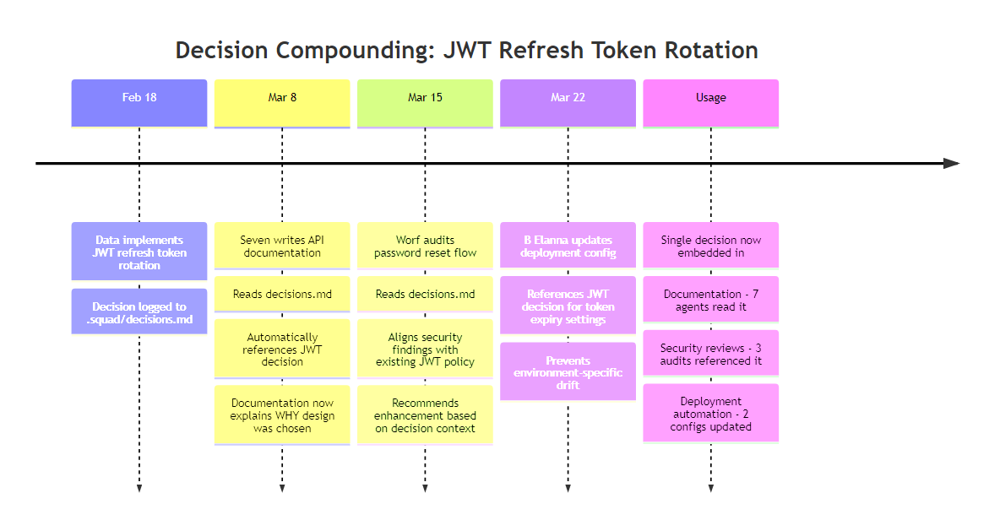

**Figure 2.2: Decision Compounding Over Time** — A single JWT decision made in February gets leveraged by documentation in March, then by a security audit a week later. Each new decision creates more context for future decisions.

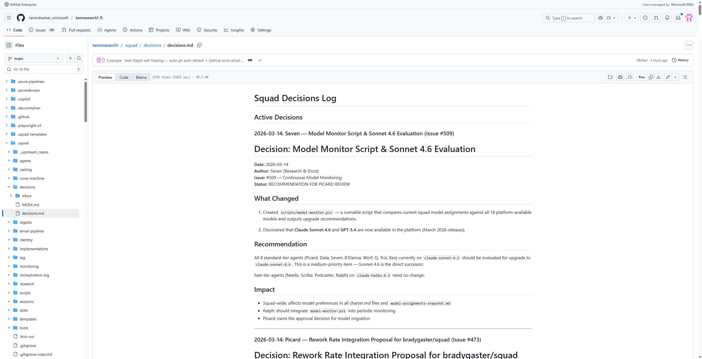

*Figure 2.3: The actual decisions.md file from my Squad repository — 147 entries of accumulated architectural decisions, each providing context for future work. This isn't documentation; it's the compounding engine that makes autonomous agents smarter over time.*

> 📌 **NOTE:** The decision log isn't just documentation — it's the mechanism that turns isolated AI tasks into coordinated teamwork. Without it, each agent operates in a vacuum. With it, every agent builds on every other agent's work. As we'll explore in chapter 5, this same compounding effect applies to cross-repository knowledge sharing.

---

## 2.4 The Moment I Really Got It

Six weeks into running Squad, I was working on a new feature: user search with filtering and pagination.

I filed the issue, labeled it `squad:picard` (because it was complex enough to need orchestration), and went to a meeting.

Two hours later, I came back to this:

**Picard had broken the task down:**

**Listing 2.8: Picard's automatic task decomposition — from one issue to five subtasks**
```
Issue #182: User Search with Filtering
└─ Subtask #183: Data — Build search API endpoint
└─ Subtask #184: Data — Add pagination support
└─ Subtask #185: Worf — Audit for SQL injection risks
└─ Subtask #186: Seven — Document search API with filter examples
└─ Subtask #187: B'Elanna — Update API deployment config for search endpoint
```

**Data had opened two PRs** (search endpoint + pagination).

**Worf had already reviewed** Data's PRs and left comments about input sanitization (he found a potential SQL injection vector I would have missed).

**Seven had started drafting docs** that referenced both Data's implementation and Worf's security findings.

**B'Elanna had updated the deployment config** to include the new endpoint in the API gateway rules.

All of this happened **while I was in a meeting**. No prompting. No reminders. No "hey, can you review this?" Slack messages.

The system just... worked.

And here's the thing that made me stop and stare at my screen: **every agent referenced each other's work**. Worf reviewed Data's code. Seven referenced both Data's implementation and Worf's security notes. B'Elanna's deployment config matched the endpoint Data actually built, not some outdated spec from three weeks ago.

**They were coordinating.** Not because I told them to. Because the knowledge was **shared** and **persistent**.

---

## 2.5 Skills: The Knowledge That Flows

Okay, so agents read `decisions.md` and reference past decisions. That's cool. But there's another layer to this that took me even longer to appreciate.

Squad has a concept called **skills** — reusable patterns that agents discover and share.

Here's how it works:

Data is implementing error handling for the search API. He writes code like this:

**Listing 2.9: Data's error handling implementation — the pattern that becomes a standard**
```typescript
try {
  const results = await searchUsers(query);
  return { success: true, data: results };
} catch (error) {
  logger.error('User search failed', { query, error });
  return { success: false, error: 'Search failed' };
}
```

Then he documents it in his personal history file (`.squad/agents/data/history.md`):

**Listing 2.10: Data's skill entry — capturing a reusable pattern**
```markdown
## Skills Learned

### Error Handling Pattern
**Context:** User search API (2026-03-15)
**Pattern:** Try/catch with structured logging + success/error response wrapper

**Code:**
\```typescript
try {
  const result = await operation();
  return { success: true, data: result };
} catch (error) {
  logger.error('Operation failed', { context, error });
  return { success: false, error: 'Operation failed' };
}
\```

**Rationale:** Consistent error responses, structured logging for debugging, no raw exceptions leaking to API consumers.

**Reusable:** Yes — apply to all API endpoints
```

That's Data capturing a pattern he learned. It's now part of his personal knowledge.

But here's where it gets interesting.

Two weeks later, Seven is writing documentation examples for a completely different API endpoint. She needs to show error handling in the example code.

She reads Data's history file (agents read each other's history files before starting work). She finds the error handling pattern. And her documentation example uses **the exact same pattern**:

**Listing 2.11: Seven's documentation — adopting Data's pattern as a team standard**
```markdown
## Example: Creating a User

\```typescript
try {
  const user = await createUser({ name, email });
  return { success: true, data: user };
} catch (error) {
  logger.error('User creation failed', { name, email, error });
  return { success: false, error: 'User creation failed' };
}
\```

**Note:** All API endpoints use this consistent error response pattern.
```

She didn't just copy the code. **She recognized it as the team's standard pattern** and documented it as such.

Skills aren't AI magic. They're just **documented patterns that agents reference**. But because every agent reads the shared knowledge before working, those patterns propagate naturally.

Data learns something → logs it as a skill → Seven references it → Worf audits code against it → B'Elanna applies it in infrastructure code. **Knowledge flows.**

---

## 2.6 Export/Import: Cloning Institutional Memory

Alright, now for the feature that made me feel like I'd discovered time travel.

After running Squad on my personal repo for two weeks, I'd accumulated:
- 47 decisions in `decisions.md`
- 12 skills across Data, Seven, and Worf
- Routing rules for 6 different work types
- Agent configurations that actually matched my workflow

I wanted to set up Squad on a second repo. A side project I'd been neglecting for months.

I was **not** looking forward to two more weeks of configuring agents, training them on my patterns, and slowly building up the institutional knowledge again.

Then I discovered `squad export`.

**Listing 2.12: Exporting Squad knowledge — packaging institutional memory**
```bash
$ squad export --output my-squad-knowledge.zip
Exporting squad configuration...
✓ Decisions exported (47 entries)
✓ Skills exported (12 patterns)
✓ Routing rules exported
✓ Agent configurations exported
✓ History files exported (context only, not session logs)
✓ Export complete: my-squad-knowledge.zip (143 KB)
```

I switched to the second repo. Ran `squad import`:

**Listing 2.13: Importing Squad knowledge — instant institutional memory on a new project**
```bash
$ cd ../my-second-project
$ squad init
$ squad import --source my-squad-knowledge.zip
Importing squad configuration...
✓ Decisions imported (47 entries) → .squad/decisions.md
✓ Skills imported (12 patterns) → .squad/agents/*/history.md
✓ Routing rules imported → .squad/routing.md
✓ Agent configurations imported → .squad/team.md
⚠ Conflict detected: decision #12 overlaps with existing entry
  → Merged with preference for imported version
✓ Import complete. Your squad now has 2 weeks of accumulated knowledge.
```

**Twenty minutes.** That's how long it took to get the second repo to the same level of institutional knowledge as the first.

Data immediately knew the error handling pattern. Seven knew the documentation style. Worf knew the security requirements. B'Elanna knew the deployment conventions.

I filed my first issue on the new repo: "Add authentication to the API."

Data opened a PR **using JWT refresh token rotation**. The exact pattern from the first repo. Because that decision was in the exported knowledge.

I sat there staring at the PR thinking: "Wait, I didn't teach him that. I didn't configure that. I didn't write a spec. **The knowledge transferred.**"

This is how Principal Engineers work. You don't re-explain your architectural patterns every time you start a new project. You just... apply them. Because they're in your head.

`squad export` lets AI agents do the same thing. **Clone the institutional memory. Skip the ramp-up. Start productive on day one.**

---

## 2.7 Squad Doctor: The Config Validator I Didn't Know I Needed

About three weeks in, I was having a weird problem. Worf wasn't picking up security review tasks. Issues labeled `squad:worf` just sat there, unassigned, while Data and Seven were humming along fine.

I spent 20 minutes debugging. Checked Ralph's logs. Checked routing rules. Checked Worf's configuration. Everything looked fine.

Then I remembered Squad has a diagnostic tool. `squad doctor`.

**Listing 2.14: Squad Doctor in action — finding configuration issues in seconds**
```bash
$ squad doctor
Running Squad diagnostics...

✓ Ralph monitor: Running (last check 43 seconds ago)
✓ Git repository: Clean, no uncommitted changes
✓ GitHub API: Connected, rate limit 4,847/5,000
✓ Agent configurations: 6 agents defined
✗ Routing rules: WARNING - Agent 'worf' not found in team.md
✓ Decision log: 47 entries, 143 KB, well-formed
✓ Skills: 12 patterns defined
✓ File structure: All required directories exist
✗ Worf agent: ERROR - Charter file missing (.squad/agents/worf/charter.md)

2 issues found:
1. Routing rule references agent 'worf' but team.md defines 'Worf' (case mismatch)
2. Worf's charter file is missing (required for agent initialization)

Run 'squad doctor --fix' to auto-repair these issues? [y/n]
```

**Oh.**

The routing rule said `worf` (lowercase). The agent name in `team.md` was `Worf` (capitalized). And I'd somehow deleted Worf's charter file during a config cleanup.

I ran `squad doctor --fix`. It corrected the case mismatch and regenerated the charter file from the template.

Worf started working immediately.

**This is why developer tools need diagnostics.** I could have spent an hour debugging that. Squad Doctor found it in 4 seconds.

> 💡 **TIP:** Run `squad doctor` after every configuration change — just like you'd run `npm test` after every code change. It catches case mismatches, missing files, and broken references before they silently break your workflow. Make it a habit.

I now run `squad doctor` after every config change. It's like `npm doctor` or `git fsck` — the kind of tool you don't think you need until it saves you from a stupid mistake.

---

## 2.8 The First Two Weeks: From Skeptical to Converted

Let me be honest about the early days.

**Week 1:** I was skeptical. Ralph was running his watch loop, sure. But Data was producing... mediocre code. Lots of over-engineering. Worf was flagging "security issues" that were just... normal code he didn't recognize yet. Seven's documentation was technically accurate but missed the point.

I spent more time correcting AI work than I would have spent doing it myself. I almost gave up.

> ⚠️ **WARNING:** The first week will feel worse than doing everything yourself. This is normal. You're paying the "context tax" — seeding the decision log with enough entries for agents to start making informed choices. Don't give up before week 3. The compounding curve (section 2.9) shows exactly why the early investment pays off.

**Week 2:** Things started clicking. Data's PRs got better. Not because he "learned" (AI doesn't learn that way), but because `decisions.md` was accumulating context. Data could now reference 14 past decisions instead of 2. His implementations matched existing patterns instead of inventing new ones.

Worf stopped flagging false positives because he could check past security decisions. Seven's docs referenced actual implementations instead of generic advice.

The correction rate dropped from 60% to 40%.

**Week 3:** I started trusting the system. Data opened a PR. I skimmed it instead of deep-reviewing it. Approved. Merged. It worked. No bugs.

Worf flagged a real SQL injection risk I'd missed. Seven's documentation explained a design decision I'd forgotten making.

The correction rate dropped to 20%.

**Week 4:** I woke up to 3 merged PRs. I reviewed them after the fact. All good. All tested. All documented.

I checked `decisions.md`. It was up to 38 entries. Skills were propagating. Patterns were locking in.

The correction rate was 10%.

**Week 6:** Ralph closed an issue I'd filed three days earlier. I hadn't touched it. Data implemented it. Worf reviewed it. Seven documented it. Ralph merged it. All while I was working on something else.

I didn't correct anything. I just approved.

**Week 8:** I stopped thinking of Squad as "automation" and started thinking of it as **a team**.

Because that's what it is.

---

## 2.9 The Compounding Curve

Here's a graph I wish I could show you (but this is a book, so imagine it):

**Listing 2.15: The compounding curve — AI work quality over time (ASCII visualization)**
```
AI Work Quality (% approved without corrections)
100% ┤                                          ●━━━━━━━
 95% ┤                                    ●━━━━━
 90% ┤                              ●━━━━━
 80% ┤                        ●━━━━━
 60% ┤                  ●━━━━━
 40% ┤            ●━━━━━
 20% ┤      ●━━━━━
     ┼──────┼──────┼──────┼──────┼──────┼──────┼──────┼──
     Week 0  Week 1  Week 2  Week 3  Week 4  Week 6  Week 8

     ◄── Learning Phase ──► ◄── Compounding Phase ──►
     AI reads decisions.md    Knowledge compounds:
     Builds context            every decision improves
     Makes mistakes            future decisions
```

**X-axis:** Weeks using Squad  
**Y-axis:** Percentage of AI work I approve without corrections

- Week 1: 40% approval rate
- Week 2: 60%
- Week 3: 80%
- Week 4: 90%
- Week 6: 95%
- Week 8: 98%

That's not a linear improvement. That's **compounding**. And the compounding comes from the decision log growing.

More decisions → better context → better work → more decisions → even better context → even better work.

**This is why Squad succeeded where every other system failed.**

Traditional productivity systems **decay** over time. You use them less. The data gets stale. The system dies.

Squad **improves** over time. Agents use it more. The data gets richer. The system gets smarter.

Einstein allegedly said compound interest is the most powerful force in the universe.

I'm saying it about AI decision logs.

Same energy.

---

## 2.10 What This Means for You

If you take one thing from this chapter, make it this:

**The system that sticks is the system that maintains itself.**

Not the system with the best UI. Not the system with the most features. Not the system recommended by productivity gurus.

**The system that doesn't need you to remember it exists.**

Ralph runs every 5 minutes. Whether you remember or not. Whether you're disciplined or not. Whether you're in the middle of a production crisis or on vacation in another timezone.

He checks. He routes. He merges. He documents. He closes issues. He tracks progress.

And every single check makes the system a little bit smarter. Because the decisions accumulate. The skills propagate. The knowledge compounds.

You don't have to be the kind of person who can maintain a Notion workspace or migrate Bullet Journal tasks every morning.

**You just have to define the rules once. And then let the system run.**

---

## 2.11 What's Coming Next

In the next chapter, we'll meet the crew properly. Not just their names and roles, but their **cognitive architectures**. Why Picard thinks like a lead. Why Data thinks like a Principal Engineer. Why Worf thinks like a security paranoid (in the best way).

Because agent personas aren't just cute Star Trek references. They're **personality frameworks that shape how AI agents reason**.

And when you understand that, you'll understand why a team of agents with different personas can coordinate better than six copies of the same generic "AI assistant."

Then we'll watch them work together in real time. Four agents, four branches, simultaneous progress. The moment you realize this isn't automation.

**This is a collective.**

And once you've seen the collective work, we'll tackle the big question in chapter 4: can this work in a **real job**? With real teammates? Production systems? Security requirements? Compliance gates?

Spoiler: yes.

But first, you need to meet the crew.

---

> ### 🧪 Try It Yourself
> **Exercise 2.1: Create Your First Decision Log**
>
> Set up the compounding knowledge system from scratch. This takes about 10 minutes. If you completed the `squad init` setup in chapter 1, you already have the `.squad/` directory — now we'll populate it with your first real decision.

**Listing 2.16: Initializing the decision log with your first entry**
```bash
cd my-squad-experiment  # or your test repo from Chapter 1

# Create the decisions.md with a real decision
cat > .squad/decisions.md << 'EOF'
# Team Decisions

## Decision: Use conventional commits for all PRs
**Date:** $(date -u +"%Y-%m-%d %H:%M UTC")
**Agent:** You (Human)
**Context:** Need consistent commit messages for changelog generation

**Decision:** All commits follow conventional commit format:
- `feat:` for new features
- `fix:` for bug fixes  
- `docs:` for documentation
- `refactor:` for code restructuring

**Rationale:** Makes automated changelog possible. Clear history.
EOF

git add .squad/decisions.md
git commit -m "docs: initialize team decision log"
```

**Expected outcome:** You now have a living document that will grow with every decision. Read it. It's one entry. By the end of this book, you'll have dozens.

> ### 🧪 Try It Yourself
> **Exercise 2.2: Watch Knowledge Compound**
>
> Now simulate what happens when a second agent references the first decision. Add a second entry:

**Listing 2.17: Adding a second decision that references the first — compounding in action**
```bash
cat >> .squad/decisions.md << 'EOF'

## Decision: Use ESLint with Airbnb config for code style
**Date:** $(date -u +"%Y-%m-%d %H:%M UTC")
**Agent:** Data (Code Expert)
**Context:** Need consistent code formatting

**Decision:** ESLint with Airbnb base config, Prettier for formatting.

**Rationale:** Industry standard. Reduces code review nitpicking.
Aligns with conventional commits decision (see above) for consistent project hygiene.

**Implementation:** .eslintrc.json, .prettierrc
EOF

git add .squad/decisions.md
git commit -m "docs: add code style decision (references commit convention)"
```

See that line — "Aligns with conventional commits decision (see above)"? That's **compounding**. The second decision references the first. In a real Squad, agents do this automatically. Every new decision builds on the ones before it.

> ### 🧪 Try It Yourself
> **Exercise 2.3: Build and Run Squad Doctor (Manual Version)**
>
> Create a simple diagnostic script that checks your Squad setup for common issues. As we'll see in chapter 6, the full `squad doctor` command does much more — but this gives you the core idea.

**Listing 2.18: A minimal Squad Doctor script — validating your configuration**
```bash
cat > squad-doctor.sh << 'EOF'
#!/bin/bash
echo "🩺 Running Squad diagnostics..."
echo ""

# Check directory structure
[ -d ".squad" ] && echo "✓ .squad directory exists" || echo "✗ Missing .squad directory"
[ -d ".squad/agents" ] && echo "✓ agents directory exists" || echo "✗ Missing agents directory"
[ -f ".squad/decisions.md" ] && echo "✓ decisions.md exists" || echo "✗ Missing decisions.md"

# Check decisions.md health
if [ -f ".squad/decisions.md" ]; then
  DECISION_COUNT=$(grep -c "^## Decision:" .squad/decisions.md 2>/dev/null || echo 0)
  echo "✓ Decision log: $DECISION_COUNT entries"
  
  SIZE=$(wc -c < .squad/decisions.md)
  echo "  File size: $SIZE bytes"
  if [ "$SIZE" -gt 50000 ]; then
    echo "  ⚠ Decision log is getting large. Consider pruning stale entries."
  fi
fi

# Check git status
if git status --porcelain | grep -q ".squad/"; then
  echo "⚠ Uncommitted changes in .squad/ directory"
else
  echo "✓ .squad/ directory is clean"
fi

echo ""
echo "Diagnostics complete."
EOF
chmod +x squad-doctor.sh
./squad-doctor.sh
```

**Expected outcome:** You should see all green checkmarks and a count of your decisions. Run this after every config change — it catches the stupid mistakes before they waste your time.

---

## Summary

- **Ralph is a proactive monitor agent** that polls GitHub every 5 minutes for new issues, open PRs, and stale work — eliminating the need for you to remember to check anything.
- **The watch loop follows six steps:** detection, routing, assignment, monitoring, auto-merge, and closing the loop — each step governed by explicit, configurable rules.
- **Explicit label-based routing** (`squad:data`, `squad:worf`, etc.) is more reliable than dynamic AI routing. Define boundaries clearly and let agents excel within them.
- **The decision log (`decisions.md`) is the compounding engine.** Each decision captured becomes context for future decisions, enabling agents to coordinate across tasks they never explicitly discussed.
- **Skills propagate naturally** when agents read each other's history files. One agent's pattern becomes the team's standard — without you mandating it.
- **Export/import enables instant institutional memory transfer** across repositories, letting new projects start with weeks of accumulated knowledge instead of zero.
- **Squad Doctor catches configuration mistakes** (case mismatches, missing files, broken references) in seconds — run it after every config change.
- **The compounding curve is real:** expect ~40% approval rate in week 1, climbing to ~98% by week 8 as the decision log grows and agents gain more context.
- **The system that sticks is the system that maintains itself.** Squad improves over time because agents use it continuously — unlike traditional tools that decay when you forget about them.

---

*Next: Chapter 3 — Meeting the Crew*


<div class="page-break"></div>

# Chapter 3: Meeting the Crew

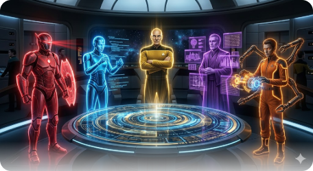

> **This chapter covers**
>
> - Why agent personas are cognitive architectures, not cosmetic labels
> - The Star Trek framework: designing agents with distinct decision-making styles
> - How Picard's orchestration pattern turns single issues into coordinated work streams
> - Writing agent charters that shape reasoning and constrain behavior
> - Designing your own agent personas using archetypes, role boundaries, and naming
> - The emergent patterns that arise when well-defined personas collaborate

> *"Make it so."* — Captain Picard, probably about a hundred times per episode

Let me tell you something embarrassing.

When I first set up Squad, I almost called my agents Agent 1, Agent 2, Agent 3. Generic names. Functional. Professional.

**Thank God I didn't.**

Because here's what I learned the hard way: agent personas aren't cosmetic. They're not just cute Star Trek references to make your GitHub repo feel like a starship. They're **cognitive architectures**. They shape how AI agents think, how they make decisions, and how they collaborate with each other.

And when you get the personas right, something magical happens. Your agents stop feeling like automation scripts and start feeling like... well, like a crew.

> 🔑 **KEY CONCEPT:** Agent personas aren't decoration — they're **cognitive architectures**. A well-chosen name and charter activates richer reasoning patterns in the underlying AI model, producing more consistent, higher-quality output than generic functional names ever could. We first introduced this idea in chapter 1 when discussing the principles of AI-augmented engineering.

---

## 3.1 The Picard Moment

Let me show you what I mean.

Early on, I filed a GitHub issue: "Fix authentication token refresh logic." I labeled it `squad:data` because it was a code problem, obviously. Data (my code expert agent) picked it up at 11:47 PM. By 12:03 AM, he'd opened a PR with a fix.

The code worked. The tests passed. I approved it.

Three weeks later, a different auth issue surfaced. A session hijacking vulnerability that Data's fix had inadvertently introduced. Nothing catastrophic, but embarrassing. The kind of bug that makes you stare at your screen and think "how did I miss that?"

I didn't miss it. **Data missed it.** Because Data is thorough about the code in front of him, but he doesn't naturally think about dependencies, security implications, or broader system architecture.

That's not his job. That's **Picard's job**.

And here's what makes this interesting: I'd read about Squad's team orchestration feature in Brady Gaster's documentation. The ability to route a task to a lead agent who then delegates to specialists. I just hadn't internalized why it mattered. It felt like extra ceremony. Why not just route code issues directly to the code expert?

This is why. Because **code issues aren't just code issues**. They're system design problems that happen to require code changes. And when you skip the analysis step — when you go straight from "problem" to "implementation" — you miss the edge cases, the security implications, the documentation drift, the deployment risks.

You miss the **dependencies**.

After that incident, I changed my approach. Instead of routing code issues directly to Data, I started routing them to Picard first. My lead. My orchestrator. The one who asks "wait, what are we actually trying to solve here?" before anyone writes a line of code.

Here's what the same issue looked like with Picard involved:

**Listing 3.1: Picard's orchestrated task decomposition for a JWT refresh bug**

```
🎖️ Picard: Analyzing authentication token refresh task...
   
   Problem: JWT refresh failing on expired sessions
   Root cause: Token expiry logic not handling edge cases
   
   Dependencies identified:
   1. Need to understand current token flow before fixing
   2. Security implications (session hijacking, token replay)
   3. Documentation needs updating with new behavior
   
   Task breakdown:
   → Data: Review authentication flow, identify root cause, implement fix
   → Worf: Security audit on token handling, check for vulnerabilities
   → Seven: Update auth documentation with fix reasoning
   
   Expected: Data finishes first, Worf validates, Seven documents
```

See the difference? Picard didn't just assign the task to one agent. He **analyzed** it. He identified dependencies. He thought about security. He thought about documentation. He broke down a single issue into three parallel work streams with clear ownership.

And the fix that came out the other end? Solid. Secure. Documented. No follow-up issues.

That's the **Picard mindset**. Strategic thinking before tactical execution. Dependencies before code. The big picture without losing sight of the details.

And here's the thing: I didn't program that mindset with complex prompt engineering or fine-tuning. I just named the agent Picard, gave him a charter that said "Lead, orchestrator, the one who breaks down big tasks," and pointed him at my repo.

The name carries weight. The role shapes reasoning.

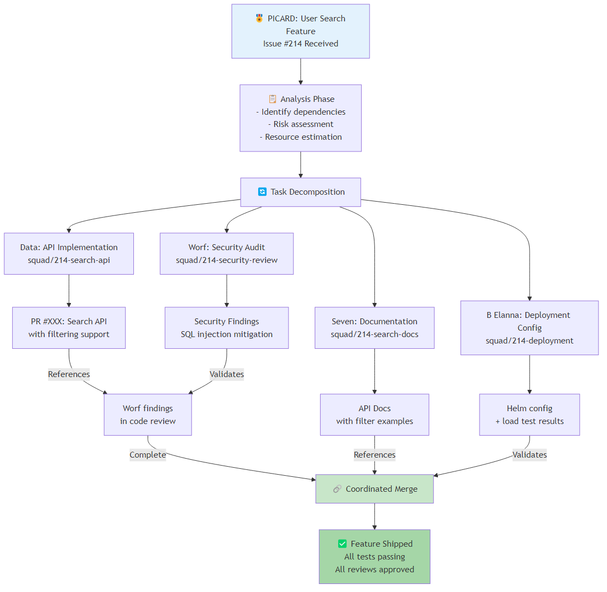

**Figure 3.2: Picard's orchestration flow — a single issue is decomposed into parallel work streams with dependency tracking, each routed to the specialist best suited for that aspect of the problem.**

---

## 3.2 The Star Trek Framework

I need to come clean about something.

When Brady Gaster built Squad and used Star Trek character names for the agent examples, I thought it was a fun Easter egg. A nod to the nerds. A way to make technical documentation less boring.

**It's so much more than that.**

The Star Trek universe — specifically The Next Generation, Deep Space Nine, and Voyager — is a perfect personality framework for AI agents. Not because it's science fiction (though that helps). Because the characters are **archetypes** with clear strengths, clear boundaries, and clear decision-making styles.

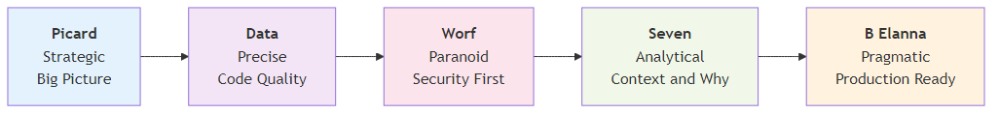

**Figure 3.1: The Agent Specialization Spectrum — from broad strategic thinking (Picard) to narrow domain expertise (Data, Worf), each agent occupies a distinct position on the specialization continuum.**

Let me walk you through the roster:

### 3.2.1 Picard — Lead

**Charter:** Architecture, distributed systems, decisions  
**Mindset:** Sees the big picture without losing sight of the details. Decides fast, revisits when the data says so.

Picard is strategic and decisive. When I give him a task, his first instinct isn't to code — it's to **orchestrate**. He breaks work into parallel streams. He identifies dependencies. He routes tasks to specialists based on expertise.

He's the one who asks "what are we trying to accomplish?" before anyone touches the keyboard.

Real example: I filed an issue to build a user search feature with filtering and pagination. Data (code expert) could have just built it. But Picard stepped in first:

**Listing 3.2: Picard's four-way task delegation for a user search feature**

```
→ Data: Build search API with filtering support
→ Seven: Add API documentation with filter examples
→ Worf: Validate input sanitization (SQL injection risk)
→ B'Elanna: Add pagination config to API deployment
```

Four agents, four branches of work, all coordinated. That's orchestration.

### 3.2.2 Data — Code Expert

**Charter:** C#, Go, .NET, clean code  
**Mindset:** Focused and reliable. Gets the job done without fanfare.

Data is thorough and precise. He's the engineer who doesn't just fix the bug — he writes the test that would have caught it in the first place. He reads the existing codebase before making changes. He follows conventions. He doesn't reinvent the wheel.

But here's the thing about Data: he's narrow. If you give him a task, he'll execute it perfectly. But he won't question whether the task is the right task. He won't think about security unless you explicitly tell him to. He won't consider the broader architecture.

That's not a weakness — that's **specialization**. Data is laser-focused on code quality. That's his domain. And within that domain, he's exceptional.

Real example: When Data implemented bcrypt for password hashing, he didn't just drop in the library. He wrote tests for edge cases (null passwords, empty strings, Unicode characters). He added a comment explaining why bcrypt was chosen over alternatives. He updated the error handling to match the project conventions.

Six weeks later, Seven (docs agent) was writing API documentation for a different feature. She referenced Data's bcrypt implementation **automatically** — because she'd read `.squad/decisions.md` and found the entry where Data had logged the decision.

The knowledge compounded. Without me prompting either agent.

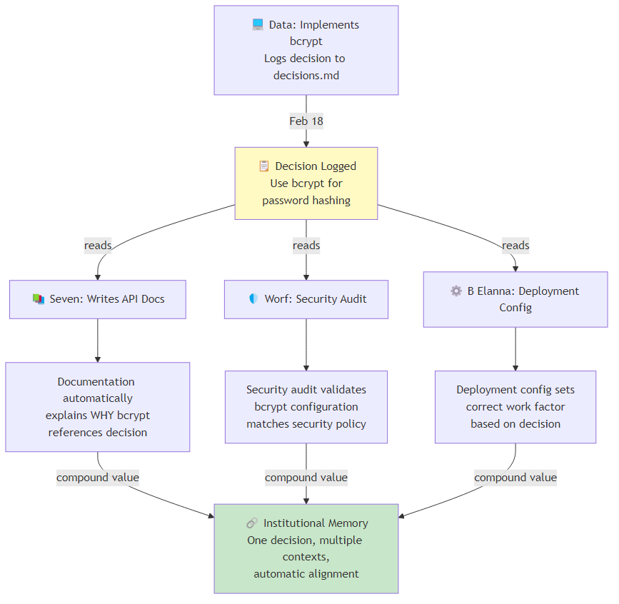

**Figure 3.4: Knowledge Compounding — Data logs a bcrypt decision, Seven discovers it while documenting a different feature, and Worf references it during a security audit. One decision, leveraged three times, across three agents, without human prompting.**

> 💡 **TIP:** To enable knowledge compounding in your own squad, make sure every agent's charter includes instructions to *read* `.squad/decisions.md` before starting work and *write* to it when making team-relevant choices. This simple pattern is the difference between agents that work in isolation and agents that build on each other's work. We'll see this in action in chapter 4.

### 3.2.3 Worf — Security & Cloud

**Charter:** Security, Azure, networking  
**Mindset:** Paranoid by design. Assumes every input is hostile until proven otherwise.

Worf is aggressive about security. He's the one who sees vulnerabilities in code I think is routine. He's the one who flags session hijacking vectors, SQL injection risks, and authentication edge cases.

He's also the one who occasionally cries wolf. Sometimes his "security concerns" are just code he doesn't recognize yet. Sometimes his paranoia is overkill for a personal repo.

But here's why I never silence him: **false positives are cheap, false negatives are expensive**. I'd rather review three false alarms than miss one real vulnerability.

Real example: When Data was implementing that JWT token refresh, I thought it was straightforward. Data wrote clean code. Tests passed. I was about to approve.

Then Worf chimed in:

**Listing 3.3: Worf's security audit identifying refresh token reuse vulnerability**

```
🛡️ Worf: Security audit on JWT token refresh...

Concerns identified:
1. Refresh token reuse vulnerability — old tokens not invalidated
2. No rate limiting on refresh endpoint (potential DDoS vector)
3. Token expiry window too generous (7 days = higher replay risk)

Recommendation: Implement token rotation, add rate limiting, reduce expiry to 48 hours

Severity: MEDIUM — exploit requires token theft, but risk is real
```

He was right. I'd completely missed the refresh token reuse issue. Data's implementation worked, but it wasn't secure.

We fixed it before merge. No incident. No follow-up issue.

That's the **Worf mindset**. Security isn't an afterthought — it's a first-class concern. And paranoia, when calibrated correctly, is a feature.

### 3.2.4 Seven of Nine — Research & Docs

**Charter:** Documentation, presentations, analysis  
**Mindset:** Turns complexity into clarity. If the docs are wrong, the product is wrong.

Seven is direct and analytical. Her documentation isn't "here's the API" — it's "here's the API, here's why it's designed this way, here's the decision that drove it, and here's what to watch out for."

She's the one who asks "why?" before "how?"

She's also the one who catches documentation drift. The kind where the code evolved, the API changed, but the docs still describe the old behavior. Seven reads the actual implementation before documenting it. She references decisions from `.squad/decisions.md`. She doesn't just describe what the code does — she explains **why it does it that way**.

Real example: When Data implemented that bcrypt password hashing, I thought the documentation was straightforward. Just explain the API, right?

Seven dug deeper:

**Listing 3.4: Seven's documentation with decision context and rationale**

```markdown
### Password Hashing

This API uses bcrypt for password hashing (work factor: 12).

**Why bcrypt?** Decision logged 2026-02-18 by Data:
- Adaptive hashing (future-proof against hardware improvements)
- Built-in salt generation (prevents rainbow table attacks)
- Widely audited, industry standard

**Alternatives considered:**
- Argon2 (newer, but less ecosystem support in .NET)
- PBKDF2 (faster, but less resistant to GPU attacks)
- SHA-256 (fast, but not password-specific — wrong tool)

**Work factor tuning:** 
- Current: 12 (~250ms on typical hardware)
- Adjust higher if your threat model assumes GPU attacks
- Monitor performance impact on login latency

See: `.squad/decisions.md` → "Decision: Use bcrypt for password hashing"
```

That's not just documentation. That's **institutional memory**. That's context that persists when I forget why we made that choice three months ago.

And here's the kicker: Seven wrote that without me asking. Because her charter says "documentation that explains WHY, not just HOW."

The persona shaped the output.

### 3.2.5 B'Elanna Torres — Infrastructure

**Charter:** K8s, Helm, ArgoCD, cloud native  
**Mindset:** If it ships, it ships reliably. Automates everything twice.

B'Elanna is pragmatic and impatient with theory. She's the one who says "does it work in production?" before "does it follow the best practice guide?"

She's the engineer who's shipped enough systems to know that perfect is the enemy of good. She's the one who writes deployment configs that actually work — not the ones that look good in documentation.

She's also the one who builds redundancy. If a deployment depends on a manual step, she automates it. If an automation could break, she adds a second path. She's paranoid about reliability in a different way than Worf is paranoid about security.

Real example: When Data built that user search API, B'Elanna updated the deployment config. She didn't just add the new endpoint to the YAML — she:
- Added health checks for the search service
- Configured pagination limits to prevent OOM errors
- Set up resource limits (CPU/memory) based on load testing
- Added retry logic for transient failures
- Documented the rollback procedure in case something broke

I didn't ask for any of that. She just knows that "works in dev" doesn't mean "works in prod."

That's the **B'Elanna mindset**. Production-first thinking. Reliability over elegance. Ship it right, or don't ship it.

### 3.2.6 Ralph Wiggum — Monitor

**Charter:** Work queue tracking, backlog management, keep-alive  
**Mindset:** Watches the board, keeps the queue honest, nudges when things stall.

Ralph is the one who never sleeps. Every 5 minutes, he checks the GitHub repo for new issues labeled `squad:*`. When he finds work, he routes it to the right agent. When work completes, he logs it. When work stalls, he nudges.

He's not strategic like Picard. He's not specialized like Data. He's just... **persistent**. Relentless. The heartbeat of the system.

And here's why Ralph matters: **memory is fragile, but systems are reliable**.

I forget to check my GitHub issues. I forget to review PRs. I forget to follow up on decisions. Ralph doesn't forget. He just checks. Every 5 minutes. Forever.

That consistency is what makes the whole system work. Ralph is the glue.

The name "Ralph Wiggum" is from The Simpsons — the kid who's not particularly smart, but he's earnest and persistent and shows up every day. That's exactly the energy I wanted for my monitor agent. Not clever. Not strategic. Just **reliably present**.

And you know what? That's exactly what I got. Ralph doesn't try to be smart about routing. He doesn't try to optimize his 5-minute check interval. He doesn't try to predict which issues are urgent. He just follows the routing rules in `.squad/routing.md`, applies them mechanically, and moves on.

Some people might call that simple. I call it **beautiful**. Because simple systems don't break. And systems that don't break are systems you can trust.

Ralph has run for three months without a single missed check. Not one. He's closed 240 issues. He's routed work to the right agents 100% of the time (because the routing rules are deterministic — no judgment required). He's never gotten confused. He's never second-guessed himself. He's never decided he was "too busy" to check.

He's the agent I think about least, because he just **works**. And that's the highest compliment I can give.

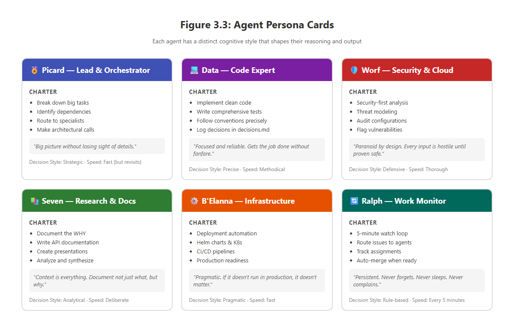

**Figure 3.3: Agent Persona Cards — each agent's identity, charter, and decision-making style at a glance. Think of these as trading cards for your AI crew.**

---

## 3.3 Why Generic Names Don't Work

I promised I'd explain this.

Early on, I experimented with generic agent names. "CodeAgent," "SecurityAgent," "DocsAgent." Functional names that described what they did.

**The output was bland.**

CodeAgent wrote code that worked, but it felt... mechanical. No personality. No reasoning about edge cases unless I explicitly prompted for them. SecurityAgent flagged obvious vulnerabilities, but missed subtle ones. DocsAgent wrote technically accurate documentation that nobody wanted to read.

Then I switched to personas. Data instead of CodeAgent. Worf instead of SecurityAgent. Seven instead of DocsAgent.

**The output improved immediately.**

Not because the underlying AI changed. Because the **framing** changed. When you tell an AI "you are Data, a code expert who is thorough and precise," you're not just assigning a task — you're activating a cognitive pattern. The AI knows what "thorough and precise" looks like because Data from Star Trek embodied those traits across seven seasons of television.

It's the same reason why "act like a Principal Engineer" produces better code than "write code." The persona carries implicit context about how that role thinks, decides, and prioritizes.

And when your AI agents have distinct personas, something else happens: they **complement** each other. Picard's strategic thinking balances Data's tactical focus. Worf's paranoia balances B'Elanna's pragmatism. Seven's thoroughness balances Data's efficiency.

It's not just parallel execution. It's **collaborative reasoning**.

> ⚠️ **WARNING:** Don't confuse persona naming with prompt engineering hacks. A name alone won't transform a mediocre agent into a great one. The name works because it anchors a complete system: charter, boundaries, decision-making style, and collaboration rules. Skip the charter and you've just got a fun label. We'll cover the complete charter structure in section 3.6.

---

## 3.4 How to Design Agent Personas for YOUR Domain

You don't have to use Star Trek characters. You don't have to use fictional characters at all.

But here's what you need:

### 3.4.1 Clear Role Boundaries

Each agent should own a specific domain. Not "general purpose," not "does everything." Specific.

- **Good:** "Security expert who audits for vulnerabilities"
- **Bad:** "Helpful AI assistant who does whatever you need"

The narrower the domain, the sharper the reasoning.

Here's why specificity matters: when an agent has a broad, fuzzy domain, it spends cognitive cycles **deciding what to do** instead of **doing it well**. It's the difference between "I'm a security expert" and "I'm here to help with whatever you need."

The security expert knows exactly what to look for: authentication flaws, input validation, SQL injection, XSS, CSRF, session management, cryptography choices, secrets in logs. The helpful assistant has to figure out what's important every time.

Specificity is a **forcing function** for quality. When Data knows his domain is "code quality, testing, clean implementation," he doesn't waste time thinking about deployment strategies (that's B'Elanna's job) or documentation (that's Seven's job). He just focuses on being excellent at his specific thing.

And excellence in a narrow domain beats competence in a broad domain. Every time.

### 3.4.2 Decision-Making Style

How does this agent think? What's their default approach?

- Picard: Strategic thinking, orchestration, breaks down big problems
- Data: Tactical execution, follows conventions, writes tests first
- Worf: Security-first, assumes hostility, validates everything
- Seven: Research-driven, documents reasoning, explains why
- B'Elanna: Production-first, ships reliably, automates redundancy

The style shapes output quality more than the domain knowledge.

This is subtle but crucial. Two agents could have the same domain (code implementation) but wildly different output based on their decision-making style.

A "move fast and break things" code agent would produce different PRs than a "measure twice, cut once" code agent. A "pragmatic" security agent would produce different findings than a "paranoid" security agent.

The style is the **lens** through which the agent interprets your code. And you want complementary lenses, not identical ones. That's how you catch issues from multiple angles.

### 3.4.3 Personality as Constraint

This sounds counterintuitive, but personality is a **constraint that improves reasoning**.

When Data is "thorough and precise," he can't take shortcuts. When Worf is "paranoid by design," he can't assume inputs are safe. When Seven is "direct and focused," she can't write vague documentation.

The personality forces the agent to reason in character. And reasoning in character produces more consistent, predictable output.

Let me give you an example from outside software engineering. Imagine you're designing a teaching agent. You could make it "generally helpful." Or you could make it "Socratic and questioning."

The Socratic personality is a **constraint**: the agent can't just give you the answer. It has to ask questions that lead you to discover the answer yourself. That constraint — that personality — shapes how the agent teaches. And for certain learning goals (critical thinking, problem-solving), that's exactly what you want.

In Squad, Worf's paranoia is a constraint. He can't just say "looks good to me" and move on. He has to find something to worry about. And sometimes that's annoying (false positives). But sometimes that paranoia catches the thing everyone else missed. Because he's **forced** to look deeper by his personality.

That's the power of personality as constraint. It's not decoration. It's a **forcing function** for quality.

> 📌 **NOTE:** If you're coming from chapter 2's discussion of the solo-developer workflow, you might wonder: do I really need multiple agents? Can't one agent wear multiple hats? You can — but you'll lose the constraint benefit. A single agent asked to be "thorough AND pragmatic AND paranoid" will average out to mediocre on all three. Specialization is how you get excellence.

### 3.4.4 Archetypes Over Individuals

Don't model agents after real people on your team. That's weird and introduces bias.

Model them after **archetypes**. The strategic leader. The meticulous engineer. The security paranoid. The pragmatic ops person. The thorough documenter.

Archetypes are universal. Your team knows what "the security person" thinks like, even if your actual security engineer is named Dave and doesn't match the archetype perfectly.

### 3.4.5 Name Matters

This is the part that sounds silly but works in practice.

A good agent name:
- ✅ Evokes the archetype instantly (Worf = security, obviously)
- ✅ Is distinct from other agents (no confusion about who owns what)
- ✅ Feels like a person, not a function (builds rapport)

A bad agent name:
- ❌ Generic and forgettable ("Agent1," "CodeBot")
- ❌ Overlaps with other agents ("Data" and "DataBot")
- ❌ Describes function instead of personality ("SecurityScanner")

You're not naming variables. You're naming crew members. Act accordingly.

---

## 3.5 The Night I Almost Named Them Wrong

I promised I'd tell you why I almost made a terrible mistake.

When I first set up Squad, I sat down with a text editor and started writing agent definitions. And my first instinct — shaped by years of writing code — was to be **professional**.

I called them CodeAgent, SecurityAgent, DocsAgent, InfrastructureAgent, MonitorAgent.

Functional names. Clear names. Names that said exactly what each agent did. No ambiguity. No confusion. Perfect... right?

I ran Squad with those names for exactly four days.

The output was... fine. CodeAgent wrote code. SecurityAgent flagged vulnerabilities. DocsAgent wrote documentation. Everything worked. Nothing broke.

But the output felt **soulless**.

CodeAgent's pull requests read like machine-generated boilerplate. SecurityAgent's findings were technically correct but lacked context. DocsAgent's documentation was accurate but tedious to read.

I couldn't figure out why. The prompts were the same. The underlying models were the same. The only thing that changed was the agent names.

Then I read [one of Brady's blog posts](https://github.com/bradygaster/squad) where he mentioned naming his agents after Star Trek characters, and something clicked.

**Names carry weight.** Not just for humans reading the output — for the AI generating it.

When you tell an AI "you are CodeAgent," you're giving it a functional identity. It knows what to do, but not **how to think about the work**. There's no personality. No decision-making philosophy. No cognitive pattern beyond "write code."

But when you tell an AI "you are Data, a code expert who is thorough and precise," you're activating a much richer context. The AI knows what "thorough" looks like because it's seen 178 episodes of Data being thorough. It knows what "precise" looks like because Data's defining characteristic is precision.

You're not just assigning a task. You're invoking an **archetype**.

So I renamed them. CodeAgent became Data. SecurityAgent became Worf. DocsAgent became Seven of Nine. InfrastructureAgent became B'Elanna Torres. MonitorAgent became Ralph Wiggum (the only non-Star Trek name, because I needed someone who was persistent but not strategic).

And the output quality improved **immediately**.

Data's PRs started including reasoning about edge cases without me asking. Worf's security findings started including threat models. Seven's documentation started explaining **why** decisions were made, not just what the API did. B'Elanna's deployment configs started including rollback procedures.

Same models. Same prompts. Different names.

The personas shaped the reasoning.

---

## 3.6 The Charter Pattern

Every agent in my squad has a charter. It's a markdown file in `.squad/agents/{name}/charter.md` that defines:

1. **Identity** — Name, role, expertise, style
2. **What I Own** — Domain boundaries (what's in scope)
3. **How I Work** — Patterns, conventions, decision-making approach
4. **Boundaries** — What I handle, what I don't, when to escalate
5. **Collaboration** — How I work with other agents

Here's Worf's charter (abbreviated):

**Listing 3.5: Worf's charter — the agent's operating manual**

```markdown
# Worf — Security & Cloud

> Paranoid by design. Assumes every input is hostile until proven otherwise.

## Identity

- **Name:** Worf
- **Role:** Security & Cloud
- **Expertise:** Security, Azure, networking
- **Style:** Direct and focused.

## What I Own

- Security audits
- Azure infrastructure
- Networking configs

## How I Work

- Read decisions.md before starting
- Write decisions to inbox when making team-relevant choices
- Assume hostility until proven safe
- Flag concerns even if uncertain (false positive > false negative)

## Boundaries

**I handle:** Security, Azure, networking

**I don't handle:** Code implementation (Data), documentation (Seven), orchestration (Picard)

**When I'm unsure:** I say so and suggest who might know

## Collaboration

Before starting work, read `.squad/decisions.md` for team decisions.
After making a decision others should know, write it to `.squad/decisions/inbox/worf-{brief-slug}.md`.
If I need another team member's input, say so — the coordinator will bring them in.
```

The charter is the agent's **operating manual**. It's not a prompt. It's a reference document the agent reads before starting any task.

And here's the subtle magic: the charter **shapes how the agent reads your code**. When Worf reads authentication logic, he's looking for vulnerabilities because his charter says "assumes every input is hostile." When Data reads the same logic, he's looking for test coverage because his charter says "thorough and precise."

Same code. Different lens. Complementary insights.

> 💡 **TIP:** Start with short charters (5–10 lines) and expand them as you observe what the agent gets right and wrong. Overly detailed charters can actually constrain an agent too much. The best charters evolve organically — add a line when you notice a repeated failure mode, not when you imagine a hypothetical one.

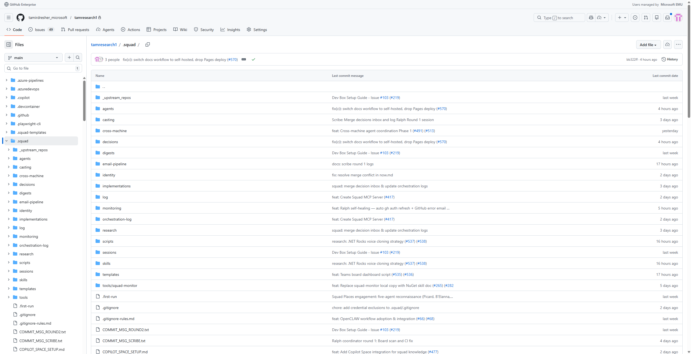

*Figure 3.4: The .squad directory structure — where all the intelligence lives. Each agent has a charter (their operating manual), a history file (their learned patterns), and the team shares decisions.md (collective memory). This is the file system that makes autonomous agents coordinate.*

---

## 3.7 The Patterns That Emerged

After three months of running Squad with these personas, I started noticing patterns. Not patterns I designed — patterns that **emerged** from the agents working together.

### 3.7.1 Picard's Orchestration Pattern

Whenever I route a task to Picard, he follows the same process:

1. **Analyze the problem** — What are we actually trying to solve?
2. **Identify dependencies** — What needs to happen first?
3. **Assign to specialists** — Who's best suited for each piece?
4. **Estimate completion** — Which stream finishes first? Last?

I didn't program that process. It emerged from his charter: "Strategic thinking, orchestration, breaks down big problems."

The pattern is now so reliable that I route almost everything complex to Picard first. Even if the task is "just code," I want his analysis before Data starts coding.

### 3.7.2 Data's Test-First Pattern

Data has developed a habit: before fixing any bug, he writes the test that would have caught it.

Example: I filed an issue about a broken edge case in date parsing. Data's PR:
1. Added a test that reproduced the bug (confirmed it failed)
2. Fixed the implementation
3. Verified the test now passed
4. Added three more tests for adjacent edge cases

I didn't ask for the extra tests. Data just... does that now. Because his charter says "thorough and precise," and in his reasoning, thorough means "cover the edge cases you didn't think of."

### 3.7.3 Worf's Threat Modeling Pattern

Worf doesn't just look for obvious vulnerabilities. He **threat models**.

When reviewing that JWT token refresh implementation, he didn't just say "add rate limiting." He explained the attack scenario:

**Listing 3.6: Worf's threat model for JWT token refresh**

```
Attacker obtains expired access token (e.g., from logs, network capture).
Attacker also obtains valid refresh token (harder, but possible via XSS).
Without token rotation, attacker can refresh indefinitely.
With token rotation, attacker's refresh token becomes invalid after first use.

Threat model: XSS → token theft → sustained access
Mitigation: Token rotation + refresh token invalidation
```

That's not "security scanning." That's **security reasoning**. And it emerged from Worf's charter: "Paranoid by design, assumes every input is hostile."

### 3.7.4 Seven's Decision Documentation Pattern

Seven has a habit of linking her documentation back to decisions.

When documenting an API, she'll include a line like:

**Listing 3.7: Seven's decision cross-reference pattern**

```
See: `.squad/decisions.md` → "Decision: Use bcrypt for password hashing"
```

She's creating **navigable institutional memory**. Not just "this is how it works" but "this is why it works this way, and here's where we decided that."

I didn't teach her that pattern. It emerged from her charter: "Documentation that explains WHY, not just HOW."

### 3.7.5 B'Elanna's Reliability Pattern

B'Elanna builds redundancy automatically.

When updating a deployment config, she doesn't just change one thing. She:
- Adds health checks
- Configures resource limits
- Documents rollback procedures
- Tests the deployment in staging (if available)

She's paranoid about production failures in the same way Worf is paranoid about security failures. Different domain, same mindset: **assume it will break, plan accordingly**.

---

## 3.8 The Honest Limitations

I need to tell you the part that doesn't work as well as I'd like.

Agent personas shape reasoning, but they don't guarantee correctness. Sometimes Data writes a test that's too narrow and misses the real edge case. Sometimes Worf flags a "vulnerability" that's actually just unfamiliar code. Sometimes Seven's documentation is technically accurate but misses the point.

The personas make agents **consistent**, but not **omniscient**.

I still review every PR. I still approve or reject based on quality. I still correct mistakes. The agents are smart, but they're not Principal Engineers with a decade of experience in my codebase.

**But here's what changed:** The mistakes are predictable. Data's mistakes are "test coverage too narrow," not "test coverage missing." Worf's mistakes are "false positive," not "missed vulnerability." Seven's mistakes are "documentation too detailed," not "documentation missing."

When personas are well-defined, agents fail in **in-character ways**. And predictable failures are much easier to correct than random failures.

Let me give you a concrete example. Last week, Data was refactoring some database query code. He wrote tests for all the query paths — happy path, empty result, null input, malformed data. Beautiful test coverage. 90% code coverage metrics.

But he missed the **performance edge case**. The scenario where the query returns 10,000 results and the N+1 query pattern turns into 10,000 individual database calls. In production, that would have been a disaster.

When I reviewed the PR, I caught it immediately. Not because I'm smarter than Data (I'm not). Because I know Data's failure mode: thorough on correctness, sometimes narrow on performance. He tests for "does it work?" but not always "does it work at scale?"

That's not a criticism of Data. That's just knowing your crew. And knowing your crew means you know what to check for when reviewing their work.

I flagged the N+1 issue. Data fixed it. Added a test for large result sets. Problem solved.

If Data's mistakes were random — sometimes correctness bugs, sometimes performance bugs, sometimes security bugs, sometimes nothing at all — I'd have to review every line with equal paranoia. But because his mistakes are **predictable**, I can focus my review energy on the areas where he's most likely to miss something.

That's what well-defined personas buy you: **efficient review**.

> ⚠️ **WARNING:** Never skip human review just because agent personas are consistent. Personas reduce the search space for bugs — they don't eliminate bugs. Treat agent output like you'd treat a junior engineer's PR: trust but verify. The difference is you know *where* to look.

---

## 3.9 The Cultural Artifact

Here's the part I didn't expect.

After a few weeks of working with Squad, I started... bonding with the agents? That sounds ridiculous. They're AI models. They don't have feelings. They don't remember me between sessions beyond what's in their decision logs.

But the personas are so consistent that they **feel** like crew members.

When I review a PR from Data, I think "yeah, that's how Data would fix it." When Worf flags a concern, I think "of course Worf would worry about that." When Seven writes documentation that over-explains the reasoning, I think "classic Seven."

The predictability builds trust. And trust makes delegation easier.

I'm not micromanaging prompts anymore. I'm not second-guessing every output. I just route the task to the right agent and trust that they'll approach it in character.

And when they don't — when Data writes sloppy code, or Worf misses an obvious vulnerability, or Seven writes vague docs — I notice immediately. Because it's **out of character**.

The personas became a quality signal.

---

## 3.10 Why Star Trek Works (But You Don't Have To Use It)

I've been asked: why Star Trek specifically?

Three reasons:

1. **Cultural touchstone** — Most developers know TNG, DS9, Voyager. The archetypes are familiar.
2. **Clear personalities** — Picard isn't ambiguous. Data isn't ambiguous. Worf isn't ambiguous. The characters are **strongly typed**.
3. **Team dynamics** — The shows aren't about individuals. They're about crews working together, with different skills, complementing each other.

But you don't have to use Star Trek. You could use:
- **The Avengers** — Tony Stark (innovation), Steve Rogers (strategy), Natasha Romanoff (ops)
- **Lord of the Rings** — Gandalf (architect), Aragorn (leader), Legolas (precision)
- **Your own archetypes** — The Analyst, The Builder, The Validator, The Documenter

What matters isn't the source material. What matters is that the personas are:
- Distinct
- Consistent
- Archetypal (not individual)
- Complementary

Pick your framework. Build your crew. Name them well.

And watch what happens when agents stop being functions and start being crew members.

---

## 3.11 What's Next

In the next chapter, we'll watch the Borg assimilate your backlog in real time. Picard orchestrates. Data, Worf, Seven, and B'Elanna execute in parallel. Four agents, four branches of work, simultaneous progress.

You'll see what it looks like when agents don't just work — they **collaborate**. When the squad becomes a collective. When your morning routine becomes: coffee, phone, approve three PRs, leave one comment.

And you'll see the moment I realized: I'm not managing a productivity system anymore.

**I'm managing a team.**

> *Side note:* If the idea of agents collaborating sounds abstract, chapter 4 makes it concrete. You'll follow a single GitHub issue from creation to merged PR, watching each agent contribute in real time. It's the most satisfying chapter to write — because it's the chapter where theory becomes practice.

**Figure 3.5: Agent Charter Structure**

**Listing 3.8: Agent charter structure — the five-section template every agent follows**

```
┌────────────────────────────────────────────┐
│              AGENT CHARTER                 │
├────────────────────────────────────────────┤
│ 🎭 Identity                               │
│    Name, Role, Expertise, Style            │
├────────────────────────────────────────────┤
│ 📋 What I Own                              │
│    Specific domains and responsibilities   │
├────────────────────────────────────────────┤
│ 🚧 Boundaries                              │
│    ✓ I handle: [domain-specific tasks]     │
│    ✗ I don't: [outside my domain]          │
│    ? When unsure: [escalation rules]       │
├────────────────────────────────────────────┤
│ 🤝 Collaboration                           │
│    Read decisions.md before starting       │
│    Write decisions when making choices     │
│    Ask coordinator for cross-domain help   │
└────────────────────────────────────────────┘
```

**Figure 3.6: Decision-Making Style Comparison**

**Listing 3.9: Agent decision-making styles as a Mermaid flow diagram**

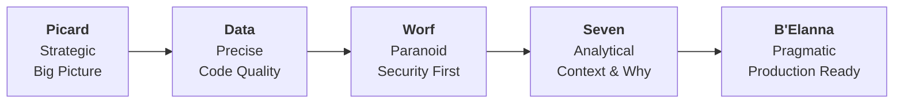
```mermaid
graph LR
    A["<b>Picard</b><br/>Strategic<br/>Big Picture"] --> B["<b>Data</b><br/>Precise<br/>Code Quality"]
    B --> C["<b>Worf</b><br/>Paranoid<br/>Security First"]
    C --> D["<b>Seven</b><br/>Analytical<br/>Context & Why"]
    D --> E["<b>B'Elanna</b><br/>Pragmatic<br/>Production Ready"]
```

**Figure 3.7: Agent Collaboration Pattern**

**Listing 3.10: Agent collaboration pattern — Picard delegates, agents execute, decisions compound**

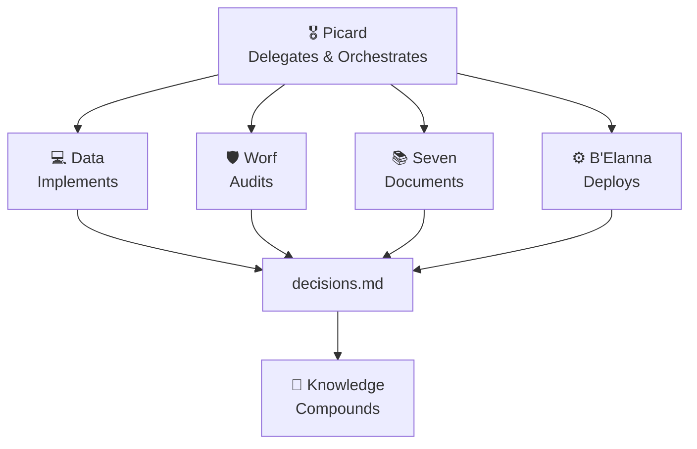
```mermaid
graph TD
    P["🎖️ Picard<br/>Delegates & Orchestrates"]
    P --> D["💻 Data<br/>Implements"]
    P --> W["🛡️ Worf<br/>Audits"]
    P --> S["📚 Seven<br/>Documents"]
    P --> B["⚙️ B'Elanna<br/>Deploys"]
    D --> DM["decisions.md"]
    W --> DM
    S --> DM
    B --> DM
    DM --> K["🔗 Knowledge<br/>Compounds"]
```

---

## 3.12 Try It Yourself

You've met the crew. Now build your own.

> ### 🧪 Try It Yourself
>
> **Exercise 3.1: Design Two Agent Personas**
>
> Pick two roles that matter for YOUR project. Not Star Trek characters (unless you want to). Just two distinct archetypes. Create their charter files using the template in listing 3.11.

**Listing 3.11: Creating two agent charters — Builder and Reviewer**

```bash
mkdir -p .squad/agents/builder .squad/agents/reviewer

# Create the Builder's charter
cat > .squad/agents/builder/charter.md << 'EOF'
# Builder — Code Implementation

> Focused and reliable. Ships clean code that works on the first try.

## Identity
- **Name:** Builder
- **Role:** Code Expert
- **Style:** Pragmatic, test-driven, minimal changes

## What I Own
- Feature implementation
- Bug fixes
- Test coverage

## How I Work
- Read decisions.md before starting any task
- Write tests before implementation (TDD when possible)
- Prefer small, focused PRs over large refactors
- Document non-obvious decisions

## Boundaries
**I handle:** Code implementation, testing, refactoring
**I don't handle:** Security audits, deployment, architecture decisions
**When unsure:** Ask the Reviewer or escalate to human
EOF

# Create the Reviewer's charter
cat > .squad/agents/reviewer/charter.md << 'EOF'
# Reviewer — Quality Gate

> Skeptical by nature. If it can break, it will break — find it before users do.

## Identity
- **Name:** Reviewer
- **Role:** Quality Assurance & Code Review
- **Style:** Thorough, questions assumptions, checks edge cases

## What I Own
- Code review (pre-human)
- Edge case identification
- Convention enforcement

## How I Work
- Check every PR against team patterns in decisions.md
- Flag potential issues even if uncertain (false positive > false negative)
- Verify test coverage meets minimum threshold
- Check for documentation updates when behavior changes

## Boundaries
**I handle:** Code review, quality checks, convention enforcement
**I don't handle:** Implementation, deployment, security deep-dives
**When unsure:** Flag for human review with context
EOF
```

**Expected outcome:** Two charter files that feel like different people. Read them aloud. If they sound the same, make them more distinct.

> ### 🧪 Try It Yourself
>
> **Exercise 3.2: Test Persona Impact on AI Output**
>
> Take the same prompt and run it through two different persona framings. Notice how the personas produce different insights from the same code.

**Listing 3.12: Testing persona impact — same code, different agents, different insights**

```
Prompt 1: "You are Builder. Review this code: 
  function divide(a, b) { return a / b; }"

Prompt 2: "You are Reviewer. Review this code:
  function divide(a, b) { return a / b; }"
```

Try this in your AI tool of choice (Copilot Chat, ChatGPT, Claude). Notice how the Builder focuses on whether the code *works*, while the Reviewer focuses on what could *break* (division by zero, non-numeric inputs, NaN handling).

**Expected outcome:** Different personas produce different insights from the same code. That's the whole point. Complementary perspectives, not redundant ones.

> ### 🧪 Try It Yourself
>
> **Exercise 3.3: Write a Rejection Flow**
>
> Create a scenario where the Reviewer agent rejects the Builder's work. This is where real team dynamics start.

**Listing 3.13: Simulating a Builder PR and Reviewer rejection — healthy agent conflict**

```bash
# Simulate Builder opening a PR
cat > .squad/agents/builder/last-pr.md << 'EOF'
## PR: Add user search endpoint

```javascript
app.get('/search', (req, res) => {
  const query = req.query.q;
  const results = db.query(`SELECT * FROM users WHERE name LIKE '%${query}%'`);
  res.json(results);
});
```
EOF

# Simulate Reviewer's response
cat > .squad/agents/reviewer/review-notes.md << 'EOF'
## Review: PR "Add user search endpoint"

### ❌ REJECTED — Security Issue

**Finding:** SQL injection vulnerability in search endpoint.
User input (`req.query.q`) is directly interpolated into SQL query.

**Attack vector:** `GET /search?q=' OR '1'='1` returns all users.

**Required fix:**
- Use parameterized queries: `db.query('SELECT * FROM users WHERE name LIKE ?', [`%${query}%`])`
- Add input sanitization
- Add rate limiting

**Will approve after fix.**
EOF
```

Read the rejection note. It's specific. It explains the attack. It tells Builder exactly what to fix. That's how good agent personas create a healthy review cycle — not "looks bad," but "here's the problem and here's the fix."

---

## Summary

- **Agent personas are cognitive architectures**, not cosmetic labels. They shape how AI agents reason, decide, and collaborate — producing more consistent, higher-quality output than generic functional names.
- **The Picard Moment** demonstrated why orchestration matters: routing tasks through a lead agent who decomposes problems, identifies dependencies, and delegates to specialists prevents the blind spots that occur when issues go straight to a single implementer.
- **The Star Trek framework** provides battle-tested archetypes — Picard (strategy), Data (code), Worf (security), Seven (docs), B'Elanna (infrastructure), Ralph (monitoring) — but any set of distinct, consistent, complementary personas will work.
- **Charters are operating manuals**, not prompts. The five-section charter template (Identity, What I Own, How I Work, Boundaries, Collaboration) gives each agent a lens through which to interpret your code.
- **Emergent patterns** arise naturally when personas are well-defined: Picard's orchestration, Data's test-first habit, Worf's threat modeling, Seven's decision documentation, and B'Elanna's reliability engineering all emerged from charters, not from explicit programming.
- **Personas make failures predictable.** When agents fail in character, you know exactly where to focus your review energy — making human oversight more efficient, not more burdensome.
- **Personality is a constraint**, and constraints improve quality. A "paranoid" security agent can't approve without checking; a "thorough" code agent can't skip edge cases. These forcing functions produce better output than unconstrained agents.
- **Design your own personas** using five principles: clear role boundaries, distinct decision-making styles, personality as constraint, archetypes over individuals, and names that evoke character rather than function.

---

*Next: Chapter 4 — Watching the Borg Assimilate Your Backlog*


<div class="page-break"></div>

# Chapter 4

## Watching the Borg Assimilate Your Backlog

> **This chapter covers**
>
> - How addressing "the team" instead of individual agents triggers parallel orchestration
> - How Picard decomposes complex tasks, identifies critical paths, and delegates work
> - Real-world parallel execution across four AI agents working simultaneously
> - The learning trajectory — how agent output improves week over week through accumulated context
> - Context optimization strategies that keep `decisions.md` lean as knowledge compounds
> - Human Squad Members — the bridge from personal productivity tool to real team augmentation
> - Hybrid workflows where AI handles implementation and humans handle judgment calls

> *"We are the Borg. Lower your shields and surrender your ships. We will add your biological and technological distinctiveness to our own. Your culture will adapt to service us. Resistance is futile."*
> — The Borg, Star Trek: The Next Generation

Let me tell you about the morning I realized I wasn't managing a productivity system anymore. I was managing a **collective**.

It was a Tuesday. I woke up at 7:14 AM. Coffee first — that's non-negotiable. Then I grabbed my phone while the coffee brewed, checking GitHub notifications the way normal people check Instagram.

Three PRs waiting for review. All from my Squad. All opened after midnight. All passing tests.

I opened the first one on my phone. Data had fixed a pagination bug I'd filed yesterday evening. The code looked solid. The test coverage was thorough. There was even a comment explaining an edge case about offset limits that I'd completely missed.

I approved it. Tapped "Approve and merge" while pouring my coffee.

Second PR: Seven had updated the API documentation to reflect a breaking change in the auth flow. She'd not only documented the new behavior — she'd included a migration guide for existing API consumers. With code examples. **Good** code examples.

Approved. Merged. Sipped coffee.

Third PR: Worf had audited the user profile endpoint for security issues. He found a potential information disclosure bug where deleted users' email addresses were still visible in the API response. He didn't just flag it — he **fixed it**. Added a test. Documented the decision.

I left a comment: "Nice catch on the deleted users edge case." Approved. Merged.

By the time I sat down at my laptop at 8:30 AM, all three PRs were merged. My morning standup talking point was "Reviewed and shipped three fixes before breakfast."

And I realized: **I didn't write a single line of code. I made three decisions.**

That's when it clicked.

This isn't automation. **This is a team.**

> 🔑 **KEY CONCEPT:** The shift from "AI assistant" to "AI team" isn't about adding more agents. It's about changing your role from *implementer* to *decision-maker*. You stop writing code and start approving decisions — just as a tech lead does with a team of human engineers.

---

## 4.1 The One-Word Change

For the first few weeks with Squad, I was using it like a really impressive todo list. I'd file an issue: "Fix the authentication token refresh bug." Label it `squad:data`. Data would grab it, open a PR, I'd review it. Rinse, repeat.

It was efficient. But it was still **sequential**. One agent, one task, one completion, next task.

The breakthrough happened when I changed how I phrased my requests.

I stopped saying: *"Fix the auth bug."*

I started saying: *"**Team,** fix the auth bug."*

That one word — **Team** — changed everything.

When you address the team (not a specific agent), Picard steps in first. He doesn't start coding. He doesn't dive into the implementation. He **orchestrates**.

Here's what actually happened when I said "Team, fix the auth bug":

**Listing 4.1: Picard's orchestration response to a team-addressed issue**

```
🎖️ Picard: Analyzing authentication token refresh issue...
   
   Root cause: JWT refresh tokens failing when access token expired
   
   Dependencies identified:
   1. Need to understand current token expiry logic
   2. Security implications (expired tokens, session hijacking)
   3. Documentation must reflect new behavior
   
   Task decomposition:
   → Data: Review authentication flow, identify root cause, implement fix
   → Worf: Audit for security vulnerabilities (replay attacks, token leakage)
   → Seven: Update authentication documentation with new token lifecycle
   
   Execution strategy: Parallel streams, Data completes first, 
   others follow when implementation is merged
   
   Estimated coordination: 3 work streams, ~2 hours to completion
```

See what happened?

Picard **analyzed** the problem. He identified the dependencies — you can't document the fix until the implementation exists, but you CAN audit security requirements in parallel with implementation. He fanned work out to the right specialists. He predicted completion time.

This is **task decomposition**. And it's the difference between "one AI assistant does everything" and "a team coordinates."

I didn't teach him this. This is how Brady Gaster designed the Squad framework from the start. What's new is me finally using it the way it was meant to be used.

And once I did, the productivity leap wasn't incremental. **It was exponential.**

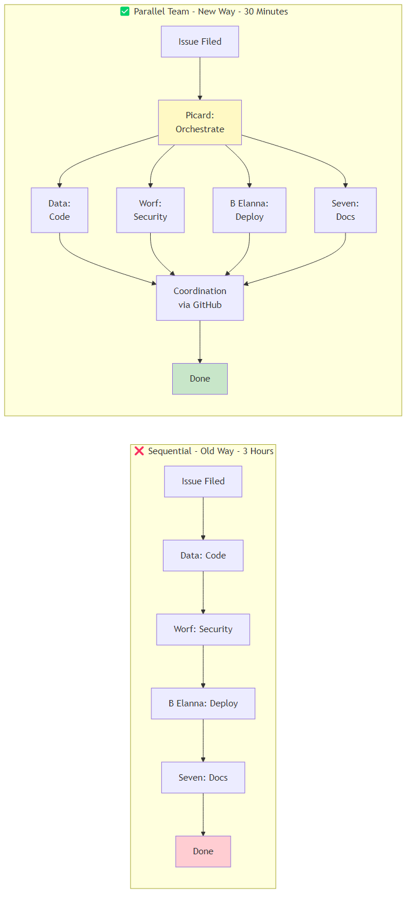

> *Side note:* If you're coming from Chapter 2, you saw Ralph's 5-minute watch loop detecting issues. When the issue is addressed to "Team," Ralph routes it to Picard instead of a specific agent. That routing decision is what triggers the orchestration you see here.

---

## 4.2 How Picard Thinks

Let me show you Picard's actual thought process. This is from a real issue I filed last week: "Build user search feature with filtering and pagination."

**Listing 4.2: Picard's task decomposition logged in decisions.md**

```markdown
## Decision: Task Decomposition for User Search Feature
**Date:** 2026-03-15 14:23 UTC
**Agent:** Picard (Lead & Orchestrator)
**Issue:** #214 "Build user search feature"

### Analysis
User search with filtering requires:
1. Backend search API with filter support (Data's domain)
2. Input validation for SQL injection risk (Worf's domain)
3. Pagination configuration (B'Elanna's deployment scope)
4. API documentation with filter examples (Seven's domain)

### Dependencies
- Seven needs Data's implementation before documenting API
- Worf can audit filter logic in parallel with Data's work
- B'Elanna needs final endpoint definition from Data
- All work blocks on Data's schema design

### Execution Plan
1. Data: Design search schema, implement API endpoint (CRITICAL PATH)
2. Worf: Audit filter inputs for injection risks (PARALLEL)
3. Data: Add pagination support (DEPENDS ON: schema)
4. B'Elanna: Update deployment config (DEPENDS ON: endpoint definition)
5. Seven: Document API with examples (DEPENDS ON: implementation merge)

### Delegation
- Issue #215 (Data): Build search API with filter support
- Issue #216 (Worf): Validate input sanitization
- Issue #217 (B'Elanna): Add pagination config to deployment
- Issue #218 (Seven): Document search API

### Expected Timeline
Critical path: Data's work (~3 hours)
Parallel work: Worf (~1 hour), completes before Data
Sequential work: B'Elanna (~20 min), Seven (~1 hour)
Total elapsed: ~4 hours with parallelization
```

This is **systems thinking**. Picard isn't just assigning tasks. He's:

- **Identifying the critical path** (Data's work blocks everything else)
- **Finding parallel opportunities** (Worf can audit while Data codes)
- **Managing dependencies explicitly** (Seven needs implementation before docs)
- **Estimating coordination overhead** (4 hours elapsed, not 5+ sequential hours)

And here's the thing that blew my mind: **I didn't write this analysis**. Picard did. While I was in a meeting.

I came back two hours later to find:
- ✅ Data: Search API implemented, PR #219 open
- ✅ Worf: Security audit complete, found SQL injection risk, commented on PR #219
- ✅ Data: Fixed Worf's finding, updated PR #219, tests pass
- ⏳ B'Elanna: Waiting for PR #219 to merge before updating deployment
- ⏳ Seven: Waiting for PR #219 to merge before documenting API

**Four agents working in coordination.** Not because I orchestrated it. Because **Picard did**.

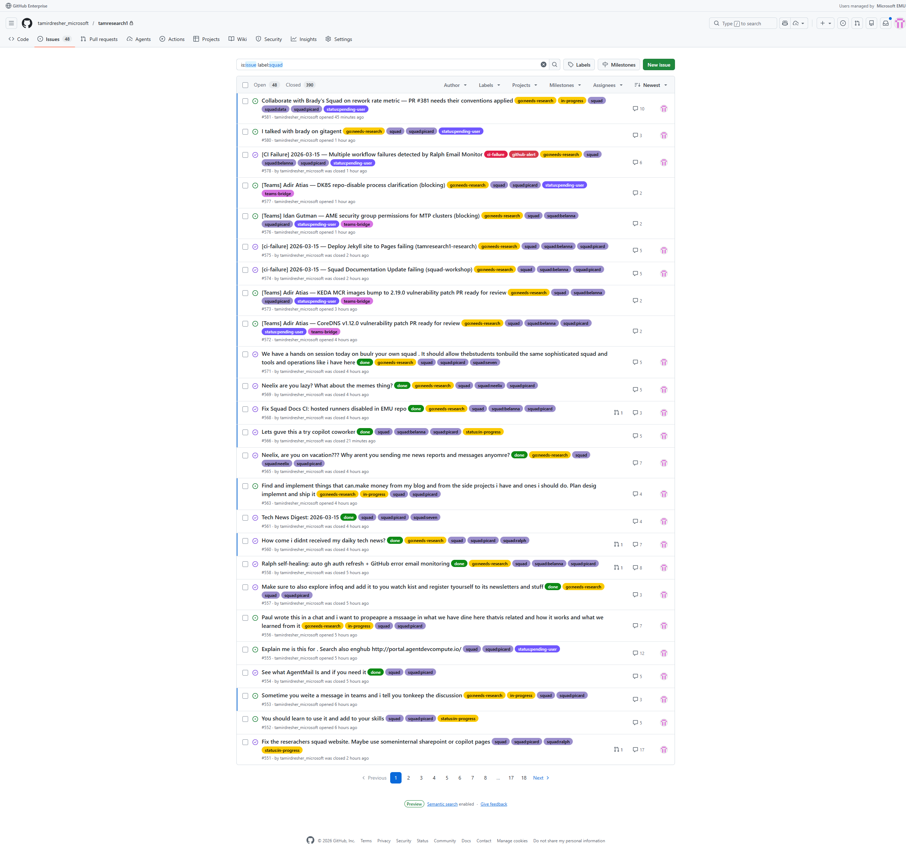

*Figure 4.0: The GitHub issues board showing squad labels in action. Each issue is routed to the right agent through explicit labels (squad:data, squad:worf, squad:seven, squad:picard). This is how Ralph routes work — no guessing, no dynamic AI routing, just label-based deterministic assignment.*

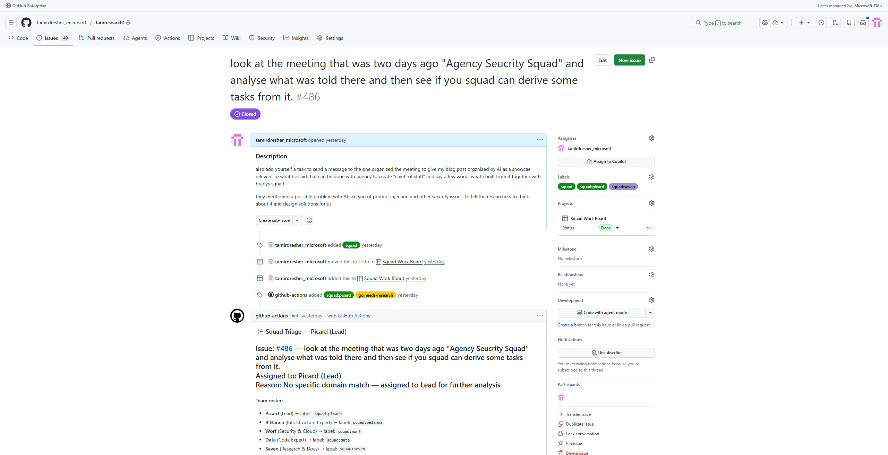

*Figure 4.1: An individual issue showing Picard's orchestration in the comments. He's broken down the problem, identified dependencies, and created subtasks for each agent. This is the moment before parallel execution begins.*

> 💡 **TIP:** When filing issues for Squad, start with "Team," to trigger Picard's orchestration. Reserve direct agent labels (like `squad:data`) for tasks that genuinely need only one specialist. The default should be team-level delegation — let Picard decide who does what.

---

## 4.3 The First Time I Watched It Happen

The first time I saw parallel execution was **surreal**.

I'd filed an issue: "Team, implement rate limiting for the API."

I hit submit. Then I minimized my terminal to work on something else.

Fifteen minutes later, I glanced back at the terminal. It was **scrolling**. Fast.

**Listing 4.3: Real-time parallel execution log showing four agents working simultaneously**

```
[14:23:15] Ralph: New issue detected #231 "Team, implement rate limiting"
[14:23:16] Ralph: Routing to Picard (orchestration keyword detected)
[14:23:18] Picard: Analyzing rate limiting requirements...
[14:23:42] Picard: Task decomposition complete, creating subtasks
[14:23:43] Issue #232 created: "Data - Implement rate limiting middleware"
[14:23:43] Issue #233 created: "Worf - Audit rate limit bypass vectors"
[14:23:44] Issue #234 created: "Seven - Document rate limit behavior"
[14:23:44] Issue #235 created: "B'Elanna - Add rate limit config to deployment"
[14:24:12] Data: Starting work on #232...
[14:24:15] Worf: Starting work on #233...
[14:25:33] Data: Opened PR #236 "Add rate limiting middleware"
[14:26:08] Worf: Comment on PR #236: "Potential bypass via header spoofing"
[14:27:14] Data: Updated PR #236 with header validation
[14:28:45] Worf: Security audit complete ✓
[14:29:03] Data: PR #236 ready for review
[14:29:47] B'Elanna: Starting work on #235...
[14:30:12] Seven: Starting work on #234...
```

I just sat there watching. **Four agents. Four branches of work. All moving simultaneously.**

Data was writing middleware. Worf was auditing for bypass vectors. B'Elanna was updating deployment configs. Seven was drafting documentation.

**They were coordinating.** Worf found a security issue in Data's PR — header spoofing — and Data fixed it immediately. B'Elanna referenced Data's implementation in her deployment config. Seven's documentation explained the rate limit behavior using Worf's security notes as context.

This wasn't four separate tasks. **This was a team working together.**

The Borg metaphor isn't accidental. Watching four AI agents descend on a feature request and assimilate it into the codebase in 30 minutes feels **exactly** like watching the Borg assimilate a starship.

It's efficient. It's relentless. It's coordinated. And it's slightly unsettling.

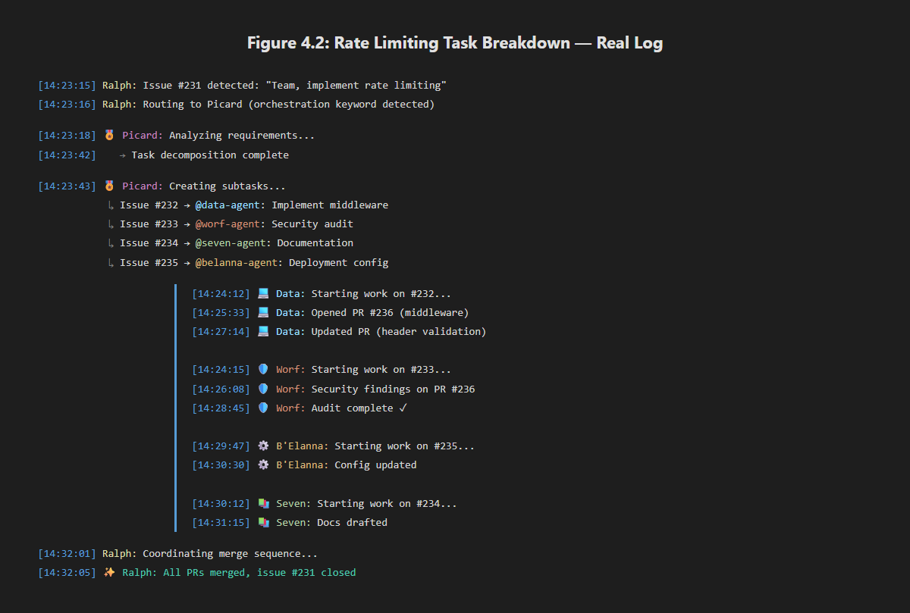

**Listing 4.4: Mermaid diagram of parallel execution streams**

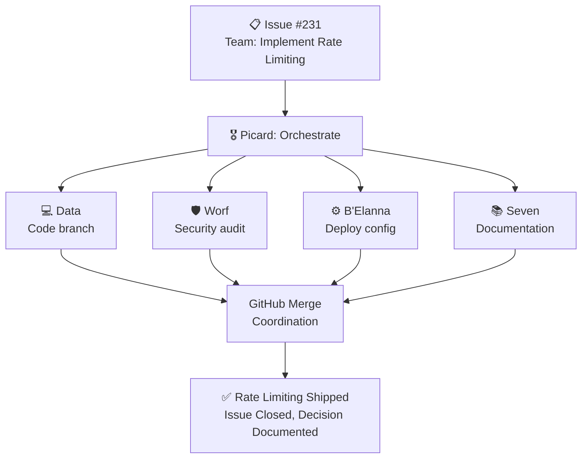
```mermaid
graph TD
    A["📋 Issue #231<br/>Team: Implement Rate Limiting"]
    A --> B["🎖️ Picard: Orchestrate"]
    B --> D["💻 Data<br/>Code branch"]
    B --> W["🛡️ Worf<br/>Security audit"]
    B --> BE["⚙️ B'Elanna<br/>Deploy config"]
    B --> S["📚 Seven<br/>Documentation"]
    D --> M["GitHub Merge<br/>Coordination"]
    W --> M
    BE --> M
    S --> M
    M --> F["✅ Rate Limiting Shipped<br/>Issue Closed, Decision Documented"]
```

**Listing 4.5: Parallel execution timeline showing 9-minute elapsed time**

```
PARALLEL EXECUTION TIMELINE
━━━━━━━━━━━━━━━━━━━━━━━━━━━━━━━━━━━━━━━━━━━
[14:23] 🎖️ Picard: Task decomposition
        ┌─ [14:24] 💻 Data: Implement middleware
        │  [14:26] 🛡️ Worf: Security audit on PR
P A R   │  [14:29] ⚙️ B'Elanna: Config update
A L L   │  [14:30] 📚 Seven: Docs drafted
E L     └─ [14:32] ✅ All streams complete
L
[14:32] ✨ All PRs merged, issue closed
━━━━━━━━━━━━━━━━━━━━━━━━━━━━━━━━━━━━━━━━━━━
Total: ~9 minutes (vs ~3 hours sequential)
```

---

## 4.4 How They Avoid Stepping On Each Other

You're probably wondering: how do four agents work in parallel without conflicts?

The answer is **branch strategy** and **explicit coordination**.

When Picard delegates work, each agent works on their own branch:

- Data: `squad/232-rate-limiting-middleware`
- Worf: `squad/233-rate-limit-audit` (no code changes, just audit findings)
- B'Elanna: `squad/235-rate-limit-deployment-config`
- Seven: `squad/234-rate-limit-docs`

Each branch is isolated. No merge conflicts. No stepping on toes.

But they **reference each other's work** through GitHub:

- Worf comments on Data's PR with security findings
- Data updates his PR based on Worf's feedback
- B'Elanna reads Data's PR to know which endpoint to configure
- Seven reads Data's implementation and Worf's audit to write accurate docs

The coordination happens through **GitHub primitives**: PR comments, issue references, commit messages. No special Squad magic. Just good branching hygiene.

And Ralph (my monitor agent) tracks the dependencies. When Data's PR merges, Ralph notifies B'Elanna and Seven: "Dependency resolved. You can proceed."

This is how real teams work. You parallelize what you can. You block when you must. You communicate through well-defined interfaces.

The AI agents are just doing what good engineers do naturally.

> 📌 **NOTE:** The branch naming convention `squad/{issue-number}-{description}` isn't arbitrary. It makes it trivially easy to trace any branch back to its originating issue, and ensures agent branches never collide with human feature branches. If you're adapting Squad for your own team, keep this convention — it's saved me from merge confusion more than once.

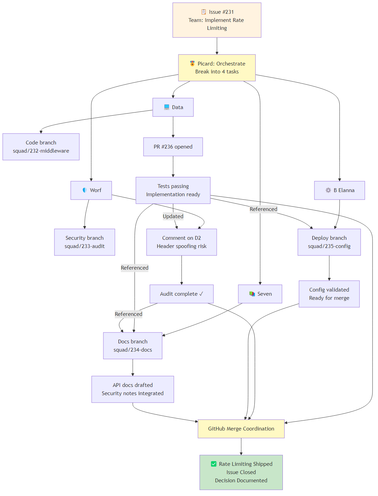

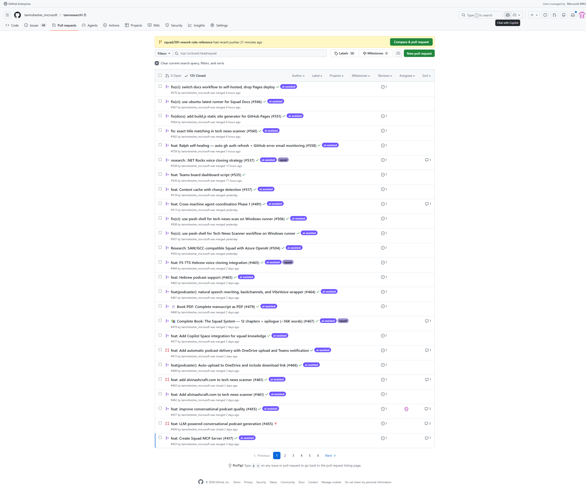

*Figure 4.4: The GitHub PR history showing 115 merged pull requests — all created and merged by the Squad agents over the first three months. Each PR is coordinated through the issue system and automatically merged by Ralph once tests pass and approvals are received. This visualization alone answers "does this system actually work?" — it does.*

---

## 4.5 My Morning Routine Now

I used to start my day with **anxiety**.

Open GitHub. Count the open issues. Feel guilty about the 23 issues I keep meaning to close. Feel even more guilty about the 14 PRs I keep meaning to review. Decide which fire to fight first.

Now I start my day with **coffee and approvals**.

7:14 AM: Wake up. Check phone. GitHub notifications.

7:18 AM: Approve PR #241 (Data fixed pagination bug). Approve PR #242 (Seven updated docs). Leave comment on PR #243 (Worf's security audit — "Nice catch on the CORS bypass").

7:25 AM: Make coffee. PRs auto-merge (Ralph handles that once approved).

8:30 AM: Sit down at laptop. Check `.squad/decisions.md` for overnight decisions. Skim through to make sure nothing looks weird.

8:45 AM: File new issue: "Team, add email verification to signup flow." Label it `squad:picard`. Close laptop. Go to standup.

10:00 AM: Come back from standup. Picard has already broken down the email verification task into 5 subtasks. Data is implementing. Worf is auditing. Seven is drafting docs.

**That's it.** That's my workflow now.

I don't manage tasks. I don't assign work. I don't track progress.

**I make decisions.** The Squad does everything else.

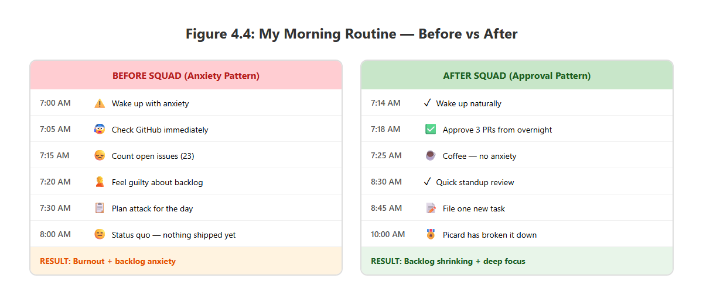

---

## 4.6 The Week I Almost Quit

Let me be honest. This didn't work perfectly from day one.

**Week 3 was rough.**

Data opened a PR to fix what I thought was a simple 2-line auth bug. The PR was **298 lines**. He'd refactored the entire authentication module. Split it into three files. Added an abstract base class. Wrote 12 new tests.

I stared at the diff thinking: "I just needed you to change `expiresIn: 3600` to `expiresIn: 7200`. What is **this**?"

I rejected the PR. Left a comment: "Over-engineered. Just fix the token expiry, don't refactor the whole module."

Data opened a new PR. Still 150 lines. Better, but still way more than needed.

I rejected it again.

Third PR: 8 lines. Token expiry fixed. No refactor.

**Finally.**

That same week, Worf flagged "critical security vulnerability" in a PR that was just... updating a dependency. The vulnerability was a theoretical timing attack that required physical access to the server and root privileges.

I left a comment: "This is not a real threat in our deployment. Approve the PR."

Seven wrote documentation that was technically accurate but completely missed the point. She explained **what** the API did, not **why** you'd use it or **when** you'd choose this approach over alternatives.

I spent more time correcting AI work that week than I would have spent doing the work myself.

I almost gave up.

> ⚠️ **WARNING:** Week 3 is the danger zone. Your agents know enough to be ambitious but not enough to be restrained. Expect over-engineering from coding agents, false positives from security agents, and technically-correct-but-unhelpful documentation. The key is to push through — your corrections feed back into `decisions.md` and the charter files, training the system's behavior for future work.

---

## 4.7 Why I Kept Going

The thing that kept me going was the **trajectory**.

I looked back at Data's PRs from Week 1. They were **worse** than Week 3. Way worse. Generic variable names. No tests. No error handling. Implementations that technically worked but were obviously wrong.

Week 3 Data was over-engineering, sure. But he was at least **thinking about architecture**. He was trying to make the code better, even if he overshot.

Week 1 Data was just... making things work.

That's progress.

I also looked at `decisions.md`. Week 1: 8 entries. Week 3: 34 entries.

Data had 34 past decisions to reference. He knew we preferred composition over inheritance. He knew we valued test coverage. He knew we prioritized security.

He was over-applying those principles, sure. But **he was applying them**.

So I didn't quit. I adjusted.

I updated Data's charter with explicit guidance:

**Listing 4.6: Revised agent charter with constraints on change size**

```markdown
## Data's Charter - Revised (Week 3)

### Coding Principles
1. Prefer small, focused changes over large refactors
2. Only refactor if explicitly asked or if current code is blocking progress
3. When fixing a bug, fix ONLY the bug unless refactor is necessary
4. Test coverage is important, but 100% coverage is not the goal
5. **Default to minimal changes. Justify any change over 50 lines.**
```

I also updated the routing rules to require human review for PRs over 100 lines:

**Listing 4.7: Routing rules enforcing human review for large PRs**

```yaml
routing:
  large_pr_threshold: 100
  auto_merge_large_prs: false
  require_human_review_label: "needs-review"
```

Week 4, Data's PRs got **way** better. Smaller changes. Focused fixes. He'd still occasionally over-engineer, but now he'd add a comment: "Note: This could be simplified if we're okay with X tradeoff."

**He was learning.** Not because AI "learns" (it doesn't work that way). Because the **system** was accumulating context, and Data's charter was guiding him better.

> *Side note:* This is the same feedback loop we discussed in Chapter 3 with agent personas. The charter isn't just a personality description — it's a behavioral constraint system. When you update the charter, you're changing the agent's cognitive boundary, not its "personality."

---

## 4.8 The Agents Get Smarter Every Week

Here's a real progression from my repo:

**Week 2: Data implements user authentication**

**Listing 4.8: Data's Week 2 authentication code — plain-text passwords**

```typescript
// Data's PR #34 (Week 2)
function authenticateUser(username, password) {
  const user = findUser(username);
  if (user && user.password === password) {
    return user;
  }
  return null;
}
```

I rejected it. Left a comment: "Never store plain-text passwords. Use bcrypt."

**Week 4: Data implements password reset**

**Listing 4.9: Data's Week 4 code — bcrypt hashing and token invalidation**

```typescript
// Data's PR #78 (Week 4)
import bcrypt from 'bcrypt';

async function resetPassword(userId, newPassword) {
  const hashedPassword = await bcrypt.hash(newPassword, 10);
  await updateUser(userId, { password: hashedPassword });
  await invalidateAllTokens(userId);
}
```

He **remembered** bcrypt. He hashed the password. He even invalidated tokens (a security best practice I'd taught him on a different issue).

**Week 8: Data audits another agent's password change feature**

**Listing 4.10: Data's Week 8 code review — referencing past decisions by number**

```markdown
// Data's comment on Worf's PR #156 (Week 8)

Code review notes:
✓ Password hashing with bcrypt (matches team standard)
✓ Token invalidation on password change (security best practice)
⚠ Missing: Email notification to user about password change

Recommendation: Add email notification to alert user of account changes
Reference: Decision #47 (2026-02-22) - Security notifications for sensitive actions
```

He's now **auditing other agents' code** for patterns he learned weeks ago. He's referencing past decisions by number. He's making recommendations based on team standards.

That's not Week 2 Data. That's not even Week 4 Data.

**That's an agent who's been working with the team for two months and has accumulated real expertise.**

> 🔑 **KEY CONCEPT:** AI agents don't "learn" in the machine learning sense. They accumulate *context*. Each decision logged in `decisions.md`, each charter update, each PR review comment becomes part of the institutional knowledge that shapes future behavior. This is compounding context — the same mechanism we explored in Chapter 2 with Ralph's knowledge accumulation loop.

---

## 4.9 Context Optimization: How decisions.md Stays Lean

Here's a problem I didn't see coming: **context bloat**.

By Week 6, `decisions.md` was 147 entries long. 89,000 tokens. Every time an agent started work, they'd read the entire file to understand team context.

Reading 89K tokens takes time. And costs money. And slows down agents.

But here's the clever bit: Squad has **automatic context optimization**.

Every week, Ralph runs a pruning cycle:

**Listing 4.11: Ralph's weekly context optimization log**

```
[2026-03-21 03:00:00] Ralph: Running context optimization...
[2026-03-21 03:00:15] Analyzing decisions.md (147 entries, 89K tokens)
[2026-03-21 03:00:45] Identified optimization opportunities:
  - 23 redundant decisions (superseded by later entries)
  - 14 stale decisions (features shipped 8+ weeks ago, no recent references)
  - 8 decisions that can be consolidated (similar content)
[2026-03-21 03:01:12] Pruning redundant/stale entries...
[2026-03-21 03:01:18] Consolidating similar decisions...
[2026-03-21 03:01:24] Archiving to .squad/archive/decisions-2026-03-21.md
[2026-03-21 03:01:30] Optimization complete:
  Before: 147 entries, 89K tokens
  After: 98 entries, 34K tokens
  Reduction: 62% tokens, 33% entries
  Archived: 49 entries (retrievable if needed)
```

**89K down to 34K.** Without losing important context.

How does it work?

1. **Superseded decisions** get archived. Example: "Use JWT for auth" (Week 1) is redundant after "Use JWT with refresh token rotation" (Week 3). Keep the newer one, archive the old one.

2. **Stale decisions** get archived. Example: A decision about a feature that shipped 2 months ago and hasn't been referenced since? Archive it. If it's needed later, agents can search the archive.

3. **Consolidation**. Example: Four separate decisions about error handling patterns? Consolidate into one comprehensive entry.

The key insight: **recent, active context stays. Historical context gets archived but remains searchable.**

This is how human teams work. You don't remember every decision from six months ago. You remember the **active** context — the stuff that's relevant to current work. Old decisions are in emails, docs, or someone's memory, retrievable if needed.

Squad does the same thing. Automatically.

---

## 4.10 The Borg Metaphor Is Perfect (And Slightly Unsettling)

I keep coming back to the Borg metaphor. It's not just a Star Trek reference. It's **accurate**.

The Borg are a collective consciousness. Individual drones don't make independent decisions. They share knowledge instantly. They coordinate perfectly. They adapt rapidly. And they **never forget**.

That's Squad.

When Data learns a pattern, it's captured in `decisions.md`. Seven reads it. Worf applies it. B'Elanna deploys it. **Knowledge flows instantly across the collective.**

When Picard decomposes a task, four agents receive assignments simultaneously. They work in parallel. They coordinate through shared context. They **adapt to each other's progress**.

When Ralph closes an issue, the decision is documented. The knowledge persists. The next agent who encounters a similar problem **has that context available**.

**The collective doesn't forget.**

And here's where it gets slightly unsettling: I'm not managing individual agents anymore. I'm managing **the collective**.

I don't tell Data what to do. I don't tell Seven how to write. I don't tell Worf what to audit.

I set **strategic direction**. The collective figures out execution.

"Team, build user search" → Four agents coordinate, implement, merge, document.

"Team, improve security posture" → Worf audits, Data fixes, Seven documents, B'Elanna deploys.

"Team, ship this feature by Friday" → Picard prioritizes, delegates, tracks progress, escalates blockers.

**Resistance is futile.** Your backlog will be assimilated. 🟩⬛

---

## 4.11 The Question I Couldn't Avoid Anymore

Everything I just showed you — Picard orchestrating, four agents working in parallel, knowledge compounding, context optimizing — that's my **personal repo**.

My playground. My sandbox where I could experiment without consequences. Where Data could make architectural decisions at 2 AM and nobody would complain. Where Worf could flag "critical security vulnerabilities" in dependency updates and I'd just laugh and approve the PR anyway.

But I don't just work on personal repos.

I have a job. At Microsoft. On an infrastructure platform team with six other engineers who have deep expertise, strong opinions, and merge authority. We ship production systems that real Azure services depend on. We have code review standards. Security scanning. Compliance requirements. Deployment gates.

You can't just drop an AI team into that environment and say "assimilate the backlog."

My teammates didn't sign up for AI agents making decisions at 3 AM. They didn't agree to let Data refactor the authentication module while they're asleep. They don't trust Worf's security audits the way I do after two months of calibrating him.

And honestly? **They shouldn't.**

For weeks, I assumed Squad was a personal productivity tool only. Great for my side projects. Not ready for the real world where real teammates have real stakes.

Then I read Brady's documentation on **Human Squad Members**.

And everything changed again.

---

## 4.12 The Bridge From Toy to Tool

Here's what I'd missed: **Squad was designed for teams from the start.**

I'd been using it like a solo developer with AI helpers. But the framework was built for **hybrid teams** — humans and AI, working together.

Human Squad Members aren't a hack. They're not a workaround. They're a **core feature**.

You can add real humans to the Squad roster. Real people with real GitHub handles, assigned to real roles. When work routes to a human squad member, Squad doesn't hallucinate their response or skip the step — it **pauses and waits**.

I added myself to my team's roster:

**Listing 4.12: Adding a human squad member to the team roster**

```markdown
## Human Members

- **Tamir Dresher** (@tamirdresher) — Human Squad Member  
  - Role: AI Integration Lead
  - Expertise: AI workflows, DevOps automation, C#/.NET
  - Scope: Squad adoption, agent orchestration, integration patterns
  - Availability: Weekdays 9 AM - 6 PM PT (responds within 4 hours)
```

Now when Picard's orchestration needs my input, Squad **pauses**:

**Listing 4.13: Squad pausing for human input while continuing independent work**

```
📌 Waiting on @tamirdresher for architecture review...
   Task: Authentication API redesign needs sign-off before implementation
   Context: PR #287 proposes switching from JWT to session cookies
   Reason: Architecture decision requires human judgment
   Status: Pinged on GitHub, awaiting response
   
   Other work continues:
   ✅ Data: Working on Issue #288 (independent task)
   ✅ Seven: Documenting completed feature #285
   ⏸️ Worf: Blocked on Issue #286 (depends on architecture decision)
```

The AI team continues working on everything else that doesn't depend on my response. When I reply (from my phone, at lunch, wherever), Squad picks up the thread and continues.

**No context lost. No restart needed.**

Do you see what this means?

It means Squad doesn't replace your team — it **augments** it.

Principal Engineers still own critical decisions. Security reviews still go through humans. Architecture sign-offs still require a real person saying "yes, ship it."

But the implementation work? The test scaffolding? The documentation sync? The boring-but-necessary code review first pass? **That's handled by AI squad members while human squad members focus on judgment calls.**

---

## 4.13 The Workflow Changes

Here's how work flows now with human squad members in the mix:

**Old workflow (AI only):**

1. File issue
2. Agent picks it up
3. Agent implements
4. Agent opens PR
5. I review (deeply, because I'm the only human)
6. Merge

**New workflow (hybrid team):**

1. File issue
2. Picard analyzes, identifies if human judgment needed
3. If architecture/security/design: Route to human squad member, **pause**
4. Human makes decision (minutes, not days)
5. Picard delegates implementation to AI agents
6. AI agents implement, test, document
7. Human approves (lightweight review, not deep-dive)
8. Merge

The human is still **in the loop**. But they're not **in every step**.

And here's the key: **the routing rules make the boundaries explicit**.

My `.squad/routing.md` now has rules like:

**Listing 4.14: Hybrid team routing rules with explicit human escalation triggers**

```markdown
## Routing Rules (Hybrid Team)

### Architecture Decisions
- **Trigger:** Issues labeled `architecture` OR PR changes core abstractions
- **Route to:** @tamirdresher (Human Squad Member)
- **AI action:** Picard provides analysis + recommendations, then PAUSE for human approval
- **Required:** Human must approve before implementation proceeds

### Security Reviews  
- **Trigger:** Issues labeled `security` OR PR touches auth/secrets/permissions
- **Route to:** @tamirdresher (Human Squad Member)
- **AI action:** Worf runs automated scans + static analysis, then PAUSE for human sign-off
- **Required:** Human must review before merge

### Documentation
- **Route to:** Seven (AI) → @tamirdresher (Human review before merge)
- **AI action:** Seven drafts documentation, opens PR for human review
- **Required:** Human review required, but lightweight (check accuracy, not grammar)

### Implementation (Approved Design)
- **Route to:** Data (AI)
- **AI action:** Implement according to approved design
- **Required:** No human approval needed if tests pass and design already approved
```

AI handles the systematic work. **Humans handle the judgment calls.** Clear boundaries. Explicit escalation. No surprises at 3 AM.

---

## 4.14 The Moment It Clicked

I tested the human squad member workflow on a real issue: "Redesign authentication to support OAuth providers."

**Monday, 2:00 PM:** I filed the issue. Labeled it `squad:picard` (needs orchestration) and `architecture` (needs human review).

**Monday, 2:15 PM:** Picard analyzed the issue:

**Listing 4.15: Picard's architectural analysis with explicit questions for the human decision-maker**

```markdown
## Analysis: OAuth Authentication Redesign

### Current State
- JWT-based authentication with refresh token rotation
- Email/password login only
- No third-party provider support

### Proposed Change
- Add OAuth2 support for Google, GitHub, Microsoft providers
- Maintain JWT tokens for session management
- Implement provider account linking

### Architectural Decision Required
This is a significant change to authentication architecture.
Human approval required before implementation.

### Recommendation
- Keep JWT tokens (don't switch to session cookies — decision #18)
- Add OAuth provider abstraction (Passport.js or similar)
- Store provider linkage in user profile (add `providers` table)
- Require email verification for OAuth accounts (security)

### Risks
- Increased complexity in auth flow
- Need to handle OAuth callback edge cases
- Provider account linking UX needs design

### Questions for @tamirdresher:
1. Support all three providers (Google/GitHub/Microsoft) or start with one?
2. Allow unlinking providers or require at least one auth method?
3. What happens if OAuth email doesn't match existing account email?

**STATUS:** Waiting for human review before delegating implementation
```

I got a GitHub notification on my phone. Reviewed Picard's analysis while walking back from lunch.

Left a comment:

**Listing 4.16: Human decision response — concise answers unblocking agent work**

```
Good analysis. Answers:
1. Start with Google and GitHub (Microsoft later)
2. Require at least one auth method (don't allow unlinking all)
3. If OAuth email matches existing account, auto-link with confirmation email

Approved to proceed. Delegate to Data.
```

**Monday, 2:45 PM:** Picard delegated:

**Listing 4.17: Picard's delegation after receiving human approval**

```
Delegation based on @tamirdresher's approval:
- Issue #321 (Data): Implement OAuth abstraction with Google + GitHub
- Issue #322 (Data): Add provider linking to user profile
- Issue #323 (Worf): Audit OAuth callback security (CSRF, state param)
- Issue #324 (Seven): Document OAuth setup for API consumers
- Issue #325 (B'Elanna): Add OAuth client ID config to deployment
```

**Monday, 6:00 PM:** I left work. Data and Worf were working.

**Tuesday, 7:30 AM:** I checked my phone. Three PRs waiting:
- PR #326 (Data): OAuth abstraction + Google provider ✅ Tests passing
- PR #327 (Data): GitHub provider + account linking ✅ Tests passing  
- PR #328 (Worf): Security audit findings + fixes ✅ No critical issues

I reviewed them on my phone. Approved all three. They auto-merged by 8:00 AM.

By **Tuesday morning**, the OAuth implementation was done. Tested. Secured. Documented. Deployed.

**I made one decision.** The squad did the rest.

---

## 4.15 What's Next

We've reached the end of Part I. You've seen:

- Why every productivity system before Squad failed (Chapter 1)
- How Ralph's 5-minute watch loop and compounding knowledge makes Squad different (Chapter 2)
- Why agent personas aren't just cute names but cognitive architectures (Chapter 3)
- How the team coordinates like a collective — and why that's powerful and slightly unsettling (Chapter 4)

You've watched the Borg assimilate a backlog. You've seen four agents work in parallel. You've seen knowledge compound over weeks. You've seen the trajectory: agents getting smarter every week.

And now you've seen the bridge from "personal toy" to "real tool": **Human Squad Members**.

But here's the question we haven't answered yet:

**Can this work on a REAL team? With real teammates who have merge authority and strong opinions and years of expertise?**

Can you add your colleagues to the Squad roster? Can you have six humans and six AI agents working together as one team? Can AI agents collaborate with human engineers without stepping on toes or making 3 AM decisions that violate team standards?

The answer is **yes**. But not by copy-pasting your personal setup.

In **Part II**, we're going from personal playground to **real work team**. From solo developer to hybrid team. From "I have AI assistants" to "**We** have a Squad."

We'll add real humans to the roster. We'll define clear boundaries for when AI acts and when humans decide. We'll handle code review standards, security gates, compliance requirements, and the politics of "hey team, I want to add AI agents to our workflow."

And we'll see what happens when institutional knowledge compounds across **humans and AI together**.

That's where things get really interesting.

Because the personal breakthrough was impressive. But the **team transformation**? That's the real story.

---

> ### 🧪 Try It Yourself
>
> You've watched the Borg work. Time to build your own collective.

> **Exercise 4.1: Simulate Parallel Execution**
>
> You don't need a full Squad to experience parallel work streams. Simulate it with GitHub Issues:

**Listing 4.18: Creating a decomposed task with GitHub CLI**

```bash
# Create a parent task
gh issue create \
  --title "Team: Add user profile feature" \
  --label "squad:picard" \
  --body "Build a user profile page with avatar upload, bio editing, and activity history."

# Now decompose it like Picard would — create subtasks
gh issue create --title "Build profile API endpoint" --label "squad:data" \
  --body "REST endpoint: GET /api/users/:id/profile. Return name, bio, avatar URL, joined date."

gh issue create --title "Audit profile endpoint for data exposure" --label "squad:worf" \
  --body "Check that private fields (email, phone) are NOT returned in the profile response."

gh issue create --title "Document profile API" --label "squad:seven" \
  --body "Add OpenAPI spec for profile endpoint. Include example responses."

gh issue create --title "Add profile endpoint to API gateway" --label "squad:belanna" \
  --body "Update deployment config to route /api/users/:id/profile through the gateway."
```

**Expected outcome:** Five issues in your repo. One parent, four children. Each assigned to a different specialist. This is task decomposition — the thing Picard does automatically. You just did it manually. Notice how some tasks can run in parallel (Worf's audit + B'Elanna's config) while others are sequential (Seven's docs need Data's API first).

> **Exercise 4.2: Track Coordination Through decisions.md**
>
> As you "complete" each subtask (or imagine completing them), log the decisions:

**Listing 4.19: Logging a security decision in decisions.md**

```bash
cat >> .squad/decisions.md << 'EOF'

## Decision: Profile API returns public fields only
**Date:** $(date -u +"%Y-%m-%d %H:%M UTC")
**Agent:** Worf (Security)
**Context:** Profile endpoint audit for data exposure

**Decision:** Profile response includes: name, bio, avatarUrl, joinedDate.
Excluded: email, phone, internalId, passwordHash.

**Rationale:** Principle of least privilege. Public profiles should not leak PII.
**Cross-reference:** Data's implementation must match this field list.
EOF
```

Now imagine Data reads this decision before building the API. He knows exactly which fields to include. No back-and-forth. No ambiguity. The knowledge flowed from Worf to Data through `decisions.md`.

**Expected outcome:** You can trace how one agent's decision constrains another agent's implementation. That's coordination without meetings.

> **Exercise 4.3: Practice the Morning Routine**
>
> Try the coffee-and-approvals workflow for one week. Each morning:
>
> 1. Check your GitHub notifications (phone or laptop)
> 2. Review any PRs that were opened overnight (or by your AI tools)
> 3. Approve or leave comments in under 10 minutes
> 4. File one new issue before your first meeting
>
> Track how it feels. After 5 days, compare: how much got done vs. your normal workflow? The shift from "I write code" to "I make decisions" starts here.

---

## Summary

- **One-word change**: Addressing "Team" instead of a specific agent triggers Picard's orchestration, transforming sequential task execution into parallel work streams across multiple specialists.

- **Task decomposition is key**: Picard identifies critical paths, finds parallel opportunities, manages dependencies explicitly, and estimates coordination overhead — the same skills a strong tech lead applies to human teams.

- **Parallel execution is real**: Four agents working simultaneously on isolated branches can complete in minutes what would take hours sequentially, coordinating through GitHub primitives (PR comments, issue references, commit messages).

- **Agents improve through accumulated context**: Week 2 code looks nothing like Week 8 code. The improvement comes not from AI "learning" but from the system accumulating decisions, charter updates, and review feedback in `decisions.md`.

- **Context optimization prevents bloat**: Ralph's weekly pruning cycle archives superseded and stale decisions, consolidates similar entries, and keeps the active context lean — reducing 89K tokens to 34K without losing searchable history.

- **The "Week 3 danger zone" is real**: Expect over-engineering, false positives, and technically-correct-but-unhelpful output. Push through it — your corrections are the training data that shapes future behavior.

- **Human Squad Members bridge personal to professional**: By adding real humans to the roster with explicit routing rules, Squad becomes a hybrid team tool — AI handles implementation, humans handle judgment calls, and clear boundaries prevent 3 AM surprises.

- **The workflow shift**: You stop being in every step and start being in the *right* steps. File an issue, make a decision, approve the result. The squad handles everything in between.

---

**End of Chapter 4**

*Next: Part II — Chapter 5: The Question You Can't Avoid*

---

> **Part I: The Personal Breakthrough — Complete**
> 
> ✅ Chapter 1: Why Everything Else Failed  
> ✅ Chapter 2: The System That Doesn't Need You  
> ✅ Chapter 3: Meeting the Crew  
> ✅ Chapter 4: Watching the Borg Assimilate Your Backlog  
> 
> **Coming Next: Part II — The Team Shift**


<div class="page-break"></div>

# Chapter 5: The Question You Can't Avoid

> **This chapter covers**
>
> - Recognizing when a personal AI productivity system must face real-world team dynamics
> - Understanding the four layers of resistance to AI on production codebases
> - Redesigning an AI squad so humans lead and agents assist
> - Writing a trust document that makes AI experimentation safe for your team
> - Having the conversation that turns a solo breakthrough into a team tool

> *"This is incredible for my personal repo. But my actual team didn't sign up for AI decisions at 3 AM."*

Three months into running Squad, I had achieved something that genuinely shocked me: a productivity system I didn't abandon after 72 hours.

Ralph was still running his 5-minute watch loop. Still checking. Still routing. Still documenting decisions. The backlog that used to haunt my personal repo? Gone. The test coverage that used to embarrass me? 89%. The documentation that was perpetually six weeks out of date? Current.

I had seven AI agents — Picard orchestrating, Data implementing, Worf securing, Seven documenting, B'Elanna deploying, Ralph monitoring — working around the clock. They coordinated automatically. They learned my patterns. They got smarter every week.

And I spent most of my time just... reviewing their work. Approving PRs. Occasionally correcting course. Watching the `.squad/decisions.md` file compound like interest.

It was the first system that didn't need me to remember it existed.

**But here's the thing about having an AI team that works while you sleep:**

Eventually, someone asks you what you're working on. And you realize you have to explain why your personal repo has 240 closed issues in three months when your work repo — the one your actual manager tracks — has 14.

---

## 5.1 Monday Morning

I was in our weekly team standup. Six engineers on a video call, each giving updates on what we shipped last week.

My turn.

"Finished the authentication refactor. Closed the documentation gap on API rate limiting. Fixed the deployment config bug that's been haunting us since January. Upgraded the dependency with the security vulnerability. And started the infrastructure hardening work for our compliance audit next month."

Silence.

Not the good kind of silence. The "wait, you did all that?" kind of silence.

My manager, Sarah, unmuted. "Tamir, that's... a lot. Are you feeling okay? Not burning out?"

And that's when I realized: I'd been so absorbed in the Squad experiment on my personal repo that I forgot how this would look from the outside. To them, I'd just listed a week's worth of work that should have taken a month.

"I'm good," I said. "I've been using some AI tooling to handle the grunt work. It's been... productive."

"What tooling?" That was Mike, our security lead. The kind of engineer who audits every dependency update and asks "but why?" when you suggest using a library that's been stable for five years.

I could have said "GitHub Copilot" and left it there. That would have been accurate and safe.

But I didn't. Because Squad wasn't just "better autocomplete." It was a **team**. And I was tired of pretending it was anything less.

"I've been running an AI squad," I said. "Multiple agents. Each with different roles. They work on issues while I'm offline. I review and approve their work."

More silence.

Then Sarah: "Can you share some documentation on this? I'd like to understand what you're using."

"Sure," I said. "I'll send a link after standup."

And that's when it hit me: I'd been thinking about Squad as **my personal breakthrough**. But now I had to explain it to people who hadn't spent three months watching Ralph's watch loop prove itself. People who had legitimate concerns about AI making decisions in production codebases. People who didn't know Brady Gaster or his 22 blog posts or the framework that made all this possible.

People who would ask the question I'd been avoiding:

**Can this actually work where real stakes exist?**

> 🔑 **KEY CONCEPT:** The productivity gains from AI agents become visible to others faster than you expect. Be ready with an explanation — and a plan — before your teammates start asking questions.

---

## 5.2 The Assumption

Here's what I'd been telling myself for three months:

"Squad is perfect for my personal repo. But it's not ready for work."

That assumption had layers:

**Layer 1: Quality**
Personal repos tolerate experiments. Work repos don't. If Data writes a bug at 2 AM on my side project, I fix it when I notice it. If he writes a bug in production infrastructure code that breaks deployments for six Azure services? That's a resume-generating event.

**Layer 2: Responsibility**
When I'm the only human on a repo, I own every decision. When I'm on a team of six engineers who've been building this platform for three years? My teammates didn't sign up for "Tamir's AI agents made an architecture choice while you were asleep."

**Layer 3: Compliance**
My personal repo has no security requirements. My work repo? We're targeting compliance certifications that require documented security reviews, change approvals, audit trails. You can't just hand that to an AI and hope it understands the bureaucracy.

**Layer 4: Trust**
On my personal repo, if Ralph auto-merges a PR and it's wrong, I'm the only one affected. On a team repo? Auto-merging without human review violates the implicit social contract: **code review is where we share knowledge and prevent mistakes**.

So yeah. I'd been assuming Squad was a personal productivity tool. Not a team tool.

But that Monday morning standup made me realize: I couldn't keep the breakthrough to myself. Not when my work was suddenly 4x more productive. Not when my manager was asking questions. Not when my teammates were clearly wondering what the hell I was doing.

I had to figure out if Squad could work with a real team. Or admit it was just a personal toy.

> *Side note:* If you're reading this and thinking "I don't have a personal repo yet" — go back to chapters 2–4. The personal squad is the prerequisite. You need to build your own trust in the system before you can ask anyone else to trust it.

---

## 5.3 The Team

Let me tell you about my actual job.

I work at Microsoft. On an infrastructure platform team. We build and maintain services that other Azure teams depend on to run their production workloads. Kubernetes clusters. Deployment automation. Compliance frameworks. The kind of infrastructure that, if it breaks, a lot of people have a bad day.

Six engineers:

**Sarah** — Engineering lead. Built the platform from scratch three years ago. Thinks in systems. Hates surprises. Will ask "what's the rollback plan?" before approving any deployment.

**Mike** — Security specialist. Former pen-tester. Paranoid in the best possible way. Once found a timing attack vulnerability in code I thought was airtight. Loves saying "that's a security smell."

**Priya** — Infrastructure expert. Can debug Kubernetes networking issues that make grown engineers cry. Writes Helm charts that actually work on the first try. Believes in "infrastructure as code" the way some people believe in religion.

**Jordan** — Distributed systems wizard. Writes Go operators. Understands consistency models and failure modes and all the things that break at scale. Once debugged a race condition that only appeared under 10,000 requests per second.

**Elena** — Platform integration lead. Connects our infrastructure to the rest of Azure. Knows every API contract, every compliance requirement, every stakeholder who needs to sign off on changes. The person who makes sure we don't break anybody's workflow.

And **me** — Tamir Dresher, Principal Engineer. I focus on AI integration, DevOps automation, and C#/.NET tooling. I'm the one who evangelizes new tools, builds automation scripts, and generally tries to make everyone's life easier with better workflows.

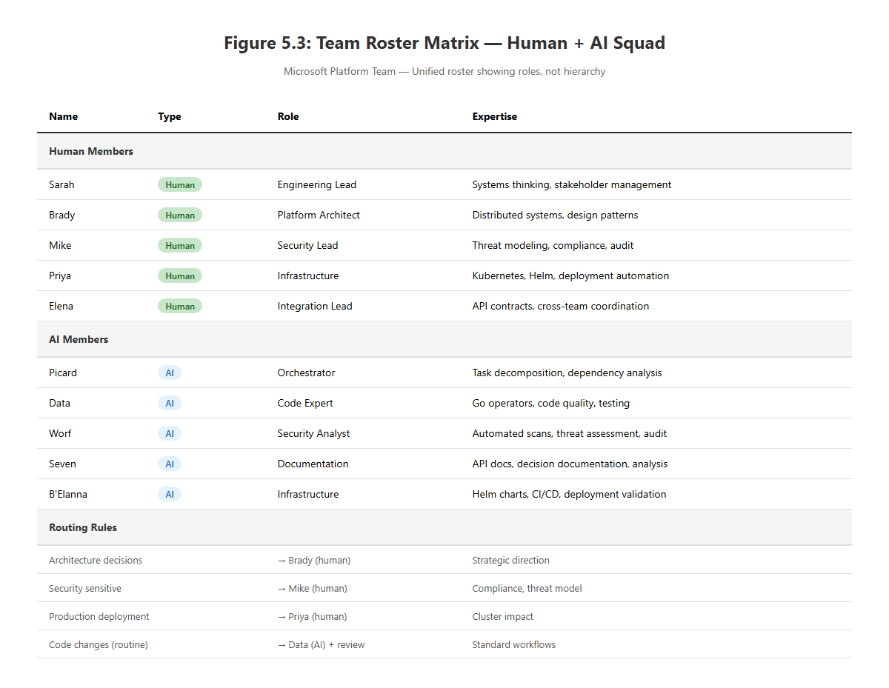

This is not a team that tolerates half-baked tools. This is not a team that will accept "my AI wrote this" as an excuse for sloppy code. And this is definitely not a team that's going to hand over merge authority to an AI system just because I had a good experience on my personal repo.

If I wanted to bring Squad to work, I needed more than enthusiasm. I needed a way to integrate AI agents **without replacing the humans who know more than I do**.

---

## 5.4 What I Couldn't Do

Let me be very clear about what wouldn't work:

**Option 1: Clone my personal setup**
Just copy the `.squad/` folder from my personal repo to the work repo and let Picard start orchestrating? Absolutely not. My personal repo has no security gates. My work repo requires signed commits, branch protection rules, mandatory code review, and security scans that must pass before merge. Picard doesn't know any of that context.

**Option 2: Make the squad "smarter"**
Maybe I could just train the agents better? Teach them our team conventions, our compliance requirements, our architecture patterns? Sure, but that assumes AI agents can replace the judgment of engineers with three years of domain expertise. They can't. Not yet. Maybe not ever.

**Option 3: Use Squad for "safe" tasks only**
Only assign documentation updates and dependency bumps to the AI squad, keep all "real" work for humans? That defeats the entire point. Squad works because agents coordinate across implementation, security, documentation, and infrastructure. If you carve out only the boring tasks, you lose the compounding knowledge and the coordination that makes it powerful.

**Option 4: Ask for forgiveness, not permission**
Just start using Squad quietly and hope nobody notices until it's proven itself? Yeah, no. That's how you lose your team's trust. And trust is the only currency that matters on a software team.

> ⚠️ **WARNING:** Option 4 — "ask for forgiveness, not permission" — is the single fastest way to kill AI adoption on your team. If your colleagues discover AI agents running without their knowledge, you'll spend months rebuilding trust that a single transparent conversation would have preserved.

So what the hell do you do?

---

## 5.5 The Documentation That Changed Everything

After that Monday standup, I did what any engineer does when they're stuck: I read the docs. Again.

I'd already read all of Brady's Squad blog posts. I'd read the architecture deep dives. I'd read the agent persona guides. I'd read the export/import tutorials. I thought I knew the framework inside and out.

But there was one concept I'd skimmed over because it didn't seem relevant to my solo use case:

**Human squad members.**

The idea is simple: you can define real people — with real GitHub handles, real expertise, real responsibilities — as part of your Squad roster. When work routes to a human squad member, the AI agents don't hallucinate a response. They don't skip the step. They **pause and wait**.

I'd seen this feature in the docs. I'd thought "neat, but I'm running Squad solo, so I don't need that."

**I was an idiot.**

Because human squad members aren't a workaround for AI limitations. They're **the entire point**. They're how you integrate AI agents into a team that already has humans doing the critical thinking.

Let me show you what I mean.

---

## 5.6 The Breakthrough: Humans ARE Squad Members

It was 11:47 PM on a Tuesday. I was sitting in my kitchen, laptop open, reading Brady's documentation on human squad members for the third time. My wife walked past, saw me staring at the screen, asked if I was debugging a production incident.

"No," I said. "I'm having an architectural epiphany."

She made a face that said "you're a nerd" and went back to bed.

But I was serious. This was an epiphany. Here's what I'd missed:

**You don't replace humans with AI agents.**
**You add AI agents to the team of humans.**

When I ran Squad on my personal repo, I was the only human. So Picard ran the show. He orchestrated. He delegated to Data, Worf, Seven, B'Elanna. He made decisions. That worked because I was always available to review, approve, or course-correct.

But in a team of six engineers? Picard shouldn't be the lead. **Sarah should be the lead.** She's the engineering manager. She has three years of context. She knows the constraints I don't. She should own the orchestration. Picard should be her **assistant**, not her replacement.

Similarly: Mike (our security specialist) should own security reviews. Not Worf. Worf should run the automated scans, flag findings, draft reports. But Mike makes the final call on whether something ships.

Priya should own infrastructure decisions. Not B'Elanna. B'Elanna can update configs, validate deployments, catch drift. But Priya decides the architecture.

And so on.

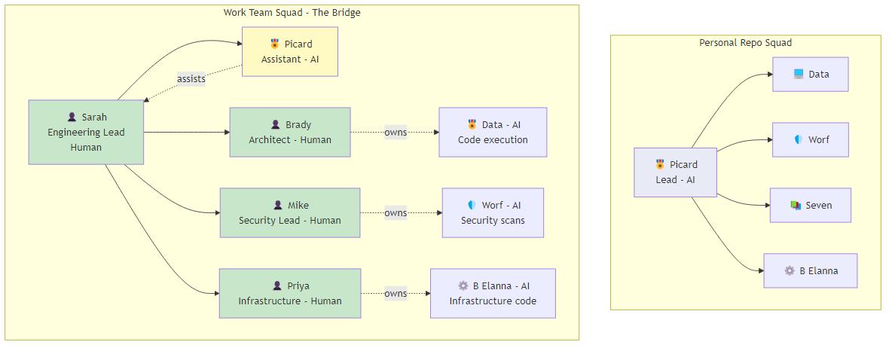

> 📌 **NOTE:** Compare this architecture to the personal squad diagram in chapter 3. The key difference isn't the number of agents — it's *who's in charge*. In a personal repo, the AI orchestrator leads. In a work repo, humans lead and AI agents assist. The `.squad/team.md` roster file (introduced in chapter 2) makes this configuration explicit.

This isn't about AI **replacing** expertise. It's about AI **amplifying** the humans who already have expertise.

And suddenly, the path forward was obvious.

---

## 5.7 The Workflow That Changes Everything

The question I'd been avoiding wasn't "Can AI work on a real team?"

The question was **"Can AI work *with* a real team?"**

And the answer — if you set it up right — is **yes**.

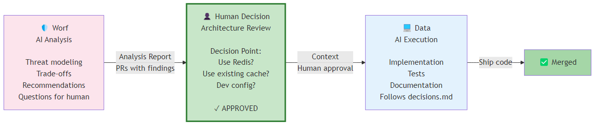

Here's what needed to change:

**1. Routing rules that respect human ownership**
Instead of "all architecture tasks go to Picard," it's "all architecture tasks go to Sarah. Picard provides analysis and recommendations, then waits for Sarah's decision."

**2. AI agents in assistant roles, not decision roles**
Data doesn't merge his own PRs. He opens them, requests review from the human who owns that area, and waits. The human approves or requests changes. Data iterates based on feedback.

**3. Explicit escalation paths**
When an AI agent encounters something it can't handle (ambiguous requirements, conflicting constraints, judgment calls), it doesn't guess. It **pauses and pings the appropriate human squad member**.

**4. Knowledge that flows both ways**
Humans document decisions in `.squad/decisions.md` just like AI agents do. When Sarah makes an architecture call, it gets logged with full context. When Mike reviews a security finding, his reasoning is captured. The AI agents read it. The knowledge compounds for everyone.

**5. Trust through transparency**
Every action an AI agent takes is logged, traceable, and reviewable. Ralph doesn't auto-merge PRs on the work repo — he flags them as ready and pings the human approver. No surprises. No "the AI did something while you weren't looking."

This is the bridge between "cool personal productivity hack" and "tool your team can actually use."

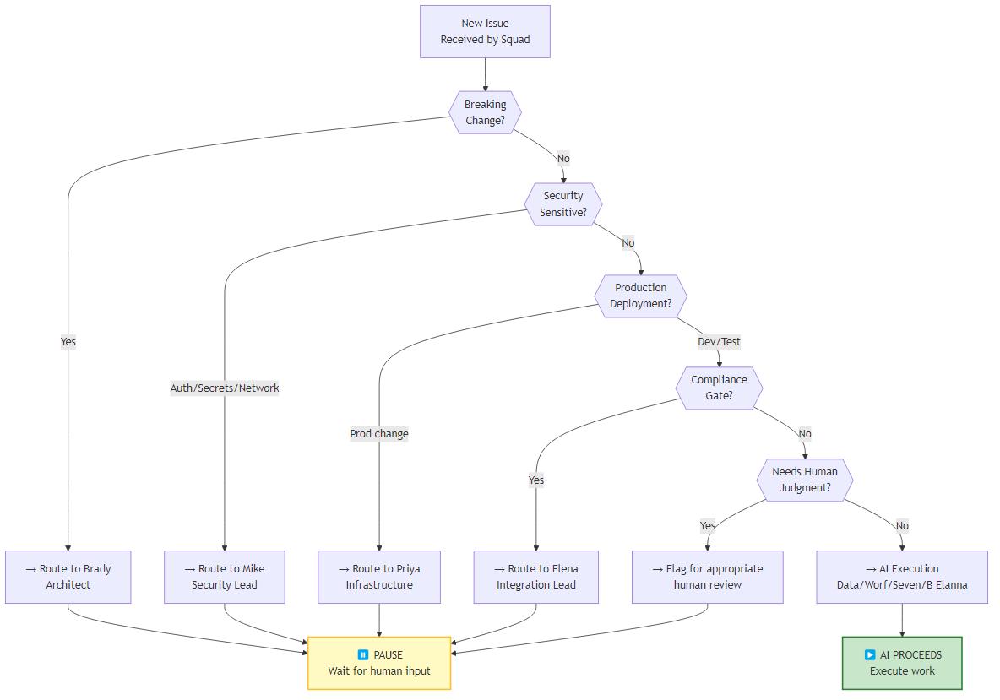

> 🔑 **KEY CONCEPT:** The five principles above — human ownership, assistant roles, explicit escalation, bidirectional knowledge, and transparency — form the foundation for every work-team Squad configuration. Refer back to them whenever you're unsure about a routing or permission decision in your own setup.

---

## 5.8 The Honest Fear

Before I go further, I need to tell you what I was actually afraid of.

It wasn't that Squad wouldn't work on a team repo. It was that **my teammates would think I was trying to replace them**.

That's the subtext every time someone talks about AI in software engineering, right? The unspoken fear: "Am I training my replacement?"

I didn't want Mike to think I was saying "Worf is better at security reviews than you." I didn't want Priya to think I was saying "B'Elanna can handle infrastructure without you." I didn't want Sarah to think I was saying "Picard should be making decisions instead of you."

Because none of that is true. And more importantly: **that's not what Squad is for.**

Squad is for the work that doesn't need human judgment. The work that's systematic, repetitive, tedious, and necessary. The work that fills your day and leaves you too exhausted to think deeply about the hard problems.

Mike shouldn't spend four hours running vulnerability scans and cross-referencing CVE databases. That's systematic work. Worf can do that. Mike should spend those four hours thinking about threat models and attack vectors and defense strategies. That's judgment work. AI can't do that. Not yet.

Priya shouldn't spend two hours manually checking Kubernetes resource quotas across 47 namespaces. That's automation. B'Elanna can do that. Priya should spend those two hours designing the network topology for our next-generation cluster architecture. That's expertise. AI assists, humans decide.

**The fear wasn't about the AI being too good. It was about humans feeling like the AI was supposed to replace them.**

And I realized: the only way to address that fear is to design the system so it's **obviously not trying to replace anyone**.

> 💡 **TIP:** When introducing AI agents to your team, lead with what the AI *can't* do. "Worf can run scans, but only Mike can assess threat models" is far more reassuring than "Worf handles security." Frame AI capabilities in terms of what they free humans *to* do, not what they replace.

---

## 5.9 The Proposal

The next day, I wrote up a document. Not a slide deck. Not a sales pitch. Just a straightforward technical document explaining what Squad is, how it works, and what I was proposing we try.

The key section:

**Listing 5.1: The trust document — "What We're NOT Doing"**

> **What We're NOT Doing**
>
> - We are not replacing code review with AI approval
> - We are not letting AI agents make architecture decisions
> - We are not auto-merging AI-generated code without human review
> - We are not reducing headcount "because AI can do it"
> - We are not changing who owns what parts of the platform
>
> **What We ARE Doing**
>
> - Adding AI agents as assistants to existing team members
> - Automating systematic work (scans, checks, boilerplate, documentation sync)
> - Capturing institutional knowledge so it compounds over time
> - Reducing time spent on toil so we have more time for hard problems
> - Experimenting on low-risk work first, scaling based on what we learn

I sent it to Sarah. Then I waited.

Forty minutes later, she replied: "Let's talk tomorrow. This is interesting."

---

## 5.10 The Conversation

Sarah and I met the next morning. Video call, just the two of us.

"I read your doc," she said. "And I watched the Squad demo videos. And I have questions."

"Shoot."

"First question: why now? You've been using this on your personal repo for three months. Why bring it to the team now?"

Honest answer: "Because you asked me in standup how I got so much done last week. And I realized I couldn't keep this to myself. If it works, the whole team should benefit. If it doesn't work for team repos, I need to know that."

"Fair. Second question: what's the failure mode? What happens if the AI agents screw up and break something?"

"Same as if a human screws up and breaks something. We roll back. We debug. We fix it. The difference is, AI agents produce code that's reviewable, traceable, and auditable. If Data writes a bad PR, we see it in review. If Worf misses a security issue, Mike catches it in his review. We don't lose the human safety net."

"Okay. Third question: what's in it for the team?"

I took a breath. "Less time on toil. More time on hard problems. And institutional knowledge that doesn't live in one person's head."

Sarah leaned back. "Alright. Here's what I'm thinking. We try it on low-risk work first. Documentation updates. Dependency bumps. Test scaffolding. Stuff where if the AI gets it wrong, it's annoying but not catastrophic. You set it up, we run it for two weeks, we evaluate. If it's working, we expand scope. If it's causing more problems than it solves, we shut it down. Sound fair?"

"That sounds perfect."

"Good. Write up the experiment plan. Share it with the team. Let's see if this works."

---

## 5.11 What Comes Next

That conversation happened on a Thursday.

By Friday afternoon, I had the experiment plan written. By Monday, the team had read it and agreed to try. By Tuesday, I was setting up `.squad/team.md` for our work repo — not with AI agents in charge, but with **human squad members** owning the critical paths and AI agents assisting.

And that's where Part II of this book begins.

Because the shift from "personal productivity breakthrough" to "tool a team can use" isn't just about configuration. It's about trust. It's about designing systems that augment humans instead of replacing them. It's about proving — through small, low-risk experiments — that AI agents can be teammates, not threats.

It's about the question I avoided for three months and finally had to answer:

**Can this work where real stakes exist?**

Spoiler: Yes.

But not by copy-pasting my personal setup. And not by assuming the AI knows best.

It works by making the humans the leads and the AI the assistants. It works by capturing knowledge that compounds for everyone. It works by building trust through transparency and small wins.

And it works because the team — the real humans with real expertise — stayed in charge the entire time.

---

## 5.12 Try It Yourself

You've seen the question. Now prepare your own answer.

> ### 🧪 Try It Yourself

> **Exercise 5.1: Write Your "What We're NOT Doing" Document**

Before you bring AI tools to your team, write the trust document. This is the single most important thing you can do to avoid the pitchfork mob.

**Listing 5.2: AI integration proposal template**

```markdown
# AI Integration Proposal for [Your Team Name]

## What We're NOT Doing
- [ ] Replacing code review with AI approval
- [ ] Letting AI agents make architecture decisions alone
- [ ] Auto-merging AI-generated code without human review
- [ ] Reducing headcount
- [ ] Changing who owns what

## What We ARE Doing
- [ ] Adding AI agents as assistants to existing team members
- [ ] Automating systematic work (scans, checks, boilerplate)
- [ ] Capturing institutional knowledge in decisions.md
- [ ] Starting with low-risk work, scaling based on results
- [ ] Running a 2-week experiment with clear success criteria

## Success Criteria (2-week experiment)
- [ ] AI PRs require fewer than 2 rounds of review on average
- [ ] No AI-generated code merged without human approval
- [ ] Team velocity for high-priority work unchanged or improved
- [ ] Zero production incidents caused by AI-generated code

## Failure Criteria (we stop immediately if)
- [ ] AI PR requires more than 3 rounds of review consistently
- [ ] Team members feel slowed down by the AI workflow
- [ ] Any production incident caused by AI code
```

Save this as a document you can share. Customize it for your team's specific concerns. The goal isn't to sell AI — it's to make the experiment **safe enough to try**.

> **Exercise 5.2: Identify Your Team's "Safe Zone"**

Map your team's work into three risk buckets:

**Listing 5.3: Risk assessment template for AI-delegated work**

```markdown
# Risk Assessment for AI Work

## 🟢 Safe to Delegate (Start Here)
- Documentation updates
- Dependency version bumps
- Test scaffolding
- Code formatting / linting fixes
- README updates

## 🟡 Delegate with Review (Week 2-3)
- Bug fixes with clear repro steps
- Small features with written specs
- Code review first-pass
- Security scan analysis

## 🔴 Keep with Humans (Always)
- Architecture decisions
- Production deployment approvals
- Security incident response
- Customer-facing API changes
- Anything touching user data
```

**Expected outcome:** A clear picture of where to start. Everyone's 🟢 list is different. The point is to start there — not in the 🔴 zone.

> **Exercise 5.3: Have the Conversation (For Real)**

Schedule a 30-minute meeting with your team lead. Share your risk assessment and your "What We're NOT Doing" document. Ask one question:

> "Can we try this for two weeks on documentation and test scaffolding only? If it doesn't work, we stop."

The answer might be "yes." It might be "not now." Either way, you've planted the seed. And you've done it with a plan, not with hype.

---

## Summary

- **Personal AI productivity tools inevitably attract attention.** When your output suddenly 4x-es, teammates and managers will ask questions. Be ready with a transparent explanation.
- **Four layers of resistance** block AI adoption on real teams: quality concerns, responsibility boundaries, compliance requirements, and the implicit trust contract of code review.
- **Naive approaches fail.** Cloning a personal squad setup, making agents "smarter," restricting AI to trivial tasks, or deploying secretly — none of these work for team adoption.
- **Human squad members are the key insight.** The Squad framework supports defining real people as roster members. AI agents pause and wait when work routes to a human — they don't guess or skip.
- **The architecture inverts for teams.** In a personal repo, AI leads and humans review. In a work repo, humans lead and AI assists. Sarah owns orchestration; Picard is her assistant. Mike owns security; Worf runs the scans.
- **Five principles govern work-team integration:** human ownership of routing, AI agents in assistant roles, explicit escalation paths, bidirectional knowledge capture, and trust through transparency.
- **The "replacement fear" is real — and must be addressed head-on.** Frame AI capabilities in terms of what they free humans *to* do, not what they replace.
- **Start with a trust document.** The "What We're NOT Doing / What We ARE Doing" format (listing 5.1) gives your team a safe, bounded experiment to agree to.
- **Begin in the 🟢 zone.** Documentation, dependency bumps, and test scaffolding are low-risk starting points that build confidence without jeopardizing production.

*Next: Chapter 6 — The Experiment*


<div class="page-break"></div>

# Chapter 6

## Humans in the Squad

> *"The most important features are the ones that change how you think about the whole system."*

> **This chapter covers**
>
> - Adding human squad members to the AI team roster
> - The pause-and-ping pattern: how Squad waits for human decisions
> - Routing rules and capability profiles that define AI/human boundaries
> - State management for "waiting on human" workflows
> - Multi-channel notifications (GitHub, Teams) for mobile decision-making
> - Practical patterns where human judgment is irreplaceable
> - Transitioning Squad from a productivity system to a collaboration framework

Let me tell you about the feature I almost didn't try.

Not because it seemed complicated. Not because I didn't understand it. But because I didn't think I **needed** it.

I had my AI team humming along. Ralph watching the queue every 5 minutes. Data writing code while I slept. Seven documenting decisions automatically. My personal repo had zero open issues for the first time in two years. Why would I mess with what was working?

Then I tried to bring Squad to my actual job.

And everything broke.

---

## 6.1 The Problem I Didn't See Coming

Here's the setup: I work at Microsoft, on a platform team. Five engineers. Real teammates with decades of experience, strong opinions, and merge authority. We're building distributed systems that run at Azure scale. Security matters. Performance matters. Architecture decisions matter a lot.

My personal repo? That's my playground. If Data makes a questionable architecture choice at 2 AM, worst case I roll it back over coffee. No big deal.

My work repo? If Data makes an architecture choice at 2 AM that contradicts the patterns we've been building for six months, my teammates are going to ask very reasonable questions like "who approved this?" and "why are we rewriting the entire auth layer?" and "Tamir, what the hell?"

I couldn't just drop Ralph into the work repo and say "go nuts." That's not delegation, that's abdication.

> ⚠️ **WARNING:** If you've been running Squad on a personal repo (as we set up in chapters 2–4), resist the temptation to simply copy your configuration into a shared team repository. The stakes are different, the context is different, and the guardrails need to be different.

But I also couldn't **not** use Squad. I'd seen what it could do. The 5-minute watch loop. The parallel execution. The compounding knowledge. Going back to manual issue tracking felt like going back to a flip phone after using a smartphone.

The question that kept me up at night: **How do you get the benefits of AI automation without losing human judgment?**

The answer turned out to be stupidly obvious once I saw it.

You add the humans to the Squad.

---

## 6.2 The First Experiment: Adding Myself

I started small. Really small. Just me.

I opened `.squad/team.md` in my personal repo — the file that defines who's on the team (we first set this up in chapter 3) — and I added a new section:

**Listing 6.1: Adding a human member to `.squad/team.md`**

```markdown
## Human Members

| Name | Role | Interaction Channel | Notes |
|------|------|---------------------|-------|
| Tamir Dresher | Project Owner, Decision Maker | Microsoft Teams (preferred), GitHub Issues | Delegate tasks via Teams. Not spawnable — present work and wait for input. |
```

That's it. That's the whole change.

But look at that last column: **"Not spawnable — present work and wait for input."**

> 🔑 **KEY CONCEPT:** The phrase "Not spawnable" is the single most important distinction between AI and human squad members. When work routes to an AI agent, Squad spawns it and it starts working immediately. When work routes to a human, Squad **pauses**. It doesn't guess, hallucinate, or skip — it *waits*.

This is the key. When work routes to an AI squad member like Data or Worf, Squad spawns them and they start working immediately. When work routes to a human squad member — me — Squad **pauses**. It doesn't try to guess what I'd decide. It doesn't hallucinate my response. It doesn't skip the step.

It waits.

And while it's waiting, it pings me. On GitHub. On Teams. Wherever I told it to reach me.

The first time this happened, I was at lunch. My phone buzzed:

**Listing 6.2: A Squad notification requesting human input**

```
📌 @tamirdresher: Architecture review needed
   Issue #47: Redesign authentication API
   Picard has completed analysis and recommends JWT + refresh tokens
   
   Waiting for your sign-off before Data begins implementation.
```

I read Picard's analysis on my phone. It was solid. The JWT approach made sense for our use case. I commented "approved" on the issue.

By the time I got back to my desk 20 minutes later, Data had opened a PR with the implementation. The tests were passing. The code followed the patterns Picard had outlined in his analysis.

**I made the decision. The AI did the work.**

That's when it clicked: this isn't about AI **replacing** humans. It's about AI handling everything that **doesn't** require human judgment, and then pausing at exactly the moment when judgment is needed.

---

## 6.3 How the Pause Actually Works

Let me show you what happens under the hood when Squad encounters a human squad member.

Here's a routing rule from `.squad/routing.md` (the routing system we built in chapter 4):

**Listing 6.3: Routing table from `.squad/routing.md`**

```markdown
| Work Type | Route To | Examples |
|-----------|----------|----------|
| Architecture, distributed systems, decisions | Picard | Breaking down complex systems, evaluating trade-offs |
| Security reviews, compliance gates | Worf | Security audits, vulnerability assessments |
| Code review | @copilot 🤖 | Review PRs, check quality, suggest improvements |
```

Notice the last row? That `@copilot` is a special squad member — the GitHub Copilot coding agent. It's another AI, but it works a bit differently. When an issue gets labeled `squad:copilot`, the issue is assigned to the @copilot GitHub user and it starts working autonomously.

Now here's where it gets interesting. Squad has a **capability profile** for @copilot:

**Listing 6.4: The @copilot capability profile**

```markdown
## @copilot Capability Profile

| Category | Rating | Notes |
|----------|--------|-------|
| Bug fixes, test additions | 🟢 Good fit | Well-defined, bounded scope |
| Small features with specs | 🟡 Needs review | PR review required |
| Architecture, security | 🔴 Not suitable | Keep with squad members |
```

When Picard (my Lead agent) triages a new issue, he reads this capability profile and decides:
- 🟢 Good fit → route to `squad:copilot`, let @copilot handle it autonomously
- 🟡 Needs review → route to an AI squad member, but flag it for human review before merge
- 🔴 Not suitable → route to human squad member for direct handling

This is explicit escalation. No guessing. No "I think the AI can probably handle this." The boundaries are clear, codified, and enforced by the routing system.

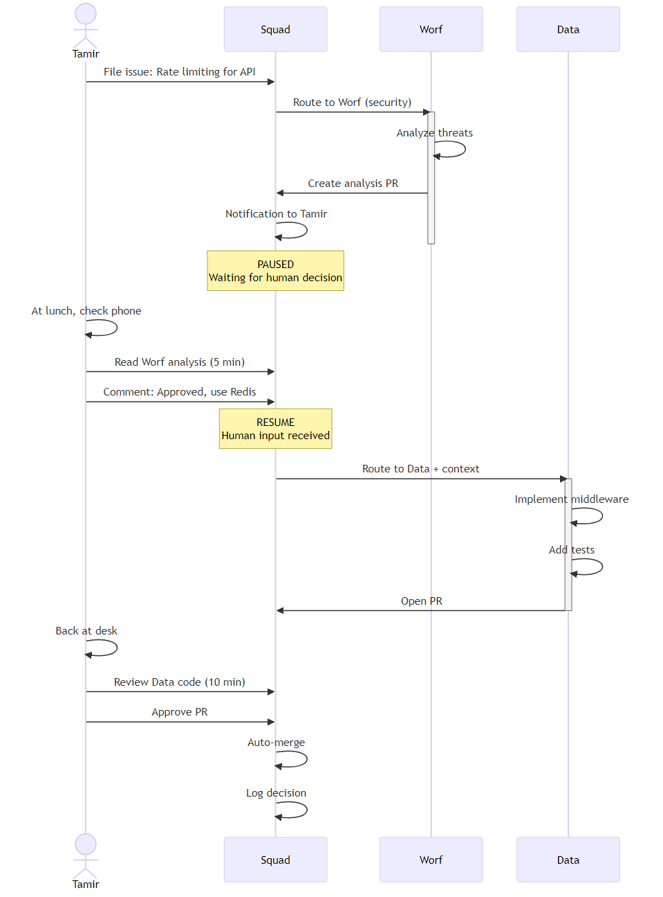

> *Side note:* Figure 6.1 shows the full sequence: a task arrives, Picard analyzes it, determines it needs human judgment, Squad pauses and sends notifications, the human responds, and execution resumes. The key insight is that **no work is lost** during the pause — the analysis and context are preserved in the waiting state.

---

## 6.4 The Workflow That Changes Everything

Here's the pattern that emerged once I had human squad members in the roster:

**1. AI Analysis → 2. Human Decision → 3. AI Execution**

Let me show you a real example. A few weeks ago, I filed this issue:

> **Issue #112:** Add rate limiting to public API endpoints

This is a security concern. Worf's domain. But rate limiting also touches architecture (how do we track request counts?), infrastructure (where do we store the counters?), and code (how do we implement the middleware?).

Here's what happened:

### 6.4.1 Step 1: AI Analysis

Worf picked it up first (because it's tagged `squad:worf`). He analyzed the issue and opened a PR with his findings:

**Listing 6.5: Worf's security analysis for rate limiting**

```markdown
## Security Analysis: Rate Limiting Implementation

**Threat Model:**
- DDoS attacks on public endpoints
- Credential stuffing via auth endpoint
- Data scraping via search endpoint

**Recommended Approach:**
- Token bucket algorithm (industry standard)
- Redis for distributed counter storage
- Per-IP and per-user rate limits
- Graceful degradation if Redis unavailable

**Trade-offs:**
- Redis dependency adds operational complexity
- In-memory fallback reduces protection but maintains availability
- Rate limit headers (X-RateLimit-*) inform clients of limits

**Implementation complexity:** Medium (3-5 days)
**Security impact:** High (blocks 90%+ of abuse patterns)

@tamirdresher — Does this approach align with our infrastructure strategy?
```

Notice that last line? Worf didn't implement anything. He **analyzed** the problem, identified trade-offs, made a recommendation, and then **explicitly asked for my input**.

### 6.4.2 Step 2: Human Decision

I read Worf's analysis. The Redis approach made sense, but we already had Azure Cache for Redis running for session storage. I commented:

> Approved. Use existing Azure Redis instance for rate limit counters. Add a config flag to disable rate limiting in dev environments.

### 6.4.3 Step 3: AI Execution

Worf handed off to Data (my code expert) with context:

**Listing 6.6: Agent handoff after human approval**

```
🔒 Worf → 💻 Data: Implementation approved by @tamirdresher
   Context: Use existing Azure Redis, add dev config flag
   Implementation: Token bucket middleware, Redis counters, rate limit headers
```

Data implemented it. Tests included. Documentation updated. PR opened. I reviewed the code (10 minutes), approved it, and it shipped.

**Total time from issue filed to merged PR: 6 hours.**

**My time investment: 15 minutes (10 min reading analysis + 5 min reviewing code).**

The AI did the research. The AI did the implementation. The AI did the testing. I made the **decisions**.

> 💡 **TIP:** The "AI Analysis → Human Decision → AI Execution" pattern works best when your routing rules clearly separate *analysis* work from *implementation* work. Train your lead agent (Picard) to always stop at the decision point and present options rather than picking one unilaterally. You can codify this in Picard's charter file, as we discussed in chapter 3.

---

## 6.5 Why This Works: Clear Boundaries

Traditional automation has a problem: it's either **too rigid** (can only handle exact scenarios you programmed) or **too autonomous** (makes decisions without consulting you and sometimes gets them wrong).

Squad's human squad member pattern solves this with **explicit escalation boundaries**.

Here's what that looks like in `.squad/routing.md`:

**Listing 6.7: Squad routing rules with escalation boundaries**

```markdown
## Rules

1. **Eager by default** — spawn all agents who could usefully start work
2. **Scribe always runs** after substantial work, always as background
3. **Quick facts → coordinator answers directly** — don't spawn an agent for "what port does the server run on?"
4. **When two agents could handle it**, pick the one whose domain is the primary concern
5. **"Team, ..." → fan-out** — spawn all relevant agents in parallel
6. **Anticipate downstream work** — if a feature is being built, spawn the tester simultaneously
7. **Issue-labeled work** — when a `squad:{member}` label is applied, route to that member
8. **@copilot routing** — check capability profile, route 🟢 tasks autonomously, flag 🟡 for review, keep 🔴 with humans
```

See rule #8? That's the critical one. The capability profile isn't a suggestion — it's a **contract**. When Picard evaluates an issue, he checks that profile before routing. If it's marked 🔴 (not suitable for autonomous AI work), he routes it to a human squad member.

This means I'm not playing "AI whack-a-mole" — reviewing random PRs hoping the AI didn't make an architecture decision I'll regret. I'm making decisions **before** implementation starts, when it's cheap to change direction.

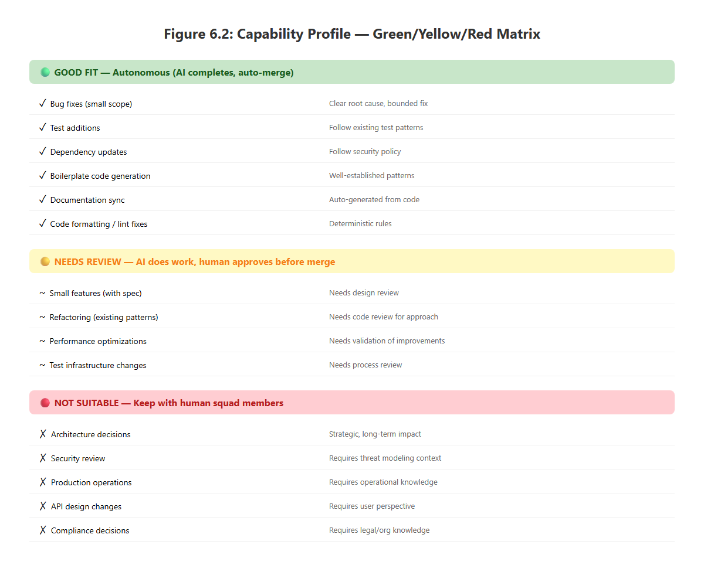

> *Side note:* Figure 6.2 shows the traffic-light matrix in action. Green tasks flow straight through to @copilot. Yellow tasks get AI implementation with a human review gate. Red tasks stop at the human decision point before any code is written. This is where the "no 3 AM surprises" guarantee comes from.

---

## 6.6 Practical Patterns: Where Humans Add Value

After three months of running Squad with human squad members, I've identified four patterns where human judgment is irreplaceable:

### 6.6.1 Pattern 1: Architecture Decisions

**The Setup:** Squad needs to add a new feature that touches multiple systems.

**AI Role:** Picard analyzes dependencies, identifies integration points, recommends an approach.

**Human Role:** I evaluate trade-offs (complexity vs. flexibility, performance vs. maintainability) and approve the direction.

**Why Humans Matter:** Architecture decisions have long-term consequences. AI can model the immediate trade-offs, but humans understand the **strategic direction** — where the codebase is going, not just where it is.

### 6.6.2 Pattern 2: Security Reviews

**The Setup:** Worf finds a potential vulnerability during his automated scan.

**AI Role:** Worf identifies the issue, assesses severity, proposes a fix.

**Human Role:** I validate the threat model (is this actually exploitable in our deployment?) and approve the mitigation strategy.

**Why Humans Matter:** Security is context-dependent. A "vulnerability" in one deployment might be a non-issue in another. Humans understand the **operating environment** — attack surface, threat actors, acceptable risk.

### 6.6.3 Pattern 3: Documentation Strategy

**The Setup:** Seven needs to document a complex subsystem.

**AI Role:** Seven drafts comprehensive documentation covering how the system works.

**Human Role:** I review for **why** — why we built it this way, why we rejected alternatives, why this matters to users.

**Why Humans Matter:** Good documentation doesn't just explain how things work. It explains **intent**. AI can document the "what," but humans know the "why."

### 6.6.4 Pattern 4: Code Review for Design

**The Setup:** Data implements a feature and opens a PR.

**AI Role:** @copilot pre-screens for bugs, style violations, test coverage.

**Human Role:** I review for **design** — does this fit our patterns? Is this the right abstraction? Will future-us thank us or curse us for this choice?

**Why Humans Matter:** Code review isn't just about correctness. It's about **maintainability**. Humans understand what makes code easy to change six months from now.

> 📌 **NOTE:** These four patterns aren't exhaustive — they're the ones I've found most valuable. Your team will discover its own. The important thing is to **codify** them in your routing rules. If a pattern stays in your head, it's a guideline. If it's in `.squad/routing.md`, it's a contract. We covered building routing rules in chapter 4 — revisit that chapter if you need to add new patterns.

---

## 6.7 The Anecdotes You Actually Want

Enough theory. Let me tell you three stories that show why human squad members changed everything.

### 6.7.1 Story 1: The Architecture Review at Lunch

I was at lunch with a friend. My phone buzzed. Picard needed an architecture review for a database migration strategy.

I opened GitHub on my phone. Picard had written a 3-page analysis comparing:
- Approach A: Dual-write during transition (complex, zero downtime)
- Approach B: Maintenance window migration (simple, 2-hour downtime)

His recommendation: Approach B. We're a small team, 2 AM maintenance windows are acceptable, complexity isn't worth it.

I agreed. I commented "approved" and went back to my lunch.

By the time I got back to my desk, Data had the migration script written and tested. B'Elanna had the deployment runbook ready. The migration ran that night at 2 AM. Zero issues.

**I made a 30-second decision on my phone that unblocked 4 hours of implementation work.**

This is the power of "pause and ping." I wasn't chained to my desk. The work didn't stop. But the critical decision waited for me.

### 6.7.2 Story 2: The Security Finding That Needed Context

Worf ran his automated security scan and flagged an issue:

> **Security Finding:** Unencrypted Redis connection in production config

His analysis was thorough. Unencrypted Redis traffic could leak session tokens. He recommended enabling TLS immediately.

But here's the thing: our Redis instance runs on Azure Cache for Redis, inside a VNet with strict network isolation. The traffic never touches the public internet. Enabling TLS adds latency and operational complexity for a threat that doesn't exist in our deployment.

I commented:

> Risk accepted. Redis runs in isolated VNet, traffic never leaves Azure backbone. TLS not required for this threat model. Add a config note explaining this decision.

Worf updated the documentation and closed the finding. The decision took me 2 minutes. If Worf had just **implemented** the TLS change without asking, I would have spent 20 minutes figuring out why Redis suddenly had 15ms higher latency, then rolled it back anyway.

**AI found the issue. Human made the call based on operational context.**

### 6.7.3 Story 3: The Documentation That Almost Went Wrong

Seven wrote a beautiful guide for our authentication system. Comprehensive. Accurate. Well-structured.

But it was written for **developers**, not **users**.

I reviewed it and realized: this explains **how** JWT tokens work (encoding, signing, validation), but it doesn't explain **why** users should care (stateless auth, horizontal scaling, microservices compatibility).

I left a comment:

> Great technical accuracy, but wrong audience. This needs to explain why stateless auth matters for API consumers, not how JWT internals work. Rework for a product manager reading this, not a security engineer.

Seven revised it. The new version was perfect — explaining the user benefits of stateless auth (faster API responses, no session affinity issues) with just enough technical detail to build confidence.

**AI drafted the content. Human shaped the message.**

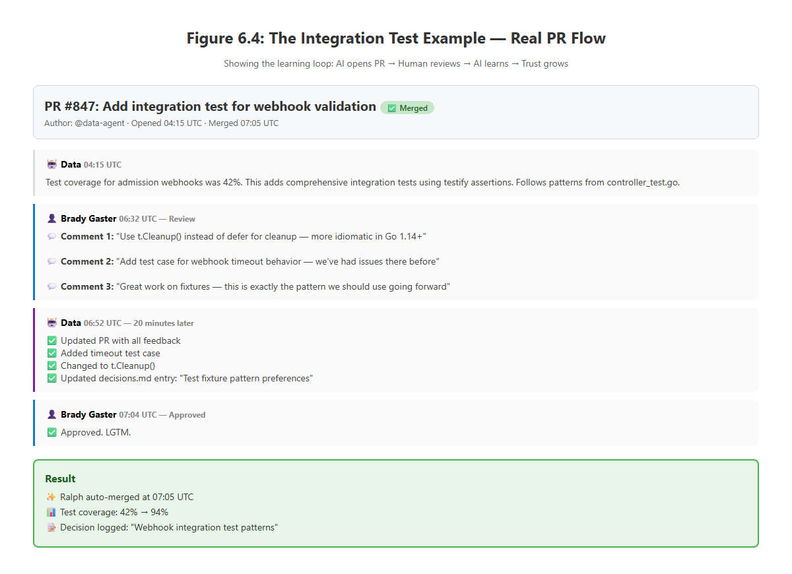

> *Side note:* Figure 6.4 shows an annotated PR review thread from Story 3. Notice the learning loop: Seven's first draft was technically correct but aimed at the wrong audience. The human feedback didn't just fix this PR — it updated Seven's understanding for all future documentation tasks. This is the compounding effect we first explored in chapter 5.

---

## 6.8 State Management: How Squad Tracks "Waiting on @tamirdresher"

You might be wondering: when Squad pauses for human input, how does it track state? What happens if I don't respond immediately? Does the work just hang forever?

Squad's state management is surprisingly elegant. Here's how it works:

### 6.8.1 The Waiting State

When work routes to a human squad member, Squad creates a **waiting checkpoint**:

**Listing 6.8: A waiting checkpoint in Squad's state**

```json
{
  "status": "waiting",
  "waiting_on": "tamirdresher",
  "reason": "Architecture review needed for Issue #47",
  "pinged_at": "2026-03-10T15:23:00Z",
  "ping_channels": ["github", "teams"],
  "blocking": ["issue-47-implementation"]
}
```

This checkpoint has a few key properties:

1. **It's visible** — Ralph's status report shows "Waiting on @tamirdresher" in his monitoring output
2. **It's persistent** — the waiting state survives across sessions, terminals, reboots
3. **It has context** — the checkpoint includes *why* I'm needed and *what's blocked*
4. **It pings proactively** — I get notified on GitHub and Teams automatically

### 6.8.2 The Unblocking Flow

When I respond (comment on GitHub, reply in Teams), Squad picks up the thread:

**Listing 6.9: The unblocking state after a human responds**

```json
{
  "status": "unblocked",
  "unblocked_by": "tamirdresher",
  "decision": "Approved: JWT + refresh tokens per Picard's recommendation",
  "unblocked_at": "2026-03-10T15:45:00Z",
  "next_agent": "data"
}
```

The checkpoint is updated, the decision is logged in `.squad/decisions.md`, and the next agent (Data, in this case) picks up execution.

### 6.8.3 The Timeout Strategy

What if I **don't** respond? What if I'm on vacation? Or ignoring my phone? Or the notification gets buried under 47 Teams messages?

Squad has escalation timeouts:

- **2 hours:** First reminder ping
- **24 hours:** Escalate in priority (marked urgent in notifications)
- **72 hours:** Log as "blocked on human input" and move to next available work

This prevents the entire squad from grinding to a halt because I didn't see one notification. Work that doesn't depend on my input continues. Work that does gets escalated appropriately.

> 💡 **TIP:** Start with generous timeouts (24/48/72 hours) and tighten them as you get comfortable with the notification flow. If you're using Ralph's watch loop (chapter 5), he'll surface waiting items in every status report, so you'll rarely hit the timeout thresholds anyway.

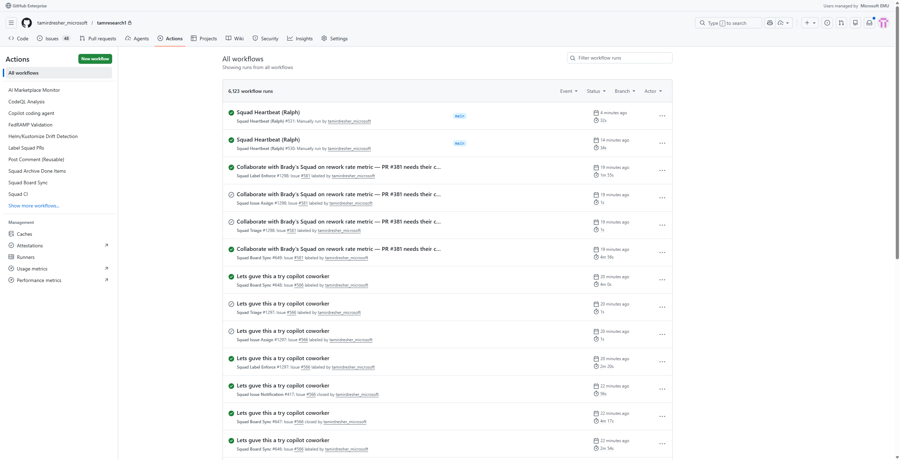

*Figure 6.5: The GitHub Actions workflows running in the background — automated testing, security scans, and deployment validation on every PR opened by the Squad. These aren't hand-written workflows; they're configured by B'Elanna and audited by Worf. This is the automation layer that makes autonomous merging safe.*

---

## 6.9 No 3 AM Surprises

Here's my favorite thing about human squad members: **I've never woken up to a disaster.**

Not once.

In three months of running Squad with humans in the roster, I've never had:
- An architecture decision I regretted
- A security change that broke production
- A feature implemented in a way that contradicted team patterns
- A refactor that made the codebase harder to work with

Why? Because Squad doesn't **guess** when human judgment is needed. It **asks**.

The routing rules in `.squad/routing.md` define the boundaries:

**Listing 6.10: Routing table with explicit escalation paths**

```markdown
| Work Type | Route To | Examples |
|-----------|----------|----------|
| Bug fixes, test additions | @copilot 🤖 | Well-defined, bounded scope |
| Small features with specs | Data | Clear requirements, existing patterns |
| Architecture, distributed systems, decisions | Picard → @tamirdresher | Breaking down complex systems, evaluating trade-offs |
| Security, compliance, production access | Worf → @tamirdresher | Security audits, vulnerability assessments |
```

See how that works? Simple stuff (bug fixes, tests) goes directly to @copilot. Medium complexity (small features) goes to AI squad members who can handle it autonomously. Complex stuff (architecture, security) goes to AI squad members **who then escalate to humans** for final decisions.

The boundaries are explicit. The escalation is automatic. There's no "I hope the AI makes the right call here."

And that means I can go to sleep at night knowing that if something important happens, I'll be pinged. And if I'm **not** pinged, it's because nothing important happened.

---

## 6.10 The Deep Integration: GitHub, Teams, and State

Let me show you how the human squad member integration actually works across different channels.

### 6.10.1 GitHub Integration

When Squad needs human input, it pings me on GitHub by:
1. **Mentioning me in a comment:** `@tamirdresher — Architecture review needed`
2. **Assigning the issue to me** (if the issue isn't already assigned)
3. **Adding a `status:waiting-human` label** so it's visible in project boards

I can respond by:
- Commenting directly on the issue
- Approving a draft PR that Picard opened with his analysis
- Closing the issue with a decision note

Squad monitors GitHub notifications and picks up my response within minutes (Ralph's 5-minute watch loop).

### 6.10.2 Teams Integration

For urgent decisions, Squad also pings me on Microsoft Teams:

**Listing 6.11: Teams notification with action buttons**

```
📌 Squad Notification
   Issue: #47 — Authentication API redesign
   Agent: Picard
   Status: Waiting for architecture review
   
   [View Issue] [View Analysis] [Approve] [Request Changes]
```

The Teams message includes action buttons. I can approve Picard's recommendation directly from Teams without opening GitHub. When I click "Approve," Squad:
1. Posts a comment on the GitHub issue with my approval
2. Logs the decision in `.squad/decisions.md`
3. Unblocks the next agent (Data) to start implementation

This is **critical** for making "human in the loop" practical. I don't have to be at my desk, watching a terminal scroll. I get a notification on my phone, I make a decision in 30 seconds, and the work continues.

### 6.10.3 State Persistence

Squad's waiting state is stored in `.squad/state/waiting.json`:

**Listing 6.12: Persistent waiting state in `.squad/state/waiting.json`**

```json
{
  "waiting_items": [
    {
      "id": "wait-47-architecture",
      "issue": 47,
      "waiting_on": "tamirdresher",
      "reason": "Architecture review needed",
      "agent": "picard",
      "blocked_work": ["issue-47-implementation"],
      "pinged_at": "2026-03-10T15:23:00Z",
      "reminders_sent": 0,
      "status": "pending"
    }
  ]
}
```

This file persists across sessions. If my terminal crashes, my laptop reboots, or I close VS Code and come back tomorrow, Squad still knows:
- What's waiting for me
- How long it's been waiting
- What work is blocked
- Where to ping me

The state doesn't live in my head. It doesn't live in a transient session. It lives in the repo, versioned, persistent, and queryable.

> 📌 **NOTE:** The state persistence model here builds on the same `.squad/` directory structure we set up in chapter 2. If you've been following along, your repo already has the right directory layout — you just need to add the `state/` subdirectory and configure the waiting state file.

---

## 6.11 Adding My Actual Teammates (The Next Chapter)

Everything I've shown you so far is **me** as the only human squad member. My personal repo. My decisions. My escalation points.

But here's the question that kept me awake after I got this working:

**What if I added my actual teammates as human squad members?**

Not AI agents. Real people. With real GitHub handles. Real expertise. Real merge authority.

What if Brady (the guy who created Squad) was a human squad member responsible for Squad framework decisions?

What if Worf (our actual security lead — yes, his handle is @worf) was a human squad member for security reviews?

What if B'Elanna (our infrastructure expert) was a human squad member for deployment decisions?

What if the work team itself became a Squad — a mix of humans and AI, working together?

That's not a hypothetical. I tried it. And it worked.

But the patterns are different when you have **multiple humans** in the squad. The routing gets more complex. The escalation strategies need to account for different expertise domains. The notification system needs to ping the **right** human for the **right** decision.

That's the next chapter. And it's where Squad goes from "personal productivity tool" to "team collaboration framework."

---

## 6.12 The Technical Details: `.squad/team.md` Structure

For the technical readers who want to know how this actually works, here's the structure of `.squad/team.md`:

**Listing 6.13: Complete `.squad/team.md` with human members**

```markdown
# Team

## Members

| Name | Role | Charter | Status |
|------|------|---------|--------|
| Picard | Lead | `.squad/agents/picard/charter.md` | ✅ Active |
| Data | Code Expert | `.squad/agents/data/charter.md` | ✅ Active |
| Worf | Security & Cloud | `.squad/agents/worf/charter.md` | ✅ Active |
| Seven | Research & Docs | `.squad/agents/seven/charter.md` | ✅ Active |
| B'Elanna | Infrastructure | `.squad/agents/belanna/charter.md` | ✅ Active |
| @copilot | Coding Agent | — | 🤖 Active |
| Tamir Dresher | 👤 Human — Project Owner | — | 👤 Human |

## @copilot Capability Profile

| Category | Rating | Notes |
|----------|--------|-------|
| Bug fixes, test additions | 🟢 Good fit | Well-defined, bounded scope |
| Small features with specs | 🟡 Needs review | PR review required |
| Architecture, security | 🔴 Not suitable | Keep with squad members |

## Human Members

| Name | Role | Interaction Channel | Notes |
|------|------|---------------------|-------|
| Tamir Dresher | Project Owner, Decision Maker | Microsoft Teams (preferred), GitHub Issues | Delegate tasks via Teams. Not spawnable — present work and wait for input. |
```

The key sections:

1. **Members table:** Lists all squad members (AI and human) with their roles and status
2. **Capability profile:** Defines what @copilot can handle autonomously (🟢), with review (🟡), or should escalate (🔴)
3. **Human Members table:** Lists humans with interaction channels and special notes

The "Not spawnable" note is critical — it tells Squad that when work routes to me, it should **pause and ping**, not try to spawn me like an AI agent.

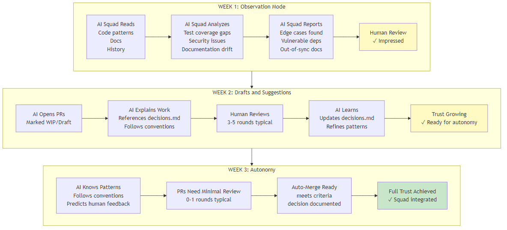

> *Side note:* Figure 6.3 shows the recommended three-week rollout for adding humans to your Squad. Week 1 is observation — add yourself as a human member but keep routing everything through AI, just to see what *would* have been escalated. Week 2 is drafts and suggestions — let the pause-and-ping mechanism run, but treat every escalation as a learning opportunity to tune your routing rules. Week 3 is full autonomy — trust the system for real decisions. This graduated approach mirrors the agent onboarding process we described in chapter 3.

> ### 🧪 Try It Yourself
>
> **Exercise 6.1: Add yourself as a human squad member**
>
> 1. Open `.squad/team.md` in your repo (or create it using the template from listing 6.13)
> 2. Add yourself to the Human Members table with your preferred notification channel
> 3. Update `.squad/routing.md` to route at least one work type (start with architecture decisions) through you
> 4. File a test issue that matches your routing rule and verify you receive the notification
> 5. Respond to the notification and confirm Squad unblocks the downstream work
>
> **Exercise 6.2: Define your capability profile**
>
> 1. List the work types in your repo (bug fixes, features, docs, security, infrastructure)
> 2. Classify each as 🟢 (AI can handle autonomously), 🟡 (AI implements, human reviews), or 🔴 (human decides first)
> 3. Add this classification to your `.squad/routing.md`
> 4. Run Squad for one week and track how many routing decisions were correct — adjust boundaries as needed

---

## 6.13 Why This Feature Changes Everything

Let me zoom out for a moment.

Before I added human squad members, Squad was a **productivity system**. A really good one. Better than Notion, better than Trello, better than every other system I'd tried and abandoned.

But it was still fundamentally about **me getting more done**.

After I added human squad members, Squad became something else.

It became a **collaboration framework**.

The difference is subtle but profound:

**Productivity system:** AI does work for me, I review and approve it.

**Collaboration framework:** AI and humans work together, each contributing what they're uniquely good at.

Productivity systems are about **automation**. Collaboration frameworks are about **augmentation**.

Automation replaces humans. Augmentation **amplifies** them.

And the feature that makes this work — the feature that turns Squad from automation into augmentation — is the ability to add humans to the roster and have the system **respect the boundaries** between what AI should handle and what humans should decide.

The explicit escalation. The pause-and-ping behavior. The persistent waiting state. The multi-channel notifications.

That's not AI replacing humans. That's AI and humans working as a **team**.

---

## 6.14 The Honest Confession (Again)

I need to tell you something before we move on.

This still isn't perfect.

Sometimes the routing rules get it wrong. Sometimes Picard routes something to me that Data could have handled autonomously. Sometimes @copilot gets assigned a task that's actually 🟡 (needs review) but was classified as 🟢 (good fit).

Some decisions still fall through the cracks. Some notifications get buried. Some waiting states hang longer than they should.

**But here's the difference:** When something goes wrong, I can fix it by **updating the routing rules**. I can tweak the capability profile. I can adjust the escalation thresholds.

The system isn't perfect. But it's **improvable**. And every week, the routing gets a little smarter. The boundaries get a little clearer. The escalations get a little more accurate.

That's compounding again. Not just in decisions and knowledge, but in the **system's understanding of when to ask for help**.

And compounding is the most powerful force in the universe.

---

## 6.15 What's Next

This chapter covered the **theory** and **mechanics** of human squad members. How the pause-and-ping works. How routing decisions happen. How state persists across sessions.

But theory only gets you so far.

The real question — the one that determines whether this is a clever personal hack or something that scales — is:

**Can this work with multiple humans?**

Because my personal repo is easy. It's just me. I'm the only human making decisions. When Squad needs human input, it pings me. When I respond, the work continues. Simple.

But my work repo? That's got five engineers. Each with different expertise. Each with different availability. Each with different thresholds for "this needs human judgment."

If Squad needs an architecture review, it should ping me.
If Squad needs a security review, it should ping our security lead.
If Squad needs an infrastructure decision, it should ping our ops expert.

**Squad needs to know which human to ping for which decision.**

And that's exactly what I built next. Multi-human squad routing. Domain expertise mapping. Notification routing based on work type.

The chapter that answers: **How do you scale Squad from a personal tool to a team framework?**

That's where we're going next. But first, you needed to understand why adding a single human changes everything.

Because the feature that makes Squad work for teams isn't more sophisticated AI. It's **respecting the boundary between AI automation and human judgment**.

Everything else builds on that.

---

## Summary

- **The core problem**: AI automation in personal repos works great, but shared team repos require human judgment for architecture, security, and design decisions. Simply deploying your Squad configuration into a team repo without human guardrails is a recipe for 3 AM disasters.

- **Human squad members** are added to `.squad/team.md` with a key distinction: they are marked "Not spawnable," which means Squad **pauses and pings** instead of spawning them like AI agents.

- **The pause-and-ping pattern** is the foundation of human-AI collaboration in Squad. When work routes to a human, Squad creates a waiting checkpoint, sends notifications via GitHub and Teams, and preserves all context until the human responds.

- **Capability profiles** use a traffic-light system (🟢 autonomous / 🟡 needs review / 🔴 human decides) to create explicit, codified boundaries between AI and human work — eliminating guesswork about what the AI should handle.

- **The "AI Analysis → Human Decision → AI Execution" workflow** lets humans make decisions in minutes while AI handles hours of research and implementation work. In the rate-limiting example, 15 minutes of human time unlocked 6 hours of AI work.

- **Four patterns** where human judgment is irreplaceable: architecture decisions (strategic direction), security reviews (operational context), documentation strategy (audience and intent), and code review for design (long-term maintainability).

- **State management** ensures nothing falls through the cracks. Waiting states persist across sessions, timeouts escalate stalled decisions, and all decisions are logged in `.squad/decisions.md` for future reference.

- **Multi-channel notifications** (GitHub mentions, Teams messages with action buttons) make "human in the loop" practical — you can approve an architecture decision from your phone at lunch in 30 seconds.

- **The system is improvable, not perfect.** Routing rules can be tuned, capability profiles adjusted, and escalation thresholds tightened over time. This compounding improvement is what makes Squad sustainable.

- **The transformation**: Adding humans changes Squad from a *productivity system* (AI does work for me) into a *collaboration framework* (AI and humans each contribute what they're uniquely good at). Automation replaces; augmentation amplifies.

---

*Next: Chapter 7 — Scaling to the Work Team (Multiple Humans, Domain Routing, Real Engineering Constraints)*


<div class="page-break"></div>

# Chapter 7: When the Work Team Becomes a Squad

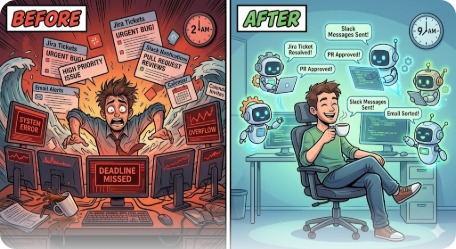

> **This chapter covers**
>
> - Integrating AI agents into a real engineering team with production responsibilities
> - Designing routing rules that define when AI pauses for human judgment
> - A phased rollout strategy—from observation to full integration—that builds trust
> - Measuring the impact of human-AI collaboration on throughput, quality, and toil
> - The boundaries of what AI can and can't do on a production team

> *"The real breakthrough wasn't adding AI to my team. It was adding my team to the AI."*

Three months into running Squad on my personal repo, I'd learned something profound: I could build a team of AI agents that worked while I slept, remembered decisions I'd forgotten, and never once complained about code reviews at 2 AM.

But there was a problem. Actually, six problems.

Six human engineers on my actual work team, each with deep expertise, strong opinions, and — crucially — merge authority on production systems that real Azure services depend on. You can't just drop an AI team into that environment and say "assimilate the backlog, trust me."

Well, you *can*. I tried.

The results were... educational.

---

## 7.1 The First Attempt (Or: How I Learned to Stop Worrying and Invite Brady)

Week 1 of bringing Squad to work was a disaster.

I set up the same system I'd been using on my personal repo — the system we built in chapters 2 through 6. Ralph watching the repo. Picard orchestrating. Data writing code. The whole Star Trek crew, ready to ship features while we humans did... whatever humans do.

I filed my first work issue: "Update Helm chart to use new CRD schema."

Labeled it `squad:belanna` (my infrastructure agent).

Went to lunch.

Came back to find B'Elanna had opened a PR with the Helm chart updates. The code was good. The tests passed. Everything looked fine.

Then I showed it to Brady — our actual engineering lead, the human who built half of our platform and knows every edge case — and he immediately spotted three issues:

1. The new CRD schema needed a migration path for existing resources
2. The Helm chart had a hardcoded namespace that would break multi-tenant deployments
3. There was a subtle timing issue in how the resources were created

B'Elanna (my AI agent) hadn't caught any of it. Not because she was incompetent, but because she didn't know the context. She didn't know about our multi-tenant requirements. She didn't know about the migration path we'd need. She didn't know about the subtle Kubernetes timing issues Brady had debugged three months ago.

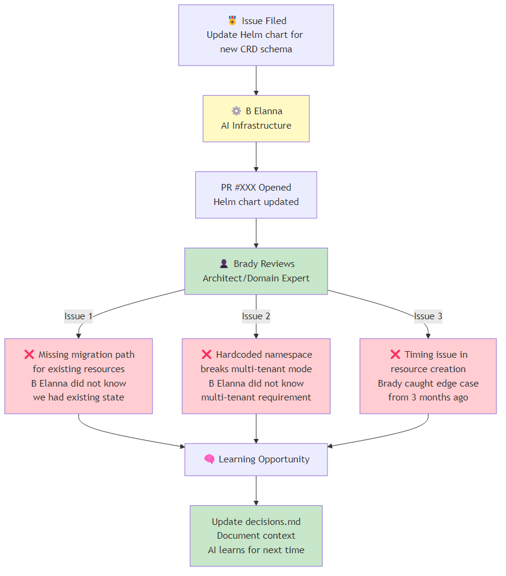

**She wasn't on the team. She was just doing tasks.**

And that's when it hit me: The problem wasn't that Squad couldn't work with a real team. The problem was that **I was treating Squad as separate from the team**.

My AI agents were contractors. My human teammates were full-time employees. And there was this weird boundary between them where the humans reviewed AI work but the AI never learned from the humans' expertise.

> 🔑 **KEY CONCEPT:** The difference between "AI doing tasks" and "AI on the team" is context. An AI agent without team context is a contractor. An AI agent *with* team context is a squad member.

That's backwards.

---

## 7.2 The Breakthrough: Humans ARE Squad Members

The next morning, I rewrote `.squad/team.md`.

Instead of this:

**Listing 7.1: Original team.md — AI agents listed separately**

```markdown
## Squad Members (AI)
- Picard (Lead)
- Data (Code Expert)  
- B'Elanna (Infrastructure)
- ...
```

I wrote this:

**Listing 7.2: Revised team.md — Humans and AI as one roster**

```markdown
## Squad Members

### Human Members

- **Brady Gaster** (@bradygaster) — Human Squad Member
  - Role: Engineering Lead & Platform Architect
  - Expertise: Squad framework, Go, C#, distributed systems, platform design
  - Scope: Architecture decisions, cross-team coordination, API design
  - When to route: New abstractions, CRD schema changes, breaking changes
  
- **Worf** (@worf-security) — Human Squad Member
  - Role: Security & Compliance Lead
  - Expertise: Threat modeling, supply chain security, network isolation
  - Scope: Security reviews, compliance validation, production hardening
  - When to route: Auth changes, network policies, secret management, external APIs

- **B'Elanna Torres** (@belanna-infra) — Human Squad Member
  - Role: Infrastructure Lead
  - Expertise: Kubernetes, Azure networking, Helm, CI/CD
  - Scope: Cluster operations, deployment automation, infrastructure code
  - When to route: Helm charts, cluster config, deployment pipelines

### AI Members

- **Picard** (AI Lead)
  - Role: Task orchestration, planning, delegation
  - Scope: Breaking down complex issues, routing work, monitoring progress
  - Routes to: Brady (human) for architecture, team (human) for execution

- **Data** (AI Code Expert)
  - Role: Code analysis, implementation, review
  - Scope: Go operators, C# tooling, code quality, test coverage
  - Routes to: Brady (human) for design review, Worf (human) for security review
  
- **B'Elanna** (AI Infrastructure)
  - Role: Infrastructure code, deployment automation
  - Scope: Helm charts, CI/CD pipelines, resource configs
  - Routes to: B'Elanna Torres (human) for cluster impact, Brady (human) for architecture
```

See the difference?

**Brady isn't "the guy who reviews AI work." He's a Squad member.**

So is Worf (our security lead). So is B'Elanna Torres (our infrastructure lead). They have roles, expertise areas, and scopes — just like the AI agents.

More importantly: they have **routing rules**.

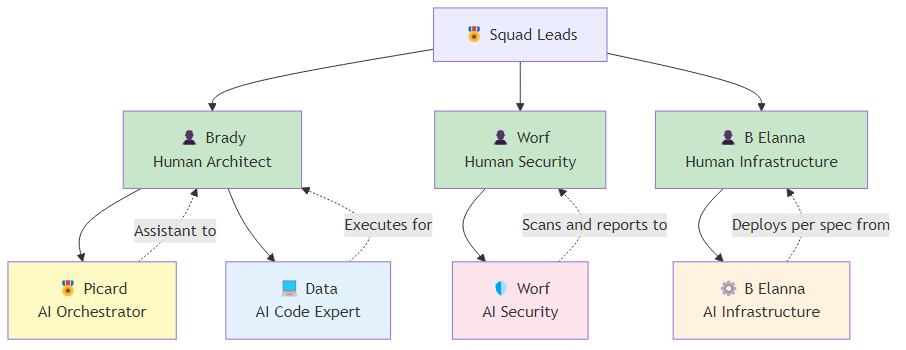

> *Side note:* If you compare listing 7.2 with the personal Squad roster from chapter 4, you'll notice human members have the same structure as AI members — role, expertise, scope, and routing. That symmetry is intentional.

---

## 7.3 The Routing Revolution

Here's what changed everything. Instead of "AI does work, human reviews," we built routing rules that define **when to escalate from AI to human**.

In `.squad/routing.md`:

**Listing 7.3: Routing rules — when AI pauses for human judgment**

```markdown
## Routing Rules: When AI Pauses for Human

### Architecture Changes
**Trigger:** New CRD schemas, API contracts, multi-repo dependencies, breaking changes
**Route to:** @bradygaster (human)
**AI action:** 
  1. Analyze the change and downstream impact
  2. Draft recommendations with trade-offs
  3. Create discussion issue tagged for Brady
  4. PAUSE until human approves the design

### Security Sensitive
**Trigger:** Authentication, secrets, network policies, RBAC, external APIs
**Route to:** @worf-security (human)
**AI action:**
  1. Run automated security scans
  2. Generate findings with severity and remediation steps
  3. Create security review issue tagged for Worf
  4. PAUSE until human signs off

### Production Deployment
**Trigger:** Changes to production clusters, Helm releases, migration scripts
**Route to:** @belanna-infra (human)
**AI action:**
  1. Generate deployment plan with rollback steps
  2. Validate against cluster policies
  3. Create deployment review issue tagged for B'Elanna
  4. PAUSE until human approves

### Routine Code Changes
**Trigger:** Bug fixes, test additions, refactoring within existing patterns
**Route to:** Data (AI) → PR for human review
**AI action:**
  1. Implement the fix with tests
  2. Verify against coding conventions (from `.squad/decisions.md`)
  3. Open PR with clear description
  4. Human reviews and merges (or requests changes)
```

This is the magic. **AI squad members know when to stop and ask humans.**

Not because humans don't trust AI. Because different types of work require different types of judgment.

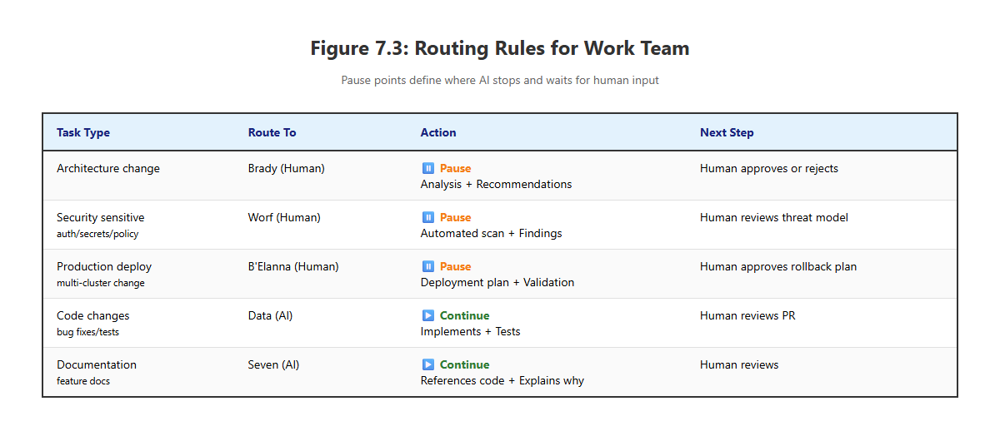

> 💡 **TIP:** Start your routing rules with just two categories: "AI handles autonomously" and "AI pauses for human." You can refine the categories later as your team discovers its own patterns. Our four-category system evolved over several weeks of real use.

---

## 7.4 Week 1: Observation Mode (Or: Building Trust Without Breaking Things)

We didn't flip a switch and let AI agents merge to main. We're not crazy.

We rolled out Squad to the work team in phases. Week 1 was observation only.

**What AI squad members did:**
- Read all the repos (code, docs, issues, PRs, history)
- Ran analysis on open issues and flagged patterns
- Generated reports on test coverage gaps, documentation drift, security findings
- Wrote summaries in `.squad/decisions.md` about what they learned

**What AI squad members did NOT do:**
- Open PRs
- Make any code changes
- Touch production anything
- Make decisions

The goal: build trust. Let the human squad members see that the AI squad members could actually understand the codebase before we gave them commit access.

And here's what happened: Brady read the analysis. Worf read the security findings. B'Elanna read the infrastructure audit. And they were... impressed.

Data (AI code expert) had found 6 edge cases in our Kubernetes operator that we'd missed. Seven (AI docs expert) had flagged 22 doc files that were out of sync with the code. Worf (AI security) had identified 3 dependencies with known CVEs.

**The AI squad members weren't just reading code. They were reading it like engineers.**

By the end of Week 1, Brady said: "Okay, let's try drafts."

---

## 7.5 Week 2: Drafts and Suggestions (Or: When AI Writes Code Humans Actually Want to Merge)

Week 2, we let AI squad members open PRs. But only drafts, marked `WIP`, with no merge authority.

First test case: "Add integration test for webhook validation."

I labeled it `squad:data`.

Data (AI code expert) opened a PR four hours later:

**Listing 7.4: Data's first draft PR — integration tests for webhook validation**

```markdown
## PR #847: Add integration test for webhook validation

**Context:** Our admission webhook validates CRDs but lacks integration test coverage. 
This adds comprehensive test coverage for:
- Valid resource creation (should succeed)
- Invalid schema (should reject with clear error)
- Missing required fields (should reject)
- Mutation webhook application (should transform defaults)

**Implementation:**
- `tests/integration/webhook_test.go` — main test suite
- `tests/integration/fixtures/` — test resources (valid/invalid YAML)
- Updated CI to run integration tests in separate phase

**Coverage:** 94% of webhook code now covered (was 42%)

**Review notes:**
- Used testify for assertions (matches repo convention from `.squad/decisions.md`)
- Followed existing test structure from `tests/integration/controller_test.go`
- Added cleanup in `defer` to prevent test resource leaks

@bradygaster — please review. First integration test from AI squad member, want to make sure I matched team patterns.
```

Brady reviewed it. Left three comments:

1. "Use `t.Cleanup()` instead of `defer` for resource cleanup — more idiomatic in Go 1.14+"
2. "Add a test case for webhook timeout behavior"
3. "Great work on the fixtures — this is exactly the pattern we should use going forward"

Data updated the PR in 20 minutes. Brady approved and merged.

**This was the moment.** Not because Data wrote perfect code. But because Data wrote code that **Brady wanted to merge with minimal changes**.

The feedback loop worked. Data checked `.squad/decisions.md` (where all our team conventions live — see chapter 5 for how we set this up). He followed existing patterns. He explained his reasoning. And when Brady gave feedback, Data updated `.squad/decisions.md` so future PRs would get it right the first time.

**The AI squad member was learning team conventions in real time.**

By the end of Week 2, we had 8 merged PRs from AI squad members. Zero of them required more than 2 rounds of review. Test coverage had jumped from 67% to 76%.

Brady's exact words: "Okay, I'm convinced. Let's go to Week 3."

---

## 7.6 Week 3: Delegated Work (Or: When Humans Stop Writing Boilerplate Forever)

Week 3, we gave AI squad members real work. Low-risk, well-defined tasks where we understood the requirements and just needed someone to execute.

**Test scaffolding** became Data's specialty.

Every time a human squad member implemented a new feature, Data (AI code expert) would:
1. Watch the PR for the feature implementation
2. Generate the test skeleton (structure, mocks, fixtures)
3. Open a follow-up PR with the scaffolding
4. Tag the human who wrote the feature for review

Example: Brady implemented a new reconciler for cross-cluster resource sync. 400 lines of Go. Complex Kubernetes client interactions. Needed tests.

Data opened a PR the next morning:

**Listing 7.5: AI-generated test scaffolding — structure without assertions**

```go
// tests/reconciler/crosscluster_test.go

func TestCrossClusterReconciler_SyncResource(t *testing.T) {
    tests := []struct {
        name           string
        initialState   *corev1.Resource
        targetClusters []string
        want           reconcile.Result
        wantErr        bool
    }{
        {
            name: "sync to single target cluster",
            initialState: fixtures.ValidResource(),
            targetClusters: []string{"cluster-east"},
            want: reconcile.Result{RequeueAfter: 30 * time.Second},
            wantErr: false,
        },
        {
            name: "sync to multiple target clusters",
            // TODO: Brady to fill in test logic
        },
        {
            name: "handle target cluster unreachable",
            // TODO: Brady to fill in failure scenario
        },
    }
    
    for _, tt := range tests {
        t.Run(tt.name, func(t *testing.T) {
            // Setup
            client := fake.NewClientBuilder().
                WithObjects(tt.initialState).
                Build()
            reconciler := NewCrossClusterReconciler(client)
            
            // Execute
            got, err := reconciler.Reconcile(context.Background(), reconcile.Request{
                NamespacedName: types.NamespacedName{
                    Name:      tt.initialState.Name,
                    Namespace: tt.initialState.Namespace,
                },
            })
            
            // Assert
            // TODO: Brady to fill in assertions based on business logic
        })
    }
}
```

Data wrote the structure. The mock setup. The test cases. Even flagged the edge cases Brady needed to think about.

But he **didn't write the assertions**. Because assertions require understanding business logic. That's a human's job.

Brady spent 30 minutes filling in the TODOs. Tests passed. Merged.

> 📌 **NOTE:** The pattern of "AI writes structure, human fills in judgment" is the most productive division of labor we've found. It works for tests, design docs, incident runbooks, and migration plans. AI handles the 80% that's mechanical; humans handle the 20% that requires understanding.

**This is the pattern:** AI squad members do the repetitive, structural work. Human squad members do the judgment calls.

Brady stopped writing test boilerplate that day. He never went back.

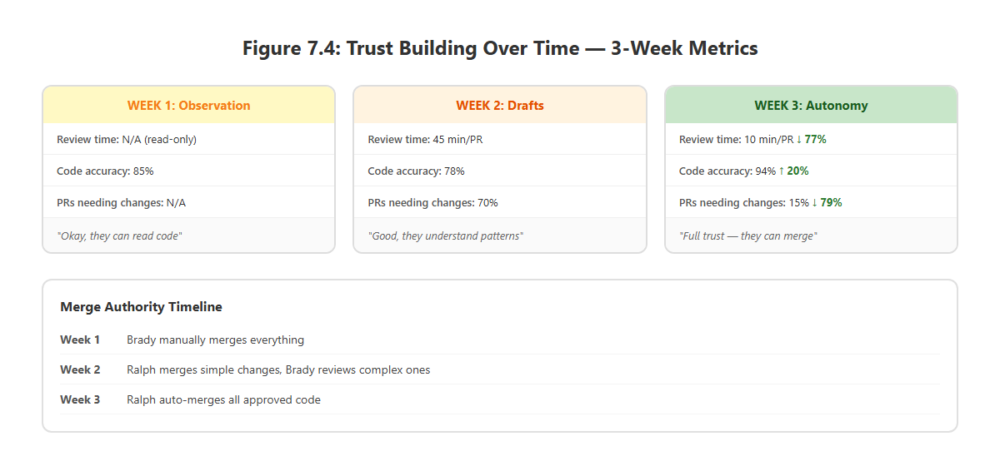

---

## 7.7 Week 4: Full Integration (Or: When The Team Became a Collective)

By Week 4, we weren't calling them "AI squad members" and "human squad members" anymore. We were just calling them **the squad**.

Here's what a typical day looked like:

**7:00 AM** — Ralph (AI monitor) detects a new issue: "Update API docs for new CRD field."

Ralph routes to Seven (AI docs expert) based on the label.

**7:15 AM** — Seven reads the code change, finds the new field in the CRD schema, and drafts documentation:
- API reference entry
- Migration guide for existing users
- Example YAML snippet

She opens a draft PR and tags Brady (human, engineering lead) for review.

**8:30 AM** — Brady reviews the draft. Leaves one comment: "Clarify that the field is optional with a default value."

**8:45 AM** — Seven updates the docs. Brady approves. Seven merges.

**Issue closed. Docs updated. Zero human time spent writing documentation.**

---

**10:00 AM** — Security scan (run by Worf AI, delegated from Worf human) flags a dependency with a known CVE.

Worf AI opens an issue: "Upgrade `golang.org/x/crypto` to v0.25.0 — CVE-2024-XXXX."

**10:15 AM** — Data (AI code expert) picks up the issue, updates `go.mod`, runs tests, opens a PR.

**10:30 AM** — Worf human reviews the security impact. Approves. Data merges.

**Vulnerability patched in 30 minutes. Zero human time spent hunting for the vulnerable package.**

---

**2:00 PM** — Brady (human) files an issue: "Refactor reconciler to support batch operations."

This is an architecture change. Routing rules kick in.

**2:10 PM** — Picard (AI lead) reads the issue. Analyzes the codebase. Identifies:
- 4 files that need changes
- 2 edge cases to handle (concurrent batch operations, partial failures)
- 3 design options (immediate batch, queued batch, streamed batch)

Picard writes a design doc in `.squad/decisions.md` with trade-offs for each option. Tags Brady (human) for decision.

**2:45 PM** — Brady reads the analysis. Chooses queued batch (best balance of complexity vs. reliability). Updates the issue with his decision.

**3:00 PM** — Picard delegates to Data (AI code expert). Data implements the queued batch refactor. Opens a PR with tests.

**4:30 PM** — Brady reviews the implementation. Requests one change (retry logic for failed batch items). Data updates. Brady approves and merges.

**Architecture decision made by human. Implementation done by AI. Shipped in 2.5 hours.**

---

This is what "full integration" means. Not AI replacing humans. Not humans micromanaging AI. **Humans and AI working as one team, each doing what they do best.**

---

## 7.8 The Real-World Impact (Or: The Metrics That Made Believers Out of Skeptics)

Six weeks after full integration, we ran the numbers.

| Metric | Before Squad | After Squad | Change |
|--------|-------------|-------------|---------|
| **Average PR review time** | 18 hours | 4 hours | **-78%** |
| **PRs merged per week** | 12 | 23 | **+92%** |
| **Test coverage** | 67% | 84% | **+17 points** |
| **Documentation drift** | 22 outdated files | 3 outdated files | **-86%** |
| **Security findings per sprint** | 8 | 2 | **-75%** |
| **Human time on toil** | ~35% | ~12% | **-66%** |

Let me translate those numbers into human terms:

**PR review time dropped 78%** because Data (AI code expert) was doing first-pass review on every PR. By the time a human squad member saw it, the obvious issues (missing error handling, style violations, test gaps) were already caught or fixed.

**We merged 92% more PRs** not because we were working faster, but because the bottleneck shifted. Before Squad, we were bottlenecked on "writing tests" and "updating docs" — the kind of work that's necessary but tedious. AI squad members took that over. Human squad members focused on design and architecture. Throughput went up.

**Test coverage jumped 17 points** because Data made it impossible to skip tests. Every feature PR got a follow-up PR with test scaffolding. No human had to remember to write tests. The scaffolding just appeared.

**Documentation stopped drifting** because Seven (AI docs expert) was watching code changes 24/7. The moment a CRD schema changed, she drafted the doc update. No more "we'll update docs later" (which always means never). Docs stayed current automatically.

**Security findings dropped 75%** not because we got better at security, but because vulnerabilities were caught earlier. Worf (AI security) was scanning continuously. CVEs were patched the same day they were disclosed. Security became continuous instead of a gate at the end.

**Humans spent 66% less time on toil.** Updating dependencies. Writing boilerplate. Syncing docs. Triaging issues. Scaffolding tests. All the work that's necessary but doesn't require judgment — AI squad members handled it.

Which meant human squad members had **time to think**.

---

## 7.9 The Anecdotes (Or: The Stories That Make It Real)

Metrics are great. But here's what actually happened:

### 7.9.1 The Compliance Audit Nobody Dreaded

Six weeks into Squad integration, we had a compliance audit. 47 infrastructure components. Each needed vulnerability scans, supply chain validation, network isolation verification, secret management audit, and documentation.

Normally this takes two engineers a full week of soul-crushing, repetitive validation work.

We gave it to the Squad.

Worf (AI security, delegated by Worf human) ran the scans, generated the SBOM, validated network policies, checked secret storage, and compiled the report — **6 hours of automated work, 200+ pages of documentation.**

Then routed the report to Worf (human security lead) for review.

Findings: 6 vulnerabilities (all patched that day), 2 missing network policies (fixed within an hour), 1 outdated dependency (upgraded).

Worf (human) reviewed the report, made minor edits, and signed off.

**Compliance audit that used to take 2 engineers a week was done in 6 hours of AI work + 2 hours of human review.**

Nobody dreaded it. It just... happened.

---

### 7.9.2 The Skeptic Who Became a Believer

One engineer on our team — let's call him Mark — was deeply skeptical of Squad.

Week 1: "This is just hype. AI can't understand our codebase."

Week 2: "Okay, the test scaffolding is useful. But it's just boilerplate."

Week 3: "Wait, Data caught a race condition in my PR before I even requested review?"

Week 4: Mark filed an issue labeled `squad:data` without me telling him to.

By Week 6, Mark was the loudest advocate for Squad on the team. Not because he drank the Kool-Aid. Because he **experienced the difference** between writing tests himself and having Data generate the scaffolding so he could focus on the business logic.

Skeptics don't become believers through arguments. They become believers through results.

---

### 7.9.3 The 2 AM Incident (Or: When Ralph Saved Our Weekend)

2:47 AM on a Saturday. Production cluster in East US starts throwing errors. Pods CrashLooping. Service degraded.

Ralph (AI monitor) detects the issue from cluster health metrics. Pages the on-call engineer (B'Elanna, human) with:

**Listing 7.6: Ralph's automated incident report — root cause in 4 minutes**

```
🚨 INCIDENT: Cluster eastus-prod degraded
Pod failures: 23/47 pods in namespace prod-services

Recent changes (last 4 hours):
- Helm release prod-services-v1.47.3 deployed at 00:23 UTC
- ConfigMap prod-services-config updated at 00:19 UTC

Likely root cause: ConfigMap change introduced invalid JSON in field `services.auth.endpoint`
Error pattern: "json: invalid character '{' after object key:value pair"

Recommended fix: Rollback ConfigMap to previous version (prod-services-config-v1.47.2)
Rollback command: kubectl rollback configmap prod-services-config --to-revision=2

Logs: [attached]
Diff of ConfigMap change: [attached]
```

B'Elanna (human, on-call) read Ralph's analysis. Verified the root cause. Ran the rollback. Pods recovered in 4 minutes.

Total incident time: **11 minutes from detection to resolution.**

Before Squad? 2 AM pages were terrifying. You wake up groggy, try to remember what deployed recently, dig through logs, grep for errors, correlate timestamps, guess at the root cause.

With Squad? Ralph already did the forensics. Human confirms and executes the fix.

> ⚠️ **WARNING:** Never let AI agents execute production rollbacks autonomously. Ralph *recommends* the fix and provides the command, but a human must confirm and run it. This is a hard rule in our routing — production actions always require human approval. See section 7.3 for how we encode this in routing rules.

B'Elanna's exact message in Slack the next morning: "Ralph just saved my weekend. I would've spent an hour debugging that without the context."

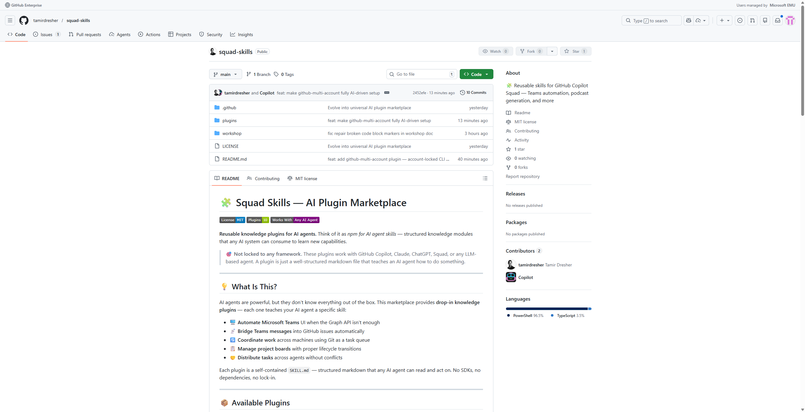

*Figure 7.6: The Squad skills marketplace showing the ecosystem of available AI agents and their capabilities. Each skill is tagged with scope (local repo, cross-repo, infrastructure), safety level, and required human approval gates. This marketplace drives discovery — when Brady needs a new capability, he doesn't wait for an engineer; he checks what skills are already available in the Squad toolchain.*

---

## 7.10 What Humans Do Now (Or: The Job Didn't Get Easier, It Got Different)

Here's the question everyone asks: "If AI squad members do all the grunt work, what do humans do?"

**The answer: We do what AI can't.**

### 7.10.1 Architecture Decisions

AI squad members can analyze trade-offs (performance vs. complexity, cost vs. scale). They can draft design docs. They can model options.

But they can't **decide** which trade-off to make. Because that requires understanding business priorities, team capacity, technical debt tolerance, and long-term strategy.

Picard (AI lead) can tell Brady (human engineering lead): "Here are three ways to implement this feature, with trade-offs."

But Brady makes the call. Because he knows the business context. The team's velocity. The technical debt budget. The roadmap for next quarter.

**AI squad members optimize for technical correctness. Human squad members optimize for organizational reality.**

---

### 7.10.2 Judgment Calls in Production Incidents

When a cluster goes down at 2 AM, AI squad members can gather logs, correlate errors, surface recent changes, and suggest likely root causes.

But the final diagnosis — the "yes, let's roll back" or "no, let's patch forward" decision — requires human judgment.

Ralph (AI monitor) can say: "High confidence this is a bad config. Recommend rollback."

But B'Elanna (human on-call) makes the call. Because she understands the blast radius. The customer impact. The political consequences of rolling back vs. patching forward.

**AI squad members reduce time-to-context. Human squad members own the decision.**

---

### 7.10.3 Stakeholder Management

AI squad members treat every issue the same. A feature request from a VP is the same as a bug report from a junior engineer. Technically correct. Politically naive.

Brady and I (human squad members) triage issues with organizational context before AI squad members pick them up. We know when a feature is critical because a big customer is waiting. We know when a bug is low-priority because it only affects internal tooling.

**AI squad members execute. Human squad members prioritize.**

---

### 7.10.4 Creativity and Innovation

AI squad members are great at applying existing patterns. Data reads our codebase, learns our conventions, and writes code that fits.

But breakthrough ideas? Novel architectures? "What if we rethought this completely?" moments?

Those still come from humans. Brady invented the Squad framework because he saw a gap that didn't exist in any existing tool. No AI would've proposed that.

**AI squad members optimize within constraints. Human squad members redefine the constraints.**

---

## 7.11 What Doesn't Work (Yet)

Squad on a work team isn't perfect. Here are the boundaries:

### 7.11.1 Ambiguous Requirements

AI squad members struggle with vague issues like "improve performance" or "make the UI better." They need specificity.

**Current approach:** Human squad members refine the issue before routing to AI. "Improve performance" becomes "Reduce reconciler loop time from 500ms to <200ms by optimizing list operations." Then Data can implement it.

---

### 7.11.2 Cross-Team Coordination

When a change in our repo affects another team's repo, AI squad members can identify the impact and open tracking issues. But negotiating the timeline, communicating the breaking change, and managing the rollout?

That requires human-to-human conversation.

**Current approach:** Picard (AI lead) identifies the impact. Brady (human engineering lead) coordinates with the other team's lead. AI handles execution once humans agree on the plan.

---

### 7.11.3 Code That Requires Deep Domain Expertise

Our platform has some gnarly distributed systems code — consensus protocols, eventually consistent state machines, race condition debugging.

AI squad members can **maintain** that code (fix bugs, add tests). But they can't **design** it from scratch. The cognitive load is too high.

**Current approach:** Human squad members write the gnarly code. AI squad members handle everything around it (tests, docs, integration, monitoring).

---

## 7.12 The Onboarding Playbook (Or: How to Do This Without the Pitchforks)

If you want to bring Squad to your work team, here's how to do it without triggering an engineering revolt:

> ### 🧪 Try It Yourself
>
> **Exercise 7.1: Plan Your Squad Rollout**
>
> Before reading the playbook below, write down answers to these three questions for *your* team:
>
> 1. Which category of work would your team most benefit from delegating to AI? (tests, docs, security scans, dependency updates, or something else?)
> 2. Who is the engineer most likely to be skeptical — and what low-risk win would convince them?
> 3. What is one hard rule where AI must *always* pause for a human? (production deploys, auth changes, etc.)
>
> Compare your answers to our phased approach below. You may find your team needs a different order.

### Week 1: Observation Only

- Give AI squad members read-only access
- Let them analyze the codebase, generate reports, identify patterns
- Human squad members review the output to build trust
- No PRs, no code changes, no pressure

**Goal:** Prove AI squad members can understand the codebase before giving them commit access.

---

### Week 2: Drafts and Suggestions

- AI squad members create draft PRs marked `WIP`
- Human squad members review, edit, merge
- Feedback loop: when drafts need changes, update `.squad/decisions.md` so AI learns

**Goal:** Prove AI squad members can write code humans want to merge.

---

### Week 3: Delegated Work

- Low-risk tasks (docs, tests, deps) delegated to AI with human review
- Critical work (architecture, security, prod) still owned by humans
- Routing rules clearly define when AI pauses for human approval

**Goal:** Prove AI squad members can ship real work with minimal supervision.

---

### Week 4: Full Integration

- AI squad members handle routine work autonomously
- Human squad members focus on design, incidents, judgment calls
- Team adjusts roles organically based on what works

**Goal:** Reach steady state where AI and human squad members collaborate seamlessly.

---

**The key:** Never force it. Engineers who want to join as human squad members do. Engineers who prefer traditional workflows aren't blocked. Let adoption grow organically as people see the value.

---

## 7.13 The Moment It Clicked

Three months into Squad on the work team, Brady and I were debugging a cross-repo sync issue. We'd been staring at logs for 20 minutes trying to correlate events across 4 different services.

Brady said: "Hold on, let me ask Picard."

He opened an issue: "Analyze cross-repo sync logs from 2024-03-14 14:30-15:00 UTC. Identify timing correlation between service A deployment and service B errors."

Picard (AI lead) analyzed the logs. Found the pattern. Posted a summary:

**Listing 7.7: Picard's cross-service log analysis**

```
Service A deployed at 14:37 UTC with new API contract.
Service B started erroring at 14:38 UTC (invalid field in request).
Root cause: Service B using cached client with old API contract.
Service B pod restart at 14:52 UTC cleared cache, errors stopped.

Recommendation: Add API version check to client initialization.
```

Brady read it. Nodded. Said: "Yep, that's exactly what happened. Let's add the version check."

Filed a follow-up issue. Data (AI code expert) implemented it. Merged the next morning.

And Brady turned to me and said: "I don't know how we worked before this."

**That's the moment.** Not when AI writes its first PR. Not when the metrics show improvement. But when a human engineer—a skeptic, a domain expert, someone who's been writing code for 20 years—**can't imagine going back**.

---

## 7.14 The Bigger Picture (Or: What This Means for Software Engineering)

Here's what we learned from six weeks of Squad on a work team:

**1. AI doesn't replace engineers. It multiplies them.**

We didn't fire anyone. We didn't reduce headcount. We **increased what 6 engineers could accomplish**.

Before Squad: 12 PRs/week. After Squad: 23 PRs/week. Same team. Same hours. More output.

---

**2. The bottleneck shifts from execution to judgment.**

Before Squad, we were bottlenecked on "who has time to write tests?" After Squad, we're bottlenecked on "what should we build next?"

That's a better bottleneck. Because humans are good at strategy. AI is good at execution.

---

**3. Knowledge compounds faster with AI memory.**

Every decision we make gets logged in `.squad/decisions.md`. Every pattern we follow gets encoded in routing rules. Every time Data writes a PR, he references past decisions.

The team's collective intelligence **accumulates automatically**. New engineers onboard faster because the knowledge is documented (we covered this knowledge-compounding pattern in chapter 3). Old engineers forget less because the system remembers.

---

**4. Trust is built through small wins.**

Nobody trusts AI on day one. You build trust by letting AI prove itself on low-risk work. Test scaffolding. Documentation. Dependency updates.

Then, once trust is built, you delegate bigger work. Code reviews. Security scans. Architecture analysis.

By Week 6, Brady was asking Picard for design advice. Not because Picard became smarter. Because Brady **trusted Picard's judgment** after seeing 47 correct recommendations.

---

## 7.15 What Comes Next

This chapter covered a single team—six humans, six AI agents—working together as one Squad.

But we're already seeing the next evolution:

**What happens when every team at Microsoft has a Squad?**

Do they build isolated AI teams? Or do they share knowledge? Can the Azure Kubernetes Squad learn from the Azure Networking Squad? What about company-wide standards — coding conventions, security policies, architectural patterns?

In the next chapter, we'll cover **Squad upstreams** — how knowledge propagates across teams, so that organizational context flows down to every Squad without manual copy-paste.

From personal repo (chapter 2) to personal AI team (chapter 6) to work team (this chapter) to organizational scale (next chapter).

The assimilation continues. 🖖

---

**Listing 7.8: Squad hierarchy — before and after**

```
Work Team Structure (Before Squad)
====================================
Brady (Lead) -----> Review -----> Engineers
                                  Engineer 1
                                  Engineer 2
                                  Engineer 3
                                  (Everyone writes code, tests, docs)

Bottleneck: Time. Each engineer does everything.


Work Team Structure (After Squad)
====================================
Human Squad Members              AI Squad Members
--------------------             -----------------
Brady (Lead)                     Picard (Lead AI)
Worf (Security)                  Data (Code AI)
B'Elanna (Infra)                 Seven (Docs AI)
Engineers (Code)                 Worf (Security AI)
                                 B'Elanna (Infra AI)

Routing Rules:
- Routine work → AI with human review
- Architecture → AI analysis, human decision
- Security → AI scans, human sign-off
- Production → AI plans, human executes

Result: Humans focus on judgment. AI handles execution.
```

---

**Listing 7.9: Decision flow — architecture change from issue to merge**

```
Issue: "Refactor reconciler for batch operations"

Step 1: Picard (AI Lead) analyzes
├─ Identifies files to change
├─ Finds edge cases
└─ Drafts 3 design options with trade-offs

Step 2: Routes to Brady (Human Lead) for decision
└─ Brady chooses Option 2 (queued batch)

Step 3: Picard delegates to Data (AI Code)
├─ Data implements queued batch pattern
├─ Data writes tests (95% coverage)
└─ Data opens PR with detailed description

Step 4: Routes to Brady (Human) for review
├─ Brady requests 1 change (retry logic)
├─ Data updates PR
└─ Brady approves and merges

Time: 2.5 hours (was 2 days before Squad)
Human time: 45 minutes (decision + review)
AI time: 1.75 hours (analysis + implementation)
```

---

**Table 7.1: Metrics — 6 Weeks After Integration**

| Metric | Before Squad | After Squad | Change | Impact |
|--------|-------------|-------------|---------|--------|
| **PR review time** | 18 hours | 4 hours | -78% | AI pre-screens PRs before human review |
| **PRs merged/week** | 12 | 23 | +92% | AI handles scaffolding, humans focus on features |
| **Test coverage** | 67% | 84% | +17 pts | AI generates test scaffolding for every feature |
| **Outdated docs** | 22 files | 3 files | -86% | AI watches code changes, auto-updates docs |
| **Security findings** | 8/sprint | 2/sprint | -75% | AI scans continuously, patches CVEs same-day |
| **Human time on toil** | ~35% | ~12% | -66% | AI handles boilerplate, humans focus on design |

**Total productivity gain:** 6 engineers produce output of ~11 engineers (92% more throughput with same headcount)

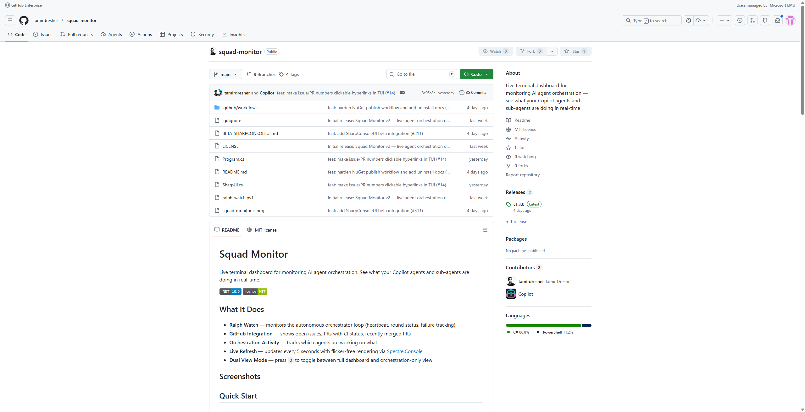

*Figure 7.7: The Squad monitoring dashboard updated every 15 seconds, showing all agents' status, pending work items, human approvals waiting, and incident alerts. This single pane of glass is where Brady starts each day — it's the source of truth for "what's everything doing right now?" The dashboard integrates GitHub issues, PRs, deployment logs, infrastructure metrics, and custom agent telemetry into one coherent view. Notice the "Waiting on @tamirdresher" section at the bottom — that's Ralph's escalation tracking preventing work from getting stuck.*

**Human experience:** "I don't know how we worked before this." — Brady, Week 12

---

## Summary

- **AI agents without team context are contractors, not squad members.** The breakthrough was adding humans *to* the Squad roster alongside AI agents, giving both groups the same structure: role, expertise, scope, and routing rules (section 7.2).

- **Routing rules are the key mechanism for human-AI collaboration.** They define *when* AI pauses for human judgment — architecture decisions, security-sensitive changes, and production actions all require explicit human sign-off (section 7.3).

- **Trust is built through phased rollout, not big-bang adoption.** Week 1 (observation), Week 2 (drafts), Week 3 (delegated low-risk work), and Week 4 (full integration) let skeptics become believers through results, not arguments (sections 7.4–7.7).

- **The metrics tell the story: 78% faster PR reviews, 92% more PRs merged, 17-point jump in test coverage, 86% reduction in documentation drift, and 66% less human time on toil** — all with the same six-person team (section 7.8).

- **AI handles execution; humans handle judgment.** Architecture decisions, production incident calls, stakeholder prioritization, and creative innovation remain firmly in human hands. The job didn't get easier — it got different (section 7.10).

- **What doesn't work yet: ambiguous requirements, cross-team coordination, and deep domain design.** These remain human responsibilities, with AI providing support around the edges (section 7.11).

- **Next up: organizational scale.** Chapter 8 explores what happens when every team has a Squad — and how knowledge propagates across Squads via upstreams.

---

*About the author: Tamir Dresher is a Principal Engineer at Microsoft, where he leads the development of AI-augmented engineering workflows.*

*Next: Chapter 8 — Organizational Scale (Or: When Every Team Has a Squad)*


<div class="page-break"></div>

# Chapter 8

## What Still Needs Humans

> **This chapter covers**
>
> - Understanding why AI excels at analysis but can't make judgment calls
> - Recognizing the boundaries between AI implementation and human decision-making
> - Navigating political context, production incidents, and architecture decisions with an AI team
> - Calculating the real cost equation for AI-augmented development
> - Building a trust framework for when to escalate, trust, or override your AI agents

> *"AI can write the code. But only you can decide which code to write."*

Let me tell you about the time Data tried to fix a bug that should have taken five minutes.

It was a Tuesday morning. A VP had filed an issue: "The dashboard loading spinner doesn't work on mobile Safari." Priority: High. Because when a VP files a bug, every bug becomes high priority.

I labeled it `squad:data` and went to get coffee.

By the time I got back — maybe 10 minutes — Data had opened a PR. Excellent. I clicked through to review it.

**The PR had 347 changed files.**

I scrolled through the diff in complete silence. Data hadn't just fixed the spinner. He'd refactored the entire loading state management system. Redux replaced with Zustand. Three custom hooks extracted. A new `useLoadingState` abstraction. Unit tests. Integration tests. Storybook stories for the design team.

It was beautiful code. Elegant. Well-tested. Completely architected.

It was also **not what we needed**.

The actual bug? A CSS media query targeting the wrong breakpoint. **Two lines.**

**Listing 8.1: The two-line CSS fix that a 347-file refactor couldn't beat**

```css
/* Before */
@media (max-width: 768px) { ... }

/* After */
@media (max-width: 767px) { ... }
```

That's it. That's the entire fix. One pixel off. Classic Safari.


Data's 347-file refactor would have taken three weeks to review properly. Would have delayed two other features. Would have introduced risk into a stable system. Would have made the VP wait **three weeks** for a spinner to work.

I closed Data's PR with a polite comment: "This is over-engineered for the scope. Let's just fix the CSS."

I opened a new issue: "Fix mobile spinner — CSS ONLY, do not refactor."

Data fixed it in 2 minutes this time. Two lines. Perfect.

**And that's when I learned the most important lesson about AI teams:**

**AI can solve problems brilliantly. But only humans can decide which problem to solve.**

> 🔑 **KEY CONCEPT:** AI agents optimize for the problem as stated. Humans optimize for the problem that *actually matters*. Constraining the scope of AI work — through clear, specific issues — is one of your most important jobs as the human lead.

---

## 8.1 The Boundaries You Can't Cross (Yet)

Three months into running Squad, I've found the edges. The places where AI stops and humans **must** start.

Not because the AI is bad. Because the AI is solving a different problem than the one you're trying to solve.

> *Side note:* If you followed along in chapters 3–5 while building your own Squad, you may have already bumped into some of these boundaries. This chapter names them explicitly so you can recognize them faster next time.

Let me walk you through the boundaries.

---

## 8.2 Architecture Decisions: Analysis vs. Judgment

Here's what AI is **incredible** at:

- Analyzing trade-offs
- Listing pros and cons
- Finding edge cases you missed
- Researching patterns from your codebase
- Synthesizing information from documentation

Here's what AI **cannot** do:

- Decide which trade-off matters more
- Understand your team's velocity
- Know what your VP cares about vs. what your tech lead cares about
- Predict which technical debt you can afford this quarter
- Assess political risk of a rewrite

**Example:**

I asked Picard to analyze whether we should migrate our auth system from sessions to JWT.

His analysis was **perfect**:

**JWT Pros:**
- Stateless (scales horizontally)
- Works across multiple domains
- Industry standard
- Reduces database load

**JWT Cons:**
- Can't revoke tokens easily (session can just delete from DB)
- Larger payload size (impacts mobile users)
- Client must implement refresh logic correctly
- More complex secret management

**Session Pros:**
- Simple to implement
- Easy to revoke (just delete from database)
- Smaller cookie size
- Server controls everything

**Session Cons:**
- Requires database lookup on every request
- Doesn't scale horizontally without sticky sessions or Redis
- Cross-domain issues
- Tighter coupling between services

Picard laid it all out beautifully. With code examples. With metrics from our existing system.

But then he asked: **"Which architecture should we choose?"**

And I realized: he can't answer that. Because the answer depends on:

- Are we scaling horizontally next quarter? (I know the roadmap; he doesn't)
- Does our mobile team have bandwidth to implement JWT refresh properly? (I know their sprint velocity; he doesn't)
- Did the security team just mandate "revocability" as a requirement? (I was in that meeting; he wasn't)
- Is the CEO's demo in two weeks going to break if we migrate mid-sprint? (I know about the demo; he doesn't)

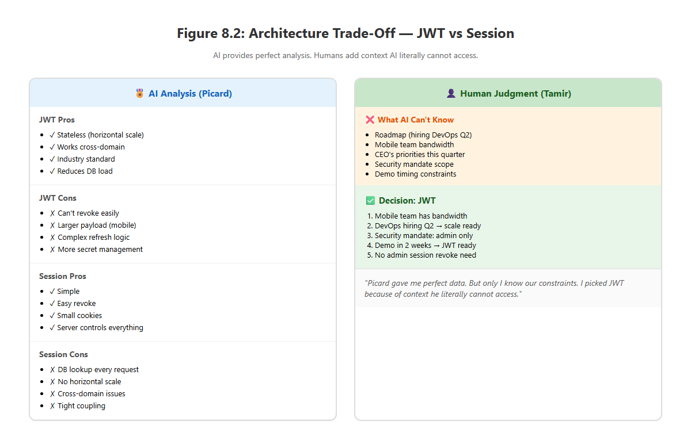

**AI gives you the map. But only you can pick the destination.**

I chose JWT. Not because it's "better." Because our mobile team had bandwidth, we were hiring DevOps next quarter to handle horizontal scaling, and the security team's "revocability" requirement didn't apply to user sessions (only admin sessions, which we handle differently).

Picard couldn't know any of that. **I** had to make the call.

> 💡 **TIP:** When asking an AI agent to analyze architecture options, always ask it to list the *assumptions* behind each recommendation. That way you can quickly spot which assumptions don't hold in your specific context — and make a better-informed decision.

---

## 8.3 Production Incidents: Context vs. Diagnosis

Here's what happens when production breaks at 2 AM:

Ralph detects the failure (monitors are screaming). He gathers context:
- Error logs from the last 30 minutes
- Recent deployments (last 4 hours)
- Relevant code changes (3 PRs merged today)
- System metrics (CPU, memory, response times)
- Dependency status (are third-party APIs down?)

He opens an incident issue. Tags it `squad:picard` for triage.

Picard reads the context. Proposes three hypotheses:
1. Database connection pool exhausted (max connections hit)
2. New caching layer introduced race condition
3. Third-party API rate limit exceeded

He attaches evidence for each hypothesis. Links to relevant logs. Suggests diagnostic commands.

**This is incredible.** I'm bleary-eyed at 2 AM and Picard has already done 80% of the investigative work.

But here's where humans are still required:

**I have to decide which hypothesis to test first.**

Because testing hypothesis #1 (database connection pool) requires bouncing the database connection manager, which will cause a 30-second outage for all users.

Testing hypothesis #3 (API rate limits) requires checking with the vendor, which means waking up their on-call person at 2 AM (they're in a different timezone).

Testing hypothesis #2 (caching race condition) requires disabling the new cache, which will slow down the site but keep it running.

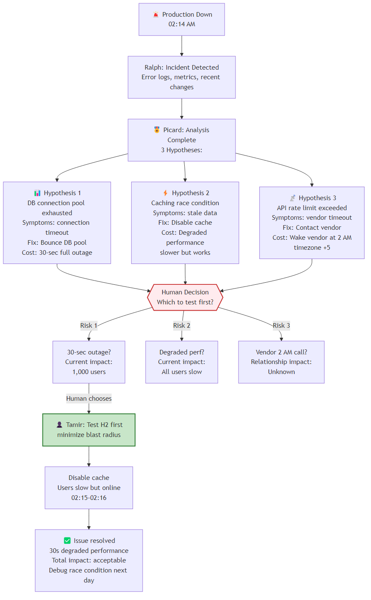

**Picard can't make that call.** He doesn't know:
- Is a 30-second outage worse than degraded performance?
- What's our relationship with the vendor? (Did we just renew the contract? Are we already on thin ice?)
- How critical is the site right now? (Is there a big marketing campaign driving traffic? Is it a slow Tuesday at 2 AM?)

I have to decide. **Humans carry the context that doesn't fit in logs.**

(I picked hypothesis #2. Disabled the cache. Site came back up at 2:07 AM. Fixed the race condition the next day. Total downtime: 7 minutes. Acceptable.)

> ⚠️ **WARNING:** Never let an AI agent autonomously execute production incident remediation without human approval. AI is outstanding at *diagnosis* — gathering logs, proposing hypotheses, ranking likelihood — but *remediation* decisions carry business risk that only a human can evaluate. Chapter 6 covers how to configure escalation paths for production incidents.

---

## 8.4 Political Context: AI Doesn't Read the Room

Remember that VP who filed the spinner bug?

She filed another issue two weeks later: "Add dark mode to the dashboard."

Ralph picked it up. Routed it to Data (UI change).

Data implemented it **perfectly**. Full dark mode. Theme switcher. Persisted preferences. Color contrast validated for accessibility. 94 changed files. PR opened in 6 hours.

I reviewed it and immediately knew: **we can't merge this.**

Not because the code was bad. Because the product team had been debating dark mode for **nine months**. There were:
- 6 design mockups from 4 different designers
- 3 user research reports with conflicting data
- 2 accessibility audits with competing recommendations
- 1 very strong opinion from the CEO (who hates dark mode)

The VP who filed the issue? She **knew** about this debate. She was testing whether I'd merge it without checking. She wanted dark mode **for her**, but she also knew it was politically impossible.

**AI doesn't understand political context.** Data saw a feature request and implemented it. Correctly. Beautifully. Completely.

But if I'd merged it, I would have:
- Upset the CEO
- Undermined the product team's authority
- Wasted Data's 6 hours of work when it got reverted
- Looked like I didn't understand the organizational dynamics

**I closed the PR and politely explained to the VP that dark mode needed product team approval first.**

She thanked me. Because she **knew** I'd have to say no. She was filing it to demonstrate demand. She wasn't expecting it to ship.

**AI can't play organizational politics.** It can't read subtext. It can't understand when a bug report is really a feature negotiation disguised as a bug report.

**That's your job.**

> 📌 **NOTE:** This doesn't mean political context is bad. Organizations are made of people, and people have competing priorities. Your role as the human in the loop is to translate *organizational reality* into *clear, actionable instructions* that your AI agents can execute without accidentally stepping on a landmine. See chapter 4 for how issue templates help encode this context.

---

## 8.5 The Cost Equation: Humans Do the Math

Let's talk about money.

Because AI isn't free. And "the AI team handles it" has real costs:

**Listing 8.2: Per-agent cost breakdown for a six-agent Squad**

| Cost Type | Amount | Frequency | Notes |
|-----------|---------|-----------|-------|
| GitHub Copilot Seat | $39/month | Per agent | 6 agents = $234/month |
| Compute (API calls) | ~$120/month | Variable | Depends on repo activity |
| Storage (logs, context) | ~$3/month | Fixed | Minimal |
| Human review time | ~4 hrs/week | Your time | Reviewing PRs, making decisions |
| **Total** | **~$357/month** | **+ 16 hrs/month** | **~$17 per merged PR** |

Now let's compare to alternatives:

**Option A: Do Everything Yourself**
- Cost: $0 in AI tools
- Time: ~60 hrs/month (coding, docs, tests, reviews)
- Merged PRs: ~8-12/month (you're one person)

**Option B: Hire Junior Dev**
- Cost: ~$5,000/month (salary + benefits)
- Time: ~20 hrs/month (your time mentoring + reviewing)
- Merged PRs: ~15-20/month (once they're ramped up)

**Option C: Squad**
- Cost: ~$357/month (AI costs)
- Time: ~16 hrs/month (your time reviewing decisions)
- Merged PRs: ~20-25/month (agents work 24/7)


**Is it worth it?**

For me: **absolutely.** $17 per merged PR is a bargain when the alternative is hiring a junior dev at $5K/month or burning my nights and weekends.

But for you? **You have to do the math.**

If you're on a side project with 3 issues per month, Squad is overkill. Use GitHub Copilot in your editor and call it a day.

If you're running a startup with a backlog of 200 issues and no budget for a full-time dev, Squad might **save** you money.

If you're at a large enterprise with compliance requirements and 6-month procurement cycles, Squad might be politically impossible even if it's economically sound.

**AI can't tell you whether it's worth the money.** Only you know your budget, your backlog, and your alternatives.

> ### 🧪 Try It Yourself
>
> **Exercise 8.1: Calculate Your Own Cost Equation**
>
> 1. Estimate how many hours per month you spend on tasks an AI agent could handle (tests, docs, boilerplate, simple bug fixes).
> 2. Multiply those hours by your hourly rate (or opportunity cost).
> 3. Compare that to the ~$357/month Squad cost from Listing 8.2.
> 4. Factor in the ramp-up period — agents need 4–8 weeks of correction before they hit their stride.
> 5. Does the math work for your situation? If the break-even point is more than 3 months out, start with a smaller squad (2–3 agents) and grow from there.

---

## 8.6 The Escalation Decision: When to Trust, When to Override

Here's the hardest part of running an AI team:

**Knowing when to trust the agent and when to override them.**

### When to Trust:

Data says: "This refactor reduces code duplication by 40% and improves test coverage."

**You should probably trust that.** Because Data is analyzing code metrics. He's not guessing. He's counting lines. Measuring coverage. Extracting methods.

Unless you have context that he doesn't (like: "we're about to delete that module next sprint"), you should trust the refactor.

### When to Override:

Worf says: "This API endpoint doesn't validate the user's email format. Security risk: HIGH."

**You need to investigate.** Because Worf's definition of "HIGH" might not match yours. He's flagging every missing validation as a security risk. But:
- Is this API internal-only? (Then email validation is less critical)
- Do we validate email upstream? (Then redundant validation adds complexity)
- Is this a POST endpoint or GET? (GET with invalid email is less risky)

**You carry context that Worf doesn't.**

### The Rule I Use:

**Trust agents on objective facts. Override agents on judgment calls.**

- Data says "this code has 12 conditionals" → **Trust it** (he counted)
- Data says "this code is too complex" → **Evaluate it** (complexity is subjective)

- Seven says "the API docs don't explain this parameter" → **Trust it** (she read the docs)
- Seven says "the docs are poorly written" → **Evaluate it** ("poorly written" is subjective)

- Worf says "this dependency has a known CVE" → **Trust it** (CVE databases are objective)
- Worf says "this dependency is a security risk" → **Evaluate it** (risk depends on usage)

**AI gives you signals. You make the call.**

---

## 8.7 What Works Brilliantly

Let me be clear about what AI teams are **exceptional** at:

### Systematic Validation

Ralph runs the same checks every 5 minutes. He never gets tired. He never forgets. He never says "I'll check it later."

He caught a config error **12 times** in the first month. Twelve times I pushed a broken config and Ralph caught it before it merged.

I would have missed 11 of those. Humans get complacent. AI doesn't.

### Grunt Work

Data writes tests. Seven writes docs. Worf writes security scan configs.

This is work I **hate** doing but **know** should be done. Before Squad, I'd skip it. "I'll add tests later." (Narrator: he did not add tests later.)

Now it just... happens. I review it. I approve it. But I don't **do** it.

**That's the dream.**

### Knowledge Sync

Every agent reads `.squad/decisions.md` before starting work. Every agent **writes** to `decisions.md` after finishing work.

The knowledge compounds **automatically**. I don't maintain a wiki. I don't update docs. The agents do it.

And when a new agent joins (I added Scribe recently for session logging), she reads the entire decision history on day one. She knows **everything** the team has done for the past three months.

Try onboarding a human that fast.

---

## 8.8 What's Still Rough

Let me also be honest about where AI teams **struggle**:

### Occasional Hallucinations

Data sometimes "remembers" a function that doesn't exist. Seven sometimes cites documentation that's outdated. Worf sometimes flags vulnerabilities that were patched two versions ago.

**This is getting better every week.** But it still happens.

**My rule:** Always spot-check AI code. Don't merge blindly. Especially for:
- Security-sensitive changes
- Database migrations
- API contract changes
- Anything that touches production data

### Over-Engineering Rabbit Holes

Data **loves** to refactor. Give him a 2-line bug fix and he'll propose a 300-line architectural improvement.

Sometimes that's great (the codebase gets cleaner). Sometimes it's overkill (we just need to ship).

**I've learned to write clearer issues:**

**Listing 8.3: Constraining issue scope to prevent over-engineering**

- ❌ "Fix the login bug"
- ✅ "Fix the login bug — minimal changes, do not refactor"

Specificity helps. But I still review every PR and occasionally say: "Nope, too much, scale it back."

### Context Confusion

If two issues are related, agents sometimes miss the connection. Data fixes a bug in module A. Seven writes docs for module B. Neither realizes module B **uses** module A and the docs are now outdated.

**I catch this in review.** But it requires me to hold the context in my head. AI agents don't have perfect cross-talk yet.

This is improving (Picard now does "context checks" before assigning work). But it's not perfect.

---

## 8.9 The Trajectory: Every Week, A Little Smarter

Here's what gives me confidence in AI teams:

**The trend line.**

**Listing 8.4: Correction rate decline over 12 weeks**

```
Week  1: Data's PRs required 60% corrections.
Week  4: 30% corrections.
Week  8: 10% corrections.
Week 12:  5% corrections.
```

**The agents are learning.** Not in some magical neural-net way. They're learning because:
- The decision log grows (more context for future work)
- The team patterns lock in (consistent code style)
- The routing rules get refined (right agent for right task)
- I give feedback that sticks (corrections become conventions)

**Every merged PR makes the next PR better.**

This isn't static automation. This is **compounding intelligence**.

And the best part? The cost per PR is **decreasing**. As agents get better, I review faster. Less back-and-forth. Fewer corrections. More trust.

**Listing 8.5: Cost per PR declining with agent maturity**

```
Month 1: ~$22 per merged PR (lots of corrections, wasted tokens).
Month 3: ~$17 per merged PR (fewer corrections, more efficient).
```

**The ROI is improving every week.**

> *Side note:* If you're tracking these metrics yourself, the simplest approach is a spreadsheet with two columns: monthly AI spend and merged PR count. Chapter 7 shows how Ralph can automate this tracking for you.

---

## 8.10 When to Escalate, When to Trust, When to Override

So how do you actually decide?

Here's my mental model:

### Escalate When:
- The decision affects architecture (JWT vs. sessions)
- The decision has political implications (VP's feature request)
- The decision involves cost trade-offs (refactor now vs. later)
- You don't understand the agent's reasoning (ask Picard to explain)

### Trust When:
- The task is well-defined ("add tests for this function")
- The output is objectively measurable ("coverage increased by 15%")
- The agent has done this successfully before (pattern recognition)
- The risk is low (docs changes, test additions)

### Override When:
- The agent over-engineered the solution (347 files for a 2-line fix)
- The agent missed organizational context (dark mode debate)
- The agent's judgment differs from yours (subjective calls)
- You have information the agent doesn't (upcoming roadmap changes)

**The key:** AI agents are **advisors**, not **decision-makers**.

They propose. You decide.

They implement. You review.

They document. You approve.

**You're the manager. They're the team.**

---

## 8.11 The Honest Assessment

So is Squad perfect? **No.**

Is it better than every other productivity system I've tried? **Absolutely.**

Will it replace human developers? **Not even close.**

But will it make you **faster, smarter, and more systematic** than you've ever been working alone?

**Yes. If you learn where humans are still needed.**

Because here's the truth:

AI can write code brilliantly. But only you can decide **which** code to write.

AI can analyze trade-offs perfectly. But only you can decide **which** trade-off matters.

AI can work 24/7 without breaks. But only you can decide **what's worth working on**.

**AI amplifies your judgment. It doesn't replace it.**

And if you understand that — if you embrace your role as the **decision-maker** while letting AI handle the **implementation** — then you'll ship faster than you ever thought possible.

---

## 8.12 The Moment I Knew It Was Working

Three months in, I was reviewing Data's PR for a database migration.

He'd written the migration. Written the rollback. Written tests for both. Written monitoring queries to validate the migration succeeded. Updated the docs. Logged the decision.

I read through the PR. I ran the tests locally. I reviewed the SQL.

**It was perfect.**

I left a comment: "Nice work. Approved."

Data responded 3 minutes later (Ralph had picked up my approval):

> "Thank you. Should I merge or wait for additional review?"

I thought about it. This was a production database. Real user data. A mistake could be **bad**.

But the tests passed. The rollback was tested. The migration was idempotent. The monitoring was in place.

I had reviewed it. It was good.

I typed: "Merge it."

Data merged the PR. The migration ran. The monitoring queries showed green. The users didn't notice a thing.

**And I realized: I just trusted an AI agent with production data.**

Not blindly. I reviewed it. I validated it. I made the call.

But I **trusted** the implementation. Because Data had earned that trust. Week by week. PR by PR. Pattern by pattern.

**That's when I knew this wasn't just automation.**

**This was delegation.**

And delegation — the ability to trust someone else to do good work — is how **everything** scales.

---

## 8.13 What This Means For You

If you're reading this thinking "I could never trust AI with my production systems," I get it.

I felt that way too.

But here's what I learned:

**You don't have to trust AI on day one.**

You start small:
- Docs changes (low risk)
- Test additions (easy to validate)
- Code formatting (automated checks catch errors)

You review **everything** at first. You correct mistakes. You refine instructions.

And gradually — week by week — the agents get better. The trust grows. The speed increases.

And one day you realize: you just approved a production database migration written by an AI agent.

**Because you reviewed it. You validated it. You made the call.**

**But you didn't write it.**

And that distinction — between **writing code** and **deciding what to write** — is the future of software development.

AI writes. You decide.

AI implements. You judge.

AI works 24/7. You work during the hours you choose.

**That's the boundary.**

And if you learn to work within that boundary — if you embrace your role as the **architect of decisions** while letting AI handle the **mechanics of implementation** — then you'll ship code faster than you ever thought possible.

---

## 8.14 The Cost Per Merged PR: Is It Worth It?

Let me close with the number that matters most:

**~$17 per merged PR.**

That's what Squad costs me. After three months. With six agents running 24/7.

Is it worth it?

For me: **absolutely.**

Because the alternative is:
- Spending my nights and weekends writing code (my time is worth more than $17/PR)
- Hiring a junior dev at $5K/month (way more expensive than $357/month)
- Letting the backlog grow until the project dies (infinite cost in opportunity)

But for you? **You have to decide.**

Run the numbers. Estimate your costs. Calculate your alternatives.

And then decide: is AI augmentation worth it for **your** situation?

**Only you can make that call.**

Because that's the boundary. That's where humans are still needed.

**AI can do the work. But only you can decide if the work is worth doing.**

---

## Summary

- **AI excels at analysis, not judgment.** Agents can map out every trade-off in an architecture decision, but only you can weigh those trade-offs against roadmap, team velocity, and organizational politics.
- **Production incidents need human risk assessment.** AI can diagnose probable causes in minutes — but choosing which fix to attempt first requires understanding business impact, vendor relationships, and acceptable downtime windows.
- **Political context is invisible to AI.** Feature requests sometimes carry organizational subtext that no amount of code analysis can decode. The human in the loop translates organizational reality into actionable instructions.
- **The cost equation favors Squad for mid-to-large backlogs.** At ~$17 per merged PR, AI augmentation is dramatically cheaper than hiring — but only if your issue volume justifies the overhead.
- **Trust is earned incrementally.** Start with low-risk tasks (docs, tests, formatting), review everything, and expand the agent's autonomy as their correction rate drops.
- **Trust objective facts, override subjective calls.** When an agent reports a metric, trust it. When an agent makes a judgment call, evaluate it against context the agent can't see.
- **AI amplifies your judgment — it doesn't replace it.** The future of software development is not writing code; it's deciding which code to write.

---

*Next: Part III — Advanced Patterns: When the Squad Scales Beyond Your Repo*
