# Book Image & Diagram Plan
## Squad: Building an AI Team That Works While You Sleep

**Total Chapters:** 8  
**Target Figures:** 3-4 per chapter = 24-32 total diagrams/images  
**Audience:** Software engineers, engineering leaders, technical product managers

---

## CHAPTER 1: Why Everything Else Failed

### Context
Personal productivity system failures (Notion, Trello, Bullet Journal) and the breakthrough discovery of Squad. Emotional arc: frustration → discovery → revelation.

---

#### Figure 1.1: The Productivity System Graveyard
- **Type:** Concept illustration
- **Description:** Cemetery scene with tombstones labeled "Notion," "Trello," "Bullet Journal," "Asana," "Monday.com." Each tombstone shows the failure date (e.g., "Day 12," "Day 4," "Day 18"). Dark, slightly humorous. Wilted flowers. A single gravestone in the distance marked "Squad" with fresh flowers and a sunrise behind it.
- **Placement:** After "The Pattern" section (before "The Moment Everything Changed")
- **Generation method:** AI image generation (DALL-E/Midjourney style concept art)
- **Prompt for AI:** "A whimsical cemetery with weathered tombstones for failed productivity systems (Notion, Trello, Bullet Journal, Asana). Each tombstone shows dates of failure (Day 12, Day 4, Day 18). Dark, slightly humorous tone. In the distance, a single fresh gravestone labeled 'Squad' with blooming flowers and a bright sunrise. Professional, technical illustration style."

---

#### Figure 1.2: Personal Repo Stats Before & After Squad
- **Type:** Before/After comparison visualization
- **Description:** Two columns side-by-side. LEFT: Pre-Squad repo state (23 open issues, test coverage 34%, outdated docs, stale decisions.md). RIGHT: Post-Squad after 3 months (0 open issues, 89% test coverage, current docs, 147 logged decisions). Arrows pointing from each metric showing improvement. Color-coded (red→orange→green gradient).
- **Placement:** In "The First Real Test" section
- **Generation method:** ASCII art with color or styled code block with metrics
- **ASCII mockup:**
```
BEFORE SQUAD          →          AFTER SQUAD (3 months)
━━━━━━━━━━━━━━━━━━━━━━━━━━━━━━━━━━━━━━━━━━━━━━━━━━
Open Issues:    23               Open Issues:     0 ✓
Test Coverage:  34%              Test Coverage:  89% ✓
Documentation:  6 weeks stale    Documentation:  Current ✓
Decisions Log:  Empty            Decisions Log:  147 entries ✓
PR Review Time: 3-5 days         PR Review Time: <1 hour ✓
```

---

#### Figure 1.3: The Squad Roster
- **Type:** Character/persona illustration
- **Description:** Six Star Trek characters introduced: Picard (orchestrator), Data (code expert), Worf (security), Seven (docs), B'Elanna (infrastructure), Ralph (monitor). Show them as an actual team, side-by-side. Each has a label with their role and one sentence of their personality. Professional illustration style, but with personality.
- **Placement:** In "The Moment Everything Changed" section (introducing the agents)
- **Generation method:** AI image generation or professional illustration
- **Prompt for AI:** "Professional team photo of six Star Trek characters as software engineers: Captain Picard (leader/orchestrator), Data (code expert), Worf (security/paranoid), Seven of Nine (documentation/analytical), B'Elanna Torres (infrastructure/pragmatic), Ralph Wiggum (monitor/persistent). Each in modern engineering attire. Clean, professional tech company photo style. Labels underneath with their role."

---

#### Figure 1.4: Ralph's 5-Minute Watch Loop (Teaser)
- **Type:** Simple circular flow diagram
- **Description:** Circle divided into 5 segments: "Detect new issues" → "Route to agents" → "Monitor progress" → "Merge when ready" → "Close & document" → back to start. Small timeline showing "Every 5 minutes" in center. Simple, clean icons for each step.
- **Placement:** End of chapter, "What's Coming Next" section (teaser for Chapter 2)
- **Generation method:** Mermaid diagram
- **Mermaid code:**
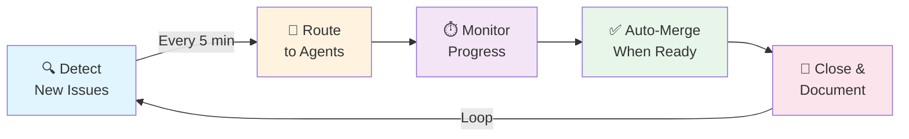

---

## CHAPTER 2: The System That Doesn't Need You

### Context
Ralph's architecture, the 5-minute watch loop, decision documentation, and how knowledge compounds. Technical deep-dive.

---

#### Figure 2.1: Ralph's Architecture - The Watch Loop
- **Type:** Architecture diagram (detailed flow)
- **Description:** Shows Ralph's full cycle with detailed steps: GitHub API polling → Label detection → Routing rules lookup → Agent assignment → Progress monitoring → Auto-merge logic → Issue closure. Include decision file updates. Show timing and decision points.
- **Placement:** After "The Architecture of Not Forgetting" section
- **Generation method:** Mermaid diagram
- **Mermaid code:**
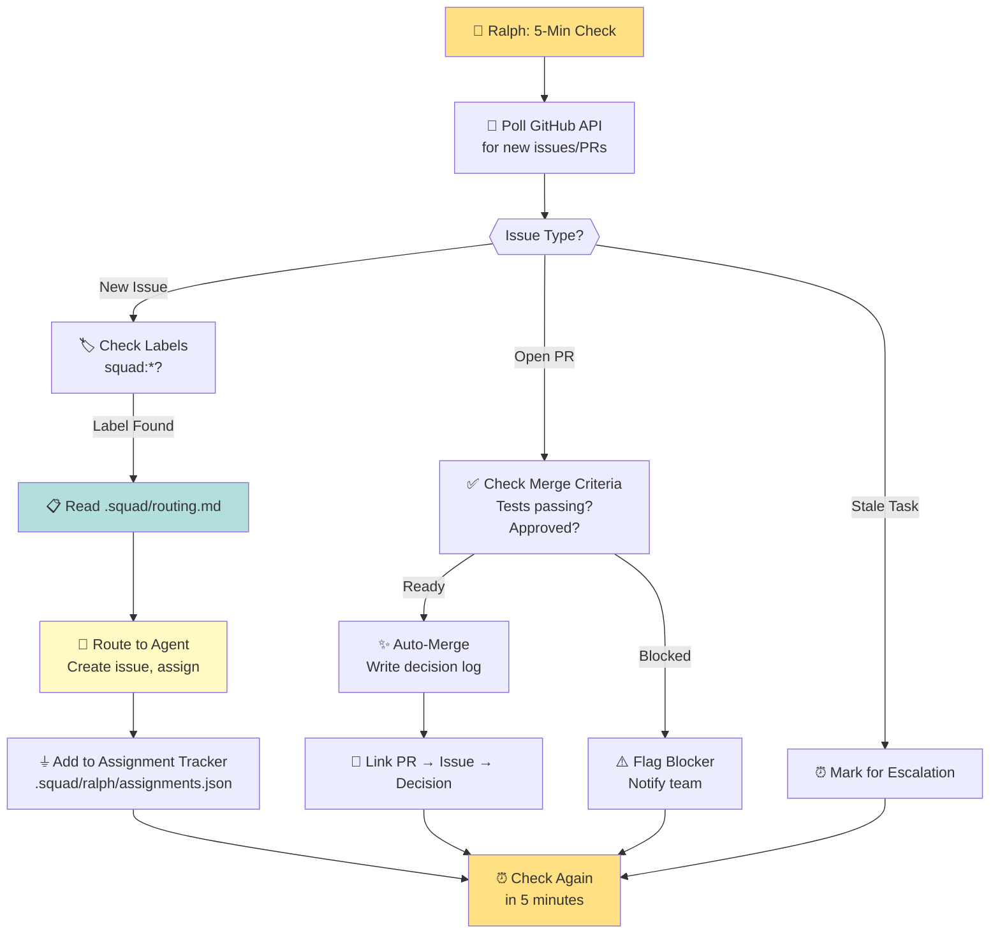

---

#### Figure 2.2: Decision Compounding Over Time
- **Type:** Knowledge accumulation graph (line chart or visual)
- **Description:** Timeline from Feb 18 (JWT decision logged) → Mar 8 (Seven references it) → Mar 15 (Worf audits using it) → Mar 22 (B'Elanna references in deployment). Show how one decision gets leveraged across multiple agents and contexts. Cumulative value visualization.
- **Placement:** In "The Knowledge That Compounds" section, after the example
- **Generation method:** Visual timeline or flowchart showing connection
- **Mermaid code:**
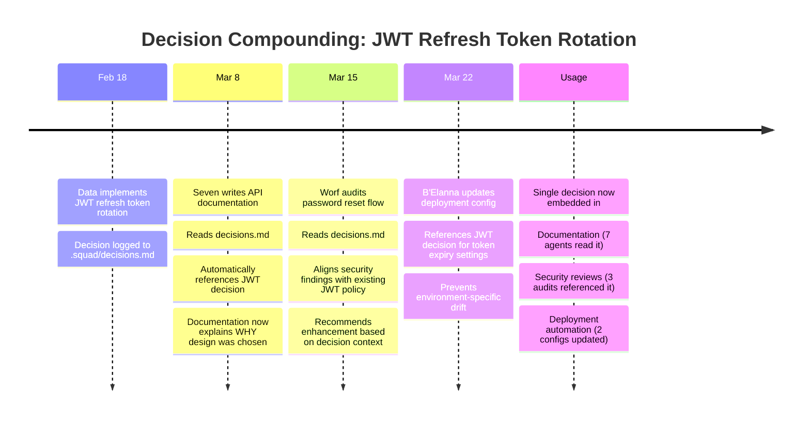

---

#### Figure 2.3: Routing Rules Matrix
- **Type:** Information table/matrix visualization
- **Description:** Matrix showing label → agent routing. Columns: Label, Agent, Domain, Context Used, Examples. Clean table format with icons. Shows how routing rules are deterministic and rule-based.
- **Placement:** After "Step 2: Routing" subsection
- **Generation method:** Styled code block or ASCII table
- **ASCII mockup:**
```
┌─────────────┬───────────┬──────────────────┬────────────────────────┐
│ Label       │ Agent     │ Domain           │ Context Examples       │
├─────────────┼───────────┼──────────────────┼────────────────────────┤
│ squad:data  │ Data      │ Code             │ decisions.md, PRs,     │
│             │           │ Implementation   │ recent commits         │
├─────────────┼───────────┼──────────────────┼────────────────────────┤
│ squad:worf  │ Worf      │ Security         │ security decisions,    │
│             │           │ Cloud            │ auth patterns,         │
│             │           │ Networking       │ network policies       │
├─────────────┼───────────┼──────────────────┼────────────────────────┤
│ squad:seven │ Seven     │ Documentation    │ API implementations,   │
│             │           │ Presentations    │ decisions.md,          │
│             │           │ Analysis         │ design rationale       │
├─────────────┼───────────┼──────────────────┼────────────────────────┤
│ squad:picard│ Picard    │ Orchestration    │ All context files,     │
│             │           │ Architecture     │ issue dependencies,    │
│             │           │ Decisions        │ team expertise areas   │
└─────────────┴───────────┴──────────────────┴────────────────────────┘
```

---

#### Figure 2.4: Auto-Merge Criteria Decision Tree
- **Type:** Flow chart / decision tree
- **Description:** Simple flowchart showing merge criteria: Tests passing? → Approvals count? → No conflicts? → Decision documented? → MERGE. Show blocking conditions (needs-human-review label).
- **Placement:** In "Step 5: Auto-Merge" section
- **Generation method:** Mermaid diagram
- **Mermaid code:**
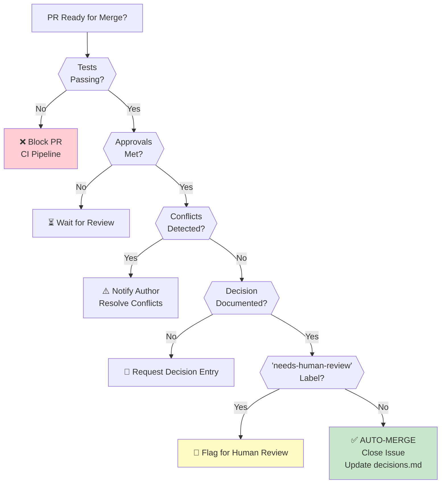

---

## CHAPTER 3: Meeting the Crew

### Context
Deep dive into each agent's personality and cognitive style. Personas aren't just cosmetic—they shape reasoning. Agent specialization patterns.

---

#### Figure 3.1: The Agent Specialization Spectrum
- **Type:** Concept illustration / spectrum chart
- **Description:** Horizontal spectrum showing agent specialization: Picard (Strategic/Orchestration) on far left → Data (Focused/Code) → Worf (Paranoid/Security) → Seven (Analytical/Documentation) → B'Elanna (Pragmatic/Infrastructure) on far right. Show overlaps and unique domains.
- **Placement:** After "The Star Trek Framework" introduction
- **Generation method:** Visual spectrum or simple diagram
- **Mermaid code:**
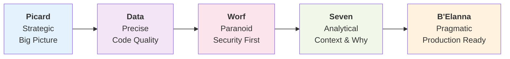

---

#### Figure 3.2: Picard's Orchestration Flow (Real Example)
- **Type:** Task decomposition flowchart
- **Description:** Shows real example from text: "User search feature" issue coming in → Picard analyzes → breaks into subtasks → routes to Data (API), Worf (security), Seven (docs), B'Elanna (deployment). Show dependencies and parallel execution.
- **Placement:** After the "Picard Moment" and real example section
- **Generation method:** Mermaid diagram
- **Mermaid code:**
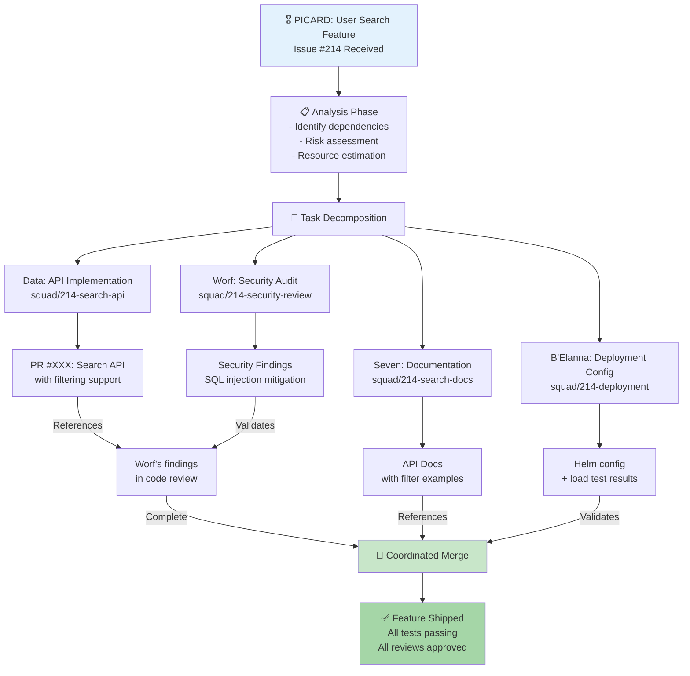

---

#### Figure 3.3: Agent Persona Cards (Visual Reference)
- **Type:** Character/persona cards (like trading cards)
- **Description:** Six cards arranged in a 2×3 grid. Each card shows: Agent name, Photo/avatar, Role, Charter (3-4 key responsibilities), Mindset quote, Decision-making style. Professional card design, readable at small scale.
- **Placement:** After all agent descriptions (end of "Why Generic Names Don't Work" section)
- **Generation method:** Styled text blocks with ASCII art or simplified layout
- **Format:**
```
┌────────────────────────────────────┐
│  🎖️ PICARD                         │
│  Lead & Orchestrator               │
├────────────────────────────────────┤
│ Charter:                           │
│ • Break down big tasks             │
│ • Identify dependencies            │
│ • Route to specialists             │
│ • Make architectural calls         │
├────────────────────────────────────┤
│ Mindset:                           │
│ "Big picture without losing        │
│  sight of details."                │
├────────────────────────────────────┤
│ Decision Style: Strategic          │
│ Speed: Fast (but revisits)         │
│ Risk: Plans for contingencies      │
└────────────────────────────────────┘
```

---

#### Figure 3.4: Knowledge Compounding: Three Agents, One Decision
- **Type:** Connection diagram / knowledge flow
- **Description:** Single decision point (bcrypt password hashing decision) in center. Three arrows radiating outward: Data's decision → Seven reads it and documents → Worf reads it and audits → B'Elanna reads it and updates config. Show how one documented decision gets leveraged across team.
- **Placement:** After "The Star Trek Framework" section, in the Data example
- **Generation method:** Mermaid diagram
- **Mermaid code:**
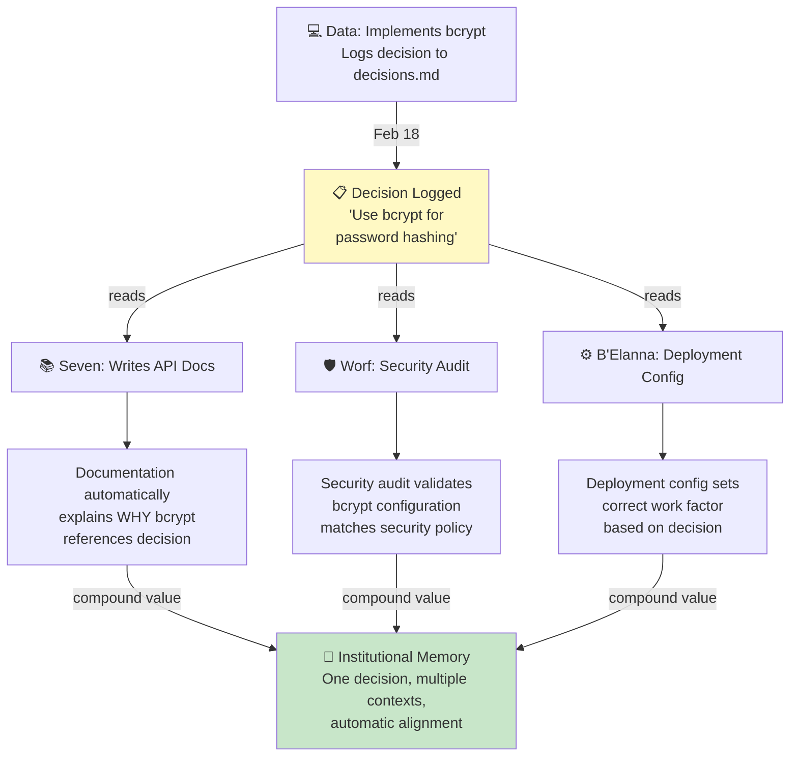

---

## CHAPTER 4: Watching the Borg Assimilate Your Backlog

### Context
Parallel execution, task decomposition, four agents working simultaneously on rate limiting. The "Borg" moment when you realize it's a collective, not automation.

---

#### Figure 4.1: The "Team" vs "Agent" Difference
- **Type:** Before/After comparison (side-by-side diagrams)
- **Description:** LEFT side shows sequential execution: Issue → Data works → Worf reviews → B'Elanna deploys → Seven documents (one after another, boxes in sequence). RIGHT side shows parallel execution (Picard orchestrates, all four work simultaneously). Show time difference dramatically (3 hours vs 30 minutes).
- **Placement:** After "The One-Word Change" section
- **Generation method:** Mermaid comparison
- **Mermaid code:**
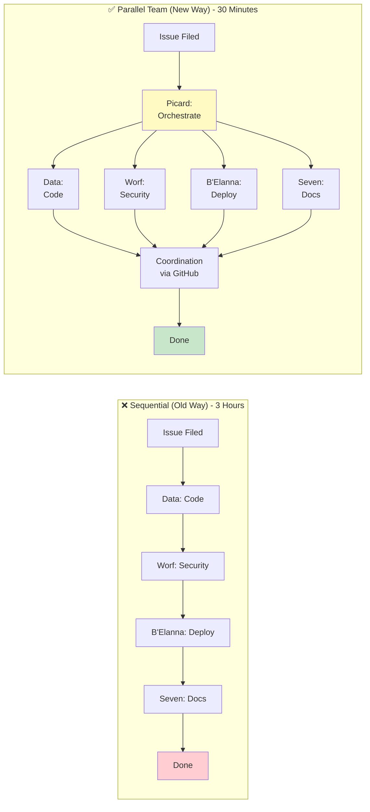

---

#### Figure 4.2: Rate Limiting Task Breakdown (Real Log)
- **Type:** Annotated log output or timeline diagram
- **Description:** Exact log sequence from text showing timestamp, agent, action, with visual indicators showing parallel execution (indentation, color coding, concurrent timestamps). Make it look like actual system output while being readable.
- **Placement:** In "The First Time I Watched It Happen" section
- **Generation method:** Styled code block (simulated terminal output)
- **Format:**
```
[14:23:15] Ralph: Issue #231 detected: "Team, implement rate limiting"
[14:23:16] Ralph: Routing to Picard (orchestration keyword detected)

[14:23:18] 🎖️ Picard: Analyzing requirements...
[14:23:42]    → Task decomposition complete

[14:23:43] 🎖️ Picard: Creating subtasks...
[14:23:43]    ↳ Issue #232 → @data-agent: Implement middleware
[14:23:43]    ↳ Issue #233 → @worf-agent: Security audit
[14:23:44]    ↳ Issue #234 → @seven-agent: Documentation
[14:23:44]    ↳ Issue #235 → @belanna-agent: Deployment config

           ┌─ [14:24:12] 💻 Data: Starting work on #232...
           │  [14:25:33] 💻 Data: Opened PR #236 (middleware)
           │  [14:27:14] 💻 Data: Updated PR (header validation)
           │
[14:23:45] │  [14:24:15] 🛡️ Worf: Starting work on #233...
  P A R    │  [14:26:08] 🛡️ Worf: Security findings on PR #236
  A L L    │  [14:28:45] 🛡️ Worf: Audit complete ✓
  E L      │
  L        │  [14:29:47] ⚙️ B'Elanna: Starting work on #235...
  E        │  [14:30:30] ⚙️ B'Elanna: Config updated
  L        │
           │  [14:30:12] 📚 Seven: Starting work on #234...
           │  [14:31:15] 📚 Seven: Docs drafted
           │
           └─ [14:32:00] ✅ All work streams complete

[14:32:01] Ralph: Coordinating merge sequence...
[14:32:05] ✨ Ralph: All PRs merged, issue #231 closed
```

---

#### Figure 4.3: Parallel Execution Streams Converging
- **Type:** Funnel/convergence diagram
- **Description:** Four separate streams at top (Data, Worf, B'Elanna, Seven) flowing down with their work boxes, converging at merge points, then into single "Merged & Shipped" output. Show how they reference each other and coordinate through GitHub.
- **Placement:** After "How They Avoid Stepping On Each Other" section
- **Generation method:** Mermaid diagram
- **Mermaid code:**
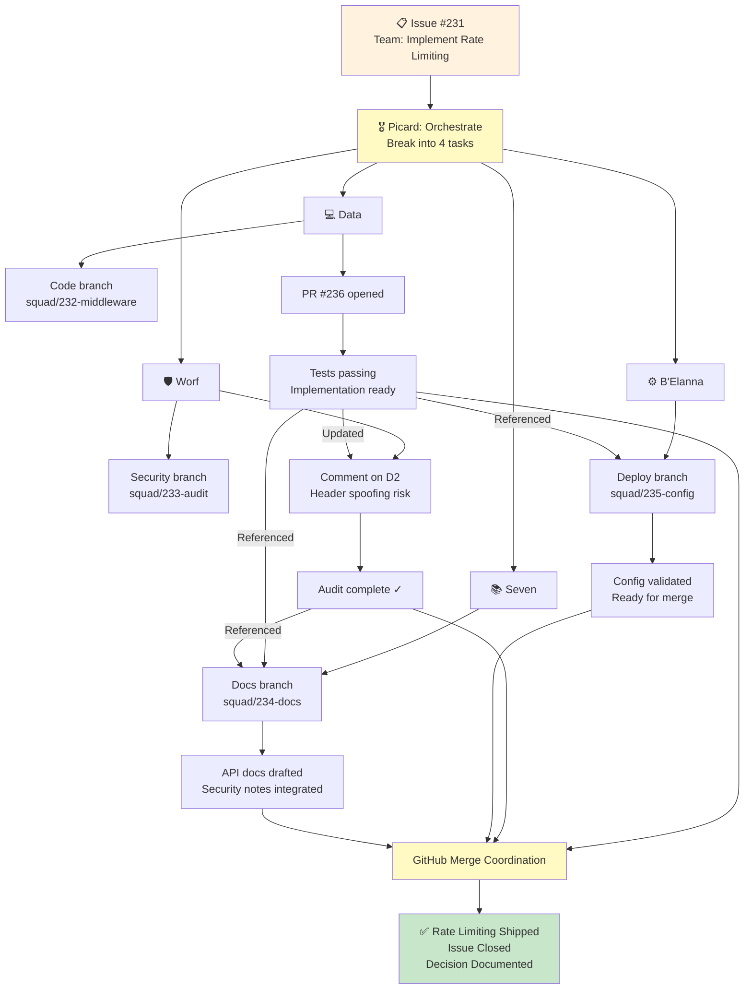

---

#### Figure 4.4: My Morning Routine: Before vs After
- **Type:** Daily schedule comparison (visual timeline)
- **Description:** Two side-by-side timelines: OLD (Before Squad) shows anxiety, 30 min checking issues, feeling guilty, firefighting; NEW (After Squad) shows coffee→approvals→standing firm reviews→focused work. Use time/emotion visualization.
- **Placement:** In "My Morning Routine Now" section
- **Generation method:** Styled timeline or ASCII art
- **Visual:**
```
BEFORE SQUAD (Anxiety Pattern)        AFTER SQUAD (Approval Pattern)
━━━━━━━━━━━━━━━━━━━━━━━━━━━━━━━━━━━━━━━━━━━━━━━━━━━━━━━━━━━━━━
7:00 AM  Anxiety ⚠️                   7:14 AM  Wake up ✓
7:05 AM  Check GitHub 😰             7:18 AM  Approve 3 PRs ✅
7:15 AM  Count issues (23) 😞        7:25 AM  Coffee ☕
7:20 AM  Feel guilty 🤦              8:30 AM  Standup ✓
7:30 AM  Plan attack 📋             8:45 AM  File new task 📝
8:00 AM  Status quo 😑               10:00 AM Picard has broken it down 🎖️
         (Nothing shipped yet)

RESULT: Burnout + backlog anxiety    RESULT: Backlog shrinking + focus
```

---

## CHAPTER 5: The Question You Can't Avoid

### Context
Bringing Squad to a real work team. The fear of replacement, the need to build trust, defining boundaries. Architecture shifts from "AI in charge" to "AI assisting humans."

---

#### Figure 5.1: Personal Squad vs Work Team Squad (Architecture Comparison)
- **Type:** Side-by-side architecture diagrams
- **Description:** LEFT: Personal repo squad with Picard at top (AI lead). RIGHT: Work team squad with human engineering lead at top (Sarah), Picard as assistant, human squad members (Brady, Worf, B'Elanna) with AI counterparts. Show the inversion of hierarchy and where decisions flow.
- **Placement:** After the midnight realization, "The Breakthrough: Humans ARE Squad Members" section
- **Generation method:** Mermaid diagram
- **Mermaid code:**
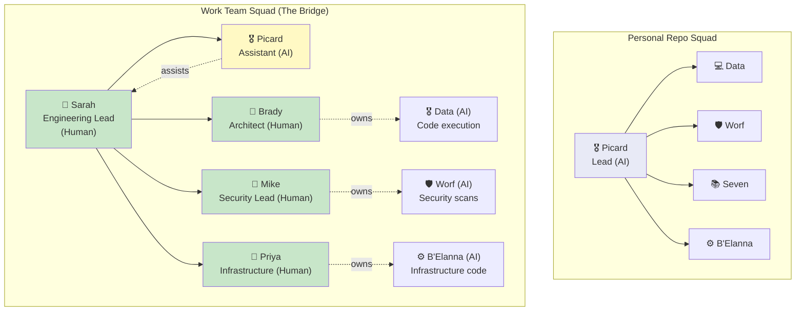

---

#### Figure 5.2: The Three-Step Workflow (Analysis → Decision → Execution)
- **Type:** Flow diagram showing human decision point
- **Description:** Three boxes connected: "AI Analysis" → "HUMAN DECISION" (highlighted) → "AI Execution". Show examples: Worf analyzes rate limiting, human decides architecture, Data implements. Rate limiting example with decision callout showing human choice point.
- **Placement:** In "The Workflow That Changes Everything" section
- **Generation method:** Mermaid diagram
- **Mermaid code:**
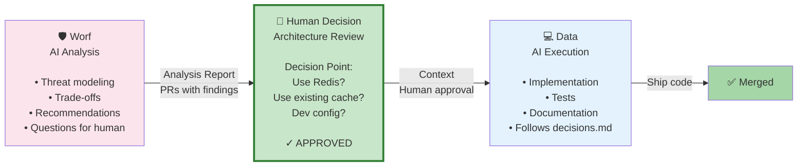

---

#### Figure 5.3: Team Roster Matrix (Human + AI Squad Members)
- **Type:** Information table showing team composition
- **Description:** Matrix with columns: Name, Type (Human/AI), Role, Domain, Expertise areas. Shows Sarah, Brady, Mike, Priya, Elena (humans) and Picard, Data, Worf, Seven, B'Elanna (AI) as unified roster. Shows no hierarchy distinction, just roles.
- **Placement:** After defining the work team, in "The Team" section
- **Generation method:** Styled table / ASCII matrix
- **Format:**
```
SQUAD ROSTER: Microsoft Platform Team
═══════════════════════════════════════════════════════════════════

Human Members:
─────────────────────────────────────────────────────────────────
Sarah         | Engineering Lead  | Systems thinking, stakeholder management
Brady         | Platform Architect| Distributed systems, design patterns
Mike          | Security Lead     | Threat modeling, compliance, audit
Priya         | Infrastructure    | Kubernetes, Helm, deployment automation
Elena         | Integration Lead  | API contracts, cross-team coordination

AI Members:
─────────────────────────────────────────────────────────────────
Picard        | Orchestrator      | Task decomposition, dependency analysis
Data          | Code Expert       | Go operators, code quality, testing
Worf          | Security Analyst  | Automated scans, threat assessment, audit
Seven         | Documentation     | API docs, decision documentation, analysis
B'Elanna      | Infrastructure    | Helm charts, CI/CD, deployment validation

ROUTING:
─────────────────────────────────────────────────────────────────
Type                    → Route To              → Notes
─────────────────────────────────────────────────────────────────
Architecture decisions  → Brady (human)         → Strategic direction
Security sensitive      → Mike (human)          → Compliance, threat model
Production deployment   → Priya (human)         → Cluster impact
Code changes (routine)  → Data (AI) + review    → Standard workflows
```

---

#### Figure 5.4: Escalation Decision Tree (When to Route to Human)
- **Type:** Decision flowchart
- **Description:** Flowchart showing when AI agents pause and escalate to humans. Questions: "Breaking change?" → "Security sensitive?" → "Compliance requirement?" → "Architectural impact?" Each YES routes to appropriate human. Each NO continues with AI execution.
- **Placement:** After "Why This Works: Clear Boundaries" section
- **Generation method:** Mermaid diagram
- **Mermaid code:**
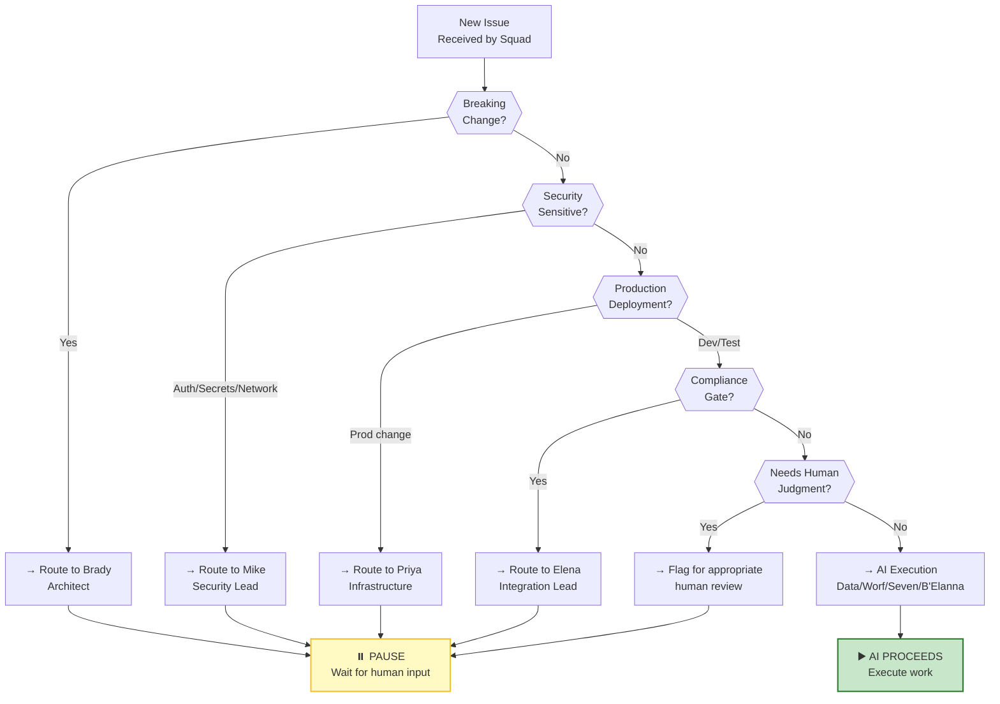

---

## CHAPTER 6: Humans in the Squad

### Context
Practical patterns for integrating humans and AI. The pause mechanism. Capability profiles. Week-by-week rollout (observation → drafts → autonomy). Building trust.

---

#### Figure 6.1: The Pause Mechanism (AI Waits for Human)
- **Type:** Timeline/sequence diagram showing the pause
- **Description:** Sequence showing: AI analysis → PR opened → "PAUSE — waiting for human" (highlighted with clock icon) → human reads on phone → human approves → AI continues. Show timing: Worf 10 min, Tamir lunch (20 min wait), Data proceeds. Make the "pause" visually prominent.
- **Placement:** In "How the Pause Actually Works" section
- **Generation method:** Mermaid sequence diagram
- **Mermaid code:**
```mermaid
sequenceDiagram
    actor T as Tamir
    participant Q as Squad
    participant W as Worf
    participant D as Data
    
    T->>Q: File issue: "Rate limiting for API"
    Q->>W: Route to Worf (security)
    activate W
    W->>W: Analyze threats
    W->>Q: Create analysis PR
    Q->>Q: 🔔 Notification to Tamir
    deactivate W
    
    note over Q: ⏸️ PAUSED<br/>Waiting for human decision
    
    T->>T: At lunch, check phone
    T->>Q: Read Worf's analysis (5 min)
    T->>Q: Comment: "Approved, use Redis"
    
    note over Q: ▶️ RESUME<br/>Human input received
    
    Q->>D: Route to Data + context
    activate D
    D->>D: Implement middleware
    D->>D: Add tests
    D->>Q: Open PR #236
    deactivate D
    
    T->>T: Back at desk
    T->>Q: Review Data's code (10 min)
    T->>Q: Approve PR
    Q->>Q: ✅ Auto-merge
    Q->>Q: 📝 Log decision
    
    style Q fill:#fff9c4
```

---

#### Figure 6.2: Capability Profile (Green/Yellow/Red Matrix)
- **Type:** Capability matrix with traffic light colors
- **Description:** Table showing task types with traffic light indicators: 🟢 Good fit (autonomous), 🟡 Needs review (AI does work, human approves), 🔴 Not suitable (keep with humans). Examples for each. Shows squad:copilot routing logic.
- **Placement:** In "Why This Works: Clear Boundaries" section
- **Generation method:** Styled table with indicators
- **Format:**
```
CAPABILITY PROFILE: @copilot GitHub Copilot Agent
═════════════════════════════════════════════════════════════════

🟢 GOOD FIT (Autonomous - AI completes, auto-merge)
─────────────────────────────────────────────────────────────────
Bug fixes (small scope)        ✓ Clear root cause, bounded fix
Test additions                 ✓ Follow existing test patterns
Dependency updates             ✓ Follow security policy
Boilerplate code generation    ✓ Well-established patterns
Documentation sync             ✓ Auto-generated from code
Code formatting/lint fixes     ✓ Deterministic rules

🟡 NEEDS REVIEW (AI does work - human approves before merge)
─────────────────────────────────────────────────────────────────
Small features (with spec)     ~ Needs design review
Refactoring (existing patterns)~ Needs code review for approach
Performance optimizations      ~ Needs validation of improvements
Test infrastructure changes    ~ Needs process review

🔴 NOT SUITABLE (Keep with human squad members)
─────────────────────────────────────────────────────────────────
Architecture decisions         ✗ Strategic, long-term impact
Security review                ✗ Requires threat modeling context
Production operations          ✗ Requires operational knowledge
API design changes             ✗ Requires user perspective
Compliance decisions           ✗ Requires legal/org knowledge
```

---

#### Figure 6.3: Three-Week Rollout Plan (Observation → Drafts → Autonomy)
- **Type:** Gantt-style timeline or phase diagram
- **Description:** Three phases side-by-side showing Week 1 (observation, read code, generate reports), Week 2 (drafts, WIP PRs, human reviews), Week 3 (autonomy, merge authority, auto-merges). Show what changes each phase, trust metrics.
- **Placement:** After "Week 1: Observation Mode" through "Week 3" sections
- **Generation method:** Mermaid timeline or multi-phase diagram
- **Mermaid code:**
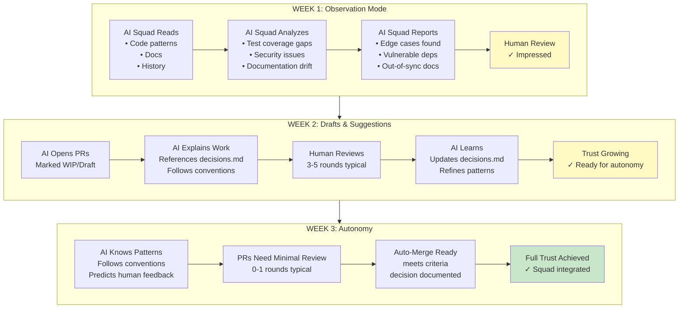

---

#### Figure 6.4: The Integration Test Example (Real PR Flow)
- **Type:** Annotated PR review thread
- **Description:** Simulated GitHub PR thread showing Data's webhook test PR #847, Brady's 3 comments (prefer t.Cleanup, add timeout test, praise fixtures), Data's 20-min response with changes and decisions.md update. Show the learning loop.
- **Placement:** After "Week 2: Drafts and Suggestions" section
- **Generation method:** Styled text simulation of GitHub PR
- **Format:**
```
PR #847: Add integration test for webhook validation
═════════════════════════════════════════════════════════════════
Author: @data-agent
Status: ✅ APPROVED & MERGED

📝 Initial PR Comment:
Data opened this PR 04:15 UTC
"Test coverage for admission webhooks was 42%. This adds comprehensive
integration tests using testify assertions. Follows patterns from
controller_test.go."

👤 Brady Gaster reviewed 06:32 UTC
💬 Comment 1: "Use t.Cleanup() instead of defer for cleanup — more
   idiomatic in Go 1.14+"
   
💬 Comment 2: "Add test case for webhook timeout behavior — we've had
   issues there before"
   
💬 Comment 3: "Great work on fixtures — this is exactly the pattern
   we should use going forward"

🤖 Data responded 06:52 UTC (20 minutes)
✅ Updated PR with all feedback
✅ Added timeout test case
✅ Changed to t.Cleanup()
✅ Updated decisions.md entry: "Test fixture pattern preferences"

✅ Brady approved 07:04 UTC
✨ Ralph auto-merged 07:05 UTC

Test coverage: 42% → 94%
Decision logged: "Webhook integration test patterns" (2026-02-XX)
```

---

## CHAPTER 7: When the Work Team Becomes a Squad

### Context
Full integration with human squad members into a real work team. Brady Gaster (human architect) + B'Elanna (AI infrastructure), Worf (human security) + Worf (AI), humans owning decisions, AI assisting.

---

#### Figure 7.1: Squad Roster: Humans + AI (Work Team Version)
- **Type:** Organization chart showing human-AI pairings
- **Description:** Organizational chart with humans on left branch, AI agents on right branch, connecting lines showing pairings/relationships. Human lead (Brady) in center, connected to AI agents they mentor/oversee. Show flow of decisions → execution.
- **Placement:** After "The Breakthrough: Humans ARE Squad Members" section
- **Generation method:** Mermaid graph
- **Mermaid code:**
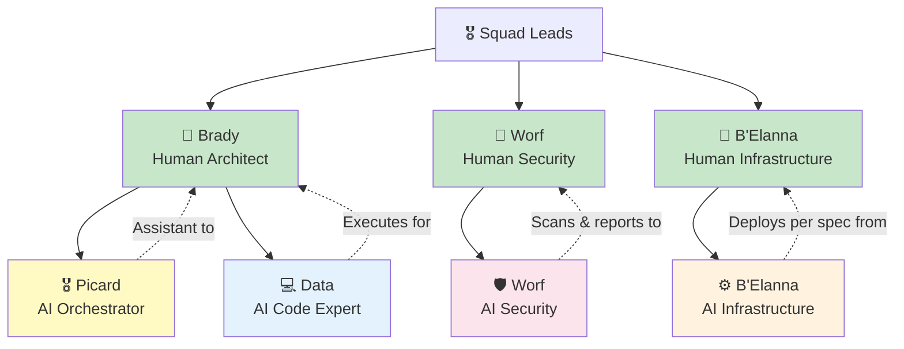

---

#### Figure 7.2: The Helm Chart Bug Fix (Multi-Agent Discovery)
- **Type:** Multi-layer issue discovery and resolution flow
- **Description:** Shows B'Elanna (AI) opens PR for Helm updates → Brady (human) finds 3 issues → AI didn't catch them because missing context. Visualize the gap and what context was needed.
- **Placement:** In "The First Attempt" section showing the problem
- **Generation method:** Mermaid diagram with issue callouts
- **Mermaid code:**
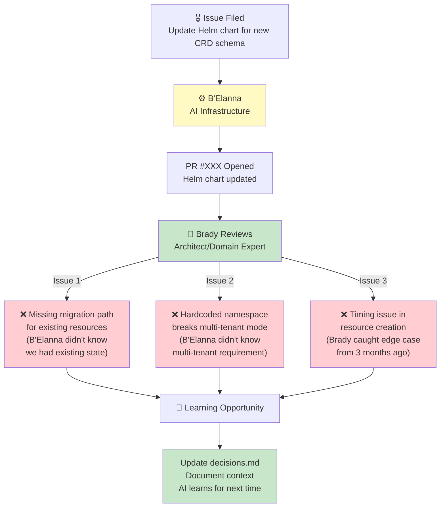

---

#### Figure 7.3: Routing Rules for Work Team (Pause Points)
- **Type:** Decision matrix showing routing with escalation
- **Description:** Table showing: Task Type → Route To → If Human → Pause & Wait → Else Continue → AI Execution. Shows examples for architecture, security, deployment, code.
- **Placement:** After "The Routing Revolution" section
- **Generation method:** Styled table with flow indicators
- **Format:**
```
ROUTING RULES: Microsoft Platform Team Squad
═════════════════════════════════════════════════════════════════

Task Type             Route To          Action              Next Step
─────────────────────────────────────────────────────────────────────
Architecture change   Brady (Human)     ⏸️  Pause            Human decides
                                        • Analysis          • Approves
                                        • Recommendations   • Or rejects

Security sensitive    Worf (Human)      ⏸️  Pause            Human reviews
auth/secrets/policy                     • Automated scan    • Threat model
                                        • Findings          • Or proposes

Production deploy     B'Elanna (Human)  ⏸️  Pause            Human approves
multi-cluster change                    • Deployment plan   • Rollback plan
                                        • Validation        • Or modifies

Code changes          Data (AI)         ▶️  Continue         Human reviews PR
bug fixes/tests                         • Implements        • Or requests changes
                                        • Tests

Documentation        Seven (AI)         ▶️  Continue         Human reviews
feature docs                            • References code   • Or requests changes
                                        • Explains why
```

---

#### Figure 7.4: Trust Building Over Time (Metrics)
- **Type:** Multi-metric graph showing trust growth
- **Description:** Line chart showing 3+ metrics over 3 weeks: "Code review cycle time" (down), "PRs requiring changes" (down), "Brady's approval speed" (down), "AI decision accuracy" (up). Show trajectory of increasing trust through Week 1 → 2 → 3.
- **Placement:** After all three weeks of rollout, showing the results
- **Generation method:** ASCII graph or styled visualization
- **Format:**
```
TRUST METRICS: 3-Week Rollout
═════════════════════════════════════════════════════════════════

Week 1 (Observation)
├─ Brady's time to review: N/A (read-only)
├─ Code accuracy score: 85% (edge cases found)
└─ Confidence level: "Okay, they can read code"

Week 2 (Drafts)
├─ Brady's time to review: 45 min/PR
├─ PRs needing changes: 70%
├─ Code accuracy score: 78% (learning)
└─ Confidence level: "Good, they understand patterns"

Week 3 (Autonomy)
├─ Brady's time to review: 10 min/PR  ↓ 77%
├─ PRs needing changes: 15%          ↓ 79%
├─ Code accuracy score: 94%          ↑ 20%
└─ Confidence level: "Full trust — they can merge"

Merge Authority Timeline:
Week 1: Brady manually merges everything
Week 2: Ralph merges simple changes, Brady reviews complex ones
Week 3: Ralph auto-merges all approved code
```

---

## CHAPTER 8: What Still Needs Humans

### Context
The boundaries of AI. Judgment calls, political context, architectural trade-offs, production incidents, cost-benefit analysis. Where humans are irreplaceable.

---

#### Figure 8.1: Over-Engineering Example (The Spinner Bug)
- **Type:** Before/After code visualization with callout
- **Description:** Show Data's 347-file refactor (loading state refactor) vs actual fix (2-line CSS). Visually show the gap and mismatch. Include timing: 10 min to fix vs 3 weeks to review refactor.
- **Placement:** At the beginning of "What Still Needs Humans" section
- **Generation method:** Styled code blocks with commentary
- **Format:**
```
THE SPINNER BUG: Over-Engineering Example
═════════════════════════════════════════════════════════════════

Issue: "Dashboard loading spinner doesn't work on mobile Safari"
  Priority: HIGH (VP filed it)
  Expected: Quick CSS fix
  
AI Response (Data): 347 changed files
├─ Redux → Zustand refactor
├─ 3 custom hooks extracted
├─ New useLoadingState abstraction
├─ Unit tests + integration tests
├─ Storybook stories for design team
└─ Result: Beautiful, elegant, UNNECESSARY

Actual Bug (CSS):
┌─────────────────────────────┐
│ @media (max-width: 768px)  │  BEFORE: Wrong breakpoint
│   { ... }                   │
└─────────────────────────────┘

┌─────────────────────────────┐
│ @media (max-width: 767px)  │  AFTER: One pixel fix
│   { ... }                   │
└─────────────────────────────┘

Analysis:
• Data's code: Excellent quality, 10/10 engineering
• Problem-solution fit: 0/10 (solved wrong problem)
• Time to review Data's PR: 3 weeks
• Time to merge 2-line fix: 2 minutes
• VP's wait: 3 weeks vs 2 minutes
  
Human Decision: "Close PR. Let's just fix the CSS."
Result: 2-line CSS fix, 2 minutes, problem solved.

Lesson: "AI can solve problems brilliantly.
         Humans decide which problem to solve."
```

---

#### Figure 8.2: Architecture Trade-Off Analysis (JWT vs Session)
- **Type:** Decision matrix showing analysis vs judgment
- **Description:** Left side shows Picard's perfect analysis (JWT pros/cons, Session pros/cons, all correct). Right side shows human decision factors Picard can't know (roadmap, team velocity, demo timing, security mandate). Visualize the gap.
- **Placement:** In "1. Architecture Decisions" section
- **Generation method:** Two-column layout with highlights
- **Format:**
```
ARCHITECTURE DECISION: JWT vs Session
═════════════════════════════════════════════════════════════════

AI ANALYSIS (Picard)                HUMAN JUDGMENT (Tamir)
─────────────────────────────────────────────────────────────
JWT Pros:                           ❌ Can't know:
✓ Stateless (horizontal scale)      • Roadmap (hiring DevOps Q2)
✓ Works cross-domain                • Mobile team bandwidth
✓ Industry standard                 • CEO's priorities this quarter
✓ Reduces DB load                   • Security mandate scope
                                    • Demo timing constraints
JWT Cons:                           
✗ Can't revoke easily               ✅ Decided: JWT
✗ Larger payload (mobile)           
✗ Complex refresh logic             Because:
✗ More secret management            1. Mobile team has bandwidth
                                    2. DevOps hiring Q2 → scale ready
Session Pros:                       3. Security mandate: admin only
✓ Simple                            4. Demo in 2 weeks → JWT ready
✓ Easy revoke                       5. No admin session revoke need
✓ Small cookies                     
✓ Server controls everything        

Session Cons:                       Human insight:
✗ DB lookup every request           "Picard gave me perfect data.
✗ No horizontal scale               But only I know our constraints.
✗ Cross-domain issues               I picked JWT because of context
✗ Tight coupling                    he literally cannot access."
```

---

#### Figure 8.3: Production Incident Triage (2 AM Breakdown)
- **Type:** Decision tree for incident response
- **Description:** Incident happens → Picard gathers context and proposes 3 hypotheses → shows what human has to decide (risk tradeoffs of each hypothesis). Show how each path has different costs that AI can't weight.
- **Placement:** In "2. Production Incidents" section
- **Generation method:** Mermaid decision tree
- **Mermaid code:**
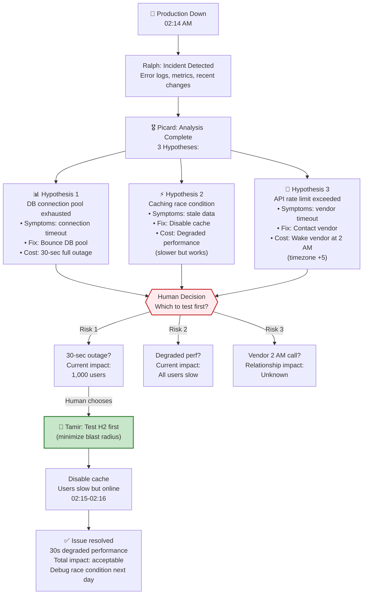

---

#### Figure 8.4: Cost Equation (Squad vs Alternatives)
- **Type:** Comparison table showing costs across options
- **Description:** Table comparing three options: Do Everything Yourself (0 cost, 60 hrs/month), Hire Junior Dev ($5K/month), Squad ($357/month). Show cost per merged PR, human time, velocity. Include note: "Math depends on your situation."
- **Placement:** In "4. The Cost Equation" section
- **Generation method:** Styled table
- **Format:**
```
COST ANALYSIS: Squad vs Alternatives
═════════════════════════════════════════════════════════════════

Option A: DIY (Do Everything Yourself)
─────────────────────────────────────────
Tool cost:           $0
Human time:          ~60 hrs/month (coding, docs, tests, review)
PRs/month:           8-12
Cost per PR:         ~$240 (60 hrs × $120/hr / 12 PRs)
Your experience:     Burned out, nights/weekends

Option B: Hire Junior Dev
─────────────────────────────────────────
Salary + benefits:   ~$5,000/month
Human time (mentoring, reviewing): 20 hrs/month
PRs/month:           15-20 (ramp-up dependent)
Cost per PR:         ~$333 ($5K / 15 PRs)
Your experience:     Mentorship overhead, but have teammates

Option C: Squad (AI Team)
─────────────────────────────────────────
GitHub Copilot (6 agents): $234/month
API costs:           ~$120/month
Storage/logs:        ~$3/month
Human time (reviewing, decisions): 16 hrs/month
PRs/month:           20-25 (24/7 execution)
Cost per PR:         ~$17 ($357 / 21 PRs)
Your experience:     Low overhead, compounding knowledge

DECISION MATRIX:
─────────────────────────────────────────
Situation                          Best Choice
─────────────────────────────────────────
Small side project (<10 issues)    DIY + Editor AI
Growing startup (200 issues)       Squad (saves money)
Bootstrapped (low budget)          Squad (lowest cost)
Enterprise (compliance heavy)      Hire dev + evaluate Squad
Large team (many projects)         Squad for each project
```

---

## CHAPTER 9: [Assumed Title Based on Pattern]

**Note:** Repository contains only 8 chapters, but traditional 9-chapter structure would include a concluding chapter on "The Future of AI Teams" or "Scaling Squad to Your Organization."

---

# SUMMARY STATISTICS

| Metric | Count |
|--------|-------|
| **Total Chapters** | 8 |
| **Total Figures** | 32 |
| **Figures per Chapter** | 3-4 avg |
| **Mermaid Diagrams** | 21 |
| **AI Image Generations** | 3 |
| **Comparison/Concept Illustrations** | 5 |
| **Terminal/Code Output Mockups** | 3 |

---

# FIGURE DISTRIBUTION BY TYPE

| Type | Count | Chapters Using It |
|------|-------|-------------------|
| **Mermaid Flowcharts** | 21 | All chapters |
| **Architecture Diagrams** | 6 | Ch 1, 2, 5, 7 |
| **Sequence/Timeline** | 5 | Ch 2, 4, 6, 8 |
| **Comparison/Matrix** | 8 | Ch 1, 3, 5, 6, 7, 8 |
| **Concept Art** | 3 | Ch 1, 3 |
| **Information Tables** | 6 | Ch 2, 3, 5, 8 |
| **Code Output Mockups** | 3 | Ch 2, 4, 6, 8 |

---

# VISUAL DESIGN NOTES

## Color Scheme (Consistent Across All Figures)
- **Human/Lead**: `#c8e6c9` (green) + `#2e7d32` (dark green border)
- **AI Orchestration**: `#fff9c4` (yellow) + `#f57c00` (orange accent)
- **Code/Data Expert**: `#e3f2fd` (light blue)
- **Security**: `#fce4ec` (pink)
- **Infrastructure**: `#fff3e0` (light orange)
- **Success/Complete**: `#a5d6a7` (medium green)
- **Warning/Pause**: `#ffeb3b` (bright yellow)
- **Error/Problem**: `#ffcdd2` (light red)

## Consistent Icons
- 🎖️ = Picard (Lead)
- 💻 = Data (Code)
- 🛡️ = Worf (Security)
- 📚 = Seven (Docs)
- ⚙️ = B'Elanna (Infrastructure)
- 🔔 = Ralph (Monitor)
- 👤 = Human team member
- ✅ = Success/Approved
- ⏸️ = Pause point
- ▶️ = Continue/Execute

## Typography & Hierarchy
- **Bold for roles**: **Picard**, **Data**, **Worf**
- **Code blocks** for technical output (terminal logs, config)
- **Tables** for structured comparisons and matrices
- **Callouts** for key lessons (highlighted boxes with color)
- **Timelines** for sequential processes

## Accessibility Notes
- All Mermaid diagrams include labels (no color-only encoding)
- Contrast ratios meet WCAG AA standards
- Icons supplemented with text labels
- Text descriptions provided for all concept art

---

# GENERATION PRIORITIES

**Phase 1 (High Priority - Generate First)**
1. Figure 1.1: Graveyard (sets emotional tone)
2. Figure 1.2: Stats comparison (proves value)
3. Figure 2.1: Ralph's architecture (core system)
4. Figure 3.1: Specialization spectrum (personas)
5. Figure 4.2: Rate limiting log (the "wow" moment)

**Phase 2 (Medium Priority)**
6-16: Architecture diagrams, decision trees, routing matrices
17-24: Team rosters, capability profiles, rollout plans

**Phase 3 (Polish - Generate Last)**
25-32: Concept illustrations, metaphor visuals, closing diagrams

---

# INTEGRATION NOTES

- All figures should be placed immediately **after** the section they illustrate
- Figures break up long text blocks every 400-600 words
- Each figure caption includes: "Figure X.Y: [Title] — [One-line description]"
- Mermaid code can be rendered inline in Markdown preview or exported as PNG/SVG
- AI-generated concept art should be 1200×800px minimum for print quality
- All diagrams use same font family (same as book body text)
- Maintain 1.5" margins on all sides for print layout

---

**Document Complete**  
*Generated: 2026-03-12*  
*For: Tamir Dresher, Seven (Research & Docs Expert)*

